# Architettura Oracle: Guida Completa ai Concetti Fondamentali

> Questa guida spiega i concetti architetturali che un DBA Oracle deve padroneggiare davvero. L'obiettivo non e' memorizzare definizioni isolate, ma capire come Oracle legge, scrive, recupera, scala e protegge i dati.

---

## 0. Glossario Rapido per Principianti

> Se sei nuovo al mondo database, questi termini sono i "mattoni" fondamentali dell'ecosistema Oracle.

- **Istanza (Instance)**: I processi in esecuzione e la memoria (RAM) allocata sul server. Esiste solo quando il server è acceso. Se riavvii la macchina, questa "Scompare" per poi ricrearsi.
- **Database**: I file reali salvati sul disco fisso (l'hard disk). Questi non scompaiono quando spegni la macchina. Contengono sia i tuoi dati che i file di log per la sicurezza.
- **SGA (System Global Area)**: La grande "memoria condivisa" (pool di RAM) che tutti i processi dell'istanza Oracle utilizzano insieme per lavorare velocemente senza accedere sempre al disco.
- **PGA (Program Global Area)**: La "memoria privata" assegnata a ogni signola connessione o processo. Ad esempio, se fai un `ORDER BY`, Oracle fa il calcolo qui dentro in privato.
- **Tablespace**: Un raccoglitore logico. È come una cartella di Windows: tu salvi i tuoi dati in un "Tablespace", e Oracle si preoccupa di spalmarli nei veri file fisici su disco (Datafiles).
- **Redo Log**: Il diaro di bordo in cui Oracle scrive *qualsiasi modifica* tu faccia prima ancora di salvarla fisicamente nei Datafile. Serve per il recupero in caso di crash.
- **Undo**: I dati temporanei usati per "Tornare indietro" (Rollback) o per permettere agli altri utenti di leggere i vecchi dati intanto che tu li stai modificando (Read Consistency).
- **Data Guard**: Il sistema di sicurezza primario per avere un "Database Copia" (Standby) costantemente allineato a quello principale (Primary) per il Disaster Recovery.
- **Oracle RAC (Real Application Clusters)**: Una tecnologia che ti permette di avere *più istanze* (su più server di calcolo) che operano contemporaneamente sullo *stesso database* fisico. Ideale per Alte Prestazioni (High Availability) e Scalabilità (Load Balancing).
- **GoldenGate**: Lo strumento che permette di "replicare" e sincronizzare dati tra Oracle e altri database (o tra versioni diverse di Oracle, anche in Cloud) in tempo reale.
- **Enterprise Manager**: Il pannello di controllo web (una grande dashboard unificata) che un DBA usa per capire lo stato di salute e gestire tutti i database da una sola pagina web.
- **ASM (Automatic Storage Management)**: Una sorta di file system speciale creato da Oracle per gestire in modo autonomo il salvataggio dei file del DB distribuiti su più dischi.

---

## 1. Modello Mentale di Base

Un database Oracle e' composto da due parti distinte:

1. l'istanza Oracle;
2. il database fisico su disco.

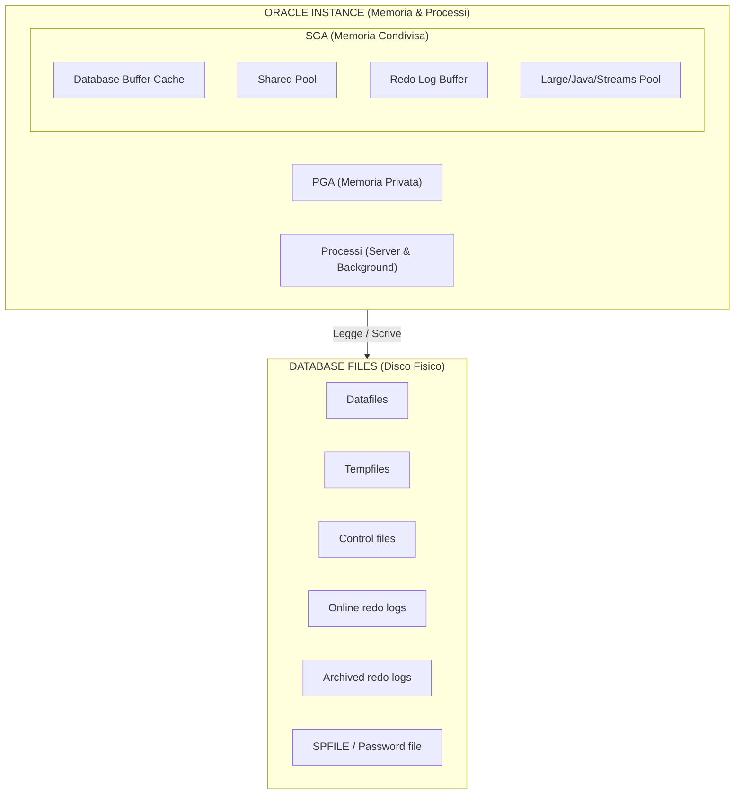

Definizioni corrette:

- `istanza` = memoria + processi;
- `database` = insieme dei file persistenti;
- quando fai `shutdown immediate`, fermi l'istanza, non cancelli il database;
- quando fai `startup`, l'istanza torna a gestire i file del database.

Concetto chiave:

- l'istanza e' volatile;
- il database e' persistente.

Blocco visivo:

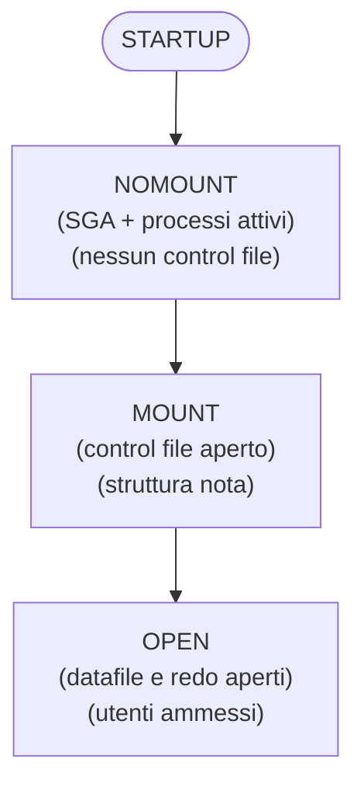

---

## 2. Ciclo di Vita del Database: NOMOUNT, MOUNT, OPEN

Oracle non parte sempre direttamente in `OPEN`. Ci sono tre fasi distinte.

### 2.1 NOMOUNT

In `NOMOUNT`, l'istanza di calcolo (Memoria e Processi) viene "guidata" e messa in moto, ma il database fisico per ora è come se non esistesse. Oracle non sa ancora dove siano i file o come si chiami il db. 
Cosa avviene esattamente sotto il cofano:

1. **Lettura del Parameter File (PFILE/SPFILE)**: L'istanza cerca un file di configurazione specifico nel sistema operativo per sapere come dimensionarsi (cercherà solitamente in sequenza: `spfile<SID>.ora`, poi `spfile.ora`, poi il file di testo `init<SID>.ora`).
2. **Allocazione della SGA**: Viene fisicamente allocata la quantità di memoria RAM gigantesca necessaria per funzionare (la Shared Pool, Buffer Cache ecc.. come richiesto nel Parameter file).
3. **Avvio dei Background Processes**: Vengono "accesi" i processi di vitale importanza come PMON, SMON, CKPT, DBWn, LGWR e posizionati pronti in RAM.
4. **Scrittura file di traccia**: Oracle apre il famosissimo file `alert.log` per l'istanza e ci annota tutte le informazioni di avvio (e gli eventuali errori critici da qui in poi).

Disponibile:
- Creazione database (comando `CREATE DATABASE`).
- Clonazione RMAN (comando `DUPLICATE`).
- Ripristino di emergenza del Parameter File.
- Setup iniziale (Bootstrap) dello standby database in Data Guard.

### 2.2 MOUNT

In `MOUNT`, l'istanza avviata stringe finalmente la mano al database fisico (ai file), mettendolo sotto chiave amministrativa. È la fase "a porte chiuse".

Cosa avviene esattamente:
1. **Apertura del Control File**: L'istanza va a leggere dal Parameter File l'indirizzo spaziale del *Control File* (il cervello/catalogo su disco) e lo apre in memoria.
2. **Scansione Fisica dei Metadati**: Leggendo il Control File, Oracle estrae la "mappa del tesoro": i nomi e le directory di tutti i Datafile e i file di Online Redo Log del database. 
3. **Verifica (senza svelare i dati)**: L'istanza verifica a basso livello che quei file fisici esistano dove il Control File dice che dovrebbero essere (es: controllando dentro i dischi ASM `+DATA`), ma volutamente **non apre i file del database ai clienti**.

Disponibile per il DBA *ma non per gli Utenti App*:
- Media Recovery completi (ripristinare e riapplicare vecchi backup).
- Messa in ricezione per i database di Standby.
- Operazioni massicce di `RENAME` dei datafiles, abilitazione o spegnimento della modalità preziosa `ARCHIVELOG`.

### 2.3 OPEN

In `OPEN`, avviene la mossa finale. Il database sbatte aperte le proprie porte, permettendo al business e alle applicazioni di riversarsi in esso per leggere e modificare dati.

Cosa avviene di molto delicato:
1. **Apertura Datafiles e Online Redo Logs**: Oracle si collega direttamente dentro quest'ultimi ed è in grado di tracciare o recuperare dati applicativi specifici.
2. **Verifica della Consistenza Integrale (L'incrocio SCN)**: Oracle va a colpo sicuro a confrontare il *System Change Number (SCN)* (l'orologio interno del db) salvato in sicurezza all'interno del Control File con gli SCN presenti stampati nell'intestazione (header) di tutti i Datafiles. Tutto **deve** coincidere al calcolo per assicurarsi che i file siano perfettamente speculari alla fine.
3. **Eventuale Instance Recovery Auto-Magica (SMON)**: Se in passato c'è stato un arresto anomalo (ad esempio togliendo la spina al server, usando *SHUTDOWN ABORT*, e interrmpendo il check degli SCN), Oracle se ne accorge qui! Il processo *SMON* entra di prepotenza, consulta i dati crudi sugli avanzi di *Online Redo Logs*, calcola, pulisce i buffer ed esegue l'*Instance Recovery* istantaneamente, recuperando transazioni committate andate disperse e rollbackando quelle sporche, garantendo il db consistente e riavviabile prima dei log in.
4. **Apertura di Accesso ai Dati**: I tablespace normali divengono editabili e gli utenti normali ottengono privilegi di querying/update sui dati.

Varianti Comuni per fasi avanzate:
- `OPEN READ WRITE`: Uso di produzione regolare.
- `OPEN READ ONLY`: Protezione assoluta in sola lettura (utile in contesti Data warehouse/Reporting statico).
- `READ ONLY WITH APPLY`: Per Data Guard attivi (la famosa feature Active Data Guard, dove tu puoi leggere i dati replicati su uno standby allo stesso tempo in cui il server lo aggiorna invisibilmente dietro le quinte).

### 2.4 Shutdown Modes

I principali sono:

- `SHUTDOWN NORMAL`: aspetta che tutti gli utenti escano;
- `SHUTDOWN IMMEDIATE`: rollback delle transazioni non committate e chiusura pulita;
- `SHUTDOWN ABORT`: stop brutale, recovery all'avvio successivo;
- `SHUTDOWN TRANSACTIONAL`: aspetta fine transazioni attive.

Nel lab, il piu' usato e' `IMMEDIATE`.

---

## 3. Architettura della Memoria

Oracle usa due grandi aree di memoria:

1. `SGA` condivisa;
2. `PGA` privata.

Schema rapido:

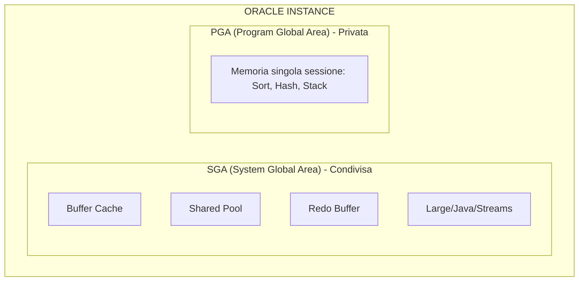

### 3.1 SGA: memoria condivisa dell'istanza

Tutti i processi server e background leggono o scrivono la SGA.

Componenti principali.

#### Database Buffer Cache

Contiene blocchi di dati letti dai datafile.

Funzione:

- ridurre I/O fisico;
- mantenere in RAM i blocchi piu' usati;
- ospitare blocchi modificati ma non ancora scritti su disco.

Stati logici dei blocchi (Buffer States):

- `clean`: blocco uguale alla copia su disco. Se il DB ha bisogno di spazio, può sovrascriverlo istantaneamente (dopo averlo "invecchiato" tramite LRU). Se Database Smart Flash Cache è abilitato, DBWn può scrivere il corpo del buffer pulito nella flash cache per un futuro riutilizzo rapido, mantenendone l'header in memoria.
- `dirty`: modificato in memoria, non ancora scritto da DBWn.
- `pinned`: blocco attualmente in uso o modificato in una transazione attiva, intoccabile per altre operazioni in quel millisecondo.

**Buffer Touch Counts e LRU (Least Recently Used)**:
Oracle usa una lista LRU per decidere quali blocchi tenere in RAM. Non sposta fisicamente i dati in memoria, ma sposta i "puntatori". Usa un meccanismo di "touch count": quando un buffer viene "pinnato", se il contatore è stato incrementato più di tre secondi fa, viene aumentato. La regola dei tre secondi evita che un burst di operazioni conti come letture multiple (es. un insert di molte righe conta come 1 touch). I blocchi con touch count alti vanno verso la parte "hot" (calda) della lista LRU, quelli non usati "age out" (invecchiano) ed escono.

**Buffer Pools multipli**:
Di default esiste solo il *Default pool*. Ma per ottimizzare, puoi dividere la Buffer Cache in:
- `Keep pool`: per blocchi letti spesso (es. tabelle di lookup) che vuoi restino sempre in RAM.
- `Recycle pool`: per blocchi letti raramente (es. data warehouse scans) che devono uscire subito dalla cache per non inquinare la LRU della Default pool.
- `Big table cache`: per gestire table scan massivi usando algoritmi basati sulla "temperatura" (temperature-based).

Concetto importante:

- il commit non aspetta la scrittura del blocco dirty sul datafile;
- il commit aspetta il redo su disco.

#### Shared Pool

Contiene strutture condivise necessarie all'esecuzione SQL.

Sottocomponenti chiave:

- `Library Cache`: Contiene SQL parsato, blocchi PL/SQL, execution plans. Qui avviene l'"Allocation and Reuse": quando un nuovo SQL viene parsato (se non è DDL), viene allocato spazio. L'item resta in memoria tramite algoritmo LRU. Se più sessioni lo usano, resta anche se il processo creatore termina. L'istruzione `ALTER SYSTEM FLUSH SHARED_POOL` (o il cambio del global database name) svuota questa cache.
- `Data Dictionary Cache` (o *Row Cache*): Oracle accede spessissimo al dizionario dati per il parsing (privilegi, oggetti, tipologie colonne). Questa cache è l'unica a memorizzare i dati come *righe* (rows) e non come *buffer* (blocchi interi).

Se la Shared Pool e' piccola o frammentata puoi vedere:

- hard parse eccessivi;
- invalidazioni;
- errori `ORA-04031`.

#### Redo Log Buffer

Buffer circolare in RAM dove Oracle accumula i redo records prima che LGWR li scriva sui redo log online.

Contiene:

- descrizione delle modifiche;
- non i blocchi interi, ma change vectors.

#### Large Pool

Area opzionale usata da:

- RMAN;
- parallel execution;
- shared server;
- alcune operazioni I/O e messaging.

Serve a evitare pressione inutile sulla Shared Pool.

#### Java Pool

Usata se il database esegue componenti Java interni.

#### Streams Pool

Usata da funzionalita' di streaming e replication in alcuni scenari.

### 3.2 PGA: memoria privata

Ogni processo Oracle ha la propria PGA.

Contiene tipicamente:

- sort area;
- hash area;
- stack;
- informazioni di sessione o processo;
- cursor state lato processo.

Caratteristiche:

- non e' condivisa;
- cresce per sessione o processo;
- e' critica per sort, hash join, bitmap merge, parallel execution.

### 3.3 UGA

La `UGA` e' la memoria associata alla sessione utente.

Dipende dal modello di connessione:

- con `dedicated server`, la UGA sta nella PGA del server process;
- con `shared server`, la UGA sta nella SGA.

### 3.4 Gestione automatica della memoria

Modelli principali.

#### ASMM

Automatic Shared Memory Management.

Parametri tipici:

- `SGA_TARGET`;
- `SGA_MAX_SIZE`;
- `PGA_AGGREGATE_TARGET`.

E' il modello piu' comune nel lab Oracle classico.

#### AMM

Automatic Memory Management.

Parametri tipici:

- `MEMORY_TARGET`;
- `MEMORY_MAX_TARGET`.

Puo' gestire insieme SGA e PGA, ma in molti ambienti reali si preferisce ASMM o tuning esplicito.

---

## 4. Architettura dei Processi

Oracle usa:

1. processi client;
2. listener;
3. server processes;
4. background processes.

### 4.1 Client process

E' il processo applicativo o lo strumento che si connette a Oracle:

- SQL*Plus;
- JDBC / Client OCI;
- Python / Applicazione web.

È fondamentale capire la differenza rispetto a un processo server:
- Il processo client **non può accedere direttamente alla SGA** (ram condivisa) del database.
- È il motivo per cui l'applicazione e il database possono risiedere su server fisici o reti completamente diversi.
- La connessione (network session) viene stabilita verso un listener che a sua volta fa nascere un **Server Process** dedicato (o assegnato) per dialogare con la SGA e i file.

### 4.2 Listener

Il listener riceve la connessione di rete e la inoltra al service corretto.

Non esegue SQL.

Fa da dispatcher iniziale:

- ascolta sulla porta;
- conosce i servizi registrati;
- passa la sessione al server process.

### 4.3 Server process

E' il processo che esegue davvero il lavoro della sessione.

Compiti:

- parse;
- execute;
- fetch;
- accesso ai blocchi;
- gestione cursori;
- interazione con PGA e SGA.

Modelli di connessione:

- `dedicated server`: per ogni utente connesso (Client process), Oracle avvia un processo dedicato (Server process) sul server DB. Quel processo Server conserva la UGA (User Global Area) all'interno della sua PGA privata. Questo è il modello standard e più sicuro lato isolamento. (Nel tuo lab usi quasi sempre `dedicated server`).
- `shared server`: se hai migliaia di utenti, sdoppiare migliaia di server process esaurirebbe la RAM (PGA). Con questo modello, i client parlano con un `Dispatcher`, il quale infila le richieste in una coda. Un pool più piccolo di `Shared Server Processes` pesca le richieste dalla coda. Qui la UGA si sposta all'interno della SGA (Large Pool) in modo che qualsiasi processo server la possa leggere.

### 4.4 Background processes fondamentali

| Processo | Ruolo pratico |
|---|---|
| Processo | Ruolo pratico e Dettaglio Tecnico|
|---|---|
| `DBWn` (Database Writer) | Esegue le scritture "lazy" (pigre) dei buffer diventati *dirty* (modificati in RAM) trasferendoli sui datafile fisici. Interviene anche in risposta ai CKPT (Checkpoint). Può avere più thread (DBW0, DBW1, ecc.). |
| `LGWR` (Log Writer) | Processo super critico: scrive le voci di REDO dal Redo Log Buffer in RAM verso gli Online Redo Logs su disco in modo sequenziale. Scrive sempre in modalità sincrona al momento di un COMMIT. |
| `CKPT` (Checkpoint) | Monitora il punto di "successo" fino al quale i dati sono salvi. Aggiorna l'header dei control file e l'header di ciascun datafile registrando fino a che numero SCN i dati sono sani, segnalando a DBWn di scaricare buffer sporchi. |
| `SMON` (System Monitor) | Si occupa della Instance Recovery. In caso di crash del server (e shutdown abort), al successivo riavvio `SMON` "riavvolge" e "riapplica" il vero redo e undo per far tornare il db consistente. Inolte ripulisce i segmenti temporanei. |
| `PMON` (Process Monitor) | È il sorvegliante. Se un processo utente cade/crasha improvvisamente, PMON interviene: sblocca i table-lock tenuti, svuota la PGA usata dal processo morto. Se usi Oracle RAC, fa il cleanup a livello di cluster. |
| `ARCn` (Archiver) | Quando un Online Redo Log è pieno, e prima che LGWR possa riciclarlo (sovrascriverlo), ARCn entra in azione copiandolo nei file di backup fisici "Archived Redo Log". Opzionale (serve configurare l'ARCHIVELOG mode) ma obbligatorio in prod. |
| `RECO` | Recupero transazioni distribuite sospese. |
| `MMON` | raccolta statistiche manageability/AWR |
| `MMNL` | supporto a MMON |
| `LREG` | registra dinamicamente servizi e istanze ai listener |
| `CJQ0` | coordina job scheduler |
| `RVWR` | scrive flashback logs se Flashback e' attivo |
| `FBDA` | Flashback Data Archive |
| `DMON` | Data Guard Broker |
| `VKTM` | gestisce il tempo virtuale interno |

### 4.5 Processi RAC-specifici

In RAC compaiono anche processi cluster-specifici, per esempio:

- `LMON`;
- `LMD`;
- `LMS`;
- `LCK`.

Servono a:

- cache fusion;
- global enqueue service;
- coordinamento dei blocchi tra istanze.

---

## 5. Come Oracle Esegue una Query

Flusso semplificato.

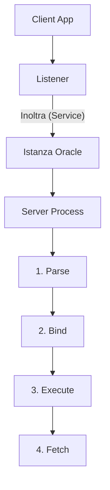

### 5.1 Parse

Il parse non e' solo analisi sintattica.

Include:

- verifica sintassi;
- verifica oggetti e privilegi;
- ottimizzazione;
- scelta execution plan;
- lookup o reuse in Library Cache.

Tipi di parse:

- `hard parse`: serve nuovo parse completo;
- `soft parse`: Oracle riusa un piano gia' esistente.

Obiettivo DBA:

- ridurre hard parse inutili;
- usare bind variables quando ha senso.

### 5.2 Execute

Durante l'execute Oracle:

- acquisisce lock o enqueue necessari;
- legge blocchi richiesti;
- modifica blocchi in memoria se la SQL cambia dati;
- genera redo e undo.

### 5.3 Fetch

Le righe vengono restituite al client in fetch successivi.

Importante:

- una query puo' essere eseguita una volta e poi fetchata molte volte;
- gran parte del tempo applicativo puo' stare nei fetch, non nel parse.

---

## 6. Transazioni, SCN, Redo, Undo e Consistenza

Schema del commit:

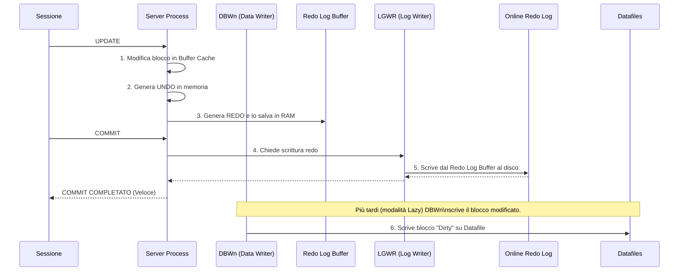

Questa e' la parte che separa chi usa Oracle da chi lo capisce.

### 6.1 SCN

Lo `SCN` e' il System Change Number.

E' il riferimento temporale o logico interno di Oracle.

Serve per:

- ordinare le modifiche;
- garantire consistenza di lettura;
- recovery;
- flashback;
- Data Guard;
- backup consistency.

### 6.2 Undo

L'undo conserva l'informazione necessaria per:

- fare rollback di transazioni non committate;
- ricostruire versioni precedenti dei blocchi per query consistenti.

Concetto chiave:

- quando fai `UPDATE`, Oracle non sovrascrive solo il dato;
- prima registra l'immagine logica necessaria in undo.

### 6.3 Redo

Il redo descrive tutte le modifiche necessarie al recovery.

Serve a:

- rifare modifiche dopo crash;
- alimentare archived redo;
- alimentare Data Guard;
- consentire media recovery.

### 6.4 Commit

Un `COMMIT` non significa che il datafile e' gia' scritto.

Significa:

- il redo di quella transazione e' stato reso durevole sui redo log online;
- da quel momento la transazione e' committed.

Per questo il commit e' veloce:

- LGWR fa scrittura sequenziale;
- DBWn scrive i datafile dopo, con logica lazy.

### 6.5 Read consistency

Oracle garantisce che una query veda una fotografia consistente dei dati a uno SCN logico.

Se un'altra sessione modifica una riga mentre una query lunga la sta leggendo, Oracle puo':

- usare il blocco corrente se compatibile;
- oppure ricostruire la versione precedente tramite undo.

Questo evita letture sporche.

### 6.6 Checkpoint

Il checkpoint non significa stop.

Significa che Oracle:

- aggiorna informazioni di checkpoint in control file e datafile header;
- riduce la quantita' di redo da rileggere in instance recovery.

### 6.7 Instance recovery vs media recovery

#### Instance recovery

Serve dopo crash dell'istanza ma senza perdita dei file.

Oracle usa:

- redo online;
- undo.

#### Media recovery

Serve quando perdi o ripristini file fisici.

Oracle usa:

- backup;
- archived redo logs;
- eventuali incremental backup;
- control file o catalog RMAN.

---

## 7. Strutture Logiche di Storage

Oracle separa architettura logica e fisica.

Ordine logico corretto:

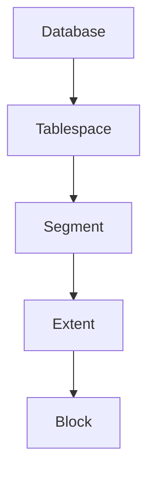

### 7.1 Data block

Il blocco è l'unità minima logica di operazione (I/O) del database. Un `Data Block` è logicamente tradotto dal DB come l'unione di uno o più OS Block (i blocchi del sistema operativo, formattati a livello Linux o Windows). Svincolarsi dalla dipendenza dell'OS block permette ad ASM e Oracle di gestire performance in modo custom.

Parametri chiave:

- `DB_BLOCK_SIZE`: tipicamente 8 KB nel lab. Esistono block size di 16 KB o 32 KB usati spesso per i Data Warehouse massivi.
- Un blocco ha un **header** (che include metadata, transazioni attive ITL e directory righe) e un **body** (che cresce bottom-up, dove vengono inserite o modificate fisicamente le row).
- Spazio d'aria (PCTFREE): percentuale (di base il 10%) lasciata rigorosamente vuota nel blocco per consentire un futuro "allargamento" delle righe (es: fai l'update di una row da NULL al testo "PincoPallo" e il dato ha bisogno di un po' più di spazio per espandersi senza provocare una fastidiosa frame-migration al blocco successivo).

### 7.2 Extent

Un extent e' un insieme di blocchi contigui allocati a un segmento.

### 7.3 Segment

Un segmento e' l'insieme di extents appartenenti a un oggetto.

Tipi comuni di segmenti:

- `Table segment`: per i dati regolari della tabella.
- `Index segment`: per le strutture ad albero che compongono gli indici.
- `Undo segment`: per lo storico/rollback (generato da Oracle in sottofondo in modo invisibile all'utente).
- `Temporary segment`: segmenti intermedi usa-e-getta crerati da Oracle mentre compi esecuzioni pesanti di SQL come `SORT` complessi o join enormi (tipicamente allocati nel tablespace *TEMP*).
- `LOB segment`: Large OBjects, foto, documenti, file JSON di grandissime dimensioni (spesso superano l'intero block capacity).

### 7.4 Tablespace

Un tablespace e' il contenitore logico dei segmenti.

Comuni in Oracle:

- `SYSTEM` e `SYSAUX`: oblogatori. Trattano il *"cervello"* di metadata, il Data Dictionary (viste, pacchetti PL/SQL built-in, cronologie AWR).
- `UNDO`: indispensabile per gestire le undo retention policy. Mantiene tutti gli Undo Segments.
- `TEMP`: tablespace temporaneo (uso volante per le query).
- tablespace applicativi: ad. esempio *USERS* o *DATI_APP* in cui vive realmente il software da gestire.

Tipi importanti:

- permanent;
- temporary;
- undo;
- bigfile;
- smallfile.

### 7.5 Bigfile vs smallfile

#### Smallfile tablespace

- piu' datafile nello stesso tablespace;
- modello storico piu' comune.

#### Bigfile tablespace

- un solo datafile molto grande;
- utile in ASM e ambienti automatizzati.

---

## 8. Strutture Fisiche di Storage

### 8.1 Datafiles

Contengono i blocchi dei tablespace permanenti e undo. I dati di un database sono archiviati collettivamente nei Datafiles. Un Segment (quindi una tabella) non può trovarsi a metà su due Tablespace, ma siccome un Tablespace può consistere di *più Datafile* fisici, un Fragment, un Extent o una Tabella possono "estendersi a cavallo" di centinaia di Datafile diversi. Questa dis-connessione astratta massimizza l'ottimizzazione dell'I/O (soprattutto in ASM via file-striping per leggere parallelamente dai vari dischi).

Non contengono:

- redo log;
- control file.

### 8.2 Tempfiles

Usati per:

- sort;
- hash;
- temporary segments.

Differenza pratica:

- non vengono recoverati come normali datafile;
- possono essere ricreati.

### 8.3 Control files

Sono il catalogo fisico minimo e *crusciale* del database: un piccolo file binario legato univocamente all'istanza. Se perdi tutti i control file attivi/disponibili, il database **non può esser montato (MOUNT)** e l'azione fallirà con errore fatale.

Contengono informazioni su:

- nome DB e DBID (Identificativo Unico Macchina vitale per RMAN);
- la mappa di tutti i datafiles e redo log su disco;
- le tabelle logiche degli SCN attuali (checkpoint);
- storia degli Archived Log e i metadati integrati di RMAN.

**Multiplexing Control File**:
Poiché il control file è fondamentale, in qualsiasi database di produzione vero avrai 2, o più comunemente 3, copie *identiche e aggiornate in contemporanea* (Multiplexing) salvate su hardware disk indipendenti. (es. una copia su `+DATA` e un duplicato di mirroring logico salvato su `+RECO`). In questo modo abbassi i "single point of failure".

### 8.4 Online redo logs

Costituiscono il componente più critico per la **Recovery** e proteggono contro le repentine perdite di alimentazione o failure del server (instance crash). Raccolgono tutte le modifiche fatte ai datafiles (*e perfino* ai block dei datafiles undo) scritte a un ritmo spaventoso prima ancora che vengano scaricate sui DataFile.

Organizzati per architettura di ridondanza solida:

- **Gruppi (Groups)**: servono almeno due gruppi al database per girare, e sono usati ad anello (quando si riempie l'11 passa al 12 e via dicendo).
- **Membri (Members per Gruppo)**: è la traduzione del Multiplexing del Redo! Anche qui, in produzione ogni Gruppo ha come minino due Membri. (Es. Gruppo 1 formattato con 2 file chiamati redo1a.log e redo1b.log messi su dischi ASM differenti. Se muore il primo storage array e redo1a brucia, redo1b garantirà che il log group proceda senza perdere le ultime righe modificate dai clienti della banca che hanno appena prelevato contante al bancomat).

Concetti:

- un gruppo e' usato come `CURRENT`;
- al log switch Oracle passa al gruppo successivo;
- ARCn archivia i gruppi pieni se il DB e' in `ARCHIVELOG`.

### 8.5 Archived redo logs

Sono copie storiche dei redo log online pieni.

Servono per:

- backup e recovery;
- point-in-time recovery;
- standby Data Guard.

### 8.6 SPFILE e PFILE

#### PFILE

- file testuale;
- leggibile e modificabile a mano;
- utile per bootstrap e recovery.

#### SPFILE

- file binario server parameter file;
- usato normalmente in produzione;
- consente `ALTER SYSTEM SET ... SCOPE=SPFILE|BOTH`.

### 8.7 Password file

Usato per autenticazione amministrativa remota:

- `SYSDBA`;
- `SYSDG`;
- `SYSBACKUP`;
- `SYSASM`;
- `SYSKM`.

E' critico in:

- RAC;
- Data Guard;
- RMAN duplicate;
- Broker.

### 8.8 FRA

La `Fast Recovery Area` e' un'area gestita da Oracle per file di recovery.

Contiene tipicamente:

- archived logs;
- flashback logs;
- backup pieces;
- copies;
- control file autobackups.

Se si riempie:

- backup e archiviazione possono fermarsi;
- Data Guard puo' degradare;
- compaiono errori di spazio recovery.

---

## 9. Flusso di Scrittura: UPDATE -> COMMIT

Questo e' il flusso da sapere a memoria.

```text
1. Sessione esegue UPDATE
2. Oracle legge il blocco in Buffer Cache se necessario
3. Oracle genera undo
4. Oracle genera redo
5. Oracle modifica il blocco in Buffer Cache
6. Il blocco diventa dirty
7. COMMIT
8. LGWR scrive redo su online redo log
9. COMMIT ritorna OK
10. DBWn scrivera' il blocco dirty sul datafile piu' tardi
```

Vista step-by-step:

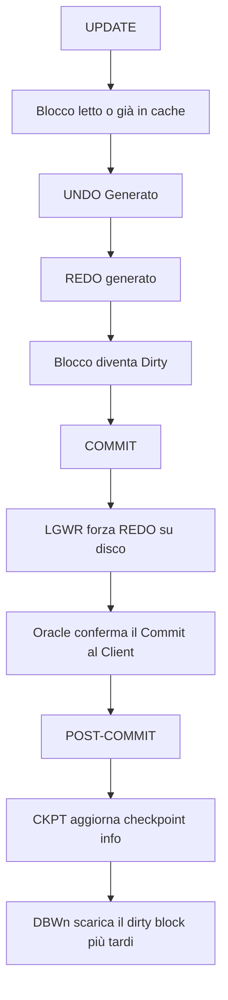

Regola d'oro:

- redo prima dei datafile;
- questa e' la base del write-ahead logging Oracle.

---

## 10. Oracle Net, Listener, Services e Registrazione Dinamica

Blocco visivo:

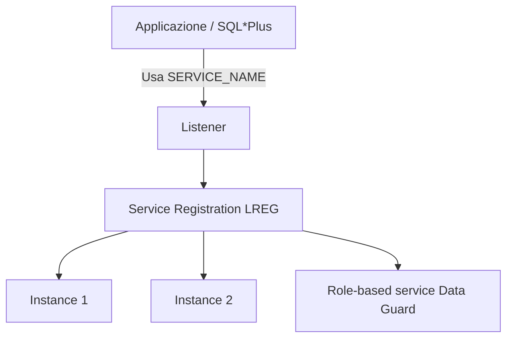

### 10.1 Listener

Il listener ascolta richieste di connessione e le inoltra al service corretto.

File tipici:

- `listener.ora`;
- `tnsnames.ora`;
- `sqlnet.ora`.

### 10.2 Service vs SID

`SID`:

- identifica un'istanza specifica.

`SERVICE_NAME`:

- identifica il servizio logico usato dalle applicazioni.

Best practice:

- le applicazioni devono usare servizi, non SID;
- in RAC e Data Guard, il service e' il concetto corretto di accesso.

### 10.3 Registrazione dinamica ed Ecosistema (LREG)

La registrazione del servizio (Service Registration) è una feature in cui il processo in background **LREG (Listener Registration Process)** comunica dinamicamente le informazioni sull'istanza al listener locale e remoto.
Questo significa che non devi configurare a mano quasi nulla nel `listener.ora`. LREG informa il listener costantemente sul carico (Load Balancing) e sui dispatcher disponibili.

Parametri coinvolti:

- `LOCAL_LISTENER`: dice a LREG dove trovare il listener locale.
- `REMOTE_LISTENER`: indispensabile in RAC per notificare il listener principale dell'intero cluster (SCAN Listener).

In RAC:

- `REMOTE_LISTENER` punta tipicamente allo SCAN;
- i servizi possono fare load balancing e failover.

Comando utile:

```sql
ALTER SYSTEM REGISTER;
```

Serve per forzare la registrazione immediata dopo start listener o cambi service.

---

## 11. Architettura Multitenant: CDB e PDB

Dal punto di vista 19c, l'architettura multitenant e' centrale.

Schema CDB/PDB:

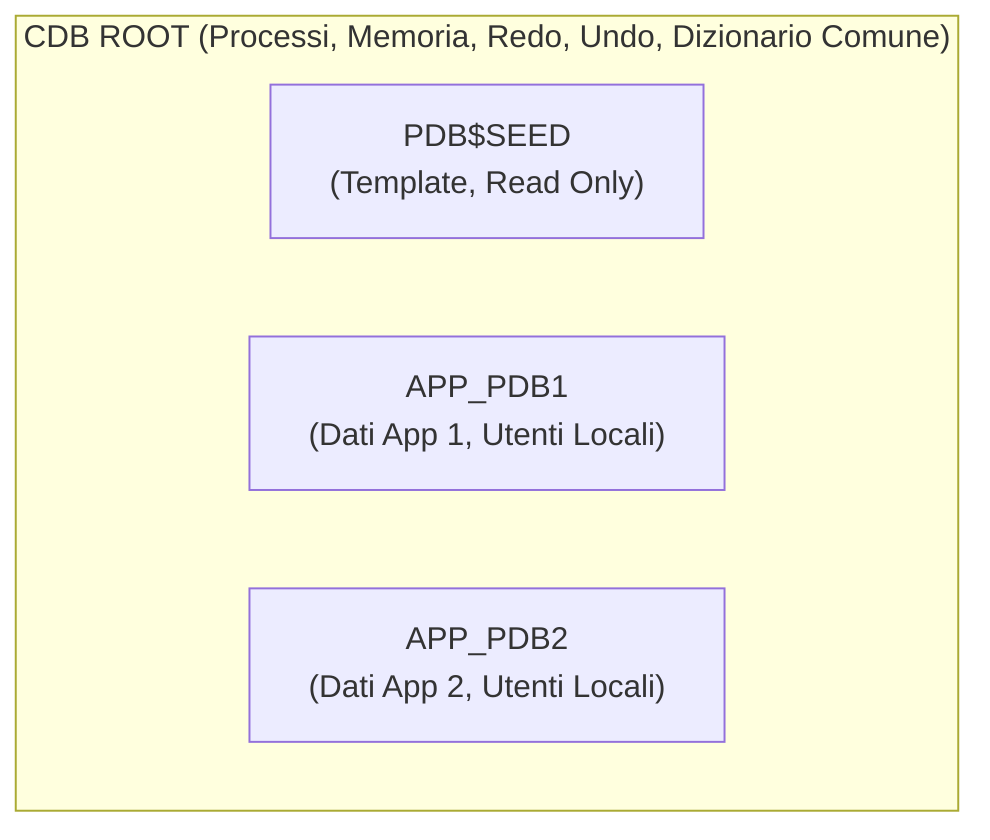

### 11.1 Componenti

Ogni CDB include:

- `CDB$ROOT`;
- `PDB$SEED`;
- zero o piu' PDB utente.

### 11.2 Root

`CDB$ROOT` contiene:

- metadata Oracle comuni;
- common users;
- strutture condivise.

Non e' il posto giusto per i dati applicativi normali.

### 11.3 Seed

`PDB$SEED` e' il template read only usato per creare nuovi PDB.

### 11.4 PDB

Un Pluggable Database (PDB) appare all'applicazione come un database fisico, indipendente e tradizionale, ma a livello architetturale condivide le risorse pesanti con il contenitore madre (CDB):

- **Stessa Istanza**: non c'è una RAM/SGA separata o un PDB_CACHE_SIZE isolato (tranne per limiti imposti col Resource Manager).
- **Mancanza di Processi Background propri**: SMON, PMON, DBWn, LGWR appartengono solo al CDB Root.
- **Redo Logs**: condivisi. Tutte le modifiche di tutti i PDB vanno ad alimentare l'unico stream di Redo Log gestito dal root.
- **Undo Tablespace**: di norma esiste l'opzione "Local Undo" (raccomandata in 19c) in cui ogni PDB ha i suoi undo file, o condivisa centralmente.
- **Control File**: il CDB ha un unico control file che mappa tutti i Datafile di tutti i PDB.

Questo e' fondamentale:

- un CDB con 10 PDB non ha 10 istanze separate;
- ha una sola istanza che gestisce piu' container.

### 11.5 Common users e local users

- common user: visibile in tutti i container;
- local user: esiste solo nel PDB.

### 11.6 Servizi e PDB

Best practice:

- ogni applicazione usa un service associato al PDB;
- in RAC si crea il service con `srvctl add service -pdb ...`.

---

## 12. ASM: Automatic Storage Management

ASM e' il layer storage Oracle ottimizzato per file database.

Fa da:

- volume manager;
- file system specializzato Oracle.

Concetti base:

- ASM instance;
- disk groups;
- failure groups;
- allocation units;
- template, striping e mirroring.

Nel tuo lab usi disk group tipici:

- `+DATA`;
- `+RECO`;
- `+CRS`.

Perche' ASM e' importante:

- semplifica naming e placement file;
- supporta OMF;
- si integra bene con RAC, RMAN, Data Guard.

Blocco visivo:

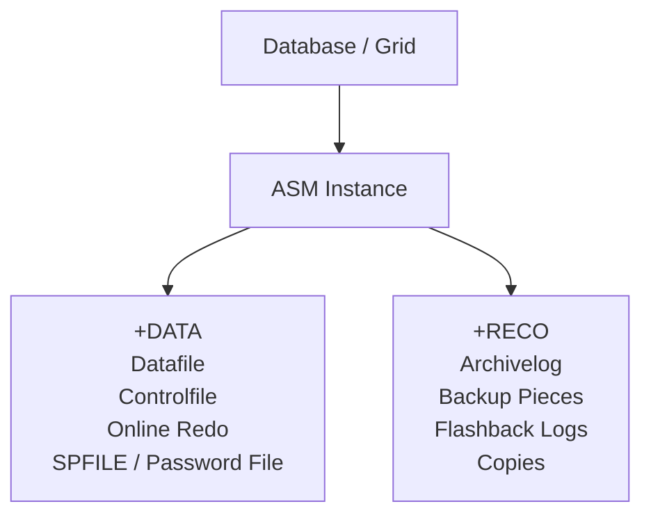

---

## 13. RAC: Architettura Cluster

RAC significa piu' istanze che aprono lo stesso database condiviso.

Schema RAC:

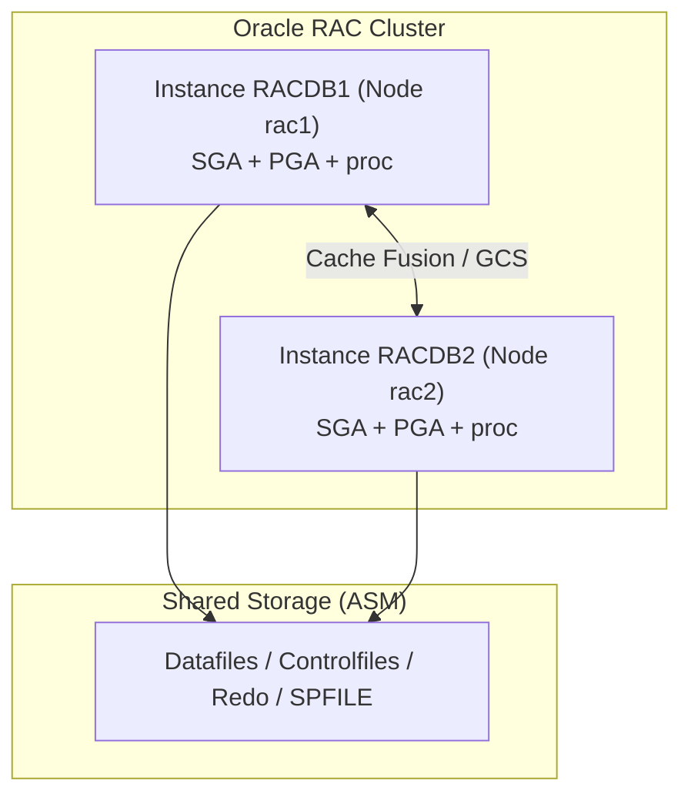

### 13.1 Cosa condividono le istanze RAC

Condividono:

- datafiles;
- control files;
- online redo logs per thread;
- SPFILE condiviso;
- ASM storage.

Non condividono:

- PGA;
- buffer cache locale;
- server processes locali.

Ogni istanza ha:

- propria SGA;
- propri processi;
- proprio redo thread;
- proprio undo tablespace.

### 13.2 Cache Fusion

E' il meccanismo con cui un'istanza RAC puo' ricevere blocchi in memoria da un'altra istanza senza passare da disco.

E' la chiave di RAC.

### 13.3 SCAN

Lo `SCAN` e' il nome virtuale di accesso al cluster.

Serve a:

- semplificare connessioni client;
- load balancing;
- failover.

### 13.4 Services in RAC

I services permettono di decidere:

- dove deve girare il workload;
- failover;
- ruolo applicativo;
- pinning a PDB.

---

## 14. Data Guard: Architettura di Protezione

Data Guard protegge il database con uno o piu' standby.

Schema redo transport:

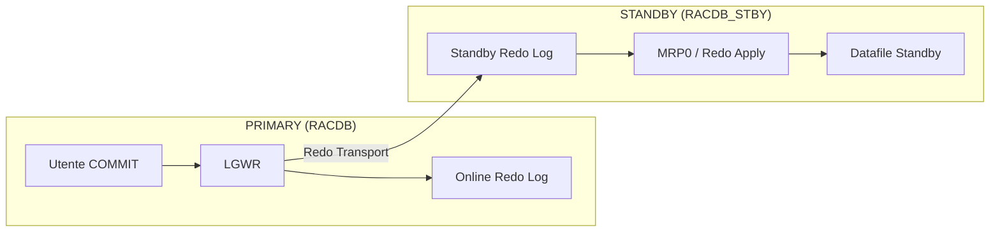

### 14.1 Componenti concettuali essenziali

- Primary database: chi detiene i Dati attivi in Read/Write.
- Standby database: chi consuma i dati e si sincronizza.
- **Redo Transport Services**: Incaricati di "spedire" via rete il flusso di REDO (tramite modalità SYNC o ASYNC, a seconda della *Protection Mode* voluta come *MaxProtection*, *MaxAvailability*, o *MaxPerformance*).
- **Apply Services**: L'entità (sul db di destinazione) che "applica" il vero redo ricevuto sui propri datafile. (Tramite `Redo Apply` logico se Logical, o fisico tramite Media Recovery).
- **Data Guard Broker (`DGMGRL`)**: Il tool amministrativo opzionale (ma consigliatissimo) che automatizza lo switchover e il failover istantaneo, pilotando in background i processi di trasporto e apply per te.

### 14.2 Tipi principali di standby

- **Physical Standby**: copia byte-per-byte esatta dei datafile. Usa MRP (Managed Recovery Process) per applicare il Redo. È la tipologia usata nel tuo lab pratico!
- **Logical Standby**: traduce e usa istruzioni SQL per mantenere allineati pezzi di tabelle. Raramente usato per pura HA.
- **Snapshot Standby**: un Physical Standby temporaneamente convertito in "Read/Write" per fare test applicativi con dati di prod senza corrompere la futura sincronizzazione primaria.

### 14.3 Flusso base

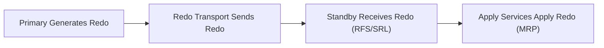

### 14.4 Ruoli e modalita'

Ruoli:

- `PRIMARY`;
- `PHYSICAL STANDBY`.

Operazioni:

- switchover;
- failover;
- reinstate.

Protection modes:

- `MaxPerformance`;
- `MaxAvailability`;
- `MaxProtection`.

### 14.5 Broker

Il Broker centralizza la gestione con:

- `DGMGRL`;
- Enterprise Manager.

Processo chiave:

- `DMON`.

---

## 15. Diagnostica: ADR, Alert Log, Trace, AWR, ASH

### 15.1 ADR

L'ADR e' l'Automatic Diagnostic Repository.

Contiene:

- alert log;
- trace files;
- incidenti;
- homes diagnostiche database, listener e ASM.

Tool principale:

- `adrci`.

### 15.2 Alert log

E' il diario operativo del database.

Da controllare per:

- ORA errors;
- archiver issues;
- crash recovery;
- Data Guard apply;
- parameter changes;
- startup e shutdown.

### 15.3 Trace files

Contengono dettaglio tecnico per processi o errori specifici.

### 15.4 AWR, ASH, ADDM

Sono strumenti di performance e diagnostica.

Uso concettuale:

- `AWR`: snapshot storici;
- `ASH`: campionamento sessioni attive;
- `ADDM`: analisi automatica.

Nota pratica:

- AWR, ASH e ADDM completi richiedono licenze o packs appropriati in produzione.

---

## 16. Dizionario Dati e Dynamic Performance Views

Due famiglie fondamentali.

### 16.1 DBA_, ALL_, USER_

Metadati persistenti:

- oggetti;
- utenti;
- tablespace;
- quote;
- segmenti.

### 16.2 V$ e GV$

Vista runtime dinamica.

- `V$`: istanza locale;
- `GV$`: cluster-wide in RAC.

Viste da conoscere.

| Vista | Perche' e' importante |
|---|---|
| `v$instance` | stato dell'istanza |
| `v$database` | ruolo, open mode, DBID, log mode |
| `v$parameter` | parametri effettivi |
| `v$spparameter` | parametri nello SPFILE |
| `v$bgprocess` | background processes |
| `v$session` | sessioni attive |
| `v$process` | processi OS e Oracle |
| `v$datafile` | datafiles |
| `v$log` | redo log groups |
| `v$logfile` | redo log members |
| `v$archived_log` | archived redo history |
| `v$managed_standby` | processi standby e apply |
| `v$dataguard_stats` | transport e apply lag |
| `v$asm_diskgroup` | stato ASM |
| `gv$instance` | tutte le istanze RAC |
| `gv$services` | services cluster-wide |

---

## 17. Mappa dei Parametri piu' Importanti

| Parametro | Significato architetturale |
|---|---|
| `DB_NAME` | nome logico del database |
| `DB_UNIQUE_NAME` | nome unico del sito, cruciale per Data Guard |
| `INSTANCE_NAME` | nome della singola istanza |
| `SERVICE_NAMES` | servizi database, oggi spesso gestiti tramite srvctl |
| `SGA_TARGET` | gestione automatica SGA |
| `PGA_AGGREGATE_TARGET` | target PGA |
| `DB_BLOCK_SIZE` | block size del database |
| `CONTROL_FILES` | control file attivi |
| `DB_CREATE_FILE_DEST` | OMF destination primaria |
| `DB_RECOVERY_FILE_DEST` | FRA |
| `DB_RECOVERY_FILE_DEST_SIZE` | dimensione FRA |
| `REMOTE_LOGIN_PASSWORDFILE` | uso del password file |
| `LOCAL_LISTENER` | listener locale |
| `REMOTE_LISTENER` | listener remoto o SCAN |
| `CLUSTER_DATABASE` | abilita comportamento RAC |
| `LOG_ARCHIVE_CONFIG` | perimetro Data Guard |
| `LOG_ARCHIVE_DEST_n` | destinazioni redo transport o local archive |
| `STANDBY_FILE_MANAGEMENT` | auto-gestione file standby |
| `DG_BROKER_START` | avvio Broker |

---

## 18. Errori Concettuali Comuni

1. pensare che `COMMIT` significhi datafile gia' scritto;
2. confondere `service` con `SID`;
3. confondere `istanza` con `database`;
4. credere che ogni PDB abbia una sua istanza separata;
5. pensare che `MRP0` debba stare su tutte le istanze standby RAC;
6. ignorare la differenza tra `SPFILE` locale e `SPFILE` condiviso in ASM;
7. credere che il listener contenga il database;
8. confondere redo e undo;
9. credere che ASM sia solo una directory speciale;
10. usare solo `v$archived_log` per misurare lo stato Data Guard.

---

## 19. Come Collegare la Teoria al Tuo Lab

Nel tuo laboratorio questi concetti diventano concreti cosi'.

### Fase 2

- `RACDB` = un database condiviso;
- `rac1` e `rac2` = due istanze;
- `+DATA`, `+RECO`, `+CRS` = disk group ASM;
- `SCAN`, VIP, services = accesso client corretto.

### Fase 3

- `RACDB_STBY` = physical standby del primario;
- `MRP0`, `RFS`, SRL = apply e transport redo;
- SPFILE in ASM = assetto corretto RAC standby;
- OCR registration = gestione clusterware completa.

### Fase 4

- Broker = strato di orchestrazione Data Guard;
- `DMON` = processo chiave;
- `DGConnectIdentifier`, protection mode, switchover, failover = gestione HA e DR vera.

### Extra DBA e Oracle Moderno (21c/23ai)

- Le nuove versioni di Oracle spingono pesantemente su AI Vector Search per RAG e machine learning.
- **Oracle 23ai True Cache**: un approccio rivoluzionario per alleggerire il carico sul DB: una cache SQL in memoria ad alte prestazioni gestita trasparentemente da Oracle.
- EM (Enterprise Manager 13c) offre la console unificata per monitorare questo ecosistema (Fase 6).
- RMAN (Fase 5) protegge il db primario, standby e target.
- GoldenGate (Fase 7) permette lo scarico in tempo reale verso Local (Oracle 21c/23ai) o Cloud (es. OCI Data Integrator o Microservices).

---

## 20. Architettura Completa del tuo Ecosistema Lab

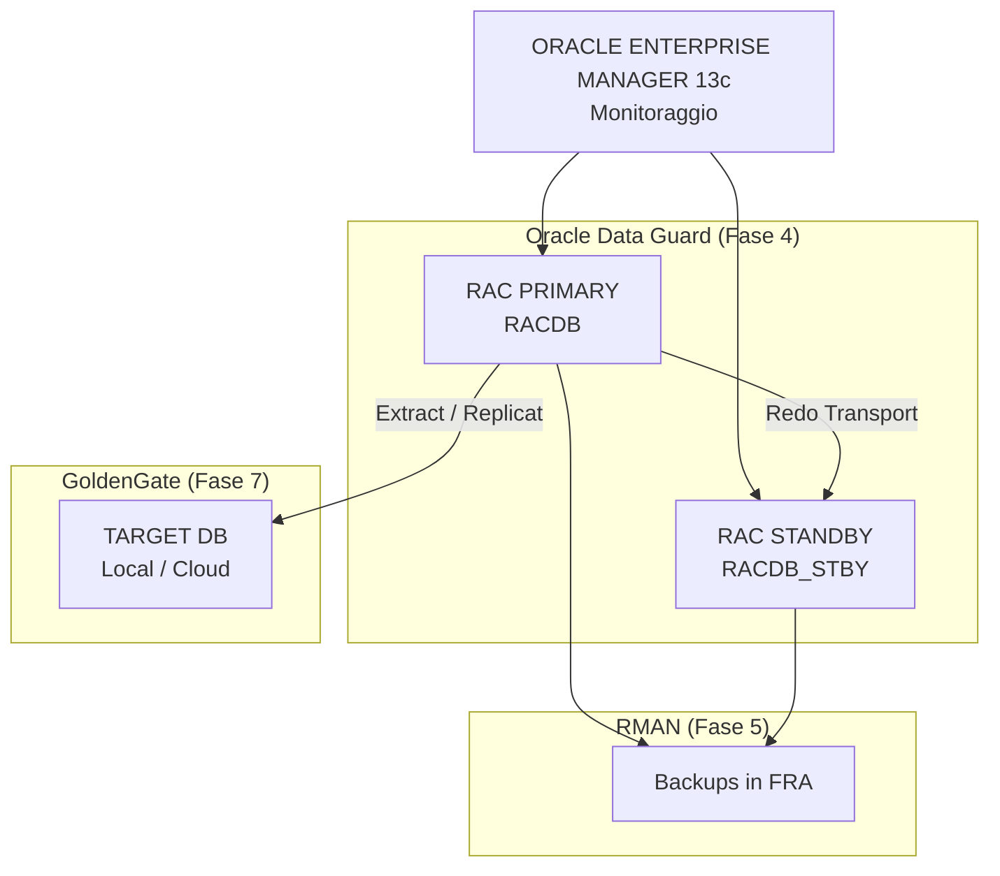

## 20. Query Minime da Sapere a Memoria

```sql
SELECT instance_name, status FROM v$instance;
SELECT name, open_mode, database_role FROM v$database;
SELECT name, value FROM v$parameter;
SELECT name, value FROM v$spparameter WHERE value IS NOT NULL;
SELECT process, status, thread#, sequence# FROM v$managed_standby;
SELECT dest_id, status, error FROM v$archive_dest;
SELECT group#, thread#, status FROM v$log;
SELECT member FROM v$logfile;
SELECT con_id, name, open_mode FROM v$pdbs;
SELECT inst_id, instance_name, host_name FROM gv$instance;
```

---

## 21. Riferimenti Oracle Ufficiali

- Oracle Database 19c Concepts - Memory Architecture
- Oracle Database 19c Concepts - Process Architecture
- Oracle Database 19c Concepts - Logical Storage Structures
- Oracle Database 19c Concepts - Physical Storage Structures
- Oracle Database 19c Concepts - Application and Networking Architecture
- Oracle Database 19c Multitenant - Overview of the Multitenant Architecture
- Oracle RAC Administration and Deployment Guide - Overview of Oracle RAC Architecture
- Oracle Data Guard Concepts and Administration - Redo Transport and Apply Services
- Oracle ASM Administrator's Guide - ASM Overview

Link ufficiali:

- https://docs.oracle.com/en/database/oracle/oracle-database/19/cncpt/memory-architecture.html
- https://docs.oracle.com/en/database/oracle/oracle-database/19/cncpt/process-architecture.html
- https://docs.oracle.com/en/database/oracle/oracle-database/19/cncpt/logical-storage-structures.html
- https://docs.oracle.com/en/database/oracle/oracle-database/19/cncpt/physical-storage-structures.html
- https://docs.oracle.com/en/database/oracle/oracle-database/19/cncpt/application-and-networking-architecture.html
- https://docs.oracle.com/en/database/oracle/oracle-database/19/multi/overview-of-the-multitenant-architecture.html
- https://docs.oracle.com/en/database/oracle/oracle-database/19/rilin/oracle-net-services-configuration-for-oracle-rac-databases.html
- https://docs.oracle.com/en/database/oracle/oracle-database/19/riwin/service-registration-for-an-oracle-rac-database.html
- https://docs.oracle.com/en/database/oracle/oracle-database/19/ostmg/automatic-storage-management-administrators-guide.pdf
- https://docs.oracle.com/en/database/oracle/oracle-database/19/sbydb/data-guard-concepts-and-administration.pdf
- https://docs.oracle.com/en/database/oracle/oracle-database/19/sbydb/oracle-data-guard-redo-apply-services.html
- https://docs.oracle.com/en/database/oracle/oracle-database/19/racad/real-application-clusters-administration-and-deployment-guide.pdf

---

## 22. Sintesi Finale

Se devi ricordare solo 10 idee, ricorda queste:

1. istanza e database non sono la stessa cosa;
2. SGA e' condivisa, PGA e' privata;
3. commit aspetta redo, non datafile;
4. redo e undo sono entrambi essenziali ma fanno cose diverse;
5. Oracle garantisce read consistency tramite SCN + undo;
6. listener inoltra connessioni, non esegue SQL;
7. service batte SID per applicazioni, RAC e Data Guard;
8. un CDB ha una sola istanza per i suoi PDB, non una per ogni PDB;
9. RAC = piu' istanze sullo stesso database condiviso;
10. Data Guard = redo transport + redo apply, non copia file \"magica\".
