# Architettura Oracle: Guida Completa ai Concetti Fondamentali

> Questa guida spiega i concetti architetturali che un DBA Oracle deve padroneggiare davvero. L'obiettivo non e' memorizzare definizioni isolate, ma capire come Oracle legge, scrive, recupera, scala e protegge i dati.

---

## 0. Glossario Rapido per Principianti

> Se sei nuovo al mondo database, questi termini sono i "mattoni" fondamentali dell'ecosistema Oracle.

- **Istanza (Instance)**: I processi in esecuzione e la memoria (RAM) allocata sul server. Esiste solo quando il server è acceso. Se riavvii la macchina, questa "Scompare" per poi ricrearsi.
- **Database**: I file reali salvati sul disco fisso (l'hard disk). Questi non scompaiono quando spegni la macchina. Contengono sia i tuoi dati che i file di log per la sicurezza.
- **SGA (System Global Area)**: La grande "memoria condivisa" (pool di RAM) che tutti i processi dell'istanza Oracle utilizzano insieme per lavorare velocemente senza accedere sempre al disco.
- **PGA (Program Global Area)**: La "memoria privata" assegnata a ogni signola connessione o processo. Ad esempio, se fai un `ORDER BY`, Oracle fa il calcolo qui dentro in privato.
- **Tablespace**: Un raccoglitore logico. È come una cartella di Windows: tu salvi i tuoi dati in un "Tablespace", e Oracle si preoccupa di spalmarli nei veri file fisici su disco (Datafiles).
- **Redo Log**: Il diaro di bordo in cui Oracle scrive *qualsiasi modifica* tu faccia prima ancora di salvarla fisicamente nei Datafile. Serve per il recupero in caso di crash.
- **Undo**: I dati temporanei usati per "Tornare indietro" (Rollback) o per permettere agli altri utenti di leggere i vecchi dati intanto che tu li stai modificando (Read Consistency).
- **Data Guard**: Il sistema di sicurezza primario per avere un "Database Copia" (Standby) costantemente allineato a quello principale (Primary) per il Disaster Recovery.
- **Oracle RAC (Real Application Clusters)**: Una tecnologia che ti permette di avere *più istanze* (su più server di calcolo) che operano contemporaneamente sullo *stesso database* fisico. Ideale per Alte Prestazioni (High Availability) e Scalabilità (Load Balancing).
- **GoldenGate**: Lo strumento che permette di "replicare" e sincronizzare dati tra Oracle e altri database (o tra versioni diverse di Oracle, anche in Cloud) in tempo reale.
- **Enterprise Manager**: Il pannello di controllo web (una grande dashboard unificata) che un DBA usa per capire lo stato di salute e gestire tutti i database da una sola pagina web.
- **ASM (Automatic Storage Management)**: Una sorta di file system speciale creato da Oracle per gestire in modo autonomo il salvataggio dei file del DB distribuiti su più dischi.

---

## 1. Modello Mentale di Base

Un database Oracle e' composto da due parti distinte:

1. l'istanza Oracle;
2. il database fisico su disco.

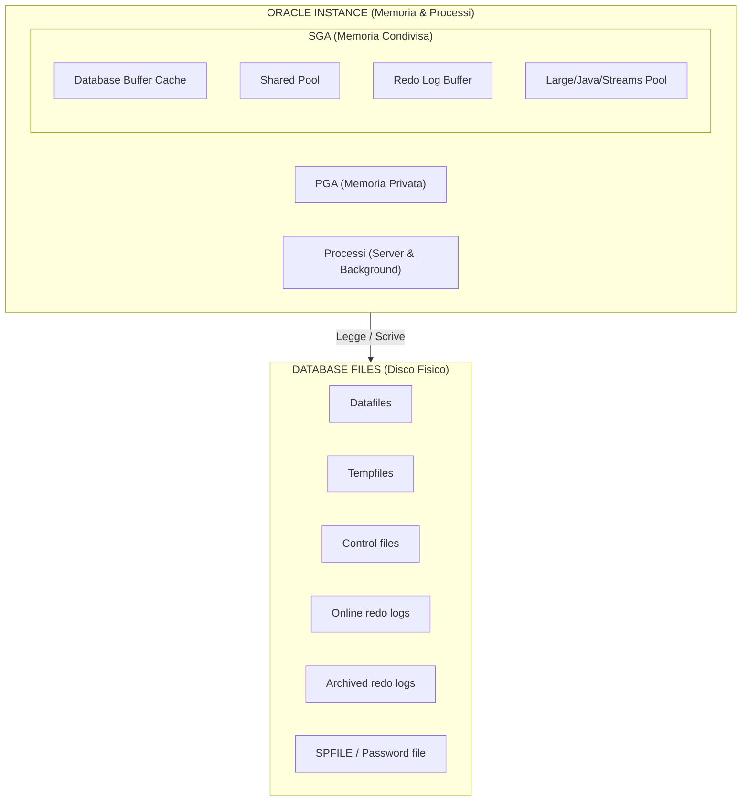

> **Spiegazione Architetturale del Diagramma (Istanza e Database):**
> Il diagramma mostra la netta e inviolabile separazione tra il "motore di calcolo" volatile e lo "storage" permanente. In alto c'è l'**Istanza Oracle** (che vive solo nella RAM del server e nei cicli di CPU), composta dalla grande memoria pubblica SGA, dalle piccole memorie private PGA e dalle decine di processi in background che lavorano senza sosta. In basso c'è il vero e proprio **Database Fisico**, ovvero file residenti in modo permanente sui dischi o SAN. L'Istanza è l'unico tramite che "Legge e Scrive" verso questi file. Se il server prende fuoco, l'Istanza evapora all'istante (perdendo la RAM), ma finché i Database Files (in basso) sono intatti sui dischi esterni, non hai perso una singola transazione committata.

Definizioni corrette:

- `istanza` = memoria + processi;
- `database` = insieme dei file persistenti;
- quando fai `shutdown immediate`, fermi l'istanza, non cancelli il database;
- quando fai `startup`, l'istanza torna a gestire i file del database.

Concetto chiave:

- l'istanza e' volatile;
- il database e' persistente.

Blocco visivo:


> **Spiegazione del Flusso di Avvio (Startup):**
> Il viaggio dall'oscurità al database operativo segue tappe obbligate di sicurezza. Al lancio del comando `STARTUP` (A), Oracle sveglia l'istanza entrando in **NOMOUNT** (B); qui la RAM (SGA) e i Processi nascono "alla cieca" consultando solo il Parameter File, senza sapere dove siano i dati reali. Nel passo successivo **MOUNT** (C), l'istanza recupera il `Control File` (il catalogo strutturale), scopre finalmente la posizione e il nome intero di tutti i Datafile e i Redo log sparsi sui dischi, ma tenendoli bloccati per operazioni amministrative. Solo nell'ultimo salto verso **OPEN** (D), Oracle sblocca fisicamente le valvole: verifica matematicamente l'integrità totale tra header dei file e control file (SCN), ripara in background eventuali corruzioni residue di un vecchio crash (Instance Recovery) e infine lascia entrare le applicazioni per fare query.

---

## 2. Ciclo di Vita del Database: NOMOUNT, MOUNT, OPEN

Oracle non parte sempre direttamente in `OPEN`. Ci sono tre fasi distinte.

### 2.1 NOMOUNT

In `NOMOUNT`, l'istanza di calcolo (Memoria e Processi) viene "guidata" e messa in moto, ma il database fisico per ora è come se non esistesse. Oracle non sa ancora dove siano i file o come si chiami il db. 
Cosa avviene esattamente sotto il cofano:

1. **Lettura del Parameter File (PFILE/SPFILE)**: L'istanza cerca un file di configurazione specifico nel sistema operativo per sapere come dimensionarsi (cercherà solitamente in sequenza: `spfile<SID>.ora`, poi `spfile.ora`, poi il file di testo `init<SID>.ora`).
2. **Allocazione della SGA**: Viene fisicamente allocata la quantità di memoria RAM gigantesca necessaria per funzionare (la Shared Pool, Buffer Cache ecc.. come richiesto nel Parameter file).
3. **Avvio dei Background Processes**: Vengono "accesi" i processi di vitale importanza come PMON, SMON, CKPT, DBWn, LGWR e posizionati pronti in RAM.
4. **Scrittura file di traccia**: Oracle apre il famosissimo file `alert.log` per l'istanza e ci annota tutte le informazioni di avvio (e gli eventuali errori critici da qui in poi).

Disponibile:
- Creazione database (comando `CREATE DATABASE`).
- Clonazione RMAN (comando `DUPLICATE`).
- Ripristino di emergenza del Parameter File.
- Setup iniziale (Bootstrap) dello standby database in Data Guard.

### 2.2 MOUNT

In `MOUNT`, l'istanza avviata stringe finalmente la mano al database fisico (ai file), mettendolo sotto chiave amministrativa. È la fase "a porte chiuse".

Cosa avviene esattamente:
1. **Apertura del Control File**: L'istanza va a leggere dal Parameter File l'indirizzo spaziale del *Control File* (il cervello/catalogo su disco) e lo apre in memoria.
2. **Scansione Fisica dei Metadati**: Leggendo il Control File, Oracle estrae la "mappa del tesoro": i nomi e le directory di tutti i Datafile e i file di Online Redo Log del database. 
3. **Verifica (senza svelare i dati)**: L'istanza verifica a basso livello che quei file fisici esistano dove il Control File dice che dovrebbero essere (es: controllando dentro i dischi ASM `+DATA`), ma volutamente **non apre i file del database ai clienti**.

Disponibile per il DBA *ma non per gli Utenti App*:
- Media Recovery completi (ripristinare e riapplicare vecchi backup).
- Messa in ricezione per i database di Standby.
- Operazioni massicce di `RENAME` dei datafiles, abilitazione o spegnimento della modalità preziosa `ARCHIVELOG`.

### 2.3 OPEN

In `OPEN`, avviene la mossa finale. Il database sbatte aperte le proprie porte, permettendo al business e alle applicazioni di riversarsi in esso per leggere e modificare dati.

Cosa avviene di molto delicato:
1. **Apertura Datafiles e Online Redo Logs**: Oracle si collega direttamente dentro quest'ultimi ed è in grado di tracciare o recuperare dati applicativi specifici.
2. **Verifica della Consistenza Integrale (L'incrocio SCN)**: Oracle va a colpo sicuro a confrontare il *System Change Number (SCN)* (l'orologio interno del db) salvato in sicurezza all'interno del Control File con gli SCN presenti stampati nell'intestazione (header) di tutti i Datafiles. Tutto **deve** coincidere al calcolo per assicurarsi che i file siano perfettamente speculari alla fine.
3. **Eventuale Instance Recovery Auto-Magica (SMON)**: Se in passato c'è stato un arresto anomalo (ad esempio togliendo la spina al server, usando *SHUTDOWN ABORT*, e interrmpendo il check degli SCN), Oracle se ne accorge qui! Il processo *SMON* entra di prepotenza, consulta i dati crudi sugli avanzi di *Online Redo Logs*, calcola, pulisce i buffer ed esegue l'*Instance Recovery* istantaneamente, recuperando transazioni committate andate disperse e rollbackando quelle sporche, garantendo il db consistente e riavviabile prima dei log in.
4. **Apertura di Accesso ai Dati**: I tablespace normali divengono editabili e gli utenti normali ottengono privilegi di querying/update sui dati.

Varianti Comuni per fasi avanzate:
- `OPEN READ WRITE`: Uso di produzione regolare.
- `OPEN READ ONLY`: Protezione assoluta in sola lettura (utile in contesti Data warehouse/Reporting statico).
- `READ ONLY WITH APPLY`: Per Data Guard attivi (la famosa feature Active Data Guard, dove tu puoi leggere i dati replicati su uno standby allo stesso tempo in cui il server lo aggiorna invisibilmente dietro le quinte).

### 2.4 Shutdown Modes

I principali sono:

- `SHUTDOWN NORMAL`: aspetta che tutti gli utenti escano;
- `SHUTDOWN IMMEDIATE`: rollback delle transazioni non committate e chiusura pulita;
- `SHUTDOWN ABORT`: stop brutale, recovery all'avvio successivo;
- `SHUTDOWN TRANSACTIONAL`: aspetta fine transazioni attive.

Nel lab, il piu' usato e' `IMMEDIATE`.

---

## 3. Architettura della Memoria

Oracle usa due grandi aree di memoria:

1. `SGA` condivisa;
2. `PGA` privata.

Schema rapido:

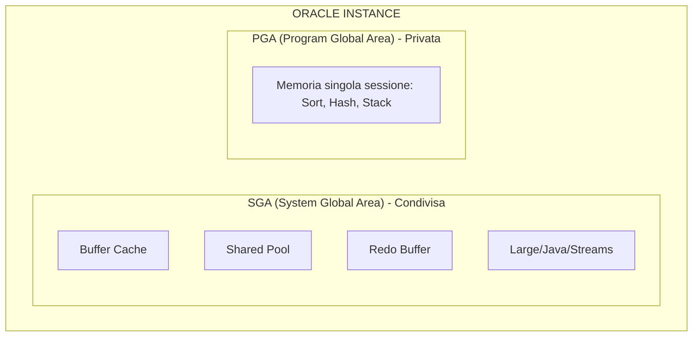

> **Spiegazione del Modello di Memoria (SGA vs PGA):**
> La topologia della RAM in Oracle è simile a un grande ufficio. La scatola superiore **SGA (System Global Area)** rappresenta l'"area comune condivisa": c'è la **Buffer Cache** (l'immenso tavolo di lavoro dove vengono depositati i dati grezzi estratti dai dischi affinché tutti possano leggerli a velocità-RAM), la **Shared Pool** (l'enorme schedario delle query e dei piani di volo già analizzati) e il **Redo Buffer** (il vassoio dove si accumulano freneticamente le registrazioni delle modifiche prima di esser "scaricate" sul disco fisso).
> La scatola inferiore **PGA (Program Global Area)** rappresenta invece la "scrivania privata asoolutamente isolata" di ciascun impiegato (il Server Process). Se tu utente hai chiesto di ordinare per ordine alfabetico un milione di record (`ORDER BY`), questo "ordinamento mentale (Sort/Hash)" viene fatto in gran segreto e al riparo da occhi indiscreti nella tua *PGA privata*, non disturbando così la memoria pubblica SGA.

### 3.1 SGA: memoria condivisa dell'istanza

Tutti i processi server e background leggono o scrivono la SGA.

Componenti principali.

#### Database Buffer Cache

Contiene blocchi di dati letti dai datafile.

Funzione:

- ridurre I/O fisico;
- mantenere in RAM i blocchi piu' usati;
- ospitare blocchi modificati ma non ancora scritti su disco.

Stati logici dei blocchi (Buffer States):

- `clean`: blocco uguale alla copia su disco. Se il DB ha bisogno di spazio, può sovrascriverlo istantaneamente (dopo averlo "invecchiato" tramite LRU). Se Database Smart Flash Cache è abilitato, DBWn può scrivere il corpo del buffer pulito nella flash cache per un futuro riutilizzo rapido, mantenendone l'header in memoria.
- `dirty`: modificato in memoria, non ancora scritto da DBWn.
- `pinned`: blocco attualmente in uso o modificato in una transazione attiva, intoccabile per altre operazioni in quel millisecondo.

**Buffer Touch Counts e LRU (Least Recently Used)**:
Oracle usa una lista LRU per decidere quali blocchi tenere in RAM. Non sposta fisicamente i dati in memoria, ma sposta i "puntatori". Usa un meccanismo di "touch count": quando un buffer viene "pinnato", se il contatore è stato incrementato più di tre secondi fa, viene aumentato. La regola dei tre secondi evita che un burst di operazioni conti come letture multiple (es. un insert di molte righe conta come 1 touch). I blocchi con touch count alti vanno verso la parte "hot" (calda) della lista LRU, quelli non usati "age out" (invecchiano) ed escono.

**Buffer Pools multipli**:
Di default esiste solo il *Default pool*. Ma per ottimizzare, puoi dividere la Buffer Cache in:
- `Keep pool`: per blocchi letti spesso (es. tabelle di lookup) che vuoi restino sempre in RAM.
- `Recycle pool`: per blocchi letti raramente (es. data warehouse scans) che devono uscire subito dalla cache per non inquinare la LRU della Default pool.
- `Big table cache`: per gestire table scan massivi usando algoritmi basati sulla "temperatura" (temperature-based).

Concetto importante:

- il commit non aspetta la scrittura del blocco dirty sul datafile;
- il commit aspetta il redo su disco.

#### Shared Pool

Contiene strutture condivise necessarie all'esecuzione SQL.

Sottocomponenti chiave:

- `Library Cache`: Contiene SQL parsato, blocchi PL/SQL, execution plans. Qui avviene l'"Allocation and Reuse": quando un nuovo SQL viene parsato (se non è DDL), viene allocato spazio. L'item resta in memoria tramite algoritmo LRU. Se più sessioni lo usano, resta anche se il processo creatore termina. L'istruzione `ALTER SYSTEM FLUSH SHARED_POOL` (o il cambio del global database name) svuota questa cache.
- `Data Dictionary Cache` (o *Row Cache*): Oracle accede spessissimo al dizionario dati per il parsing (privilegi, oggetti, tipologie colonne). Questa cache è l'unica a memorizzare i dati come *righe* (rows) e non come *buffer* (blocchi interi).

Se la Shared Pool e' piccola o frammentata puoi vedere:

- hard parse eccessivi;
- invalidazioni;
- errori `ORA-04031`.

#### Redo Log Buffer

Buffer circolare in RAM dove Oracle accumula i redo records prima che LGWR li scriva sui redo log online.

Contiene:

- descrizione delle modifiche;
- non i blocchi interi, ma change vectors.

#### Large Pool

Area opzionale usata da:

- RMAN;
- parallel execution;
- shared server;
- alcune operazioni I/O e messaging.

Serve a evitare pressione inutile sulla Shared Pool.

#### Java Pool

Usata se il database esegue componenti Java interni.

#### Streams Pool

Usata da funzionalita' di streaming e replication in alcuni scenari.

### 3.2 PGA: memoria privata (Program Global Area)

A differenza della SGA (che è un'enorme piazza pubblica dove tutti i processi leggono e scrivono), la **PGA** è strettamente privata. Ogni singolo server process o background process possiede la propria PGA allocata dal sistema operativo al momento del suo avvio. Nessun altro processo può sbirciare nei dati della tua PGA.

Cosa avviene qui dentro:
- **Sort Area**: Se scrivi una query con `ORDER BY`, `GROUP BY` o un `ROLLUP`, Oracle usa questo spazio di calcolo in RAM per ordinare i dati. Se la Sort Area è troppo piccola, Oracle "spilla" (riversa) i dati nei file temporanei su disco (Tablespace TEMP), crollando le performance generali.
- **Hash Area**: Sfruttata matematicamente per eseguire gli *Hash Join* tra tabelle giganti.
- **Session Information & Cursor State**: Contiene lo stato attuale della connessione (chi sei, che privilegi hai attivi) e lo stato di esecuzione riga per riga di un cursore SQL.
- **Stack Space**: Variabili locali e array passati alla sessione o ai programmi PL/SQL.

Il controllo della PGA è governato da parametri come `PGA_AGGREGATE_TARGET` (in cui imponi un limite soft totale per tutte le PGA sommate) e, da Oracle 12c, dal `PGA_AGGREGATE_LIMIT` (un limite hard per evitare che il DB consumi tutta la RAM del server esplodendo in errori OOM - Out of Memory).

### 3.3 UGA: La memoria dell'utente (User Global Area)

La `UGA` è un subset logico della memoria associata strettamente alla *sessione* utente (non al processo operativo in sé). Dove Oracle posiziona fisicamente la UGA dipende in modo critico dall'architettura di rete scelta:

- **Modello Dedicated Server**: C'è un rapporto 1:1 tra la sessione e il processo OS. Poiché il processo serve un solo client, **la UGA è interamente contenuta all'interno della PGA** del processo server. Questo garantisce massime performance e totale isolamento.
- **Modello Shared Server**: Migliaia di sessioni "saltano" di volta in volta su un pool ristretto di processi condivisi. Di conseguenza, il processo server A non può tenere i dati privati dell'utente X nella propria PGA, perché l'utente X fra dieci secondi potrebbe venir affidato al processo server B. Quindi, **Oracle sposta la UGA dentro la SGA** (specificamente nel Large Pool o Shared Pool) rendendo lo stato dell'utente visibile a tutti i processi server dell'anello.

### 3.4 Gestione automatica della memoria

Configurare quanta RAM dare a Shared Pool, Buffer Cache o Java Pool a mano è complesso. Oracle nel tempo ha inventato algoritmi per far auto-bilanciare queste aree "rubacchiandosi" RAM a vicenda a orecchio delle vere necessità (il workload-driven tuning).

#### ASMM (Automatic Shared Memory Management)
Il modello tutt'oggi più utilizzato (specie nei grossi lab ed enterprise). Tu stabilisci la quota *totale* di SGA, e i processi in background MMAN (Memory Manager) dimensionano dinamicamente e continuamente i Pool interni.
Parametri di controllo:
- `SGA_TARGET`: Quanta allocazione dinamica consentire.
- `SGA_MAX_SIZE`: Il limite strutturale massimo oltre cui ASMM non può fisicamente spingersi senza un vero riavvio dell'istanza.
- `PGA_AGGREGATE_TARGET`: La gestione automatica delle PGA private, slegata e trattata parallelamente.

#### AMM (Automatic Memory Management)
L'evoluzione estrema, un po' meno amata per i grandi sistemi Linux con HugePages.
Parametri:
- `MEMORY_TARGET` e `MEMORY_MAX_TARGET`.
Affidando a Oracle un singolo bacino totale di RAM per tutto (SGA + PGA), l'istanza è in grado di allargare la SGA rubando spazio alla PGA se i processi non stanno facendo calcoli, e viceversa. Tende ad essere eccellente per server più piccoli, ma in sistemi Data Warehouse giganti porta a potenziali instabilità o continui ridimensionamenti frenetici.

---

## 4. Architettura dei Processi

Oracle usa:

1. processi client;
2. listener;
3. server processes;
4. background processes.

### 4.1 Client process

E' il processo applicativo o lo strumento che si connette a Oracle:

- SQL*Plus;
- JDBC / Client OCI;
- Python / Applicazione web.

È fondamentale capire la differenza rispetto a un processo server:
- Il processo client **non può accedere direttamente alla SGA** (ram condivisa) del database.
- È il motivo per cui l'applicazione e il database possono risiedere su server fisici o reti completamente diversi.
- La connessione (network session) viene stabilita verso un listener che a sua volta fa nascere un **Server Process** dedicato (o assegnato) per dialogare con la SGA e i file.

### 4.2 Listener

Il listener riceve la connessione di rete e la inoltra al service corretto.

Non esegue SQL.

Fa da dispatcher iniziale:

- ascolta sulla porta;
- conosce i servizi registrati;
- passa la sessione al server process.

### 4.3 Server process

E' il processo che esegue davvero il lavoro della sessione.

Compiti:

- parse;
- execute;
- fetch;
- accesso ai blocchi;
- gestione cursori;
- interazione con PGA e SGA.

Modelli di connessione:

- `dedicated server`: per ogni utente connesso (Client process), Oracle avvia un processo dedicato (Server process) sul server DB. Quel processo Server conserva la UGA (User Global Area) all'interno della sua PGA privata. Questo è il modello standard e più sicuro lato isolamento. (Nel tuo lab usi quasi sempre `dedicated server`).
- `shared server`: se hai migliaia di utenti, sdoppiare migliaia di server process esaurirebbe la RAM (PGA). Con questo modello, i client parlano con un `Dispatcher`, il quale infila le richieste in una coda. Un pool più piccolo di `Shared Server Processes` pesca le richieste dalla coda. Qui la UGA si sposta all'interno della SGA (Large Pool) in modo che qualsiasi processo server la possa leggere.

### 4.4 Background processes fondamentali

| Processo | Ruolo pratico |
|---|---|
| Processo | Ruolo pratico e Dettaglio Tecnico|
|---|---|
| `DBWn` (Database Writer) | Esegue le scritture "lazy" (pigre) dei buffer diventati *dirty* (modificati in RAM) trasferendoli sui datafile fisici. Interviene anche in risposta ai CKPT (Checkpoint). Può avere più thread (DBW0, DBW1, ecc.). |
| `LGWR` (Log Writer) | Processo super critico: scrive le voci di REDO dal Redo Log Buffer in RAM verso gli Online Redo Logs su disco in modo sequenziale. Scrive sempre in modalità sincrona al momento di un COMMIT. |
| `CKPT` (Checkpoint) | Monitora il punto di "successo" fino al quale i dati sono salvi. Aggiorna l'header dei control file e l'header di ciascun datafile registrando fino a che numero SCN i dati sono sani, segnalando a DBWn di scaricare buffer sporchi. |
| `SMON` (System Monitor) | Si occupa della Instance Recovery. In caso di crash del server (e shutdown abort), al successivo riavvio `SMON` "riavvolge" e "riapplica" il vero redo e undo per far tornare il db consistente. Inolte ripulisce i segmenti temporanei. |
| `PMON` (Process Monitor) | È il sorvegliante. Se un processo utente cade/crasha improvvisamente, PMON interviene: sblocca i table-lock tenuti, svuota la PGA usata dal processo morto. Se usi Oracle RAC, fa il cleanup a livello di cluster. |
| `ARCn` (Archiver) | Quando un Online Redo Log è pieno, e prima che LGWR possa riciclarlo (sovrascriverlo), ARCn entra in azione copiandolo nei file di backup fisici "Archived Redo Log". Opzionale (serve configurare l'ARCHIVELOG mode) ma obbligatorio in prod. |
| `RECO` | Recupero transazioni distribuite sospese. |
| `MMON` | raccolta statistiche manageability/AWR |
| `MMNL` | supporto a MMON |
| `LREG` | registra dinamicamente servizi e istanze ai listener |
| `CJQ0` | coordina job scheduler |
| `RVWR` | scrive flashback logs se Flashback e' attivo |
| `FBDA` | Flashback Data Archive |
| `DMON` | Data Guard Broker |
| `VKTM` | gestisce il tempo virtuale interno |

### 4.5 Processi RAC-specifici

In RAC compaiono anche processi cluster-specifici, per esempio:

- `LMON`;
- `LMD`;
- `LMS`;
- `LCK`.

Servono a:

- cache fusion;
- global enqueue service;
- coordinamento dei blocchi tra istanze.

---

## 5. Come Oracle Esegue una Query

Flusso semplificato.

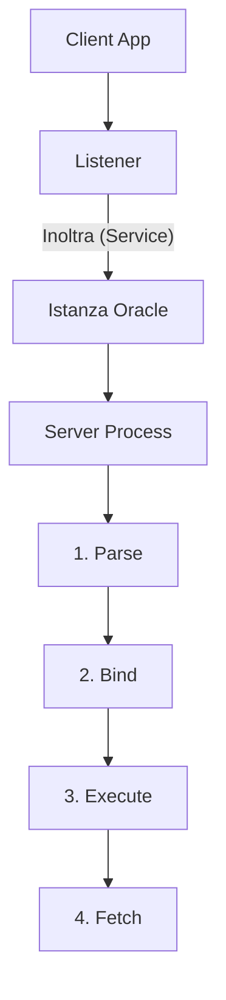

> **Spiegazione del Flusso di Esecuzione di una Query (Lifecycle):**
> Il percorso completo per far girare una semplice `SELECT *` è incredibilmente elaborato. 
> Tutto parte della **Client App** (che potrebbe essere il tuo script Python o DBeaver), che contatta l'antenna direzionale chiamata **Listener**. Il Listener lo rimbalza dentro l'**Istanza** assegnandogli o creandogli al volo un "maggiordomo privato" (il **Server Process**).
> A questo punto iniziano i "4 Salti Sacri" della SQL: 
> 1) Il **Parse**: Il server controlla grammatica, permessi e decide la "strada col navigatore GPS" più veloce (Execution Plan tramite il CBO).
> 2) Il **Bind**: Traduce e incolla le variabili dinamiche segrete passate dall'utente (es: `WHERE ID = :1`) al posto dei segnaposti.
> 3) L'**Execute**: L'azione pulsante! Si acquisiscono i Lock, si caricano i blocchi fisici dai Datafile alla memoria Buffer Cache (se non ci sono già) e si applicano le eventuali modifiche (Undo e Redo logici).
> 4) Il **Fetch**: Avviene per le sole letture o ritorni. Il server impacchetta le righe trovate e gliele lancia indietro via rete TCP al Client un "X righe alla volta" (Array Fetching) per non intasare l'infrastruttura.

### 5.1 Parse (Analisi sintattica e ottimizzazione)

Il *parse* è l'operazione cerebrale più costosa (e spesso temuta per le performance) in cui Oracle analizza il testo SQL immesso dall'utente e produce il piano di volo (Execution Plan) per recuperare velocemente i dati. Non si tratta solo di controllare parentesi e punteggiatura.

1. **Syntax Check**: Controlla la correttezza della grammatica.
2. **Semantic Check e Privilegi**: Oracle sfoglia freneticamente la *Data Dictionary Cache* per assicurarsi che la tabella chiamata "DIPENDENTI" esista davvero, e che il tuo utente abbia il permesso GRANT per leggerla.
3. **Ottimizzazione CBO (Cost-Based Optimizer)**: Oracle considera l'intelligenza delle statistiche. Esplorerà indici o partizioni? Farà un Table Scan sequenziale? Il *CBO* genera decine di possibili Execution Plan invisibili e assegna un "costo logico" (basato su I/O o stima CPU) a ognuno. Sceglierà il percorso dal costo matematico minore.

Tipi critici di parse:
- **Hard Parse**: È la prima volta che questa specifica query esatta viene vista dal server. Oracle segue tutti i 3 passaggi (estremamente costoso per CPU e spinlock in memoria). Dopodichè, ripone l'astratto "piano di volo" nella *Library Cache* della Shared Pool.
- **Soft Parse**: Una query identica viene ricevuta (letteralmente carattere per carattere, inclusi gli spazi). Oracle controlla i permessi ma poi *salta l'ottimizzazione CBO*, pescando e riciclando istantaneamente l'Execution Plan salvato nella Library Cache.

> **Obiettivo Sacro di un DBA / Dev**: Incoraggiare massivamente il *Soft Parse* utilizzando sempre le **Bind Variables** (`SELECT * FROM dipendenti WHERE id = :codice`). Se concateni le stringhe esplicitamente (`... WHERE id = 12` e poi `... WHERE id = 13`), Oracle le vedrà come query diverse e martellerà la CPU con continui ed estenuanti *Hard Parse*.

### 5.2 Execute (Esecuzione della manipolazione/query)

Armato del suo Execution Plan, il server process fa sul serio. Se si tratta di un comando DDL o DML (INSERT, UPDATE, DELETE):
1. **Verifica della Buffer Cache**: Controlla se possiede già le row della tabella in RAM. Altrimenti, scatena l'I/O scendendo sui Datafiles e copiando il blocco in memoria.
2. **Locking**: Se è DML, posiziona gli `Enqueue` (Lock) esclusivi per difendere le righe modificate da modifiche concorrenti da parte di altre sessioni.
3. **Generazione STORICO e LOG**: Scrive la contromisura temporale negli *Undo Segments* (per permetterti di fare rollback se ci ripensi) e successivamente salva lo stream di cambiamento nei log RAM sequenziali (il *Redo Log Buffer* destinato a LGWR).
4. **Mutazione RAM**: Cambia materialmente il valore della riga nel *Database Buffer Cache*, flaggando il blocco logico come **Dirty** (sporco). Nessun datafile viene toccato in disco al momento dell'Execute!

### 5.3 Fetch (Riversamento o restituzione)

Questa fase vale se si trattava di una `SELECT` o di ritorni da cursori PL/SQL:
- Il server process impacchetta ordinatamente le righe recuperate e le spedisce via rete tramite TCP/IP al terminale o all'applicazione (SQL*Plus, Java, .NET, browser).
- Se le righe sono molte (es. 1 milione), non le spedisce tutte subito, provocando crash. Le inoltra in "lotti" a manciate (es: 100 righe alla volta per fetch) gestendo le finestre di buffer di rete. Molti colli di bottiglia applicativi risiedono in cicli Fetch mal scritti a livello applicativo (chiamati Row-by-Row o "Slow-by-Slow"), mentre in Oracle il fetch massivo (Array Fetch) è sempre best practice.

---

## 6. Transazioni, SCN, Redo, Undo e Consistenza

Schema del commit:

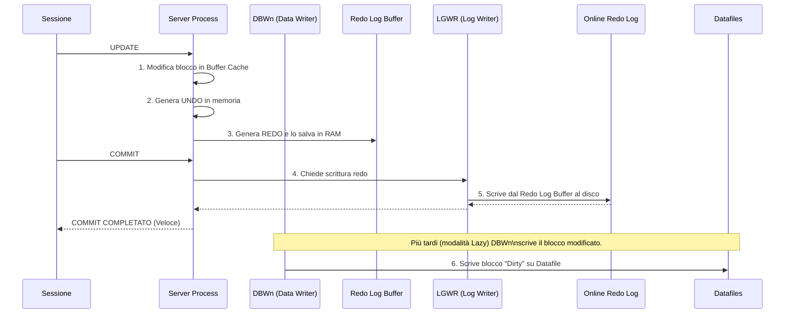

Questa e' la parte che separa chi usa Oracle da chi lo capisce.

### 6.1 SCN (System Change Number)

Lo `SCN` è il vero cuore pulsante temporale di Oracle. Non ci si affida all'orologio del sistema operativo (che potrebbe saltare per colpa di un server NTP), ma a un contatore incrementale interno (un orologio logico ed esatto) che non torna mai indietro.

E' di importanza galattica per tutto il motore perché:
- **Ordina le modifiche**: Ogni volta che un COMMIT ha successo, lo SCN avanza, ponendo un "timbro" univoco sulle transazioni.
- **Garantisce la Read Consistency**: Oracle usa lo SCN per capire se i dati che stai leggendo in questo istante erano già stati modificati e committati *prima* che la tua lunghissima query iniziasse.
- **Orchestra Data Guard e Recovery**: Permette di allineare perfettamente i database di Data Guard e di effettuare il *Point-In-Time Recovery* dicendo a RMAN "riportami il database allo SCN 14590212".

### 6.2 Undo (I Dati di Sicurezza e L'Annullamento)

L'Undo conserva l'informazione "antica" dei dati (il "prima" rispetto alla tua modifica), ed è salvata nel Tablespace dedicato (*UNDO*). Ha un triplo scopo fondamentale:

1. **Rollback**: Se un utente lancia una `UPDATE` cancellando migliaia di dipendenti per sbaglio, ma non ha ancora lanciato `COMMIT`, Oracle legge dall'Undo la foto precedente e ripristina la situazione.
2. **Read Consistency (Multi-versioning)**: Se l'utente X sta modificando la riga di Mario Rossi, l'utente Y che legge in quello stesso secondo non vedrà la riga bloccata, ma Oracle andrà furtivamente a ricostruirgli *"al volo"* la precedente maschera di Mario Rossi assemblando la riga vecchia recuperata dall'Undo. Questo evita i tremendi "Dirty Reads" o i lettori in perenne attesa tipici di altri RDBMS vecchi.
3. **Flashback**: Grazie all'Undo puoi interrogare le tabelle "nel passato" (es: `SELECT * FROM dipendenti AS OF TIMESTAMP...`).

*Concetto Chiave*: L'Undo è considerato a tutti gli effetti un *dato del database*. Pertanto, le modifiche allo spazio Undo producono a loro volta Redo!

### 6.3 Redo (I Log Operativi di Frontiera)

Il Redo log racconta il "dopo" (la "storia nuda e cruda" dei bit cambiati sul disco). È lo stream ininterrotto e sacro di *qualsiasi manipolazione* o vettorializzazione dei blocchi del database avvenuta in memoria.

Serve a:
- **Instance Recovery (Crash)**: Se qualcuno stacca brutalmente la spina di alimentazione e i buffer in RAM evaporano, il Redo Log su disco (se sopravvive) ha l'elenco esatto delle operazioni per "Rifare" o Re-Play i cambiamenti e rimettere in piedi le modifiche committate.
- **Alimentazione Data Guard**: Questo stream di cambiamenti binari è la sostanza che viene pompata via rete al server di Disaster Recovery.

### 6.4 L'arte del Fast Commit

Il comando `COMMIT` è il momento più critico. Non significa assolutamente che i blocchi enormi dei tuoi Datafile sono stati salvati su disco. Quel lavoro è assegnato a scoppio ritardato (*Lazy*) al `DBWn` per salvare le lenti performance dei vecchi dischi o della latenza storage.

COSA SIGNIFICA: Eseguendo `COMMIT`, metti pressione solo sul Log Writer (`LGWR`). Questo scriverà *solo la ricevuta* nel piccolissimo *Online Redo Log*. È un I/O sequenziale purissimo ed esplosivamente veloce. 
Appena l'Online Redo log lo sigilla su disco, Oracle decreta la tua transazione "salva e completata al 100%" risvegliando il processo client e dandogli luce verde. Tutto il resto (aggiornamento datafile veri e propri) potrà impiegare anche mezz'ora, perché Oracle, finché possiede il Redo, è sereno e imbattibile in caso di crash.

### 6.5 Read Consistency Totale

Oracle non ti mostrerà mai "letture sporche" od iper-variabili nel tempo. Garantisce che una grande query (che impiega magari 20 minuti a girare) veda una *fotografia consistente esatta* dei dati scattata al momento infinitesimale dello suo SCN di partenza logico.
Se un'altra rapida applicazione modifica costantemente e fa "commit" su una riga che la tua lenta query non ha ancora letto da disco, nel momento in cui la tua query ci arriva, Oracle non leggerà il blocco nuovo, ma "impalcherà" temporaneamente in memoria una ricostruzione assemblandolo con i dati dell'*Undo*.

### 6.6 Checkpoint (CKPT e l'Armonia dei File)

Il Checkpoint è il momento della pulizia e marcatura in sicurezza. Non equivale a bloccare l'I/O o mettere in pausa il business.
Significa che il processo *CKPT* annota nel **Control File** e negli **Intestazioni (Header) fisici di tutti i Datafile** qual è l'SCN corrente garantito pulito e consolidato.
Un Checkpoint obbliga il *DBWn* a versare finalmente tutti i blocchi "Dirty" pendenti dalla RAM al Datafile (es. quelli vecchi e modificati da lungo tempo). Lo scopo immenso del checkpoint è *fissare una boa di salvezza* per abbreviare mostruosamente il tempo necessario per un Instance Recovery. Meno buffer sono sporchi in memoria -> meno gap logico c'è tra Datafile e Redo -> minor Redo da "Rifare" al boot.

### 6.7 Instance Recovery vs Media Recovery

È la distinzione più fraintesa ma cruciale in Oracle:

**Instance Recovery (Il sistema fa da solo)**
- **Quando Avviene**: Dopo spegnimento brutale, mancanza di corrente, kernel panic, processo critico ucciso (`SHUTDOWN ABORT`). Il server perde la RAM, ma i dischi e tutti i file sono intatti e integri.
- **Il Meccanismo**: Al primo comando `STARTUP`, l'istanza capisce che l'SMON non ha chiuso correttamente i file (Control file SCN non combacia coi Datafiles SCN). Automaticamente il db apre i vecchi *Online Redo Log*, usa i change-vector non salvati su datafile e l'Undo, ed emula in 5 secondi le ore pre-crash ridando consistenza perfetta *senza* intervento umano in fase di boot.

**Media Recovery (RMAN interviene e il DBA suda)**
- **Quando Avviene**: Quando uno storage corrompe bit, i dischi si rompono, qualcuno fa un clamoroso "rm -rf" ai tuoi file binari dei Datafiles, o un temporale brucia la SAN.
- **Il Meccanismo**: Qui Oracle Database non sa riprendersi da solo, perché gli manca storicamente l'humus per capire i cambiamenti. Il DBA *deve* chiamare manualmente `RMAN` (Recovery Manager), incollare backup vecchi nei cluster disk, e avviare script espliciti dove RMAN riapplicherà a braccio tonnellate storiche di *Archived Redo Logs* scaricate dai nastri fino ad arrivare all'attualità. Il database resta OFF o parziale per quel file finché l'operazione non è terminata.

---

## 7. Strutture Logiche di Storage

Oracle separa architettura logica e fisica.

Ordine logico corretto:

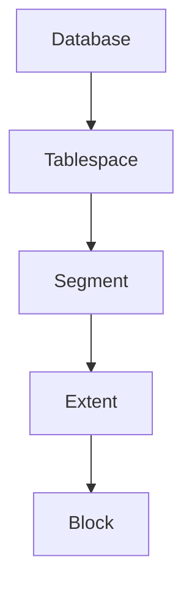

### 7.1 Data block

Il blocco è l'unità minima logica di operazione (I/O) del database. Un `Data Block` è logicamente tradotto dal DB come l'unione di uno o più OS Block (i blocchi del sistema operativo, formattati a livello Linux o Windows). Svincolarsi dalla dipendenza dell'OS block permette ad ASM e Oracle di gestire performance in modo custom.

Parametri chiave:

- `DB_BLOCK_SIZE`: tipicamente 8 KB nel lab. Esistono block size di 16 KB o 32 KB usati spesso per i Data Warehouse massivi.
- Un blocco ha un **header** (che include metadata, transazioni attive ITL e directory righe) e un **body** (che cresce bottom-up, dove vengono inserite o modificate fisicamente le row).
- Spazio d'aria (PCTFREE): percentuale (di base il 10%) lasciata rigorosamente vuota nel blocco per consentire un futuro "allargamento" delle righe (es: fai l'update di una row da NULL al testo "PincoPallo" e il dato ha bisogno di un po' più di spazio per espandersi senza provocare una fastidiosa frame-migration al blocco successivo).

### 7.2 Extent

Un extent e' un insieme di blocchi contigui allocati a un segmento.

### 7.3 Segment

Un segmento e' l'insieme di extents appartenenti a un oggetto.

Tipi comuni di segmenti:

- `Table segment`: per i dati regolari della tabella.
- `Index segment`: per le strutture ad albero che compongono gli indici.
- `Undo segment`: per lo storico/rollback (generato da Oracle in sottofondo in modo invisibile all'utente).
- `Temporary segment`: segmenti intermedi usa-e-getta crerati da Oracle mentre compi esecuzioni pesanti di SQL come `SORT` complessi o join enormi (tipicamente allocati nel tablespace *TEMP*).
- `LOB segment`: Large OBjects, foto, documenti, file JSON di grandissime dimensioni (spesso superano l'intero block capacity).

### 7.4 Tablespace

Un tablespace e' il contenitore logico dei segmenti.

Comuni in Oracle:

- `SYSTEM` e `SYSAUX`: oblogatori. Trattano il *"cervello"* di metadata, il Data Dictionary (viste, pacchetti PL/SQL built-in, cronologie AWR).
- `UNDO`: indispensabile per gestire le undo retention policy. Mantiene tutti gli Undo Segments.
- `TEMP`: tablespace temporaneo (uso volante per le query).
- tablespace applicativi: ad. esempio *USERS* o *DATI_APP* in cui vive realmente il software da gestire.

Tipi importanti:

- permanent;
- temporary;
- undo;
- bigfile;
- smallfile.

### 7.5 Bigfile vs smallfile

#### Smallfile tablespace

- piu' datafile nello stesso tablespace;
- modello storico piu' comune.

#### Bigfile tablespace

- un solo datafile molto grande;
- utile in ASM e ambienti automatizzati.

---

## 8. Strutture Fisiche di Storage

### 8.1 Datafiles

Contengono i blocchi dei tablespace permanenti e undo. I dati di un database sono archiviati collettivamente nei Datafiles. Un Segment (quindi una tabella) non può trovarsi a metà su due Tablespace, ma siccome un Tablespace può consistere di *più Datafile* fisici, un Fragment, un Extent o una Tabella possono "estendersi a cavallo" di centinaia di Datafile diversi. Questa dis-connessione astratta massimizza l'ottimizzazione dell'I/O (soprattutto in ASM via file-striping per leggere parallelamente dai vari dischi).

Non contengono:

- redo log;
- control file.

### 8.2 Tempfiles

Usati per:

- sort;
- hash;
- temporary segments.

Differenza pratica:

- non vengono recoverati come normali datafile;
- possono essere ricreati.

### 8.3 Control files

Sono il catalogo fisico minimo e *crusciale* del database: un piccolo file binario legato univocamente all'istanza. Se perdi tutti i control file attivi/disponibili, il database **non può esser montato (MOUNT)** e l'azione fallirà con errore fatale.

Contengono informazioni su:

- nome DB e DBID (Identificativo Unico Macchina vitale per RMAN);
- la mappa di tutti i datafiles e redo log su disco;
- le tabelle logiche degli SCN attuali (checkpoint);
- storia degli Archived Log e i metadati integrati di RMAN.

**Multiplexing Control File**:
Poiché il control file è fondamentale, in qualsiasi database di produzione vero avrai 2, o più comunemente 3, copie *identiche e aggiornate in contemporanea* (Multiplexing) salvate su hardware disk indipendenti. (es. una copia su `+DATA` e un duplicato di mirroring logico salvato su `+RECO`). In questo modo abbassi i "single point of failure".

### 8.4 Online redo logs

Costituiscono il componente più critico per la **Recovery** e proteggono contro le repentine perdite di alimentazione o failure del server (instance crash). Raccolgono tutte le modifiche fatte ai datafiles (*e perfino* ai block dei datafiles undo) scritte a un ritmo spaventoso prima ancora che vengano scaricate sui DataFile.

Organizzati per architettura di ridondanza solida:

- **Gruppi (Groups)**: servono almeno due gruppi al database per girare, e sono usati ad anello (quando si riempie l'11 passa al 12 e via dicendo).
- **Membri (Members per Gruppo)**: è la traduzione del Multiplexing del Redo! Anche qui, in produzione ogni Gruppo ha come minino due Membri. (Es. Gruppo 1 formattato con 2 file chiamati redo1a.log e redo1b.log messi su dischi ASM differenti. Se muore il primo storage array e redo1a brucia, redo1b garantirà che il log group proceda senza perdere le ultime righe modificate dai clienti della banca che hanno appena prelevato contante al bancomat).

Concetti:

- un gruppo e' usato come `CURRENT`;
- al log switch Oracle passa al gruppo successivo;
- ARCn archivia i gruppi pieni se il DB e' in `ARCHIVELOG`.

### 8.5 Archived redo logs (La Cronologia Perpetua)

Mentre gli *Online Redo Logs* sono come un "nastro a ciclo continuo" che viene sovrascritto di ora in ora per preservare spazio, gli **Archived Redo Logs** sono la copia permanente e storicizzata messa in cassaforte prima che la sovrascrittura avvenga. Il processo responsabile di questa copia fotografica è l'*ARCn* (Archiver).

Senza di essi, avresti protezione solo contro i crash temporanei (Instance Recovery) ma perderesti tutto in caso di rottura di un disco.
Servono tassativamente per:
- **Backup e Restores Completi**: RMAN li usa per colmare il "buco temporale" tra l'ultimo backup completo (messo su nastro un mese fa) e il momento esatto in cui il server è esploso oggi.
- **Point-in-Time Recovery**: La possibilità di riportare la banca dati esattamente a "ieri alle 14:00:00" prima che un dev lanciasse una DROP TABLE catastrofica.
- **Standby Data Guard**: Nelle modalità asincrone, i log archiviati sul db primario vengono spediti costantemente al server secondario per tenerlo allineato.

### 8.6 SPFILE e PFILE (Il DNA dell'Istanza)

L'istanza non sa nulla di sé quando si accende. Le serve un file che le dica quanta RAM usare (SGA), come si chiama il database, e dove trovare i Control File.

#### PFILE (Init.ora)
- È un semplice file testuale (`initSID.ora`), storico e statico.
- Può essere aperto e modificato a mano con `vi` o `Notepad`.
- Svantaggio: Se mentre il database è acceso fai un `ALTER SYSTEM SET ...`, la modifica si applica in RAM ma *non* viene scritta nel PFILE. Al prossimo riavvio, la perderesti.

#### SPFILE (Server Parameter File)
- È un file binario gestito internamente da Oracle.
- È il vero standard in produzione. Vietato aprirlo con editor testuali, pena la corruzione.
- Vantaggio Assoluto: Consente di applicare tuning o modifiche alla memoria in tempo reale con persistenza. Usando il comando `ALTER SYSTEM SET memory_target=4G SCOPE=BOTH;`, Oracle applica la modifica sia per la sessione corrente in RAM, *sia modificando fisicamente il parametro binario nell'SPFILE* per i riavvii futuri.

### 8.7 Password file (orapw)

Se il database è in stato di "SHUTDOWN" (spento), come pensi di autenticare l'utente `SYSDBA` per ordinargli di accendersi, dato che la tabella utenti "DBA_USERS" è bloccata nei datafile spenti? 
Qui entra in gioco il **Password File**. Un file di sicurezza esterno al database stesso che risiede a livello di sistema operativo.

Senza di esso, gli amministratori remoti non potrebbero amministrare il server in fasi critiche. Consente accessi potentissimi con privilegi espliciti: `SYSDBA` (Amministrazione totale), `SYSDG` (Amministratori limitati al solo Data Guard) e `SYSBACKUP` (Amministratori per operazioni RMAN).
E' critico in architetture come Data Guard o RAC dove i nodi del cluster devono riconoscersi tramite stringhe crittografiche sicure senza accedere a tabelle.

### 8.8 FRA (Fast Recovery Area)

La `Fast Recovery Area` è l'enorme e fondamentale "cartella centralizzata" gestita automaticamente (spesso montata su uno storage super-veloce o su un ASM Disk Group dedicato chiamato `+RECO`). Il suo scopo è ospitare tutti i file legati alla sopravvivenza del database.

Più che una cartella, è un ecosistema governato da Oracle: tu decidi quanto deve essere capiente (`DB_RECOVERY_FILE_DEST_SIZE`), e Oracle eliminerà automaticamente da lì i backup obsoleti per far posto ai nuovi se lo spazio scarseggia (basandosi sulle Retention Policy di RMAN).
Contiene immancabilmente:
- Archived Logs storici e Flashback Logs (i dati per "viaggiare nel tempo" a un'ora fa).
- Backup scritti da RMAN (Backup Set, Backup Pieces) e Copie Immagine.
- Autobackup automatici del Control File e dello SPFILE.

**Rischio altissimo**: Se lo spazio della FRA si satura all'100% (errore comune `ORA-19809: limit exceeded`), l'Archiver non riuscirà più a salvare i Redo Log. Per autodifesa, *l'intero Database si frizzerà ("Hang") bloccando tutte le sessioni utente e ogni transazione in UPDATE/INSERT* finché non svuoti spazio e liberi il semaforo per il Redo!

---

## 9. Flusso di Scrittura: UPDATE -> COMMIT

Questo e' il flusso da sapere a memoria.

```text
1. Sessione esegue UPDATE
2. Oracle legge il blocco in Buffer Cache se necessario
3. Oracle genera undo
4. Oracle genera redo
5. Oracle modifica il blocco in Buffer Cache
6. Il blocco diventa dirty
7. COMMIT
8. LGWR scrive redo su online redo log
9. COMMIT ritorna OK
10. DBWn scrivera' il blocco dirty sul datafile piu' tardi
```

Vista step-by-step:

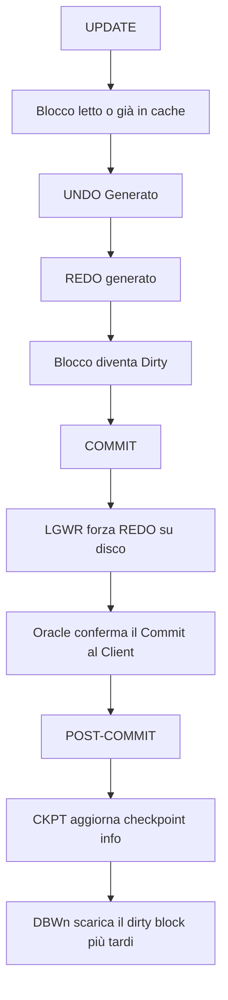

> **Spiegazione del Flusso di Scrittura (Write-Ahead Logging):**
> Quando lanci un `UPDATE`, non scrivi minimamente sul file dei dati! Subito Oracle cerca il blocco in cache o lo legge dal disco se assente. Una volta in memoria, Oracle non tocca i dati prima di essersi protetto: **1)** Genera le informazioni di rollback nell'UNDO. **2)** Dichiara l'intenzione creando voci di REDO a raffica. **3)** A questo punto "sporca" davvero (Dirty) il blocco in Buffer Cache. Quando dai il comando esplicito `COMMIT`, il processo finale LGWR viene fulmineamente svegliato e costretto a sparare il REDO su disco sequenziale. Fatto questo salto salvavita, il tuo client riceve un glorioso "Ok, salvato!". Molto tempo dopo (Lazy writing), quando scatta il Checkpoint (CKPT), sarà il sonnolento DBWn a svuotare realmente il blocco dirty sul lentissimo Datafile fisico su disco.

Regola d'oro:

- redo prima dei datafile;
- questa e' la base del write-ahead logging Oracle.

---

## 10. Oracle Net, Listener, Services e Registrazione Dinamica

Blocco visivo:

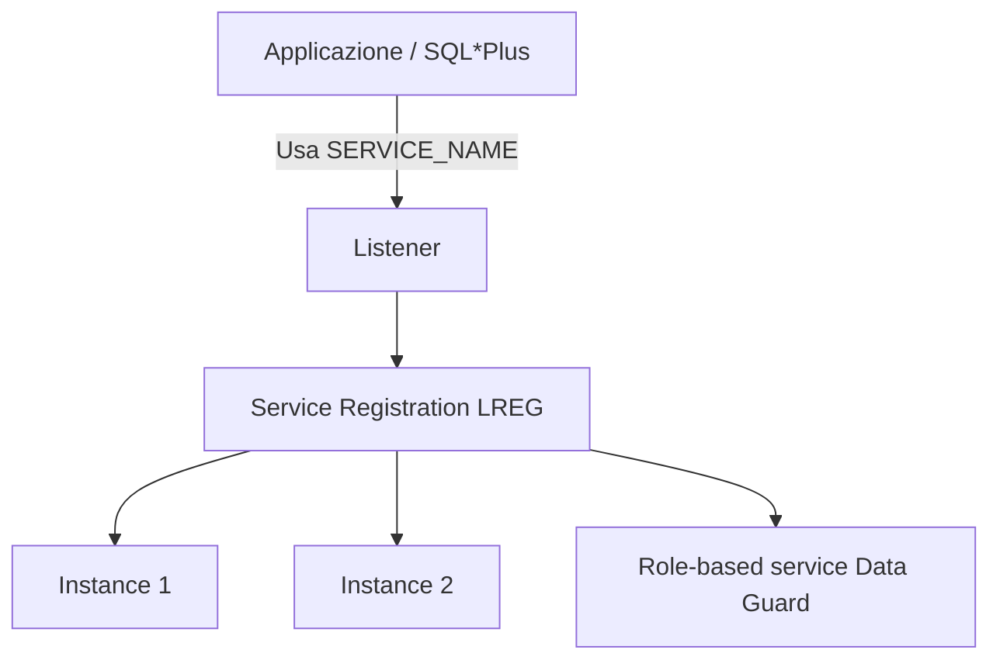

> **Spiegazione Architetturale (Ecosistema di Connessione):**
> Nel diagramma, l'utente (Applicazione) punta ciecamente al Listener usando soltanto un `SERVICE_NAME` logico (es. `ecommerce_db`). Il Listener non ha la più pallida idea di dove stia fisicamente l'Istanza all'accensione. L'intelligenza sta sotto: è il background process **LREG (Listener Registration)** del Database stesso ad alzarsi e "bussare alla porta" del Listener dicendogli: *"Ehi, io sono l'Instance 1, sono vivo, gestisco il service 'ecommerce_db' e sono carico al 50%. Passami le connessioni!"*. In ambienti RAC o Data Guard, LREG notifica l'intero ecosistema permettendo bilanciamenti fluidi senza che tu debba mai modificare i file `tnsnames.ora`.
 
### 10.1 Listener

Il listener ascolta richieste di connessione e le inoltra al service corretto.

File tipici:

- `listener.ora`;
- `tnsnames.ora`;
- `sqlnet.ora`.

### 10.2 Service vs SID

`SID`:

- identifica un'istanza specifica.

`SERVICE_NAME`:

- identifica il servizio logico usato dalle applicazioni.

Best practice:

- le applicazioni devono usare servizi, non SID;
- in RAC e Data Guard, il service e' il concetto corretto di accesso.

### 10.3 Registrazione dinamica ed Ecosistema (LREG)

La registrazione del servizio (Service Registration) è una feature in cui il processo in background **LREG (Listener Registration Process)** comunica dinamicamente le informazioni sull'istanza al listener locale e remoto.
Questo significa che non devi configurare a mano quasi nulla nel `listener.ora`. LREG informa il listener costantemente sul carico (Load Balancing) e sui dispatcher disponibili.

Parametri coinvolti:

- `LOCAL_LISTENER`: dice a LREG dove trovare il listener locale.
- `REMOTE_LISTENER`: indispensabile in RAC per notificare il listener principale dell'intero cluster (SCAN Listener).

In RAC:

- `REMOTE_LISTENER` punta tipicamente allo SCAN;
- i servizi possono fare load balancing e failover.

Comando utile:

```sql
ALTER SYSTEM REGISTER;
```

Serve per forzare la registrazione immediata dopo start listener o cambi service.

---

## 11. Architettura Multitenant: CDB e PDB

Dal punto di vista 19c, l'architettura multitenant e' centrale.

Schema CDB/PDB:

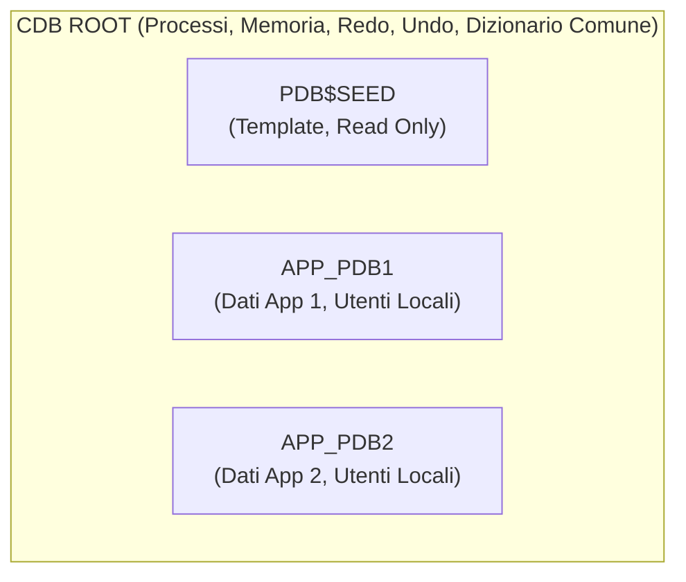

> **Spiegazione Visiva del Multitenant (CDB/PDB):**
> La struttura è concettualmente ricalcata dall'idea delle macchine virtuali, ma per i database. L'involucro esterno titanico è il **CDB ROOT**: esso "Paga l'affitto" dell'intera memoria RAM e dei processi background condivisi da tutti (ha i propri redo log e process manager che reggono il sistema).
> Al suo interno, isolati l'uno dall'altro come in tanti appartamenti privati, risiedono i **Pluggable Databases (PDB)**. Il `PDB$SEED` funge unicamente da stampino read-only per colare nuovi PDB puliti. I PDB numerati `APP_PDB1` e `APP_PDB2` sono invece i veri e propri database virtualizzati delle varie applicazioni cliente: credono di essere autonomi, possiedono i propri utenti finali e i propri Tablespace, ma in realtà demandano l'utilizzo di CPU e RAM all'Istanza Madre condivisa.

### 11.1 Componenti

Ogni CDB include:

- `CDB$ROOT`;
- `PDB$SEED`;
- zero o piu' PDB utente.

### 11.2 Root

`CDB$ROOT` contiene:

- metadata Oracle comuni;
- common users;
- strutture condivise.

Non e' il posto giusto per i dati applicativi normali.

### 11.3 Seed

`PDB$SEED` e' il template read only usato per creare nuovi PDB.

### 11.4 PDB

Un Pluggable Database (PDB) appare all'applicazione come un database fisico, indipendente e tradizionale, ma a livello architetturale condivide le risorse pesanti con il contenitore madre (CDB):

- **Stessa Istanza**: non c'è una RAM/SGA separata o un PDB_CACHE_SIZE isolato (tranne per limiti imposti col Resource Manager).
- **Mancanza di Processi Background propri**: SMON, PMON, DBWn, LGWR appartengono solo al CDB Root.
- **Redo Logs**: condivisi. Tutte le modifiche di tutti i PDB vanno ad alimentare l'unico stream di Redo Log gestito dal root.
- **Undo Tablespace**: di norma esiste l'opzione "Local Undo" (raccomandata in 19c) in cui ogni PDB ha i suoi undo file, o condivisa centralmente.
- **Control File**: il CDB ha un unico control file che mappa tutti i Datafile di tutti i PDB.

Questo e' fondamentale:

- un CDB con 10 PDB non ha 10 istanze separate;
- ha una sola istanza che gestisce piu' container.

### 11.5 Common users e local users

- common user: visibile in tutti i container;
- local user: esiste solo nel PDB.

### 11.6 Servizi e PDB

Best practice:

- ogni applicazione usa un service associato al PDB;
- in RAC si crea il service con `srvctl add service -pdb ...`.

---

### 12. ASM (Automatic Storage Management): Il File System Intelligente

ASM non è solo uno spazio su disco; è un "Volume Manager" e un "File System" ingegnerizzato su misura esclusivamente per i database Oracle. Prima di ASM, i DBA dovevano mappare manualmente dozzine di Datafile su dischi fisici Linux, lottando contro colli di bottiglia e "hot spot" (dischi lenti perché troppo usati).

**I pilastri tecnici di ASM:**
- **Istanza ASM Separata**: ASM gira come un'istanza Oracle dedicata (con una sua piccola SGA e background processes) indipendente dal database. Il Database "parla" con l'istanza ASM tramite l'ASMB process per concordare l'allocazione dei blocchi, ma attenzione: *L'I/O effettivo viene fatto dal Database direttamente al disco, bypassando l'istanza ASM per massimizzare la velocità.*
- **Allocation Units (AU)**: Invece di salvare un Datafile da 10GB tutto intero su un disco, ASM lo affetta in minuscoli "Allocation Units" (es. 1MB o 4MB).
- **Striping Estremo**: ASM prende i milioni di AU di un singolo file e li spalma (stripe) rigorosamente su *tutti* i dischi componenti un `Disk Group` in modo round-robin. Se fai una query complessa, 10 dischi lavoreranno in parallelo per darti la risposta, polverizzando i colli di bottiglia!
- **Mirroring a livello di estensione**: Non fai più il RAID lato hardware-LUN. ASM gestisce il mirroring software: tiene due o tre copie dello stesso AU matematicamente su dischi diversi (Failure Groups).
- **OMF (Oracle Managed Files)**: Piena simbiosi automatica. Non decidi più i nomi dei file. Dici `CREATE TABLESPACE users;` e ASM creerà sotto il cofano `+DATA/RACDB/DATAFILE/users.259.102394`.

Nel lab e nella vita reale usi Disk Group standardizzati:
- `+DATA`: Dischi a testina veloce o SSD. Contiene tutto ciò che serve a far girare il db (Datafiles, Online Redo).
- `+RECO`: Dischi molto grandi ma magari più lenti. Contiene la scialuppa di salvataggio (Archived Logs, FRA, Backups RMAN).
- `+CRS`: File ultra-critici legati unicamente alla sopravvivenza del cluster (Voting Disk e OCR).

Blocco visivo:

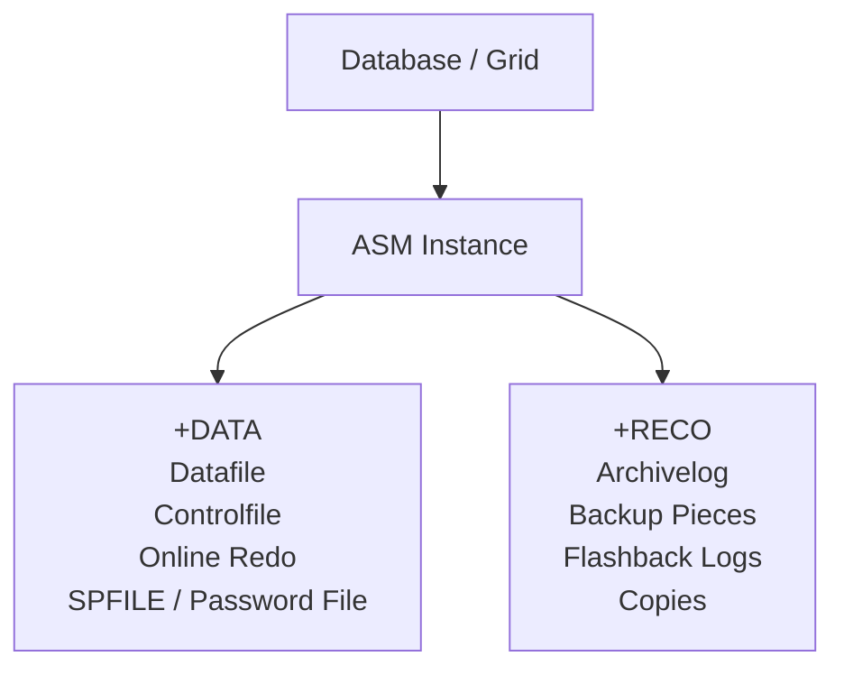

> **Spiegazione del Flusso ASM:**
> Il diagramma mostra come il Database venga completamente accecato: non vede più gli Hard Disk. Vede solo l'Istanza ASM, che fa da intermediario magico e traduttore.
> A destra, i cilindri (Disk Groups) rappresentano le enormi piscine di dischi raggruppati: `+DATA` ingerisce e smista a velocità folli tutta l'operatività I/O calda (Datafile, log attivi), mentre `+RECO` ingurgita senza sosta i dati storici di salvataggio (Archivi e copie RMAN).

---

## 13. RAC: Architettura Cluster

RAC significa piu' istanze che aprono lo stesso database condiviso.

Schema RAC:

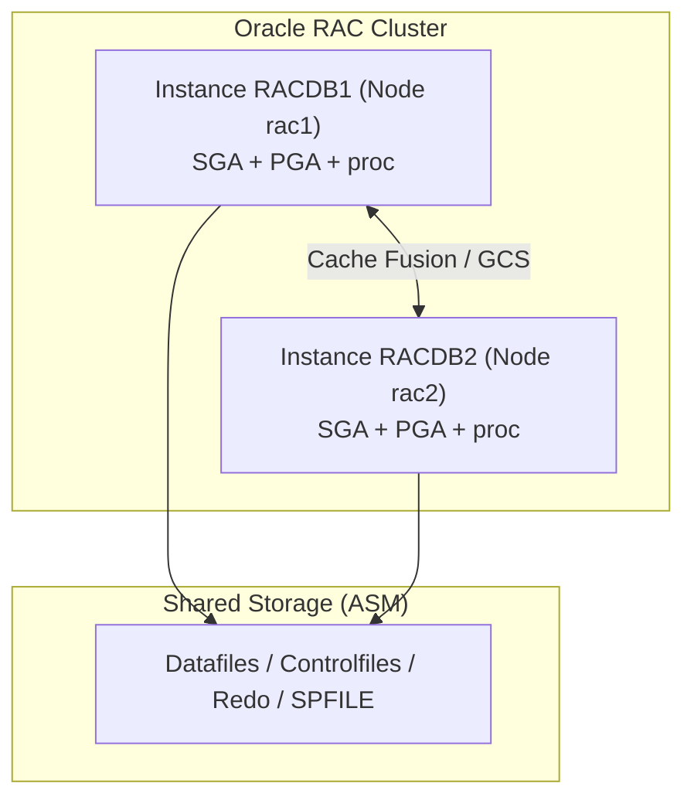

> **Spiegazione del Flusso Cluster RAC:**
> La potenza mostruosa del RAC è visibile qui! Sotto hai un singolo Database inossidabile posato sui dischi ASM. Ma sopra? Hai due o più nodi di calcolo (Istanze) armati di tonnellate di RAM (SGA/PGA). 
> Le frecce verticali (`I1 --> SS`) mostrano che ogni nodo legge e scrive simultaneamente sugli stessi Datafile fottendosene degli altri grazie a lock distribuiti.
> La gigantesca freccia orizzontale al centro (`Cache Fusion`) è l'esclusiva rete in fibra (Interconnect): se il Node 1 ha in RAM i salari dei dipendenti, e il Node 2 deve calcolare le tasse, il Node 2 non scende ai dischi lenti (SS), ma "risucchia" i dati direttamente dalla RAM del Node 1 tramite Cache Fusion a latenza zero.

### 13.1 Il Paradigma del "Condiviso ma Indipendente"

In una configurazione RAC (es. un cluster a 2 nodi), ci sono fisicamente *due server distinti* (due Istanze, con la loro SGA e i loro PMON/SMON), ma a terra c'è *una ed una sola copia* fisica del database (su dispositivi condivisi come ASM).

**Cosa condividono:**
- **I Storage ASM**: Datafiles e Controlfiles sono visibili ed editabili simultaneamente da tutte e due le istanze tramite tecnologie di I/O distribuito.
- **Lo SPFILE**: È globale, per permettere modifiche strutturali identiche a tutti i nodi.

**Cosa NON condividono MAI:**
- **PGA Privata**: Le elaborazioni in RAM di un nodo non sono connesse all'altro.
- **Thread di Redo Log**: Quando l'Istanza A fa l'UPDATE di un blocco, usa il proprio LGWR privato e svuota il contenuto su files `Online Redo Log (Thread 1)`. L'Istanza B lavora su un set di dischi logici totalmente diverso `Online Redo Log (Thread 2)`. Questo evita contese di bloccaggio tra server.
- **Undo Tablespace**: Ognuno possiede il proprio spazio locale e isolato in cui scrivere le transazioni passate.

### 13.2 Cache Fusion (La vera Magia del RAC)

Se il nodo 1 ha letto il blocco della fattura #10 in memoria (Buffer Cache), e ora il nodo 2 vuole leggerlo, cosa succede?
Pre-RAC, il nodo 2 sarebbe sceso pietosamente sull'hard-disk per prelevarlo.
In RAC, abbiamo la **Cache Fusion**: sfruttando una rete privata ultra-veloce ai gigabit (Interconnect network), il Node 1 spedisce l'intero blocco di memoria a velocità della luce *direttamente nella RAM* del Nodo 2 tramite il protocollo UDP. I processi Global Cache Service (`LMS` e `LMD`) orchestrano questo balletto costantemente, bloccando conflitti "Ping-Pong" e fondendo le due SGA in un "Cervellone" unificato.

### 13.3 SCAN (Single Client Access Name)

Nei DB classici, davi al frontend/web application l'indirizzo IP del server. Ma in RAC ci sono N server!
Lo **SCAN** (Spesso associato a 3 IP logici distribuiti round-robin su un Server DNS) funge da porta del castello unificata. Nessuna applicazione client conosce gli IP reali dei singoli nodi del cluster fisici (`rac1-vip` o `rac2-vip`). 
I client puntano al *Nome SCAN*. Se aggiungi un terzo nodo (rac3) o se rac2 si brucia, gli sviluppatori applicativi non modificano una virgola nemmeno nel loro URL JDBC, perché lo SCAN ri-distribuisce silenziosamente le connessioni a valle verso i listner sopravvissuti.

### 13.4 Services in RAC (Sartoria di Precisione)

Invece di dare ai vari dipartimenti aziendali la stringa per connettersi al database generico, configuri dei *Server Names* specializzati tramite SRVCTL.
- Puoi forzare l'applicativo "Risorse Umane" a puntare al servizio `HR_SRV`, il quale tramite policy lavora fisicamente **solo** sul nodo rac1 (Preferito).
- Se rac1 muore, il cluster fa "Failover" accendendo in tempo zero il servizio `HR_SRV` sul nodo rac2.
Questo meccanismo è imprescindibile anche per isolare il traffico dei PDB multipli, dove ogni container possiede e attiva un Service univoco da inseguire in caso di disastro di un server fisico.

---

## 14. Data Guard: Architettura di Protezione

Data Guard protegge il database con uno o piu' standby.

Schema redo transport:

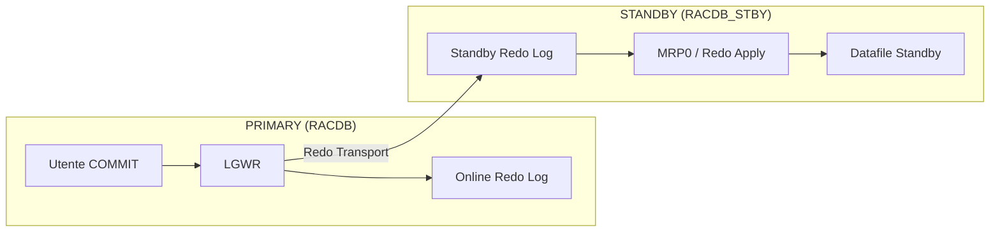

> **Spiegazione Visiva del Data Guard:**
> Due server distanti chilometri in due Data Center diversi uniti da un tracciante di rete. 
> Nel Primary (a sinistra), l'utente modifica qualcosa. L'indefesso processo `LGWR` annota fulmineamente queste modifiche nel proprio *Online Redo Log*. 
> Simultaneamente o asincronamente (a seconda della modalità di sicurezza voluta), dei processi di backend arpionano questo flusso di log e lo "Sparano" sul cavo di rete (*Redo Transport*). 
> Il server Standby (a destra) è in profonda ricezione: i processi RFS inzuppano gli *Standby Redo Log* con le nuove modifiche, e infine l'operaio silente `MRP0` (Managed Recovery Process) legge questi log e li scava fisicamente sui Datafile del db di salvataggio, tenendoli allineati al millisecondo col primario.

### 14.1 Componenti concettuali essenziali

- Primary database: chi detiene i Dati attivi in Read/Write.
- Standby database: chi consuma i dati e si sincronizza.
- **Redo Transport Services**: Incaricati di "spedire" via rete il flusso di REDO (tramite modalità SYNC o ASYNC, a seconda della *Protection Mode* voluta come *MaxProtection*, *MaxAvailability*, o *MaxPerformance*).
- **Apply Services**: L'entità (sul db di destinazione) che "applica" il vero redo ricevuto sui propri datafile. (Tramite `Redo Apply` logico se Logical, o fisico tramite Media Recovery).
- **Data Guard Broker (`DGMGRL`)**: Il tool amministrativo opzionale (ma consigliatissimo) che automatizza lo switchover e il failover istantaneo, pilotando in background i processi di trasporto e apply per te.

### 14.2 Tipi principali di standby

- **Physical Standby**: copia byte-per-byte esatta dei datafile. Usa MRP (Managed Recovery Process) per applicare il Redo. È la tipologia usata nel tuo lab pratico!
- **Logical Standby**: traduce e usa istruzioni SQL per mantenere allineati pezzi di tabelle. Raramente usato per pura HA.
- **Snapshot Standby**: un Physical Standby temporaneamente convertito in "Read/Write" per fare test applicativi con dati di prod senza corrompere la futura sincronizzazione primaria.

### 14.3 Flusso base

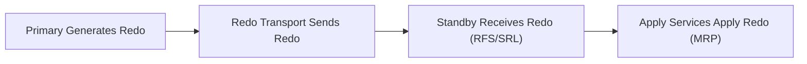

> **Micro-Analisi del Flusso Dati Standby:**
> 1) Il Primario genera REDO (la ricetta chimica della transazione).
> 2) Il Transport Network lancia la ricetta via etere.
> 3) Lo Standby cattura la ricetta mettendola in RAM o su SRL.
> 4) I servizi *Apply* fungono da cuoco: eseguono ciecamente la ricetta macinando I/O locale copiando la transazione "originale" senza perdersi una sillaba.

### 14.4 Ruoli, Modalità di Protezione e Operazioni

**I Ruoli (Roles):**
- `PRIMARY`: Il database sovrano. È aperto in Read/Write, gli utenti ci lavorano attivamente, e produce tonnellate di Redo log.
- `PHYSICAL STANDBY`: Il gemello silenzioso. Riceve il Redo log dal primario e lo applica byte-per-byte alterando i propri datafile di copia. Se aperto in *Read Only con Apply*, permette query di reportistica sgravando il primario (Active Data Guard).

**Operazioni di Cambio Ruolo (Role Transitions):**
- **Switchover**: Un passaggio di scettro pianificato, senza perdita di dati. Il Primario chiude cordialmente le connessioni utente, si trasforma in Standby, e l'ex-Standby diventa il nuovo Primario ufficiale. Usato per server maintenance o prove DR.
- **Failover**: Il pulsante rosso di emergenza. Il primario esplode o va a fuoco, e tu forzi fisicamente lo Standby ad aprirsi come nuovo Primario salvando l'azienda. A seconda del livello di protezione, potresti perdere gli ultimissimi millisecondi di dati.
- **Reinstate**: Dopo un Failover, il vecchio Primario bruciato (una volta riacceso) viene ricondizionato e "retrocesso" a nuovo Standby per ristabilire la catena del Data Guard.

**Modalità di Protezione (Protection Modes):**
- **MaxPerformance** (Default): Il primario manda il log via asincrona (`ASYNC`). L'utente non aspetta mai l'arrivo sullo Standby. Altissime performance sul db principale, ma se il server esplode potresti perdere qualche secondo di transazioni mai arrivate a destinazione.
- **MaxAvailability**: Spedizione sincrona (`SYNC`). L'utente aspetta il commit solo dopo che lo Standby ha confermato di aver ricevuto il log in memoria in remoto. Ma c'è un trucco intelligente: se la rete verso lo standby cade, il primario "degrada" automaticamente a MaxPerformance pur di non bloccarsi.
- **MaxProtection**: Spedizione sincrona pura (`SYNC`). Se lo standby non è raggiungibile via rete, *il primario si blocca (shutdown)* per impedire ad ogni costo la divergenza dei dati. Usato solo da banche o istituti con reti ultra-ridondate.

### 14.5 Data Guard Broker (Il cervello manageriale)

Impostare a mano il Data Guard tramite lunghi e contorti comandi SQL sul Redo Transport è un rischio altissimo (Oracle lo chiama "Data Guard manuale").
Il **Data Guard Broker** è un framework interno attivato tramite il processo demone `DMON`. Esso accentra tutta la configurazione in un singolo file di configurazione (`dr1.dat`/`dr2.dat`).

Perché è fondamentale:
- Crea un'astrazione: Tu parli con l'interfaccia testuale pazzesca chiamata **`DGMGRL`** o tramite l'intuitivo *Enterprise Manager* (OEM).
- Basta digitare letteralmente `switchover to RACDB_STBY;` e decine di comandi criptici avvengono sotto il cofano. Non devi preoccuparti di alterare parameter files, riavviare istanze chiuse, o fare check incrociati degli SCN: fa tutto il processo DMON in sinergia tra i due siti.

---

## 15. Diagnostica Strutturale: L'ADR e l'Investigazione degli Errori

### 15.1 ADR (Automatic Diagnostic Repository)

Quando il database entra in crisi mistica (`ORA-00600` o `ORA-07445`), la struttura ad albero su file system che trattiene tutti i referti medici prende il nome di ADR. È centralizzato in un percorso definito dal parametro `DIAGNOSTIC_DEST`.
A differenza delle versioni vetuste di Oracle (>10g), in 19c ogni componente principale (Istanza, Listener, Istanza ASM, Clusterware) ha la propria `ADR Home`. L'utility rigorosa e vitale per interrogare senza pietà l'ADR da terminale Bash è `adrci`.

- **Alert Log**: Il "diario" maestro (sia XML che text).
- **Trace Files (`.trc`) e Dump**: I "referti" lunghi, dove il processo che cade sbraita il proprio stack trace per il supporto tecnico (MOS).
- **Incidenti (Incidents) e Packages (IPS)**: Se il database rileva un errore ciclopico ORA-00600 ("Baco software Oracle"), l'ADR lo codifica come `Incidente` univoco. `adrci` permette al DBA di impacchettare in due secondi tutti i trace e log di quell'inciampo dentro un comodo file zippato da mandare in allegato all'Oracle Support Engineer.

### 15.2 Alert Log (`alert_SID.log`)

Il santuario della diagnosi ad alto livello, è la prima riga che il DBA guarda al buio quando sente squillare l'allarme. 
È un semplice file di testo sequenziale situato tipicamente sotto la cartella `/trace` nell'ADR.

Cosa devi cercarci ossessivamente:
- Dettagli precisi di un crash e riavvii improvvisi (Tutti gli STARTUP e SHUTDOWN).
- Eventuali mancanze di Spazio in RMAN o fallosità nell'Archiviare il redo (`ORA-00257`).
- ORA-Errors non applicativi, che fermano i processi background centrali.
- Modifiche ai parametri (scopri chi ha alterato a runtime un parametro critico e a che ora).
- Lo stream di recupero o log-apply in Data Guard.

### 15.3 Strumenti di Tuning (AWR, ASH e ADDM)

Una diagnosi non è solo sui crash, ma soprattutto sulle Performance azzoppate.

- **AWR (Automatic Workload Repository)**: Il "cervellone" statistico che interroga le metriche di I/O, Cache ed esecuzioni SQL prelevate dai processi MMON *ogni 60 minuti* di default. Produce snapshot pesantissimi e ti permette in un click di confrontare "Ieri alle 14" vs "Oggi alle 14", generando un Report HTML con evidenza dei principali wait-event e colli di bottiglia del sistema (es: Dischi saturati da `db file sequential read`).
- **ASH (Active Session History)**: Mentre l'AWR ti offre dei macro-report orari totali, ASH fotografa la situazione esatta di tutte le v$session attive *ogni secondo*. Se ti serve sapere a chi diamine apparteneva l'SQL che ieri ha bloccato un processo per esattamente tre miseri minuti tra le 12:00 e le 12:03, lo trovi tramite le tabelle storiche `DBA_HIST_ACTIVE_SESS_HISTORY`.
- **ADDM (Automatic Database Diagnostic Monitor)**: L'occhio esperto robotizzato. Ad ogni nuovo AWR snapshot generato, interviene lui analiticamente a produrre dei suggerimenti umani e chiari (Esempio: "Aggiungi più RAM al buffer cache perché questo SQL sta divorando la CPU in Hard Parse").

*Avvertenza*: Questi strumenti fenomenali non sono gratuiti ma rientrano unicamente nelle licenze *Diagnostic Pack* o *Tuning Pack* in Oracle Enterprise Edition. Usarli senza licenza equivale a una violazione enorme di compliance nelle audit software.

---

## 16. Dizionario Dati e le Dynamic Performance Views

Come si capisce cosa c'è "nella testa" o "sui dischi" di Oracle in tempo reale? Lo fai con banali query `SELECT`. Oracle codifica se stesso dentro speciali viste divise in due macro e sacre famiglie.

### 16.1 Famiglia Statica / Metadata (DBA_, ALL_, USER_)

Rappresentano i metadati "immobili", come la geometria salvata in cassaforte sul tablespace SYSTEM. Ereditano sempre lo stesso suffisso a seconda dei privilegi di chi esegue la query:
- `USER_TABLES`: Rivela all'utente X le tabelle create di proprietà dell'utente X (Il suo mondo circoscritto).
- `ALL_TABLES`: Mostra all'utente X anche le incredibili tabelle di proprietà degli utenti Y o Z verso le quali X abbia ricevuto preventivi permessi stridenti di `GRANT SELECT`.
- `DBA_TABLES`: Il potere dell'Amministratore Totale. Mostra l'interezza di ogni dannato oggetto nel database, indipendentemente dai permessi del piccolo utente di turno, consentendo una diagnosi dall'alto. In queste view DBA cerchi ad esempio gli storici log spaziali in `DBA_DATA_FILES` e le code Undo in `DBA_UNDO_EXTENTS`.

### 16.2 Famiglia Dinamica Runtime (Le misteriose V$ e GV$)

Rivelano l'esatto istante presente caricato in Memoria (SGA/PGA). Queste non sono tabelle fisicamente scritte sui dischi in modo permanente, ma proiezioni live dei parametri dei background server processes lette "in tempo reale" scansionando i bit nella RAM. Esplodono se spegni l'istanza.

- **V$ (Visualizzazioni Istanza Locale)**: Si riferiscono rigorosamente all'attività del *singolo calcolatore (Istanza)* su cui hai aperto il terminale in esecuzione.
- **GV$ (Global Views per RAC)**: Essenziali quando l'Oracle gira in Cluster Multi-Nodo. Una query su `GV$SESSION` anziché interrogare solo le attuali tre sessioni utente su `rac1` e tralasciare i poveracci su `rac2`, scende ai daemon interni di Cache Fusion e raduna magicamente i process state di entrambe le SGA, restituendoti il quadro applicativo collettivo di tutta l'intera infrastruttura RAC nel suo mastodontico insieme.

Viste da conoscere.

| Vista | Perche' e' importante |
|---|---|
| `v$instance` | stato dell'istanza |
| `v$database` | ruolo, open mode, DBID, log mode |
| `v$parameter` | parametri effettivi |
| `v$spparameter` | parametri nello SPFILE |
| `v$bgprocess` | background processes |
| `v$session` | sessioni attive |
| `v$process` | processi OS e Oracle |
| `v$datafile` | datafiles |
| `v$log` | redo log groups |
| `v$logfile` | redo log members |
| `v$archived_log` | archived redo history |
| `v$managed_standby` | processi standby e apply |
| `v$dataguard_stats` | transport e apply lag |
| `v$asm_diskgroup` | stato ASM |
| `gv$instance` | tutte le istanze RAC |
| `gv$services` | services cluster-wide |

---

## 17. Mappa dei Parametri piu' Importanti

| Parametro | Significato architetturale |
|---|---|
| `DB_NAME` | nome logico del database |
| `DB_UNIQUE_NAME` | nome unico del sito, cruciale per Data Guard |
| `INSTANCE_NAME` | nome della singola istanza |
| `SERVICE_NAMES` | servizi database, oggi spesso gestiti tramite srvctl |
| `SGA_TARGET` | gestione automatica SGA |
| `PGA_AGGREGATE_TARGET` | target PGA |
| `DB_BLOCK_SIZE` | block size del database |
| `CONTROL_FILES` | control file attivi |
| `DB_CREATE_FILE_DEST` | OMF destination primaria |
| `DB_RECOVERY_FILE_DEST` | FRA |
| `DB_RECOVERY_FILE_DEST_SIZE` | dimensione FRA |
| `REMOTE_LOGIN_PASSWORDFILE` | uso del password file |
| `LOCAL_LISTENER` | listener locale |
| `REMOTE_LISTENER` | listener remoto o SCAN |
| `CLUSTER_DATABASE` | abilita comportamento RAC |
| `LOG_ARCHIVE_CONFIG` | perimetro Data Guard |
| `LOG_ARCHIVE_DEST_n` | destinazioni redo transport o local archive |
| `STANDBY_FILE_MANAGEMENT` | auto-gestione file standby |
| `DG_BROKER_START` | avvio Broker |

---

## 18. Errori Concettuali Comuni

1. pensare che `COMMIT` significhi datafile gia' scritto;
2. confondere `service` con `SID`;
3. confondere `istanza` con `database`;
4. credere che ogni PDB abbia una sua istanza separata;
5. pensare che `MRP0` debba stare su tutte le istanze standby RAC;
6. ignorare la differenza tra `SPFILE` locale e `SPFILE` condiviso in ASM;
7. credere che il listener contenga il database;
8. confondere redo e undo;
9. credere che ASM sia solo una directory speciale;
10. usare solo `v$archived_log` per misurare lo stato Data Guard.

---

## 19. Come Collegare la Teoria al Tuo Lab

Nel tuo laboratorio questi concetti diventano concreti cosi'.

### Fase 2

- `RACDB` = un database condiviso;
- `rac1` e `rac2` = due istanze;
- `+DATA`, `+RECO`, `+CRS` = disk group ASM;
- `SCAN`, VIP, services = accesso client corretto.

### Fase 3

- `RACDB_STBY` = physical standby del primario;
- `MRP0`, `RFS`, SRL = apply e transport redo;
- SPFILE in ASM = assetto corretto RAC standby;
- OCR registration = gestione clusterware completa.

### Fase 4

- Broker = strato di orchestrazione Data Guard;
- `DMON` = processo chiave;
- `DGConnectIdentifier`, protection mode, switchover, failover = gestione HA e DR vera.

### Extra DBA e Oracle Moderno (21c/23ai)

- Le nuove versioni di Oracle spingono pesantemente su AI Vector Search per RAG e machine learning.
- **Oracle 23ai True Cache**: un approccio rivoluzionario per alleggerire il carico sul DB: una cache SQL in memoria ad alte prestazioni gestita trasparentemente da Oracle.
- EM (Enterprise Manager 13c) offre la console unificata per monitorare questo ecosistema (Fase 6).
- RMAN (Fase 5) protegge il db primario, standby e target.
- GoldenGate (Fase 7) permette lo scarico in tempo reale verso Local (Oracle 21c/23ai) o Cloud (es. OCI Data Integrator o Microservices).

---

## 20. Architettura Completa del tuo Ecosistema Lab

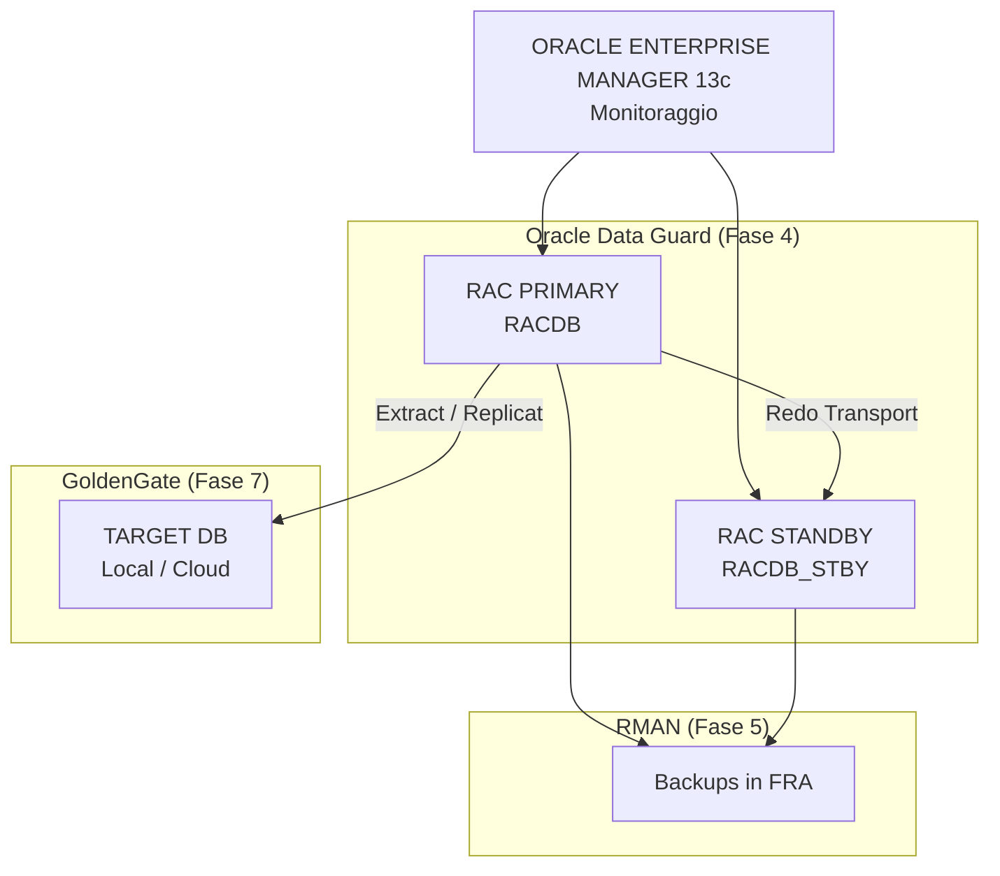

## 20. Query Minime da Sapere a Memoria

```sql
SELECT instance_name, status FROM v$instance;
SELECT name, open_mode, database_role FROM v$database;
SELECT name, value FROM v$parameter;
SELECT name, value FROM v$spparameter WHERE value IS NOT NULL;
SELECT process, status, thread#, sequence# FROM v$managed_standby;
SELECT dest_id, status, error FROM v$archive_dest;
SELECT group#, thread#, status FROM v$log;
SELECT member FROM v$logfile;
SELECT con_id, name, open_mode FROM v$pdbs;
SELECT inst_id, instance_name, host_name FROM gv$instance;
```

---

## 21. Riferimenti Oracle Ufficiali

- Oracle Database 19c Concepts - Memory Architecture
- Oracle Database 19c Concepts - Process Architecture
- Oracle Database 19c Concepts - Logical Storage Structures
- Oracle Database 19c Concepts - Physical Storage Structures
- Oracle Database 19c Concepts - Application and Networking Architecture
- Oracle Database 19c Multitenant - Overview of the Multitenant Architecture
- Oracle RAC Administration and Deployment Guide - Overview of Oracle RAC Architecture
- Oracle Data Guard Concepts and Administration - Redo Transport and Apply Services
- Oracle ASM Administrator's Guide - ASM Overview

Link ufficiali:

- https://docs.oracle.com/en/database/oracle/oracle-database/19/cncpt/memory-architecture.html
- https://docs.oracle.com/en/database/oracle/oracle-database/19/cncpt/process-architecture.html
- https://docs.oracle.com/en/database/oracle/oracle-database/19/cncpt/logical-storage-structures.html
- https://docs.oracle.com/en/database/oracle/oracle-database/19/cncpt/physical-storage-structures.html
- https://docs.oracle.com/en/database/oracle/oracle-database/19/cncpt/application-and-networking-architecture.html
- https://docs.oracle.com/en/database/oracle/oracle-database/19/multi/overview-of-the-multitenant-architecture.html
- https://docs.oracle.com/en/database/oracle/oracle-database/19/rilin/oracle-net-services-configuration-for-oracle-rac-databases.html
- https://docs.oracle.com/en/database/oracle/oracle-database/19/riwin/service-registration-for-an-oracle-rac-database.html
- https://docs.oracle.com/en/database/oracle/oracle-database/19/ostmg/automatic-storage-management-administrators-guide.pdf
- https://docs.oracle.com/en/database/oracle/oracle-database/19/sbydb/data-guard-concepts-and-administration.pdf
- https://docs.oracle.com/en/database/oracle/oracle-database/19/sbydb/oracle-data-guard-redo-apply-services.html
- https://docs.oracle.com/en/database/oracle/oracle-database/19/racad/real-application-clusters-administration-and-deployment-guide.pdf

---

## 22. Sintesi Finale

Se devi ricordare solo 10 idee, ricorda queste:

1. istanza e database non sono la stessa cosa;
2. SGA e' condivisa, PGA e' privata;
3. commit aspetta redo, non datafile;
4. redo e undo sono entrambi essenziali ma fanno cose diverse;
5. Oracle garantisce read consistency tramite SCN + undo;
6. listener inoltra connessioni, non esegue SQL;
7. service batte SID per applicazioni, RAC e Data Guard;
8. un CDB ha una sola istanza per i suoi PDB, non una per ogni PDB;
9. RAC = piu' istanze sullo stesso database condiviso;
10. Data Guard = redo transport + redo apply, non copia file \"magica\".
