# Architettura Oracle: Guida Completa ai Concetti Fondamentali

> Questa guida spiega i concetti architetturali che un DBA Oracle deve padroneggiare davvero. L'obiettivo non e' memorizzare definizioni isolate, ma capire come Oracle legge, scrive, recupera, scala e protegge i dati.

---

## 0. Glossario Rapido per Principianti

> Se sei nuovo al mondo database, questi termini sono i "mattoni" fondamentali dell'ecosistema Oracle.

- **Istanza (Instance)**: I processi in esecuzione e la memoria (RAM) allocata sul server. Esiste solo quando il server è acceso. Se riavvii la macchina, questa "Scompare" per poi ricrearsi.
- **Database**: I file reali salvati sul disco fisso (l'hard disk). Questi non scompaiono quando spegni la macchina. Contengono sia i tuoi dati che i file di log per la sicurezza.
- **SGA (System Global Area)**: La grande "memoria condivisa" (pool di RAM) che tutti i processi dell'istanza Oracle utilizzano insieme per lavorare velocemente senza accedere sempre al disco.
- **PGA (Program Global Area)**: La "memoria privata" assegnata a ogni signola connessione o processo. Ad esempio, se fai un `ORDER BY`, Oracle fa il calcolo qui dentro in privato.
- **Tablespace**: Un raccoglitore logico. È come una cartella di Windows: tu salvi i tuoi dati in un "Tablespace", e Oracle si preoccupa di spalmarli nei veri file fisici su disco (Datafiles).
- **Redo Log**: Il diaro di bordo in cui Oracle scrive *qualsiasi modifica* tu faccia prima ancora di salvarla fisicamente nei Datafile. Serve per il recupero in caso di crash.
- **Undo**: I dati temporanei usati per "Tornare indietro" (Rollback) o per permettere agli altri utenti di leggere i vecchi dati intanto che tu li stai modificando (Read Consistency).
- **Data Guard**: Il sistema di sicurezza primario per avere un "Database Copia" (Standby) costantemente allineato a quello principale (Primary) per il Disaster Recovery.
- **Oracle RAC (Real Application Clusters)**: Una tecnologia che ti permette di avere *più istanze* (su più server di calcolo) che operano contemporaneamente sullo *stesso database* fisico. Ideale per Alte Prestazioni (High Availability) e Scalabilità (Load Balancing).
- **GoldenGate**: Lo strumento che permette di "replicare" e sincronizzare dati tra Oracle e altri database (o tra versioni diverse di Oracle, anche in Cloud) in tempo reale.
- **Enterprise Manager**: Il pannello di controllo web (una grande dashboard unificata) che un DBA usa per capire lo stato di salute e gestire tutti i database da una sola pagina web.
- **ASM (Automatic Storage Management)**: Una sorta di file system speciale creato da Oracle per gestire in modo autonomo il salvataggio dei file del DB distribuiti su più dischi.

---

## 1. Modello Mentale di Base

Un database Oracle e' composto da due parti distinte:

1. l'istanza Oracle;
2. il database fisico su disco.

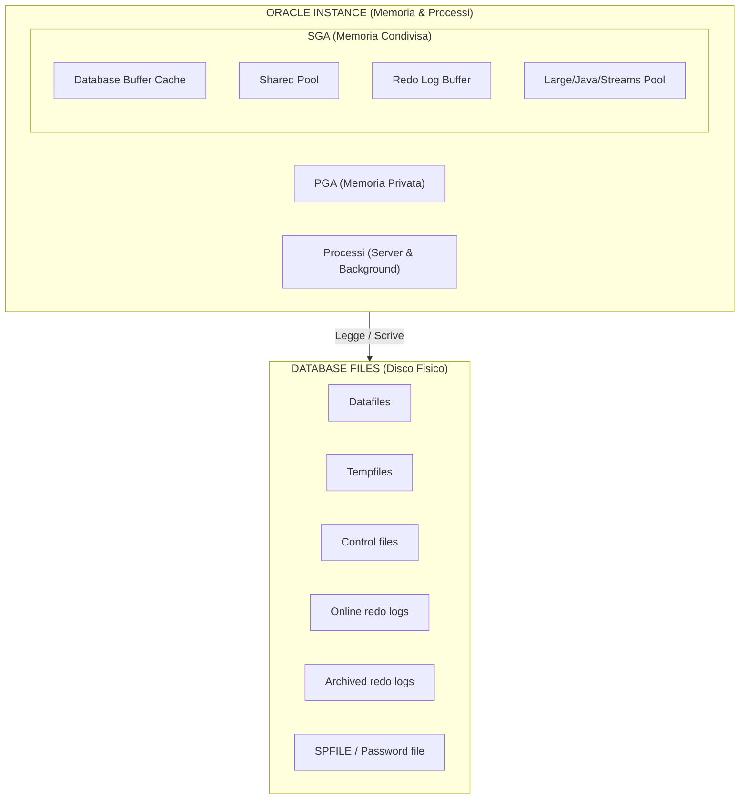

Definizioni corrette:

- `istanza` = memoria + processi;
- `database` = insieme dei file persistenti;
- quando fai `shutdown immediate`, fermi l'istanza, non cancelli il database;
- quando fai `startup`, l'istanza torna a gestire i file del database.

Concetto chiave:

- l'istanza e' volatile;
- il database e' persistente.

Blocco visivo:

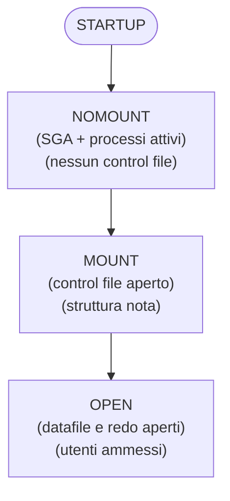

---

## 2. Ciclo di Vita del Database: NOMOUNT, MOUNT, OPEN

Oracle non parte sempre direttamente in `OPEN`. Ci sono tre fasi distinte.

### 2.1 NOMOUNT

In `NOMOUNT`, Oracle legge il parameter file e avvia l'istanza.

Disponibile:

- SGA;
- background processes;
- parameter file.

Non disponibile ancora:

- control file aperto;
- datafile montati;
- redo log aperti per uso normale.

Uso tipico:

- creazione database;
- RMAN duplicate;
- recupero di SPFILE;
- bootstrap standby.

### 2.2 MOUNT

In `MOUNT`, Oracle apre il control file e conosce la struttura del database.

Disponibile:

- control file;
- elenco datafile e redo log;
- metadati di montaggio.

Non disponibile ancora:

- accesso normale ai dati da parte degli utenti.

Uso tipico:

- media recovery;
- standby database;
- rename file;
- enable/disable archivelog;
- operazioni Data Guard.

### 2.3 OPEN

In `OPEN`, Oracle apre datafile e redo log e il database diventa utilizzabile.

Varianti comuni:

- `OPEN READ WRITE`;
- `OPEN READ ONLY`;
- `MOUNTED` per standby fisico;
- `READ ONLY WITH APPLY` per Active Data Guard.

### 2.4 Shutdown Modes

I principali sono:

- `SHUTDOWN NORMAL`: aspetta che tutti gli utenti escano;
- `SHUTDOWN IMMEDIATE`: rollback delle transazioni non committate e chiusura pulita;
- `SHUTDOWN ABORT`: stop brutale, recovery all'avvio successivo;
- `SHUTDOWN TRANSACTIONAL`: aspetta fine transazioni attive.

Nel lab, il piu' usato e' `IMMEDIATE`.

---

## 3. Architettura della Memoria

Oracle usa due grandi aree di memoria:

1. `SGA` condivisa;
2. `PGA` privata.

Schema rapido:

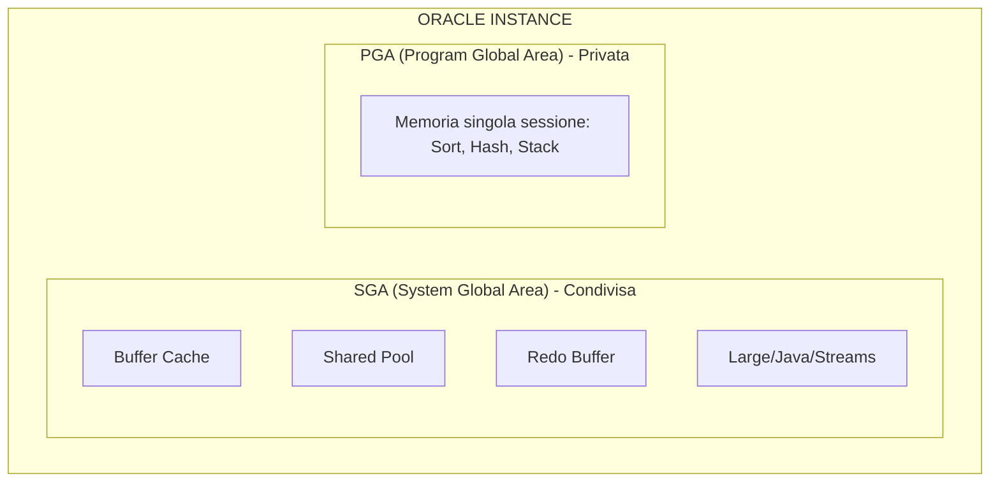

### 3.1 SGA: memoria condivisa dell'istanza

Tutti i processi server e background leggono o scrivono la SGA.

Componenti principali.

#### Database Buffer Cache

Contiene blocchi di dati letti dai datafile.

Funzione:

- ridurre I/O fisico;
- mantenere in RAM i blocchi piu' usati;
- ospitare blocchi modificati ma non ancora scritti su disco.

Stati logici dei blocchi:

- `clean`: blocco uguale alla copia su disco;
- `dirty`: modificato in memoria, non ancora scritto da DBWn.

Concetto importante:

- il commit non aspetta la scrittura del blocco dirty sul datafile;
- il commit aspetta il redo su disco.

#### Shared Pool

Contiene strutture condivise necessarie all'esecuzione SQL.

Sottocomponenti chiave:

- `Library Cache`: SQL parsato, PL/SQL, execution plans;
- `Data Dictionary Cache`: metadata di tabelle, utenti, oggetti, privilegi.

Se la Shared Pool e' piccola o frammentata puoi vedere:

- hard parse eccessivi;
- invalidazioni;
- errori `ORA-04031`.

#### Redo Log Buffer

Buffer circolare in RAM dove Oracle accumula i redo records prima che LGWR li scriva sui redo log online.

Contiene:

- descrizione delle modifiche;
- non i blocchi interi, ma change vectors.

#### Large Pool

Area opzionale usata da:

- RMAN;
- parallel execution;
- shared server;
- alcune operazioni I/O e messaging.

Serve a evitare pressione inutile sulla Shared Pool.

#### Java Pool

Usata se il database esegue componenti Java interni.

#### Streams Pool

Usata da funzionalita' di streaming e replication in alcuni scenari.

### 3.2 PGA: memoria privata

Ogni processo Oracle ha la propria PGA.

Contiene tipicamente:

- sort area;
- hash area;
- stack;
- informazioni di sessione o processo;
- cursor state lato processo.

Caratteristiche:

- non e' condivisa;
- cresce per sessione o processo;
- e' critica per sort, hash join, bitmap merge, parallel execution.

### 3.3 UGA

La `UGA` e' la memoria associata alla sessione utente.

Dipende dal modello di connessione:

- con `dedicated server`, la UGA sta nella PGA del server process;
- con `shared server`, la UGA sta nella SGA.

### 3.4 Gestione automatica della memoria

Modelli principali.

#### ASMM

Automatic Shared Memory Management.

Parametri tipici:

- `SGA_TARGET`;
- `SGA_MAX_SIZE`;
- `PGA_AGGREGATE_TARGET`.

E' il modello piu' comune nel lab Oracle classico.

#### AMM

Automatic Memory Management.

Parametri tipici:

- `MEMORY_TARGET`;
- `MEMORY_MAX_TARGET`.

Puo' gestire insieme SGA e PGA, ma in molti ambienti reali si preferisce ASMM o tuning esplicito.

---

## 4. Architettura dei Processi

Oracle usa:

1. processi client;
2. listener;
3. server processes;
4. background processes.

### 4.1 Client process

E' il processo applicativo o lo strumento che si connette a Oracle:

- SQL*Plus;
- JDBC;
- Python;
- applicazione web.

### 4.2 Listener

Il listener riceve la connessione di rete e la inoltra al service corretto.

Non esegue SQL.

Fa da dispatcher iniziale:

- ascolta sulla porta;
- conosce i servizi registrati;
- passa la sessione al server process.

### 4.3 Server process

E' il processo che esegue davvero il lavoro della sessione.

Compiti:

- parse;
- execute;
- fetch;
- accesso ai blocchi;
- gestione cursori;
- interazione con PGA e SGA.

Modelli:

- `dedicated server`: un server process per sessione;
- `shared server`: piu' sessioni condividono risorse server.

Nel tuo lab usi quasi sempre `dedicated server`.

### 4.4 Background processes fondamentali

| Processo | Ruolo pratico |
|---|---|
| `DBWn` | scrive i dirty buffers dalla Buffer Cache ai datafile |
| `LGWR` | scrive redo dal Redo Log Buffer agli online redo logs |
| `CKPT` | segnala checkpoint e aggiorna header/control file |
| `SMON` | instance recovery e housekeeping |
| `PMON` | cleanup di processi/sessioni fallite |
| `ARCn` | archivia redo log pieni in archived redo logs |
| `RECO` | recupero transazioni distribuite in dubbio |
| `MMON` | raccolta statistiche manageability/AWR |
| `MMNL` | supporto a MMON |
| `LREG` | registra dinamicamente servizi e istanze ai listener |
| `CJQ0` | coordina job scheduler |
| `RVWR` | scrive flashback logs se Flashback e' attivo |
| `FBDA` | Flashback Data Archive |
| `DMON` | Data Guard Broker |
| `VKTM` | gestisce il tempo virtuale interno |

### 4.5 Processi RAC-specifici

In RAC compaiono anche processi cluster-specifici, per esempio:

- `LMON`;
- `LMD`;
- `LMS`;
- `LCK`.

Servono a:

- cache fusion;
- global enqueue service;
- coordinamento dei blocchi tra istanze.

---

## 5. Come Oracle Esegue una Query

Flusso semplificato.

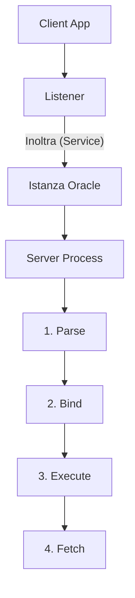

### 5.1 Parse

Il parse non e' solo analisi sintattica.

Include:

- verifica sintassi;
- verifica oggetti e privilegi;
- ottimizzazione;
- scelta execution plan;
- lookup o reuse in Library Cache.

Tipi di parse:

- `hard parse`: serve nuovo parse completo;
- `soft parse`: Oracle riusa un piano gia' esistente.

Obiettivo DBA:

- ridurre hard parse inutili;
- usare bind variables quando ha senso.

### 5.2 Execute

Durante l'execute Oracle:

- acquisisce lock o enqueue necessari;
- legge blocchi richiesti;
- modifica blocchi in memoria se la SQL cambia dati;
- genera redo e undo.

### 5.3 Fetch

Le righe vengono restituite al client in fetch successivi.

Importante:

- una query puo' essere eseguita una volta e poi fetchata molte volte;
- gran parte del tempo applicativo puo' stare nei fetch, non nel parse.

---

## 6. Transazioni, SCN, Redo, Undo e Consistenza

Schema del commit:

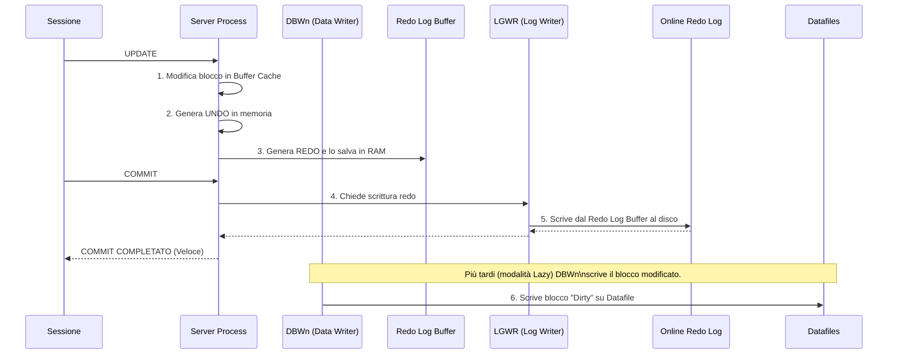

Questa e' la parte che separa chi usa Oracle da chi lo capisce.

### 6.1 SCN

Lo `SCN` e' il System Change Number.

E' il riferimento temporale o logico interno di Oracle.

Serve per:

- ordinare le modifiche;
- garantire consistenza di lettura;
- recovery;
- flashback;
- Data Guard;
- backup consistency.

### 6.2 Undo

L'undo conserva l'informazione necessaria per:

- fare rollback di transazioni non committate;
- ricostruire versioni precedenti dei blocchi per query consistenti.

Concetto chiave:

- quando fai `UPDATE`, Oracle non sovrascrive solo il dato;
- prima registra l'immagine logica necessaria in undo.

### 6.3 Redo

Il redo descrive tutte le modifiche necessarie al recovery.

Serve a:

- rifare modifiche dopo crash;
- alimentare archived redo;
- alimentare Data Guard;
- consentire media recovery.

### 6.4 Commit

Un `COMMIT` non significa che il datafile e' gia' scritto.

Significa:

- il redo di quella transazione e' stato reso durevole sui redo log online;
- da quel momento la transazione e' committed.

Per questo il commit e' veloce:

- LGWR fa scrittura sequenziale;
- DBWn scrive i datafile dopo, con logica lazy.

### 6.5 Read consistency

Oracle garantisce che una query veda una fotografia consistente dei dati a uno SCN logico.

Se un'altra sessione modifica una riga mentre una query lunga la sta leggendo, Oracle puo':

- usare il blocco corrente se compatibile;
- oppure ricostruire la versione precedente tramite undo.

Questo evita letture sporche.

### 6.6 Checkpoint

Il checkpoint non significa stop.

Significa che Oracle:

- aggiorna informazioni di checkpoint in control file e datafile header;
- riduce la quantita' di redo da rileggere in instance recovery.

### 6.7 Instance recovery vs media recovery

#### Instance recovery

Serve dopo crash dell'istanza ma senza perdita dei file.

Oracle usa:

- redo online;
- undo.

#### Media recovery

Serve quando perdi o ripristini file fisici.

Oracle usa:

- backup;
- archived redo logs;
- eventuali incremental backup;
- control file o catalog RMAN.

---

## 7. Strutture Logiche di Storage

Oracle separa architettura logica e fisica.

Ordine logico corretto:

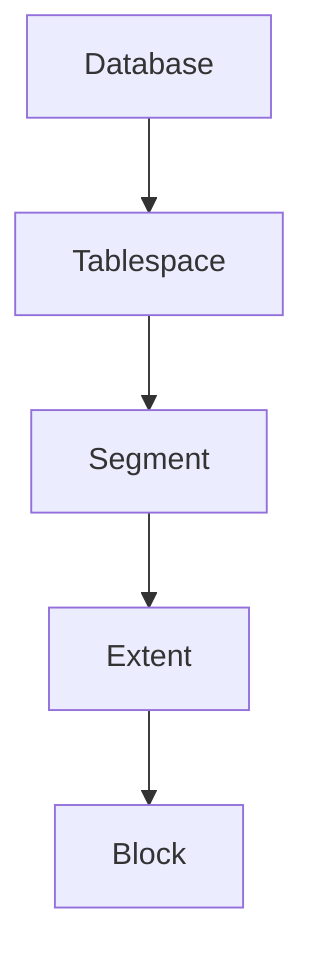

### 7.1 Data block

Il blocco e' l'unita' minima logica di I/O database.

Parametri chiave:

- `DB_BLOCK_SIZE`;
- tipicamente 8 KB nel lab.

### 7.2 Extent

Un extent e' un insieme di blocchi contigui allocati a un segmento.

### 7.3 Segment

Un segmento e' l'insieme di extents appartenenti a un oggetto.

Tipi comuni:

- table segment;
- index segment;
- undo segment;
- temporary segment;
- LOB segment.

### 7.4 Tablespace

Un tablespace e' il contenitore logico dei segmenti.

Comuni in Oracle:

- `SYSTEM`;
- `SYSAUX`;
- `UNDO`;
- `TEMP`;
- tablespace applicativi.

Tipi importanti:

- permanent;
- temporary;
- undo;
- bigfile;
- smallfile.

### 7.5 Bigfile vs smallfile

#### Smallfile tablespace

- piu' datafile nello stesso tablespace;
- modello storico piu' comune.

#### Bigfile tablespace

- un solo datafile molto grande;
- utile in ASM e ambienti automatizzati.

---

## 8. Strutture Fisiche di Storage

### 8.1 Datafiles

Contengono i blocchi dei tablespace permanenti e undo.

Non contengono:

- redo log;
- control file.

### 8.2 Tempfiles

Usati per:

- sort;
- hash;
- temporary segments.

Differenza pratica:

- non vengono recoverati come normali datafile;
- possono essere ricreati.

### 8.3 Control files

Sono il catalogo fisico minimo del database.

Contengono informazioni su:

- nome DB e DBID;
- datafiles e redo log;
- checkpoint;
- archived log history;
- RMAN metadata minima.

Se perdi tutti i control file, il database non monta.

### 8.4 Online redo logs

Sono il journal attivo del database.

Organizzati in:

- gruppi;
- membri.

Concetti:

- un gruppo e' usato come `CURRENT`;
- al log switch Oracle passa al gruppo successivo;
- ARCn archivia i gruppi pieni se il DB e' in `ARCHIVELOG`.

### 8.5 Archived redo logs

Sono copie storiche dei redo log online pieni.

Servono per:

- backup e recovery;
- point-in-time recovery;
- standby Data Guard.

### 8.6 SPFILE e PFILE

#### PFILE

- file testuale;
- leggibile e modificabile a mano;
- utile per bootstrap e recovery.

#### SPFILE

- file binario server parameter file;
- usato normalmente in produzione;
- consente `ALTER SYSTEM SET ... SCOPE=SPFILE|BOTH`.

### 8.7 Password file

Usato per autenticazione amministrativa remota:

- `SYSDBA`;
- `SYSDG`;
- `SYSBACKUP`;
- `SYSASM`;
- `SYSKM`.

E' critico in:

- RAC;
- Data Guard;
- RMAN duplicate;
- Broker.

### 8.8 FRA

La `Fast Recovery Area` e' un'area gestita da Oracle per file di recovery.

Contiene tipicamente:

- archived logs;
- flashback logs;
- backup pieces;
- copies;
- control file autobackups.

Se si riempie:

- backup e archiviazione possono fermarsi;
- Data Guard puo' degradare;
- compaiono errori di spazio recovery.

---

## 9. Flusso di Scrittura: UPDATE -> COMMIT

Questo e' il flusso da sapere a memoria.

```text
1. Sessione esegue UPDATE
2. Oracle legge il blocco in Buffer Cache se necessario
3. Oracle genera undo
4. Oracle genera redo
5. Oracle modifica il blocco in Buffer Cache
6. Il blocco diventa dirty
7. COMMIT
8. LGWR scrive redo su online redo log
9. COMMIT ritorna OK
10. DBWn scrivera' il blocco dirty sul datafile piu' tardi
```

Vista step-by-step:

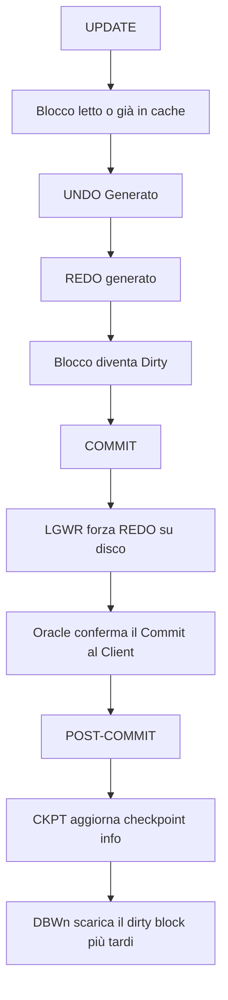

Regola d'oro:

- redo prima dei datafile;
- questa e' la base del write-ahead logging Oracle.

---

## 10. Oracle Net, Listener, Services e Registrazione Dinamica

Blocco visivo:

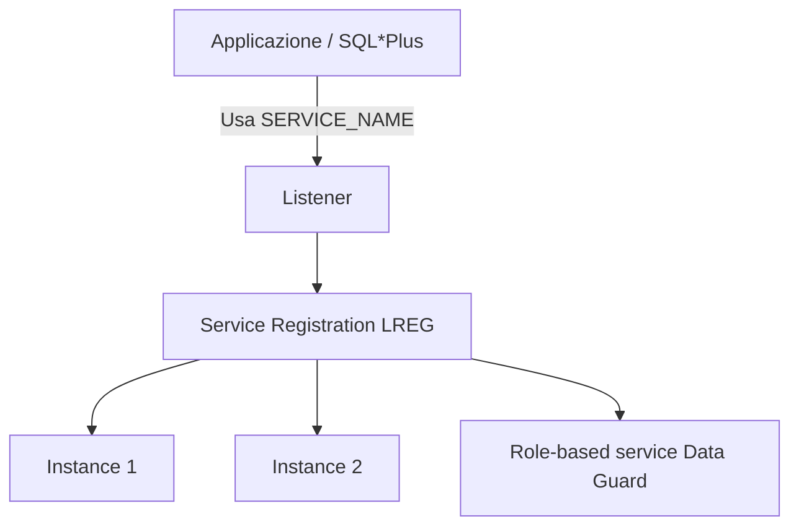

### 10.1 Listener

Il listener ascolta richieste di connessione e le inoltra al service corretto.

File tipici:

- `listener.ora`;
- `tnsnames.ora`;
- `sqlnet.ora`.

### 10.2 Service vs SID

`SID`:

- identifica un'istanza specifica.

`SERVICE_NAME`:

- identifica il servizio logico usato dalle applicazioni.

Best practice:

- le applicazioni devono usare servizi, non SID;
- in RAC e Data Guard, il service e' il concetto corretto di accesso.

### 10.3 Registrazione dinamica

Il processo `LREG` registra i servizi al listener.

Parametri coinvolti:

- `LOCAL_LISTENER`;
- `REMOTE_LISTENER`.

In RAC:

- `REMOTE_LISTENER` punta tipicamente allo SCAN;
- i servizi possono fare load balancing e failover.

Comando utile:

```sql
ALTER SYSTEM REGISTER;
```

Serve per forzare la registrazione immediata dopo start listener o cambi service.

---

## 11. Architettura Multitenant: CDB e PDB

Dal punto di vista 19c, l'architettura multitenant e' centrale.

Schema CDB/PDB:

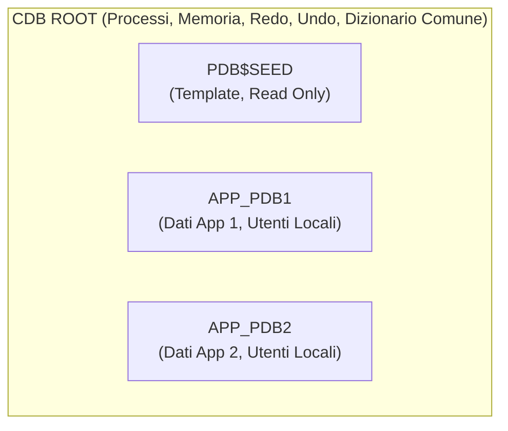

### 11.1 Componenti

Ogni CDB include:

- `CDB$ROOT`;
- `PDB$SEED`;
- zero o piu' PDB utente.

### 11.2 Root

`CDB$ROOT` contiene:

- metadata Oracle comuni;
- common users;
- strutture condivise.

Non e' il posto giusto per i dati applicativi normali.

### 11.3 Seed

`PDB$SEED` e' il template read only usato per creare nuovi PDB.

### 11.4 PDB

Un PDB appare all'applicazione come database quasi indipendente, ma condivide con il CDB:

- istanza;
- SGA;
- background processes;
- redo logs;
- control file.

Questo e' fondamentale:

- un CDB con 10 PDB non ha 10 istanze separate;
- ha una sola istanza che gestisce piu' container.

### 11.5 Common users e local users

- common user: visibile in tutti i container;
- local user: esiste solo nel PDB.

### 11.6 Servizi e PDB

Best practice:

- ogni applicazione usa un service associato al PDB;
- in RAC si crea il service con `srvctl add service -pdb ...`.

---

## 12. ASM: Automatic Storage Management

ASM e' il layer storage Oracle ottimizzato per file database.

Fa da:

- volume manager;
- file system specializzato Oracle.

Concetti base:

- ASM instance;
- disk groups;
- failure groups;
- allocation units;
- template, striping e mirroring.

Nel tuo lab usi disk group tipici:

- `+DATA`;
- `+RECO`;
- `+CRS`.

Perche' ASM e' importante:

- semplifica naming e placement file;
- supporta OMF;
- si integra bene con RAC, RMAN, Data Guard.

Blocco visivo:

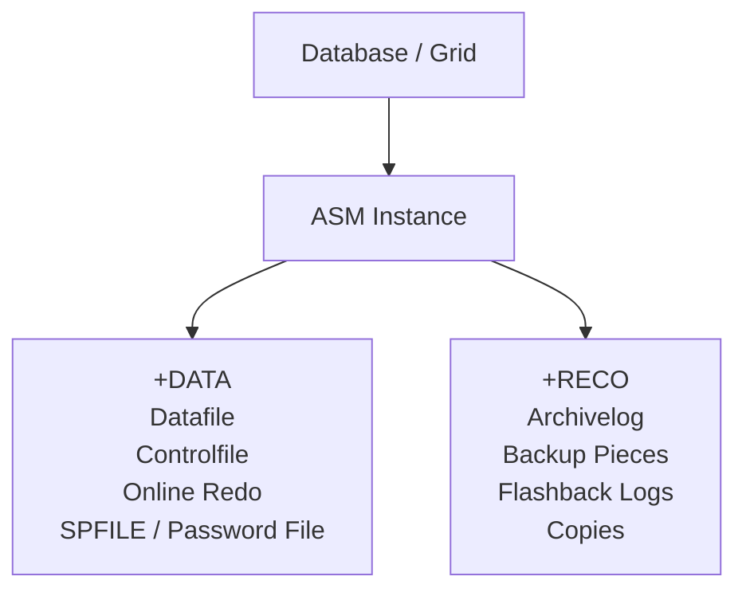

---

## 13. RAC: Architettura Cluster

RAC significa piu' istanze che aprono lo stesso database condiviso.

Schema RAC:

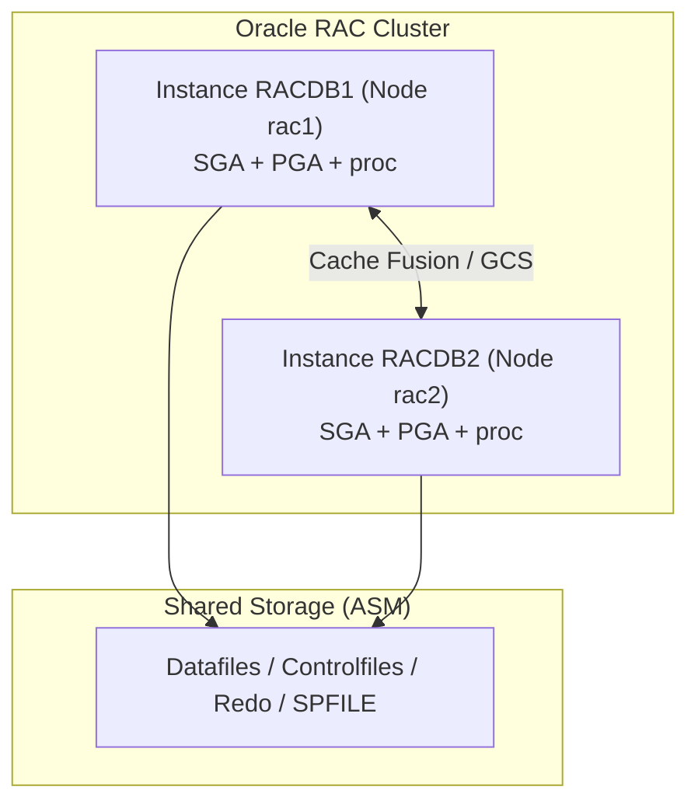

### 13.1 Cosa condividono le istanze RAC

Condividono:

- datafiles;
- control files;
- online redo logs per thread;
- SPFILE condiviso;
- ASM storage.

Non condividono:

- PGA;
- buffer cache locale;
- server processes locali.

Ogni istanza ha:

- propria SGA;
- propri processi;
- proprio redo thread;
- proprio undo tablespace.

### 13.2 Cache Fusion

E' il meccanismo con cui un'istanza RAC puo' ricevere blocchi in memoria da un'altra istanza senza passare da disco.

E' la chiave di RAC.

### 13.3 SCAN

Lo `SCAN` e' il nome virtuale di accesso al cluster.

Serve a:

- semplificare connessioni client;
- load balancing;
- failover.

### 13.4 Services in RAC

I services permettono di decidere:

- dove deve girare il workload;
- failover;
- ruolo applicativo;
- pinning a PDB.

---

## 14. Data Guard: Architettura di Protezione

Data Guard protegge il database con uno o piu' standby.

Schema redo transport:

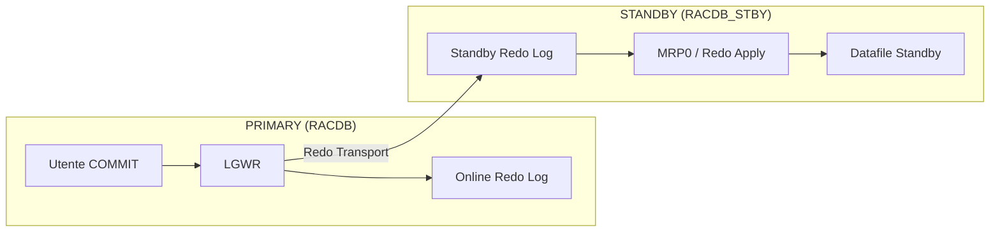

### 14.1 Componenti concettuali

- primary database;
- standby database;
- redo transport services;
- apply services;
- Broker opzionale.

### 14.2 Tipi principali di standby

- physical standby;
- logical standby;
- snapshot standby.

Nel tuo lab usi physical standby.

### 14.3 Flusso base

```mermaid
flowchart LR
    P[Primary Generates Redo] --> T[Redo Transport Sends Redo]
    T --> R[Standby Receives Redo (RFS/SRL)]
    R --> A[Apply Services Apply Redo (MRP)]
```

### 14.4 Ruoli e modalita'

Ruoli:

- `PRIMARY`;
- `PHYSICAL STANDBY`.

Operazioni:

- switchover;
- failover;
- reinstate.

Protection modes:

- `MaxPerformance`;
- `MaxAvailability`;
- `MaxProtection`.

### 14.5 Broker

Il Broker centralizza la gestione con:

- `DGMGRL`;
- Enterprise Manager.

Processo chiave:

- `DMON`.

---

## 15. Diagnostica: ADR, Alert Log, Trace, AWR, ASH

### 15.1 ADR

L'ADR e' l'Automatic Diagnostic Repository.

Contiene:

- alert log;
- trace files;
- incidenti;
- homes diagnostiche database, listener e ASM.

Tool principale:

- `adrci`.

### 15.2 Alert log

E' il diario operativo del database.

Da controllare per:

- ORA errors;
- archiver issues;
- crash recovery;
- Data Guard apply;
- parameter changes;
- startup e shutdown.

### 15.3 Trace files

Contengono dettaglio tecnico per processi o errori specifici.

### 15.4 AWR, ASH, ADDM

Sono strumenti di performance e diagnostica.

Uso concettuale:

- `AWR`: snapshot storici;
- `ASH`: campionamento sessioni attive;
- `ADDM`: analisi automatica.

Nota pratica:

- AWR, ASH e ADDM completi richiedono licenze o packs appropriati in produzione.

---

## 16. Dizionario Dati e Dynamic Performance Views

Due famiglie fondamentali.

### 16.1 DBA_, ALL_, USER_

Metadati persistenti:

- oggetti;
- utenti;
- tablespace;
- quote;
- segmenti.

### 16.2 V$ e GV$

Vista runtime dinamica.

- `V$`: istanza locale;
- `GV$`: cluster-wide in RAC.

Viste da conoscere.

| Vista | Perche' e' importante |
|---|---|
| `v$instance` | stato dell'istanza |
| `v$database` | ruolo, open mode, DBID, log mode |
| `v$parameter` | parametri effettivi |
| `v$spparameter` | parametri nello SPFILE |
| `v$bgprocess` | background processes |
| `v$session` | sessioni attive |
| `v$process` | processi OS e Oracle |
| `v$datafile` | datafiles |
| `v$log` | redo log groups |
| `v$logfile` | redo log members |
| `v$archived_log` | archived redo history |
| `v$managed_standby` | processi standby e apply |
| `v$dataguard_stats` | transport e apply lag |
| `v$asm_diskgroup` | stato ASM |
| `gv$instance` | tutte le istanze RAC |
| `gv$services` | services cluster-wide |

---

## 17. Mappa dei Parametri piu' Importanti

| Parametro | Significato architetturale |
|---|---|
| `DB_NAME` | nome logico del database |
| `DB_UNIQUE_NAME` | nome unico del sito, cruciale per Data Guard |
| `INSTANCE_NAME` | nome della singola istanza |
| `SERVICE_NAMES` | servizi database, oggi spesso gestiti tramite srvctl |
| `SGA_TARGET` | gestione automatica SGA |
| `PGA_AGGREGATE_TARGET` | target PGA |
| `DB_BLOCK_SIZE` | block size del database |
| `CONTROL_FILES` | control file attivi |
| `DB_CREATE_FILE_DEST` | OMF destination primaria |
| `DB_RECOVERY_FILE_DEST` | FRA |
| `DB_RECOVERY_FILE_DEST_SIZE` | dimensione FRA |
| `REMOTE_LOGIN_PASSWORDFILE` | uso del password file |
| `LOCAL_LISTENER` | listener locale |
| `REMOTE_LISTENER` | listener remoto o SCAN |
| `CLUSTER_DATABASE` | abilita comportamento RAC |
| `LOG_ARCHIVE_CONFIG` | perimetro Data Guard |
| `LOG_ARCHIVE_DEST_n` | destinazioni redo transport o local archive |
| `STANDBY_FILE_MANAGEMENT` | auto-gestione file standby |
| `DG_BROKER_START` | avvio Broker |

---

## 18. Errori Concettuali Comuni

1. pensare che `COMMIT` significhi datafile gia' scritto;
2. confondere `service` con `SID`;
3. confondere `istanza` con `database`;
4. credere che ogni PDB abbia una sua istanza separata;
5. pensare che `MRP0` debba stare su tutte le istanze standby RAC;
6. ignorare la differenza tra `SPFILE` locale e `SPFILE` condiviso in ASM;
7. credere che il listener contenga il database;
8. confondere redo e undo;
9. credere che ASM sia solo una directory speciale;
10. usare solo `v$archived_log` per misurare lo stato Data Guard.

---

## 19. Come Collegare la Teoria al Tuo Lab

Nel tuo laboratorio questi concetti diventano concreti cosi'.

### Fase 2

- `RACDB` = un database condiviso;
- `rac1` e `rac2` = due istanze;
- `+DATA`, `+RECO`, `+CRS` = disk group ASM;
- `SCAN`, VIP, services = accesso client corretto.

### Fase 3

- `RACDB_STBY` = physical standby del primario;
- `MRP0`, `RFS`, SRL = apply e transport redo;
- SPFILE in ASM = assetto corretto RAC standby;
- OCR registration = gestione clusterware completa.

### Fase 4

- Broker = strato di orchestrazione Data Guard;
- `DMON` = processo chiave;
- `DGConnectIdentifier`, protection mode, switchover, failover = gestione HA e DR vera.

### Extra DBA e Oracle Moderno (21c/23ai)

- Le nuove versioni di Oracle spingono pesantemente su AI Vector Search per RAG e machine learning.
- **Oracle 23ai True Cache**: un approccio rivoluzionario per alleggerire il carico sul DB: una cache SQL in memoria ad alte prestazioni gestita trasparentemente da Oracle.
- EM (Enterprise Manager 13c) offre la console unificata per monitorare questo ecosistema (Fase 6).
- RMAN (Fase 5) protegge il db primario, standby e target.
- GoldenGate (Fase 7) permette lo scarico in tempo reale verso Local (Oracle 21c/23ai) o Cloud (es. OCI Data Integrator o Microservices).

---

## 20. Architettura Completa del tuo Ecosistema Lab

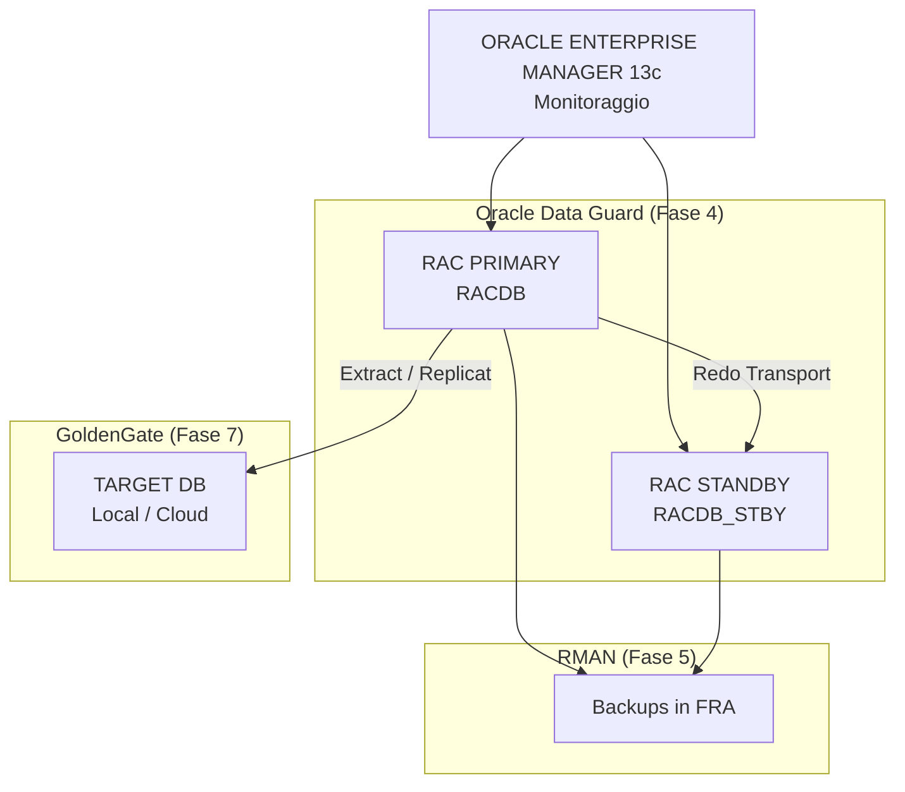

## 20. Query Minime da Sapere a Memoria

```sql
SELECT instance_name, status FROM v$instance;
SELECT name, open_mode, database_role FROM v$database;
SELECT name, value FROM v$parameter;
SELECT name, value FROM v$spparameter WHERE value IS NOT NULL;
SELECT process, status, thread#, sequence# FROM v$managed_standby;
SELECT dest_id, status, error FROM v$archive_dest;
SELECT group#, thread#, status FROM v$log;
SELECT member FROM v$logfile;
SELECT con_id, name, open_mode FROM v$pdbs;
SELECT inst_id, instance_name, host_name FROM gv$instance;
```

---

## 21. Riferimenti Oracle Ufficiali

- Oracle Database 19c Concepts - Memory Architecture
- Oracle Database 19c Concepts - Process Architecture
- Oracle Database 19c Concepts - Logical Storage Structures
- Oracle Database 19c Concepts - Physical Storage Structures
- Oracle Database 19c Concepts - Application and Networking Architecture
- Oracle Database 19c Multitenant - Overview of the Multitenant Architecture
- Oracle RAC Administration and Deployment Guide - Overview of Oracle RAC Architecture
- Oracle Data Guard Concepts and Administration - Redo Transport and Apply Services
- Oracle ASM Administrator's Guide - ASM Overview

Link ufficiali:

- https://docs.oracle.com/en/database/oracle/oracle-database/19/cncpt/memory-architecture.html
- https://docs.oracle.com/en/database/oracle/oracle-database/19/cncpt/process-architecture.html
- https://docs.oracle.com/en/database/oracle/oracle-database/19/cncpt/logical-storage-structures.html
- https://docs.oracle.com/en/database/oracle/oracle-database/19/cncpt/physical-storage-structures.html
- https://docs.oracle.com/en/database/oracle/oracle-database/19/cncpt/application-and-networking-architecture.html
- https://docs.oracle.com/en/database/oracle/oracle-database/19/multi/overview-of-the-multitenant-architecture.html
- https://docs.oracle.com/en/database/oracle/oracle-database/19/rilin/oracle-net-services-configuration-for-oracle-rac-databases.html
- https://docs.oracle.com/en/database/oracle/oracle-database/19/riwin/service-registration-for-an-oracle-rac-database.html
- https://docs.oracle.com/en/database/oracle/oracle-database/19/ostmg/automatic-storage-management-administrators-guide.pdf
- https://docs.oracle.com/en/database/oracle/oracle-database/19/sbydb/data-guard-concepts-and-administration.pdf
- https://docs.oracle.com/en/database/oracle/oracle-database/19/sbydb/oracle-data-guard-redo-apply-services.html
- https://docs.oracle.com/en/database/oracle/oracle-database/19/racad/real-application-clusters-administration-and-deployment-guide.pdf

---

## 22. Sintesi Finale

Se devi ricordare solo 10 idee, ricorda queste:

1. istanza e database non sono la stessa cosa;
2. SGA e' condivisa, PGA e' privata;
3. commit aspetta redo, non datafile;
4. redo e undo sono entrambi essenziali ma fanno cose diverse;
5. Oracle garantisce read consistency tramite SCN + undo;
6. listener inoltra connessioni, non esegue SQL;
7. service batte SID per applicazioni, RAC e Data Guard;
8. un CDB ha una sola istanza per i suoi PDB, non una per ogni PDB;
9. RAC = piu' istanze sullo stesso database condiviso;
10. Data Guard = redo transport + redo apply, non copia file \"magica\".
