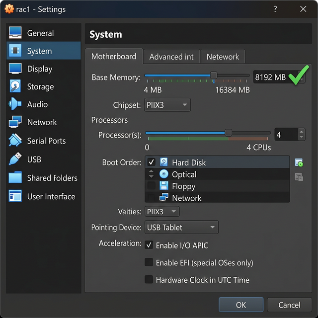
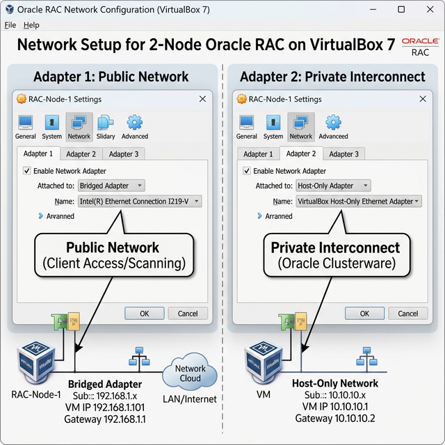
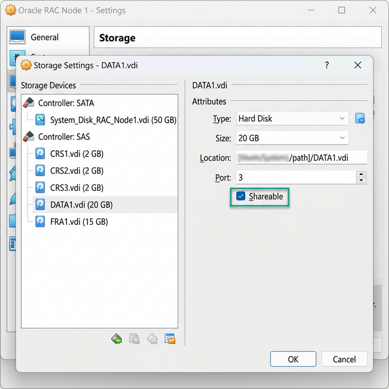

# FASE 0: Setup delle Macchine (VirtualBox)

> **Questa fase va completata PRIMA di tutto il resto.** Qui creiamo le VM in VirtualBox per il DNS, il RAC primario e il RAC standby.
> **Basato su**: [Oracle Base RAC 19c Guide](https://oracle-base.com/articles/19c/oracle-db-19c-rac-installation-on-oracle-linux-7-using-virtualbox) — adattato per installazione manuale passo per passo.

### Vista d'Insieme del Lab VirtualBox

```
╔══════════════════════════════════════════════════════════════════════════════════╗
║                         IL TUO PC (HOST VIRTUALBOX)                             ║
║                                                                                  ║
║   ┌───────────────────────────────────────────────────────────────────────┐      ║
║   │              Rete Host-Only #1 (192.168.56.0/24)                      │      ║
║   │                    "Pubblica" per il cluster                          │      ║
║   └──┬─────────┬────────┬──────────┬──────────┬──────────────────────────┘      ║
║      │         │        │          │          │                                  ║
║   ┌──┴───┐  ┌──┴──┐  ┌──┴──┐   ┌──┴──┐   ┌──┴──┐                              ║
║   │dns   │  │rac1 │  │rac2 │   │stby1│   │stby2│                               ║
║   │.56.50│  │.56.1│  │.56.2│   │.56.3│   │.56.4│   dbtarget + GG su cloud     ║
║   │1GB   │  │8GB  │  │8GB  │   │8GB  │   │8GB  │                               ║
║   │1CPU  │  │4CPU │  │4CPU │   │4CPU │   │4CPU │                               ║
║   └──────┘  └──┬──┘  └──┬──┘   └──┬──┘   └──┬──┘                               ║
║                │        │        │         │                                    ║
║             ┌──┴────────┴──┐  ┌──┴─────────┴──┐                                ║
║             │  Host-Only   │  │  Host-Only    │    (Reti Private Interconnect)  ║
║             │  #2: 192.168 │  │  #3: 192.168  │    Separate per ogni cluster   ║
║             │  .1.x (Prim) │  │  .2.x (Stby)  │                                ║
║             └──────────────┘  └───────────────┘                                ║
║                                                                                  ║
║   Dischi Condivisi (Shareable VDI):                                             ║
║   ┌────────────────────────┐    ┌────────────────────────┐                      ║
║   │ rac1 + rac2            │    │ racstby1 + racstby2    │                      ║
║   │ asm-crs-disk1  2GB     │    │ asm-stby-crs-1  2GB   │                      ║
║   │ asm-crs-disk2  2GB     │    │ asm-stby-crs-2  2GB   │                      ║
║   │ asm-crs-disk3  2GB     │    │ asm-stby-crs-3  2GB   │                      ║
║   │ asm-data-disk1 20GB    │    │ asm-stby-data   20GB  │                      ║
║   │ asm-reco-disk1 15GB    │    │ asm-stby-reco   15GB  │                      ║
║   └────────────────────────┘    └────────────────────────┘                      ║
╚══════════════════════════════════════════════════════════════════════════════════╝
```

### 📸 Riferimenti Visivi







---

## 0.1 Cosa Ti Serve (Requisiti Hardware)

| Macchina | Tipo | RAM | CPU | Disco OS | Disco /u01 | Dischi ASM |
|---|---|---|---|---|---|---|
| `dnsnode` | VM VirtualBox | **1 GB** | **1 vCPU** | 15 GB | — | — |
| `rac1` | VM VirtualBox | **8 GB** | **4 vCPU** | 50 GB | 100 GB | 5 condivisi |
| `rac2` | VM (clone di rac1) | **8 GB** | **4 vCPU** | 50 GB | 100 GB | stessi di rac1 |
| `racstby1` | VM VirtualBox | **8 GB** | **4 vCPU** | 50 GB | 100 GB | 5 condivisi (propri) |
| `racstby2` | VM (clone di racstby1) | **8 GB** | **4 vCPU** | 50 GB | 100 GB | stessi di racstby1 |

> **Perché un DNS separato?** Oracle Base consiglia una VM DNS dedicata con **Dnsmasq** (alternativa leggera a BIND). Così il DNS non si ferma quando riavvii i nodi RAC, e SCAN funziona sempre. Costa solo 1 GB.
>
> **Perché il disco /u01 separato?** Il software Oracle (Grid + DB) va installato su un disco a parte. Oracle Base usa questo approccio — separa binari dal SO.
>
> **`dbtarget` e GoldenGate** girano su **cloud OCI** o altra macchina, non su questo PC.

### Piano IP Completo

| Hostname | Tipo | IP Pubblica | IP Privata | Note |
|---|---|---|---|---|
| `dnsnode` | DNS Server | 192.168.56.50 | — | Dnsmasq |
| `rac1` | RAC Primary N.1 | 192.168.56.101 | 192.168.1.101 | |
| `rac2` | RAC Primary N.2 | 192.168.56.102 | 192.168.1.102 | |
| `rac1-vip` | VIP N.1 | 192.168.56.103 | — | Gestito dal CRS |
| `rac2-vip` | VIP N.2 | 192.168.56.104 | — | Gestito dal CRS |
| `rac-scan` | SCAN (3 IP) | 192.168.56.105-107 | — | Round-Robin DNS |
| `racstby1` | Standby N.1 | 192.168.56.111 | 192.168.2.111 | |
| `racstby2` | Standby N.2 | 192.168.56.112 | 192.168.2.112 | |
| `racstby1-vip` | VIP Standby N.1 | 192.168.56.113 | — | Gestito dal CRS |
| `racstby2-vip` | VIP Standby N.2 | 192.168.56.114 | — | Gestito dal CRS |
| `racstby-scan` | SCAN Standby | 192.168.56.115-117 | — | Round-Robin DNS |

### Software da Scaricare PRIMA di Iniziare

| Software | File | Link | Dimensione |
|---|---|---|---|
| Oracle Linux 7.9 ISO | `OracleLinux-R7-U9-Server-x86_64-dvd.iso` | [yum.oracle.com](https://yum.oracle.com/oracle-linux-isos.html) | ~4.6 GB |
| Grid Infrastructure 19c | `LINUX.X64_193000_grid_home.zip` | [edelivery.oracle.com](https://edelivery.oracle.com) | ~2.7 GB |
| Database 19c | `LINUX.X64_193000_db_home.zip` | [edelivery.oracle.com](https://edelivery.oracle.com) | ~2.9 GB |
| GoldenGate 19c/21c | `fbo_ggs_Linux_x64_Oracle_shiphome.zip` | [edelivery.oracle.com](https://edelivery.oracle.com) | ~500 MB |
| VirtualBox | Ultimo | [virtualbox.org](https://www.virtualbox.org/wiki/Downloads) | ~100 MB |

### 🔧 Patch Oracle — Come Trovarli (My Oracle Support)

| Patch | MOS Patch ID | Come Trovarlo | Note |
|---|---|---|---|
| **OPatch** (utility) | **6880880** | [Scarica qui](https://updates.oracle.com/Orion/PatchDetails/process_form?patch_num=6880880) | Aggiorna SEMPRE prima di ogni RU |
| **Release Update (RU)** | Cambia ogni trimestre | MOS → Patches & Updates → cerca `"Database Release Update 19"` | Ogni 3 mesi esce una nuova RU |
| **OJVM Patch** | Accompagna la RU | MOS → cerca `"OJVM Release Update 19"` | Stesso trimestre della RU |
| **Grid RU** | Accompagna la RU | Cerca `"GI Release Update 19"` | Stesso numero della DB RU |

> **Come trovare l'ultima RU**: Vai su MOS (Doc ID **2118136.2**) → tabella con TUTTE le Release Update per ogni versione.
>
> **⚡ Scarica tutto prima di iniziare.** Non c'è niente di peggio che arrivare a metà installazione e scoprire che manca un file da 3 GB.

---

## 0.2 Configurazione Reti in VirtualBox (UNA SOLA VOLTA)

Prima di creare qualsiasi VM, configura le reti a livello globale.

### Rete Host-Only #1: "Pubblica" del Cluster (192.168.56.0/24)

1. Apri VirtualBox → **File > Strumenti > Gestore di Rete (Network Manager)**
2. Tab **Reti Host-only**
3. Clicca **Crea**
4. Configura:
   - Indirizzo IPv4: `192.168.56.1`
   - Maschera: `255.255.255.0`
   - **DHCP Server**: ❌ **DISABILITATO** (usiamo IP statici!)

### Rete Host-Only #2: Interconnect RAC Primario (192.168.1.0/24)

5. Clicca **Crea** di nuovo
6. Configura:
   - Indirizzo IPv4: `192.168.1.1`
   - Maschera: `255.255.255.0`
   - **DHCP**: ❌ Disabilitato

### Rete Host-Only #3: Interconnect RAC Standby (192.168.2.0/24)

7. Clicca **Crea** un'altra volta
8. Configura:
   - Indirizzo IPv4: `192.168.2.1`
   - Maschera: `255.255.255.0`
   - **DHCP**: ❌ Disabilitato

> **Perché 3 reti?** La #1 è il traffico alla LAN del cluster (pubblica), la #2 è l'interconnect privato del primario, la #3 è l'interconnect privato dello standby. In produzione sarebbero su switch fisici separati.

---

## 0.3 Creare la VM DNS (PRIMA DI TUTTO)

> **Ordine di build**: DNS → rac2 → rac1 (Oracle Base installa il SW da rac1. Nel lab manuale puoi anche fare rac1 → rac2).

### Creazione VM `dnsnode` in VirtualBox

1. **Nuova** → Nome: `dnsnode`, Tipo: Linux, Oracle (64-bit)
2. **RAM**: 1024 MB (1 GB)
3. **CPU**: 1
4. **Disco**: 15 GB (allocato dinamicamente)
5. **Rete**:
   - Adattatore 1: **NAT** (per accesso Internet/yum)
   - Adattatore 2: **Scheda solo host** → seleziona la rete 192.168.56.0
6. **Installa Oracle Linux 7.9** (installazione minimale, no GUI)

### Configurare la Rete (Console VirtualBox)

> ⚠️ **Problema Copia-Incolla**: Sei appena entrato nella console nera di VirtualBox. Non puoi fare "copia e incolla" del codice qui sotto. Prima dobbiamo dare un IP alla macchina, e poi ci collegheremo comodamente con MobaXterm!

Dal terminale di VirtualBox:
1. Accedi come `root`
2. Digita il comando: `nmtui`
3. Scegli **Edit a connection**
4. Vai sulla seconda scheda di rete (quella host-only, di solito `enp0s8`)
5. Cambia IPv4 Configuration in **Manual**
6. Inserisci l'indirizzo: `192.168.56.50/24` (lascia vuoto il gateway)
7. Salva ed esci.
8. Digita: `systemctl restart network`
9. Verifica di avere l'IP: `ip addr show enp0s8`

### Connettiti con MobaXterm (ORA PUOI FARE COPIA-INCOLLA!)

Ora che la macchina ha l'IP `192.168.56.50`, minimizza VirtualBox e apri **MobaXterm** dal tuo PC Windows.
- Crea una sessione SSH verso `192.168.56.50`, utente `root`.
- Ora sei comodamente collegato e puoi incollare il blocco seguente!

### Configurare Dnsmasq

```bash
# == ESEGUI COME ROOT (ora via MobaXterm) ==

# (Opzionale) Rendi statica la configurazione di rete via file per sicurezza
cat > /etc/sysconfig/network-scripts/ifcfg-enp0s8 <<EOF
TYPE=Ethernet
BOOTPROTO=static
NAME=enp0s8
DEVICE=enp0s8
ONBOOT=yes
IPADDR=192.168.56.50
NETMASK=255.255.255.0
EOF
systemctl restart network


# 2. Popola /etc/hosts con TUTTI gli hostname del cluster
cat >> /etc/hosts <<EOF

# === RAC PRIMARY ===
192.168.56.101   rac1
192.168.56.102   rac2
192.168.1.101    rac1-priv
192.168.1.102    rac2-priv
192.168.56.103   rac1-vip
192.168.56.104   rac2-vip
192.168.56.105   rac-scan
192.168.56.106   rac-scan
192.168.56.107   rac-scan

# === RAC STANDBY ===
192.168.56.111   racstby1
192.168.56.112   racstby2
192.168.2.111    racstby1-priv
192.168.2.112    racstby2-priv
192.168.56.113   racstby1-vip
192.168.56.114   racstby2-vip
192.168.56.115   racstby-scan
192.168.56.116   racstby-scan
192.168.56.117   racstby-scan
EOF

# 3. Installa Dnsmasq
yum install -y dnsmasq

# Configura Dnsmasq
cat > /etc/dnsmasq.d/rac.conf <<EOF
# Ascolta sull'interfaccia host-only
interface=enp0s8
# Usa Google DNS per nomi esterni
no-resolv
server=8.8.8.8
server=8.8.4.4
# Logging
log-queries
EOF

# 4. Abilita e avvia
systemctl enable dnsmasq
systemctl start dnsmasq

# 5. Apri porta DNS sul firewall
firewall-cmd --permanent --add-service=dns
firewall-cmd --reload

# 6. VERIFICA
nslookup rac1 192.168.56.50
nslookup rac-scan 192.168.56.50     # Deve ritornare 3 IP!
nslookup racstby1 192.168.56.50
nslookup racstby-scan 192.168.56.50  # Deve ritornare 3 IP!
```

> 📸 **SNAP-DNS**: Quando Dnsmasq funziona, fai snapshot della VM dnsnode!

---

## 0.4 Creazione VM `rac1` (RAC Primario — Nodo 1)

### Step-by-step in VirtualBox

1. Clicca **Nuova** (New)
2. **Nome e Sistema Operativo**:
   - Nome: `rac1`
   - Tipo: **Linux** → **Oracle (64-bit)**
3. **Memoria**: **8192 MB** (8 GB)
4. **CPU**: **4** processori
5. **Disco Rigido**:
   - Seleziona **Crea un disco virtuale adesso**
   - Tipo: **VDI**, Allocato Dinamicamente
   - Dimensione: **50 GB**

### Configurazione Hardware

Seleziona `rac1` → **Impostazioni** (Settings):

#### Sistema > Processore
- ✅ Abilita **PAE/NX**

#### Sistema > Scheda Madre
- Ordine di avvio: ❌ Togli **Floppy**
- Chipset: **ICH9** (consigliato per Oracle Linux)

#### Rete (3 schede di rete)

**Scheda 1 — NAT (accesso Internet per yum)**:
- ✅ Abilita scheda di rete
- Connessa a: **NAT**

**Scheda 2 — Rete "Pubblica" del Cluster**:
- ✅ Abilita scheda di rete
- Connessa a: **Scheda solo host (Host-only Adapter)**
- Nome: Seleziona la rete **192.168.56.0** (creata al punto 0.2)
- Avanzate → Tipo: **Intel PRO/1000 MT Desktop**
- Avanzate → Modalità promiscua: **Permetti tutto (Allow All)**

**Scheda 3 — Interconnect Privata**:
- ✅ Abilita scheda di rete
- Connessa a: **Scheda solo host (Host-only Adapter)**
- Nome: Seleziona la rete **192.168.1.0** (interconnect primario)
- Avanzate → Tipo: **Intel PRO/1000 MT Desktop**
- Avanzate → Modalità promiscua: **Permetti tutto**

> **Perché 3 NIC?** Oracle Base usa questo approccio: NIC1=NAT (per yum/update), NIC2=Pubblica cluster (SCAN, VIP, client connections), NIC3=Privata interconnect (Cache Fusion). Questo è più pulito di Bridged perché non dipende dalla tua rete di casa.

#### Archiviazione (Storage)

1. In **Controller: IDE**, attacca la ISO `OracleLinux-R7-U9-Server-x86_64-dvd.iso`
2. Aggiungi un **secondo disco** da **100 GB** (per `/u01` — binari Oracle)

---

## 0.5 Creazione Dischi Condivisi ASM (per RAC Primario)

### Crea 5 dischi nel Virtual Media Manager

VirtualBox → **File > Gestore Supporti Virtuali** (`Ctrl+D`) → **Crea**:

| Disco | Dimensione | Tipo | Uso |
|---|---|---|---|
| `asm-crs-disk1.vdi` | **2 GB** | **Dimensione Fissa** | OCR (Disk Group CRS) |
| `asm-crs-disk2.vdi` | **2 GB** | **Dimensione Fissa** | Voting (Disk Group CRS) |
| `asm-crs-disk3.vdi` | **2 GB** | **Dimensione Fissa** | Voting (Disk Group CRS) |
| `asm-data-disk1.vdi` | **20 GB** | **Dimensione Fissa** | Datafile (Disk Group DATA) |
| `asm-reco-disk1.vdi` | **15 GB** | **Dimensione Fissa** | Recovery (Disk Group RECO) |

> **Perché 3 dischi CRS?** Per usare **NORMAL redundancy** con Failure Groups! Se un disco muore, l'OCR e i Voting Disk sopravvivono. Oracle Base usa questo approccio.

### Rendi i dischi Condivisibili (CRITICO!)

1. Nel Virtual Media Manager, seleziona ogni disco ASM
2. **Attributi** → Tipo: **Condivisibile (Shareable)** ✅
3. Clicca **Applica**
4. Ripeti per tutti e 5 i dischi

### Attacca i dischi a `rac1`

1. Seleziona `rac1` → **Impostazioni > Archiviazione**
2. Seleziona **Controller: SATA**
3. Clicca l'icona "Aggiungi disco rigido" (+)
4. Aggiungi tutti e 5 i dischi nell'ordine: crs1, crs2, crs3, data, reco

---

## 0.6 Installazione Oracle Linux 7.9 su `rac1`

1. Avvia `rac1` → Si avvia dalla ISO → **Install Oracle Linux 7.9**

### Schermata di Installazione

**Lingua**: English (consigliato per coerenza con log e documentazione)

**Software Selection**:
- Seleziona: **Server with GUI** (serve il GUI per l'installer Grid/DB!)
- Aggiungi:
  - ✅ Development Tools
  - ✅ Compatibility Libraries

> **Perché Server with GUI?** Gli installer Oracle (gridSetup.sh, runInstaller, dbca) usano Java/X11. Senza GUI, devi usare i response file in modalità silente — possibile ma più complesso per un lab.

**Installation Destination**:
- Seleziona il disco da 50 GB (sda) — NON toccare il disco da 100 GB (sdb, sarà /u01)
- Partitioning: **Automatic** va bene, oppure manuale:

| Mount Point | Size | Tipo |
|---|---|---|
| `/boot` | 1 GB | xfs |
| `swap` | 8 GB | swap |
| `/` | Resto (~41 GB) | xfs |


**Network & Host Name**:
- Attiva **TUTTE** le interfacce (ON)
- Hostname: `rac1`
- NON configurare gli IP qui (li facciamo nella Fase 1 con più controllo)

**Kdump**: ❌ Disabilitalo (risparmi RAM)

**Root Password**: `oracle` (per il lab)

3. Clicca **Begin Installation** → Aspetta (~15-20 minuti)
4. Al termine → **Reboot**
5. Accetta la licenza al primo avvio

> 📸 **SNAPSHOT — "SNAP-01: OS Installato"**
> ```
> VBoxManage snapshot "rac1" take "SNAP-01_OS_Installato"
> ```

---

## 0.7 Preparare il disco /u01

Dopo il primo boot di rac1, esegui come root:

```bash
# Partiziona il disco da 100 GB (sdb)
echo -e "n\np\n1\n\n\nw" | fdisk /dev/sdb
mkfs.xfs -f /dev/sdb1

# Monta permanentemente
mkdir -p /u01
UUID=$(blkid -s UUID -o value /dev/sdb1)
echo "UUID=${UUID}  /u01  xfs  defaults 1 2" >> /etc/fstab
mount /u01

# Verifica
df -h /u01
# Deve mostrare ~100 GB montato su /u01
```

---

## 0.8 Configurare ASMLib (oracleasm) per i Dischi ASM

> **ASMLib vs UDEV**: Sebbene Oracle spinga verso udev o ASMFD sulle ultime release, **ASMLib (`oracleasm`)** rimane un metodo robusto, facile da usare e storicamente consolidato per l'insegnamento e i laboratori su Oracle Linux 7/8. Utilizzeremo questo metodo.

### 1. Partizionamento dei dischi (== ESEGUI SOLO SU rac1 ==)

Tutti i dischi ASM devono essere partizionati prima di essere assegnati ad ASMLib.

```bash
# Come root su rac1
echo -e "n\np\n1\n\n\nw" | fdisk /dev/sdc   # CRS disk 1
echo -e "n\np\n1\n\n\nw" | fdisk /dev/sdd   # CRS disk 2
echo -e "n\np\n1\n\n\nw" | fdisk /dev/sde   # CRS disk 3
echo -e "n\np\n1\n\n\nw" | fdisk /dev/sdf   # DATA disk
echo -e "n\np\n1\n\n\nw" | fdisk /dev/sdg   # RECO disk

# Rileggi la tabella delle partizioni
partprobe
```

### 2. Installazione e Configurazione ASMLib (== ESEGUI SU rac1 E rac2 ==)

```bash
# Come root su rac1 e rac2
yum install -y oracleasm-support
yum install -y kmod-oracleasm

# Configura ASMLib
oracleasm configure -i
# Rispondi alle domande come segue:
# Default user to own the driver interface []: grid
# Default group to own the driver interface []: asmadmin
# Start Oracle ASM library driver on boot (y/n) [n]: y
# Scan for Oracle ASM disks on boot (y/n) [y]: y

# Inizializza il modulo
oracleasm init
```

> **Verifica**: Il comando `oracleasm status` dovrebbe mostrare che il driver è caricato e montato. Non creeremo i dischi ora, lo faremo nella Fase 2.

---

## 0.9 Clonazione `rac1` → `rac2`

**NON clonare adesso!** Prima completa tutta la **Fase 1** (configurazione OS, pacchetti, utenti) su `rac1`. Il momento giusto è alla fine della Fase 1, **PRIMA** dell'installazione Grid.

---

## 0.10 Setup Macchine Standby (`racstby1`, `racstby2`)

L'installazione dei nodi standby è **identica** a rac1/rac2, con queste differenze:

| Parametro | Primario | Standby |
|---|---|---|
| Nomi VM | `rac1`, `rac2` | `racstby1`, `racstby2` |
| IP Pubblica | 192.168.56.101-102 | 192.168.56.111-112 |
| IP Privata | 192.168.1.101-102 | 192.168.2.111-112 |
| VIP | 192.168.56.103-104 | 192.168.56.113-114 |
| SCAN | 192.168.56.105-107 | 192.168.56.115-117 |
| Interconnect (NIC3) | Rete Host-Only #2 | Rete Host-Only **#3** |
| Dischi ASM | `asm-crs-disk*` | `asm-stby-crs-*` (dischi DIVERSI!) |

> **IMPORTANTE**: I dischi ASM dello standby sono dischi **DIVERSI** da quelli del primario! Ogni cluster ha i propri dischi condivisi.

### Procedura

1. Crea `racstby1` esattamente come `rac1` (stessi passaggi 0.4-0.8)
2. Crea 5 dischi ASM separati per lo standby
3. Marcali come Shareable
4. Installa Oracle Linux 7.9
5. Completa la Fase 1
6. Clona `racstby1` → `racstby2`

---

## 0.11 Tips e Best Practice

### NetworkManager dns=none (CRITICO!)

```bash
# Impedisce a NetworkManager di sovrascrivere /etc/resolv.conf dopo reboot
sed -i -e "s|\[main\]|\[main\]\ndns=none|g" /etc/NetworkManager/NetworkManager.conf
systemctl restart NetworkManager.service
```

> ⚠️ **Senza questo fix**, dopo un reboot NetworkManager può sovrascrivere il tuo `/etc/resolv.conf` e **rompere la risoluzione SCAN**. Bug insidioso e difficile da diagnosticare!

### chrony Time Sync (al posto di NTP)

```bash
yum install -y chrony
systemctl enable chronyd
systemctl restart chronyd
chronyc -a 'burst 4/4'
chronyc -a makestep
```

---

## 0.12 Come Connettersi alle VM (MobaXterm)

> 💡 **IMPORTANTE**: Da questo momento in poi, **NON** usare la finestra console di VirtualBox per lavorare. Usa un client SSH professionale come **MobaXterm** (gratuito) dal tuo PC Windows. Perché?
> 1. Puoi fare copia-incolla dei comandi comodamente.
> 2. Supporta il multi-tabling (apri `rac1` e `rac2` affiancati).
> 3. **FONDAMENTALE**: Ha un server X11 integrato per farti vedere le finestre grafiche (es. l'installer di Oracle Grid).

### Configurare le Sessioni in MobaXterm

1. Scarica e apri MobaXterm (versione Home/Portable va benissimo).
2. Clicca in alto a sinistra su **Session** -> **SSH**.
3. **Remote host**: Inserisci l'IP pubblico (Rete Host-Only #1) della VM.
   - Es. `192.168.56.50` per `dnsnode`
   - Es. `192.168.56.101` per `rac1`
4. **Specify username**: Spunta la casella e scrivi `root` (o `oracle`).
5. **Advanced SSH settings** (scheda sotto):
   - Assicurati che **X11-Forwarding** sia SPUNTATO ✅ (questo serve per vedere le API grafiche).
6. Clicca **OK**. Ti chiederà la password (inserisci la tua pwd di root).

Ripeti questo processo per creare le sessioni salvate per `dnsnode`, `rac1`, `rac2`, `racstby1`, `racstby2`.

---

> 📸 **Riepilogo Snapshot Fase 0**:
> - **SNAP-DNS** (dnsnode funzionante)
> - **SNAP-01** (OS installato su rac1)
> - **SNAP-01-stby** (OS installato su racstby1)

**→ Prossimo: [FASE 1: Preparazione OS e Configurazione](./GUIDA_FASE1_PREPARAZIONE_OS.md)**
