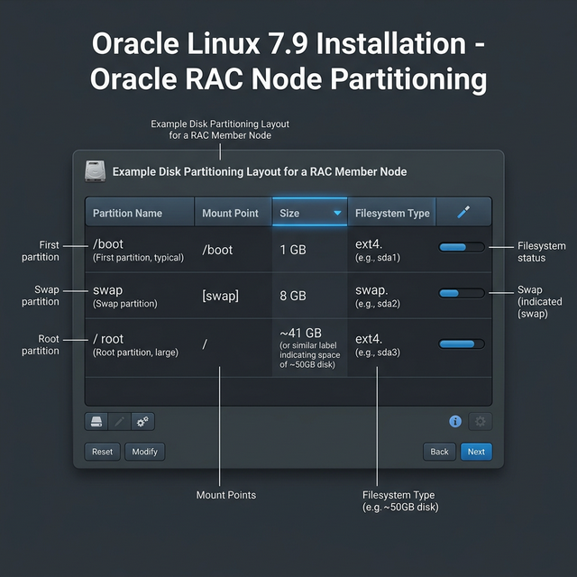
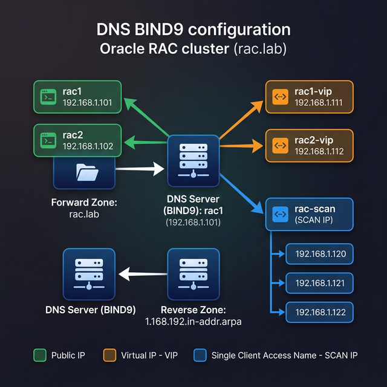

# FASE 1: Preparazione Nodi e OS (Oracle Linux 7.9)

> **Architettura di riferimento**: 2 nodi RAC primario (`rac1`, `rac2`) + 2 nodi RAC standby (`racstby1`, `racstby2`).
> Tutti i comandi vanno eseguiti come `root` salvo dove diversamente indicato.
> I passaggi di questa fase vanno ripetuti su **tutti i nodi** salvo dove specificato.

### 📸 Riferimenti Visivi





---

### Cos'è il DNS e Perché Ci Serve?

**DNS (Domain Name System)** è il servizio che traduce i nomi in indirizzi IP. Quando digiti `rac-scan.localdomain`, il DNS risponde con `192.168.56.105, 192.168.56.106, 192.168.56.107`.

```
  Senza DNS:                          Con DNS:
  ══════════                          ═════════

  Applicazione:                       Applicazione:
  "Connettimi a                       "Connettimi a
   192.168.56.105"                      rac-scan.localdomain"
           │                                    │
           ▼                                    ▼
  ┌────────────────┐                  ┌────────────────┐
  │  Connessione   │                  │  DNS Server    │
  │  a UN solo IP  │                  │  Risponde con  │
  │  (se cambia,   │                  │  3 IP in round │
  │   tutto si     │                  │  robin:        │
  │   rompe!)      │                  │  .105 .106 .107│
  └────────────────┘                  └────────┬───────┘
                                               │
                                      Load balanced!
                                      Se cambi un IP,
                                      aggiorni solo il DNS
```

**Perché Oracle RAC lo richiede?**
- Lo **SCAN** (Single Client Access Name) DEVE risolvere a 3 IP simultaneamente.
- `/etc/hosts` **NON** basta per lo SCAN. Non supporta il Round-Robin. Se metti 3 IP per `rac-scan` nel file hosts, Linux userà sempre e solo il primo.
- Il DNS invece permette il **round-robin**: le connessioni dei client vengono distribuite automaticamente tra i 3 IP.

**Che DNS usiamo nel Lab? (Dnsmasq vs BIND)**
In produzione si usano server DNS complessi come **BIND** o Microsoft DNS. In laboratorio, installare BIND richiede decine di file di configurazione composti da sintassi ostica.
Per **semplificare enormemente**, noi useremo **Dnsmasq**. Dnsmasq è un DNS leggerissimo che fa una cosa magica: **legge il suo file `/etc/hosts` e lo trasforma in record DNS interrogabili dalla rete**.

```
  Il trucco di Dnsmasq:
  ═════════════════════
  1. Compiliamo /etc/hosts sul nodo 'dnsnode' con tutti gli IP (inclusi i 3 SCAN)
  2. Avviamo dnsmasq
  3. dnsmasq legge quel file e "serve" quelle traduzioni agli altri nodi (rac1, rac2)
  4. Quando rac1 chiede "chi è rac-scan?", dnsmasq restituisce i 3 IP in round-robin!
```

**Tipi di record DNS che configuriamo:**

| Tipo | Esempio | Cosa fa |
|---|---|---|
| **A** | `rac1 → 192.168.56.101` | Nome → IP (forward) |
| **PTR** | `192.168.56.101 → rac1` | IP → Nome (reverse) |
| **SOA** | `localdomain` | Authority della zona |
| **NS** | `ns1.localdomain` | Chi risponde per questa zona |

---

## 1.1 Piano IP e Hostname

Prima di tutto, definiamo il piano di indirizzamento. Questo è il cuore di qualsiasi cluster: se sbagli gli IP, niente funziona.

| Ruolo | Hostname | IP Pubblica | IP Privata (Interconnect) | IP VIP |
|---|---|---|---|---|
| RAC Nodo 1 | rac1 | 192.168.56.101 | 192.168.1.101 | 192.168.56.103 |
| RAC Nodo 2 | rac2 | 192.168.56.102 | 192.168.1.102 | 192.168.56.104 |
| RAC SCAN | rac-scan | 192.168.56.105, .106, .107 | - | - |
| Standby Nodo 1 | racstby1 | 192.168.56.111 | 192.168.2.111 | 192.168.56.113 |
| Standby Nodo 2 | racstby2 | 192.168.56.112 | 192.168.2.112 | 192.168.56.114 |
| Standby SCAN | racstby-scan | 192.168.56.115, .116, .117 | - | - |
| Target GoldenGate | dbtarget | 192.168.56.150 | - | - |

> **Perché?** Oracle RAC necessita di minimo 3 tipi di IP per nodo: Pubblica (comunicazione client), Privata (Cache Fusion, il "sangue" del cluster), VIP (failover trasparente). Lo SCAN (Single Client Access Name) è un load balancer DNS integrato nel cluster.

### Come Funzionano le Reti del RAC

```
                     ┌───────────────────────────────────────────┐
                     │          RETE PUBBLICA (eth0)             │
                     │       192.168.1.0/24 (Bridged)           │
      Client App     │                                           │
          │          │  ┌──────┐  ┌──────┐  ┌──────┐            │
          ▼          │  │SCAN  │  │SCAN  │  │SCAN  │            │
    ┌──────────┐     │  │ .105 │  │ .106 │  │ .107 │            │
    │ SCAN     │◄────│──┤      │  │      │  │      │ DNS        │
    │ Listener │     │  └──────┘  └──────┘  └──────┘ Round-Robin│
    └────┬─────┘     │                                           │
         │           │  ┌─────────────┐   ┌─────────────┐       │
         ├──────────►│  │ rac1        │   │ rac2        │       │
         │           │  │ IP: .101    │   │ IP: .102    │       │
         │           │  │ VIP: .111   │   │ VIP: .112   │       │
         │           │  │ (Se rac1    │   │ (Se rac2    │       │
         │           │  │  muore, VIP │   │  muore, VIP │       │
         │           │  │  migra su   │   │  migra su   │       │
         │           │  │  rac2)      │   │  rac1)      │       │
         │           │  └──────┬──────┘   └──────┬──────┘       │
         │           └─────────┼──────────────────┼─────────────┘
         │                     │                  │
         │           ┌─────────┼──────────────────┼─────────────┐
         │           │         │  RETE PRIVATA    │   (eth1)    │
         │           │         │  192.168.1.0/24   │  Host-Only  │
         │           │  ┌──────┴──────┐   ┌──────┴──────┐      │
         │           │  │ rac1-priv   │   │ rac2-priv   │      │
         │           │  │ 192.168.1.101  │◄═►│ 192.168.1.102  │      │
         │           │  └─────────────┘   └─────────────┘      │
         │           │         Cache Fusion (GCS/GES)           │
         │           │    Blocchi dati trasferiti via RAM        │
         │           └─────────────────────────────────────────┘
```

> **VIP (Virtual IP)**: Quando un nodo crasha, il suo VIP "migra" sull'altro nodo in pochi secondi. I client connessi al VIP vengono re-indirizzati automaticamente senza cambiare configurazione.

> **SCAN**: I client si connettono SEMPRE allo SCAN, MAI direttamente ai nodi. Lo SCAN load-balancia le connessioni tra i nodi disponibili.

---

## 1.2 Il Problema del Copia-Incolla (MobaXterm)

> ⚠️ **ATTENZIONE**: Appena installato il sistema operativo, ti trovi nella console nera di VirtualBox dove **non puoi incollare testo**. Tutte le configurazioni successive (come l'`/etc/hosts`) sono file lunghissimi. 
> Per procedere devi **prima dare un IP** alla macchina usando l'interfaccia testuale, e poi collegarti dal tuo PC tramite **MobaXterm**. Questo vale per **TUTTE le macchine** (`rac1`, `rac2`, `racstby1`, etc.) man mano che le crei.

**Passo 1: Assegna un IP Temporaneo e Hostname (dalla console VirtualBox)**

Ti trovi nella "console nera" di VirtualBox. Fai login come `root`.

1. **Imposta l'Hostname**:
   ```bash
   hostnamectl set-hostname rac1.localdomain
   ```

2. **Lancia l'interfaccia di rete**:
   ```bash
   nmtui
   ```

3. **Configura le Schede (Step-by-Step)**:
   - Seleziona **Edit a connection** e premi `Invio`.
   - **SCHEDA 1 (NAT/Internet - di solito `enp0s3`)**:
     - Vai su **Edit...**
     - Assicurati che **IPv4 CONFIGURATION** sia su `<Automatic>`.
     - ⚠️ **MOLTO IMPORTANTE**: Scorri in basso e spunta con la barra spaziatrice `[X] Automatically connect`.
     - Vai su `<OK>` in fondo e premi `Invio`.
   - **SCHEDA 2 (Pubblica - di solito `enp0s8`)**:
     - Vai su **Edit...**
     - Cambia **IPv4 CONFIGURATION** da `<Automatic>` a `<Manual>`.
     - Seleziona `<Show>` a destra di IPv4 per espandere i campi.
     - **Addresses**: Inserisci l'indirizzo per il nodo (es. `192.168.56.101/24`).
     - **Gateway**: Lascia VUOTO.
     - **DNS Servers**: Lascia VUOTO.
     - Spunta `[X] Automatically connect`.
     - Vai su `<OK>` in fondo e premi `Invio`.

4. **Esci e Applica**:
   - Premi `Esc` o seleziona `<Back>` finché non torni al menu principale, poi seleziona **Quit**.
   - Riavvia il networking per applicare:
     ```bash
     systemctl restart network
     ```

5. **Tabella di Riferimento Rapida (IP Pubblici)**:

| Nodo | Hostname | IP Pubblico (Scheda 2) |
| :--- | :--- | :--- |
| **rac1** | `rac1.localdomain` | `192.168.56.101/24` |
| **rac2** | `rac2.localdomain` | `192.168.56.102/24` |
| **racstby1** | `racstby1.localdomain` | `192.168.56.111/24` |
| **racstby2** | `racstby2.localdomain` | `192.168.56.112/24` |

6. **Verifica TASSATIVA**:
   - Controlla gli IP: `ip addr`
   - Controlla Internet: `ping -c 2 google.com` (Se non risponde, hai sbagliato lo step della Scheda 1).

**Passo 2: Connettiti tramite MobaXterm**
Ora che la macchina ha un IP raggiungibile dal tuo PC:
1. Apri **MobaXterm**.
2. **Session** -> **SSH** -> Remote Host: `192.168.56.101` (o quello che hai scelto).
3. Username: `root`.
4. **Advanced SSH settings**: Spunta **X11-Forwarding** ✅.
5. Clicca OK e **D'ORA IN POI COPIA-INCOLLA I COMANDI DA QUI!**

---

---

## 1.3 Configurazione Rete (File Statici)

> 🛑 **ALT! FERMATI! SEI ANCORA NELLA SCHERMATA NERA DI VIRTUALBOX?**
>
> **TUTTI I COMANDI DA QUI IN POI VANNO ESEGUITI VIA MOBAXTERM!**
> La console di VirtualBox non supporta il copia-incolla. Ora che la tua VM ha un IP, minimizza la finestra di VirtualBox, apri MobaXterm e crea una sessione SSH verso l'IP che le hai appena dato. Fallo per ogni VM che stai configurando!
> 
> **Tabella IP di Riferimento per MobaXterm:**
> - `rac1`: 192.168.56.101
> - `rac2`: 192.168.56.102
> - `racstby1`: 192.168.56.111
> - `racstby2`: 192.168.56.112
> - `dbtarget`: 192.168.56.150

Ora che hai aperto il terminale in MobaXterm e hai fatto login come `root`, rendiamo permanente e rigorosa la configurazione scrivendo i file. 

> ⚠️ **ATTENZIONE AI NOMI DELLE SCHEDE**: I nomi fisici dipendono dall'OS. In Oracle Linux 7, di solito l'Adattatore 1 (NAT) si chiama `enp0s3`, l'Adattatore 2 (Pubblica) si chiama `enp0s8`, e l'Adattatore 3 (Privata) si chiama `enp0s9`. Sostituisci i nomi negli script se necessario controllando `ip addr`.

Esempio per `rac1` (ricordati di cambiare l'IP al punto 2 e 3 se sei su un'altra VM!):

### 1. Interfaccia NAT (Internet) $\rightarrow$ `enp0s3`
> **Nodo: rac1** | **Utente: root**
Non usare IP statici qui. Deve prendere IP, Gateway e DNS dal DHCP di VirtualBox.
```bash
cat > /etc/sysconfig/network-scripts/ifcfg-enp0s3 <<'EOF'
TYPE=Ethernet
BOOTPROTO=dhcp
NAME=enp0s3
DEVICE=enp0s3
ONBOOT=yes
EOF
```

### 2. Interfaccia Pubblica (192.168.56.x) $\rightarrow$ `enp0s8`
> **Nodo: rac1** | **Utente: root**
Questa è la rete del Lab dove i nodi comunicano tra loro e con il tuo PC.
```bash
cat > /etc/sysconfig/network-scripts/ifcfg-enp0s8 <<'EOF'
TYPE=Ethernet
BOOTPROTO=static
NAME=enp0s8
DEVICE=enp0s8
ONBOOT=yes
IPADDR=192.168.56.101
NETMASK=255.255.255.0
DOMAIN=localdomain
EOF
```
> *(Nota: Abbiamo omesso volontariamente il GATEWAY qui per evitare che scavalchi il NAT interrompendo l'accesso a Internet)*

### 3. Interfaccia Privata (Interconnect) $\rightarrow$ `enp0s9`
> **Nodo: rac1** | **Utente: root**
L'interconnect per il traffico esclusivo del cluster. **NIENTE GATEWAY QUI**.
```bash
cat > /etc/sysconfig/network-scripts/ifcfg-enp0s9 <<'EOF'
TYPE=Ethernet
BOOTPROTO=static
NAME=enp0s9
DEVICE=enp0s9
ONBOOT=yes
IPADDR=192.168.1.101
NETMASK=255.255.255.0
EOF
```

> **Perché BOOTPROTO=static?** L'interconnect del RAC NON deve MAI cambiare IP. Se usi DHCP e l'IP cambia, il cluster va in split-brain (i due nodi pensano di essere soli e corrompono i dati).

```bash
# Riavvia il networking
systemctl restart network

# Verifica (Sostituisci i nomi se diversi sul tuo sistema)
ip addr show enp0s3
ip addr show enp0s8
ip addr show enp0s9

ping -c 2 rac2        # Da rac1 (dopo aver configurato hosts)
ping -c 2 rac2-priv   # Da rac1 (rete privata)
```

> ⚠️ **PERCHÉ ETH0 NON ESISTE?**
> Nelle versioni moderne di Oracle Linux (come la 7.9), il sistema non usa più la nomenclatura `eth0`, `eth1` ecc. ma nomi "consistenti" basati sulla posizione hardware (es. `enp0s3`). Se provi a fare `ip addr show eth0` e ricevi errore, è perché la tua scheda si chiama `enp0s3`. Usa sempre `ip addr` per vedere i nomi reali assegnati dal BIOS della tua VM.

---

## 1.4 Configurazione /etc/hosts

Esegui su **TUTTI** i nodi (sempre da MobaXterm!):

```bash
cat >> /etc/hosts <<'EOF'
# === RAC PRIMARY ===
192.168.56.101   rac1.localdomain       rac1
192.168.56.102   rac2.localdomain       rac2
192.168.1.101    rac1-priv.localdomain  rac1-priv
192.168.1.102    rac2-priv.localdomain  rac2-priv
192.168.56.103   rac1-vip.localdomain   rac1-vip
192.168.56.104   rac2-vip.localdomain   rac2-vip

# === RAC STANDBY ===
192.168.56.111   racstby1.localdomain      racstby1
192.168.56.112   racstby2.localdomain      racstby2
192.168.2.111    racstby1-priv.localdomain racstby1-priv
192.168.2.112    racstby2-priv.localdomain racstby2-priv
192.168.56.113   racstby1-vip.localdomain  racstby1-vip
192.168.56.114   racstby2-vip.localdomain  racstby2-vip
EOF
```

> 💡 **IL SEGRETO DEL DBA: Perché non mettiamo lo SCAN qui?**
> Hai notato che abbiamo omesso lo SCAN? Ecco perché:
> 1. **Il file hosts NON fa Round-Robin**: Se scrivi 3 IP per lo SCAN qui, Linux userà sempre e solo il primo. Il bilanciamento del carico morirebbe sul nascere.
> 2. **Il DNS invece lo fa**: Lo SCAN deve stare solo nel DNS affinché ad ogni richiesta il DNS risponda con un ordine diverso di IP, distribuendo i client su tutto il cluster.
> 3. **VIP e Privati invece vanno messi**: Servono ai nodi per "parlarsi" velocemente e garantisce che il cluster parta anche se il DNS ha un momento di crisi.

---

## 1.4 Configurazione DNS (Dnsmasq su VM separata)

> **Il DNS è già stato configurato nella Fase 0** sulla VM `dnsnode` con Dnsmasq.
> Se non hai ancora completato la [Fase 0 — sezione 0.3](./GUIDA_FASE0_SETUP_MACCHINE.md), torna indietro e falla ora.
>
> **Perché una VM DNS separata?** (Oracle Base approach)
> - Il DNS non si ferma quando riavvii i nodi RAC
> - Lo SCAN funziona sempre, anche durante i restart del cluster
> - Dnsmasq legge `/etc/hosts` e lo espone come DNS — zero configurazione di zone
> - Costa solo 1 GB di RAM

### Configura resolv.conf su TUTTI i nodi RAC

```bash
# == ESEGUI SU OGNI NODO (rac1, rac2, racstby1, racstby2) ==

# 1. Sblocca il file (se precedentemente protetto)
chattr -i /etc/resolv.conf

# 2. Punta al DNS server (la VM dnsnode)
cat > /etc/resolv.conf <<'EOF'
search localdomain
nameserver 192.168.56.50
options timeout:1
options attempts:5
EOF

# 3. CRITICO: Impedisci a NetworkManager di sovrascrivere resolv.conf
sed -i -e "s|\[main\]|\[main\]\ndns=none|g" /etc/NetworkManager/NetworkManager.conf
systemctl restart NetworkManager.service

# 4. Blocca il file per sicurezza extra (Protezione "anti-overwrite")
chattr +i /etc/resolv.conf
```

> 💡 **PERCHÉ "Operation not permitted"?**
> Se ricevi questo errore pur essendo `root`, è perché il file è "immutabile" (protetto dal comando `chattr +i`). Linux impedisce a CHIUNQUE (anche a root) di modificarlo finché non lo sblocchi con `chattr -i`. 
> Lo usiamo per evitare che NetworkManager o altri processi cancellino la nostra configurazione DNS, che è vitale per lo SCAN.

> **Cosa fa dns=none?** Dice a NetworkManager di NON toccare `/etc/resolv.conf` dopo un reboot. Senza questo fix, dopo ogni restart il file viene riscritto e il SCAN smette di funzionare. È uno dei bug più insidiosi!

### Test DNS (da ogni nodo)

```bash
# Verifica che il DNS risolve gli hostname
nslookup rac1 192.168.56.50
nslookup rac2 192.168.56.50

# SCAN deve ritornare 3 IP!
nslookup rac-scan 192.168.56.50
# Server:  192.168.56.50
# Address: 192.168.56.50#53
# Name:    rac-scan.localdomain
# Address: 192.168.56.105
# Name:    rac-scan.localdomain
# Address: 192.168.56.106
# Name:    rac-scan.localdomain
# Address: 192.168.56.107

# Standby SCAN
nslookup racstby-scan 192.168.56.50
```

### (Opzionale ma Consigliato) Configurare il DNS su Windows (Host)

Se vuoi accedere a EM Express o altri servizi web del lab direttamente dal browser del tuo PC fisico usando i nomi (es. `https://rac1.localdomain:5500/em`), devi dire a Windows di usare il tuo `dnsnode`.

1. Su Windows, apri **Impostazioni di rete** -> **Modifica opzioni scheda**.
2. Trova la scheda **VirtualBox Host-Only Network** (quella relativa a `192.168.56.x`).
3. Tasto destro -> **Proprietà** -> Doppio clic su **Protocollo Internet versione 4 (TCP/IPv4)**.
4. Seleziona **Utilizza i seguenti indirizzi server DNS**.
5. Server DNS preferito: inserisci l'IP del dnsnode (`192.168.56.50`).
6. Clicca OK. Ora dal tuo browser Windows puoi navigare usando gli hostname del lab!

> **Se il DNS non funziona, NON procedere!** Il Grid installer fallirà se non riesce a risolvere lo SCAN.

---

> 📸 **SNAPSHOT — "SNAP-03: Rete_e_DNS_OK"**
> Hai configurato Hostname, IP Statici e Client DNS. Esegui lo snapshot ora su `rac1`.
> ```bash
> VBoxManage snapshot "rac1" take "SNAP-03_Rete_e_DNS_OK"
> ```

---

## 1.5 Disabilitare Firewall e SELinux

> **Perché?** In un ambiente di laboratorio, firewall e SELinux aggiungono complessità non necessaria e spesso bloccano le porte necessarie all'interconnect del RAC o i processi di Grid Infrastructure. In produzione useresti policy e regole di rete certosine, ma per imparare l'architettura è imperativo eliminarli per evitare falsi positivi.

### Step 1: Disabilitare il Firewall (firewalld)
Esegui questi due comandi da root per fermare il firewall adesso e impedirne l'avvio al prossimo reboot:
```bash
systemctl stop firewalld
systemctl disable firewalld
```

### Step 2: Disabilitare SELinux (Modifica Manuale)
SELinux è una sicurezza del kernel. Disabilitiamolo permanentemente modificando il suo file di configurazione.

1. Apri il file con l'editor testuale `vi`:
   ```bash
   vi /etc/selinux/config
   ```
2. Cerca la riga che dice `SELINUX=enforcing` (usa le frecce della tastiera per muoverti).
3. Premi il tasto `i` per entrare in modalità INSERIMENTO.
4. Cancella `enforcing` e scrivi `disabled`. La riga deve risultare esattamente:
   `SELINUX=disabled`
5. Premi `Esc` per uscire dall'inserimento, poi scrivi `:wq` e premi `Invio` per salvare e uscire.
6. Per non dover riavviare subito la macchina, abbassa le difese di SELinux in RAM per la sessione corrente in questo modo:
   ```bash
   setenforce 0
   ```

---

## 1.6 Installazione Pacchetti Prerequisiti

```bash
# Installa il pacchetto preinstall che configura automatamente
# kernel params, limiti utente, gruppi e molto altro
yum install -y oracle-database-preinstall-19c

# Pacchetti aggiuntivi necessari
yum install -y ksh libaio-devel net-tools nfs-utils \
    smartmontools sysstat unzip wget xorg-x11-xauth \
    xorg-x11-utils xterm bind-utils
```

> **Perché oracle-database-preinstall-19c?** Questo pacchetto RPM magico fa il 70% del lavoro di preparazione OS: crea l'utente `oracle`, configura i parametri kernel (`sysctl.conf`), imposta i limiti di risorse (`limits.conf`), installa le dipendenze RPM. Senza questo, dovresti fare tutto a mano.

---

## 1.7 Creazione Gruppi e Utenti

> **Perché due utenti (oracle e grid)?** Questa è una best practice Oracle "Role Separation". L'utente `grid` installerà e gestirà il clusterware e lo storage (ASM). L'utente `oracle` installerà e gestirà solo i motori dei database. Se un account viene compromesso, l'altro resta protetto. Il pacchetto `preinstall` ha già creato l'utente `oracle` base, ora dobbiamo creare il resto.

### Step 1: Creazione dei gruppi ASM
Creiamo tre gruppi Linux specifici per amministrare lo storage condiviso ASM. I numeri -g indicano il GroupID fisso (devono essere uguali su tutti i nodi!).
```bash
groupadd -g 54327 asmdba
groupadd -g 54328 asmoper
groupadd -g 54329 asmadmin
```

### Step 2: Aggiungi "oracle" al gruppo ASM
L'utente oracle deve poter leggere lo storage ASM per poterci scrivere i datafile del database. Aggiungiamolo al gruppo `asmdba`:
```bash
usermod -a -G asmdba oracle
```

### Step 3: Creazione dell'utente "grid"
Creiamo l'utente `grid`, che avrà come gruppo principale `oinstall` e farà parte di tutti i gruppi amministrativi (dba, asmdba, asmadmin, asmoper, racdba):
```bash
useradd -u 54331 -g oinstall -G dba,asmdba,asmadmin,asmoper,racdba grid
```

### Step 4: Imposta le password (Manualmente)
Siamo in un laboratorio, diamo la stessa password facile a entrambi.
Esegui questi comandi. Linux ti chiederà di digitare la nuova password (non vedrai i caratteri mentre digiti per sicurezza). Scrivi `oracle` per il primo e `grid` per il secondo, dando sempre Invio.

```bash
passwd oracle
# (Digita: oracle -> Invio -> oracle -> Invio)

passwd grid
# (Digita: grid -> Invio -> grid -> Invio)
```

---

## 1.8 Creazione Directory (Albero ORACLE_BASE)

> **Perché questa struttura complessa?** Oracle segue un'architettura rigida chiamata *OFA (Optimal Flexible Architecture)*. Separa i binari di Grid dai binari di Database. Memorizza questo concetto: il software Grid risiede in `GRID_HOME`, e *non può mai essere una sottocartella* dell' `ORACLE_BASE` di grid, deve essere "fuori" (MOS Note 1373511.1).

### Step 1: Crea le cartelle per il Grid Infrastructure (Gestore Cluster)
Queste ospiteranno l'inventory globale, il path base per i log di grid, e la casa effettiva dei binari 19c.
```bash
mkdir -p /u01/app/19.0.0/grid        # Questa sarà la GRID_HOME
mkdir -p /u01/app/grid                # Questa sarà la ORACLE_BASE dell'utente grid
mkdir -p /u01/app/oraInventory        # L'inventario unico per tutto il server
```

### Step 2: Crea le cartelle per il Database
Qui risiederanno invece i binari di Oracle 19c Database.
```bash
mkdir -p /u01/app/oracle                              # Questa sarà la ORACLE_BASE dell'utente oracle
mkdir -p /u01/app/oracle/product/19.0.0/dbhome_1      # Questa sarà la DB_HOME
```

### Step 3: Assegna Proprietari e Permessi
Ora diciamo al sistema operativo che la roba di `grid` appartiene all'utente `grid`, e la roba del database appartiene ad `oracle`. Entrambi fanno parte del gruppo installatori (`oinstall`).
```bash
chown -R grid:oinstall   /u01/app/19.0.0/grid
chown -R grid:oinstall   /u01/app/grid
chown -R grid:oinstall   /u01/app/oraInventory
chown -R oracle:oinstall /u01/app/oracle

# Diamo i permessi corretti in lettura/scrittura/esecuzione a tutto l'albero /u01
chmod -R 775 /u01
```

---

## 1.9 Variabili d'Ambiente

### Per l'utente `grid`

```bash
cat > /home/grid/.grid_env <<'ENVEOF'
host=$(hostname -s)
if [ "$host" == "rac1" ]; then
    ORA_SID=+ASM1
elif [ "$host" == "rac2" ]; then
    ORA_SID=+ASM2
elif [ "$host" == "racstby1" ]; then
    ORA_SID=+ASM1
elif [ "$host" == "racstby2" ]; then
    ORA_SID=+ASM2
fi

export ORACLE_SID=$ORA_SID
export ORACLE_BASE=/u01/app/grid
export ORACLE_HOME=/u01/app/19.0.0/grid
export ORACLE_TERM=xterm
export TNS_ADMIN=$ORACLE_HOME/network/admin
export PATH=$ORACLE_HOME/bin:$PATH
export LD_LIBRARY_PATH=$ORACLE_HOME/lib:$LD_LIBRARY_PATH
ENVEOF

echo '. ~/.grid_env' >> /home/grid/.bash_profile
chown grid:oinstall /home/grid/.grid_env
```

### Per l'utente `oracle`

```bash
cat > /home/oracle/.db_env <<'ENVEOF'
host=$(hostname -s)
if [ "$host" == "rac1" ]; then
    ORA_SID=RACDB1
elif [ "$host" == "rac2" ]; then
    ORA_SID=RACDB2
elif [ "$host" == "racstby1" ]; then
    ORA_SID=RACDB1
elif [ "$host" == "racstby2" ]; then
    ORA_SID=RACDB2
fi

export ORACLE_SID=$ORA_SID
export ORACLE_UNQNAME=RACDB
export ORACLE_BASE=/u01/app/oracle
export ORACLE_HOME=/u01/app/oracle/product/19.0.0/dbhome_1
export ORACLE_TERM=xterm
export TNS_ADMIN=$ORACLE_HOME/network/admin
export NLS_DATE_FORMAT="DD-MON-YYYY HH24:MI:SS"
export PATH=$ORACLE_HOME/bin:$PATH
export LD_LIBRARY_PATH=$ORACLE_HOME/lib:$LD_LIBRARY_PATH
ENVEOF

echo '. ~/.db_env' >> /home/oracle/.bash_profile
chown oracle:oinstall /home/oracle/.db_env
```

---

## 1.10 Parametri Kernel e Ottimizzazioni Golden Image (Tassative)

> 💡 **IMPORTANTE**: Tutti i passaggi di questa sezione rappresentano il cuore della tua **Golden Image**. Vanno eseguiti **SOLO su `rac1`**. Quando clonerai la macchina, queste ottimizzazioni saranno già presenti in tutti i nodi, risparmiandoti ore di lavoro e configurazioni manuali.

### 1.10.1 Oracle Pre-Install Limits

Il pacchetto `oracle-database-preinstall-19c` li ha già configurati, ma verifichiamo:

```bash
# Verifica sysctl
sysctl -a | grep -E "shm|sem|file-max|ip_local_port|rmem|wmem"
```

Valori attesi minimi:
```
kernel.shmmax = 4398046511104
kernel.shmall = 1073741824
kernel.shmmni = 4096
kernel.sem = 250 32000 100 128
fs.file-max = 6815744
net.ipv4.ip_local_port_range = 9000 65500
net.core.rmem_default = 262144
net.core.rmem_max = 4194304
net.core.wmem_default = 262144
net.core.wmem_max = 1048576
fs.aio-max-nr = 1048576
```

```bash
# Verifica limits
cat /etc/security/limits.d/oracle-database-preinstall-19c.conf
```

Se i limits per l'utente `grid` non esistono (il preinstall li crea solo per `oracle`), dobbiamo crearli noi copiando quelli di oracle.

1. Copia il file di configurazione esistente:
   ```bash
   cp /etc/security/limits.d/oracle-database-preinstall-19c.conf \
      /etc/security/limits.d/grid-database-preinstall-19c.conf
   ```
2. Apri il nuovo file con `vi`:
   ```bash
   vi /etc/security/limits.d/grid-database-preinstall-19c.conf
   ```
3. 💡 **Vim Pro Tip (Sostituzione Rapida)**:
   Invece di cambiare ogni riga a mano, usa questo comando "magico" di Vim. Digita (mentre non sei in modalità inserimento):
   `:%s/oracle/grid/g`
   E poi premi `Invio`. Vim sostituirà TUTTE le scadenze di "oracle" con "grid" in un colpo solo!
4. Salva e chiudi (`Esc`, poi `:wq`, poi `Invio`).

---

## 🚀 DBA Pro Tip: Come fare tutto velocemente (MobaXterm)

Se trovi noioso ripetere gli stessi comandi su `rac1`, `rac2`, ecc., usa queste due tecniche:

1. **Multi-Execution Mode (Il Top!)**:
   In MobaXterm, clicca sul pulsante **"Multi-exec"** (icona con quattro terminali). Qualsiasi comando scriverai in un tab verrà replicato istantaneamente su TUTTI i tab aperti. Perfetto per `/etc/hosts`, installazione pacchetti e setup utenti.
   > ⚠️ **ATTENZIONE**: Disabilitalo quando devi scrivere IP specifici per ogni nodo!

2. **Copiare i file tra nodi (scp)**:
   Invece di fare `cat` su ogni macchina, puoi configurare un file su `rac1` e copiarlo sugli altri:
   ```bash
   scp /etc/resolv.conf rac2:/etc/
   ```

---

---

### 1.10.1 Oracle Best Practices (Tassative)
Oltre ai parametri standard, Oracle raccomanda fortemente di disabilitare alcune feature di Linux che causano instabilità e degrado delle performance sui cluster RAC:

#### 1. Disabilitare Transparent HugePages (THP)
I THP causano grave frammentazione della memoria e crolli delle prestazioni sul database. Vanno disabilitati a livello di kernel (`grub`).

```bash
# Apri il file di configurazione di GRUB
vi /etc/default/grub

# Trova la riga che inizia con GRUB_CMDLINE_LINUX e aggiungi alla fine (prima delle virgolette di chiusura della stringa):
# transparent_hugepage=never

# Esempio:
# GRUB_CMDLINE_LINUX="crashkernel=auto ... rhgb quiet transparent_hugepage=never"

# Ricompila il file grub per applicare la modifica al prossimo riavvio
grub2-mkconfig -o /boot/grub2/grub.cfg
```

> 💡 **Verifica Live (Senza riavviare)**:
> Se vuoi essere sicuro che THP sia disabilitato ora (o se lo avevi già nel file), lancia questo:
> ```bash
> cat /sys/kernel/mm/transparent_hugepage/enabled
> ```
> Se vedi `[never]`, allora sei a posto! Se vedi `[always]`, devi riavviare la macchina dopo aver lanciato `grub2-mkconfig`.

#### 2. Disabilitare Avahi Daemon (mDNS)
L'Avahi daemon invia pacchetti multicast (Bonjour/mDNS) costanti sulla rete. Sull'interfaccia privata del RAC questo genera "rumore di fondo" che può disturbare il protocollo di heartbeat del Clusterware.
```bash
systemctl stop avahi-daemon.socket
systemctl stop avahi-daemon.service
systemctl disable avahi-daemon.socket
systemctl disable avahi-daemon.service
```

#### 3. Disabilitare NOZEROCONF (Rotta 169.254.x.x)
Evita che Linux assegni automaticamente indirizzi di link-local (169.254.0.0) sulle interfacce di rete, mantenendo la tabella di routing pulita.
```bash
echo "NOZEROCONF=yes" >> /etc/sysconfig/network
```

#### 4. Configurazione Standard HugePages (Opzionale ma Raccomandata)

A differenza dei Transparent HugePages (che vanno spenti), gli **Standard HugePages** pre-allocati sono una best practice fondamentale. 

##### 💡 Perché usarli? (Semplificato)
1. **Pagine Giganti**: Di default Linux usa pagine da 4KB. Per una SGA da 1.5GB, Linux deve gestire milioni di "pezzettini". Con le HugePages, usiamo pagine da **2MB** (512 volte più grandi!). Il processore trova i dati molto più velocemente.
2. **Niente Swap**: Le HugePages rimangono "inchiodate" nella RAM fisica. Oracle non finirà mai nello "swap" (disco lento), garantendo performance costanti.
3. **Meno Carico CPU**: Il kernel fatica molto meno a gestire la memoria del database.

##### 🧮 La Matematica del Lab
- La nostra **SGA** Oracle sarà di circa **1.5 GB**.
- Configurando **1024 pagine** da 2MB l'una, allochiamo **2 GB** totali di RAM ultra-veloce.
- In questo modo la SGA ci starà comodamente dentro.

```bash
# Imposta 1024 HugePages (2MB l'una = 2GB totali)
echo "vm.nr_hugepages = 1024" >> /etc/sysctl.conf
sysctl -p
```

> ⚠️ **Nota**: Una volta dato il comando `sysctl -p`, la RAM viene "sequestrata" dal kernel per Oracle. Non vederla più come "Free" è normale!

---

## 1.11 Configurazione NTP/Chrony

Oracle Clusterware richiede che i clock siano sincronizzati tra tutti i nodi (max 1 secondo di differenza):

```bash
# Configura Chrony
vi /etc/chrony.conf
# Aggiungi/modifica:
# server 0.pool.ntp.org iburst
# server 1.pool.ntp.org iburst

systemctl enable chronyd
systemctl restart chronyd

# Verifica
chronyc sources
```

> **Perché?** Se i clock dei nodi del cluster divergono troppo, il Clusterware forza un "node eviction" (espelle il nodo dal cluster) per proteggere i dati.


---

## 1.12 Predisposizione SSH (GUIDA RIVISTA)

> ⚠️ **IMPORTANTE**: Abbiamo deciso di **NON** generare le chiavi sulla Golden Image. 
> Se le generassimo su `rac1` e poi clonassimo, tutti i nodi avrebbero la **stessa identica chiave**, il che non è la best practice di sicurezza.
> 
> **COSA FARE ORA**: Salta questo passaggio e vai direttamente al punto 1.13. Genereremo chiavi uniche per ogni nodo nella **Sezione 1.15**, subito dopo la clonazione.

> 🛠️ **OPS! HAI GIÀ GENERATO LE CHIAVI?**
> Se hai già lanciato i comandi ed è comparsa la "randomart image", non preoccuparti. Per tornare alla Golden Image "pulita" ed evitare chiavi duplicate, lancia questi due comandi da root:
> ```bash
> rm -rf /home/grid/.ssh
> rm -rf /home/oracle/.ssh
> ```
> Fatto! Ora la tua macchina è di nuovo vergine e pronta per essere clonata correttamente.

---

---

## 1.13 Inventory Location (Golden Image)
> **Nodo: rac1** | **Utente: root**

```bash
## 1.13 Inventory Location (Golden Image)

> 💡 **Nodo: rac1** | **Utente: root**

Questo file è fondamentale: dice all'installer di Oracle dove tenere il registro (l'inventario) di tutti i prodotti installati sulla macchina.

**Perché lo facciamo nella Golden Image?**
Configurandolo qui, tutti i nodi clonati (`rac2`, `racstby`...) avranno già il puntamento corretto e i permessi giusti. Questo evita che l'installer si blocchi chiedendoti di crearlo a mano durante l'installazione del Grid.

```bash
cat > /etc/oraInst.loc <<'EOF'
inventory_loc=/u01/app/oraInventory
inst_group=oinstall
EOF

chmod 664 /etc/oraInst.loc
chown grid:oinstall /etc/oraInst.loc
```

---
```

---

## 🛑 IL MOMENTO DELLA VERITÀ: Clonazione Golden Image

Hai appena completato tutta la configurazione OS, utenti, gruppi, limiti e binari su **`rac1`**. 

> 🔍 **Verifica ASM (Prima di clonare)**:
> Come utente `root`, verifica che il driver ASM sia pronto (anche se non vedi ancora i dischi):
> ```bash
> oracleasm status
> # Deve rispondere: "Checking if ASM is loaded: yes" e "Checking if /dev/oracleasm is mounted: yes"
> ```

> ⚠️ **ATTENZIONE:** Questo è l'esatto momento in cui devi fermarti. Se procedi oltre o cerchi di fare lo scambio delle chiavi SSH, fallirai. **DEVI CLONARE ORA.**

### 1.14 Procedura di Clonazione (DA RAC1 A TUTTI)

#### Step 1: Spegni `rac1`
```bash
# Da MobaXterm su rac1
poweroff
```

> 📸 **SNAPSHOT — "SNAP-04: Prerequisiti_Completi_Golden_Image" ⭐ MILESTONE**
> Appena la macchina è spenta, fai lo snapshot ORA. Questa è la tua **Golden Image**.
> ```
> VBoxManage snapshot "rac1" take "SNAP-04_Prerequisiti_Cloni_Pronti"
> ```

#### Step 2: Crea i Cloni (rac2, racstby1, racstby2)
1. In VirtualBox, seleziona `rac1` -> Sezione **Istantanee**.
2. Tasto destro su `SNAP-04` -> **Clona**.
3. **POLICY MAC**: Seleziona **Genera nuovi indirizzi MAC** (FONDAMENTALE).
4. **TIPO CLONE**: Clonazione completa.
5. Ripeti per creare: `rac2`, `racstby1`, `racstby2`.

#### Step 3: FIX STORAGE (Cruciale!) - Rimuovi i "cloni" dei dischi condivisi
Quando cloni `rac1`, VirtualBox crea purtroppo delle copie inutili dei dischi ASM (es. `rac2-disk1.vdi`). Dobbiamo rimuoverli e collegare quelli originali.

**Per RAC2:**
1. Seleziona `rac2` -> **Impostazioni** -> **Archiviazione**.
2. Sotto il Controller SATA, vedrai molti dischi. **Devi mantenere i primi DUE dischi:**
   - Il disco del sistema operativo (circa 50GB).
   - Il disco con i binari Oracle in `/u01` (esattamente **100GB**).
   > 🛑 **NON RIMUOVERE IL DISCO DA 100GB!** Contiene tutto il software Oracle che hai installato sulla Golden Image.
3. **Rimuovi invece tutti gli altri 5 dischi cloni** (quelli da 2GB, 20GB, 15GB che VirtualBox ha rinominato in automatico, es. `rac2-disk3.vdi`).
4. Ora clicca sull'icona "Aggiungi disco fisso" e seleziona **Scegli un disco esistente**.
5. Seleziona i 5 dischi originali creati in Fase 0: `asm_crs1`, `asm_crs2`, `asm_crs3`, `asm_data`, `asm_reco`.
6. Clicca OK. Ora `rac1` e `rac2` puntano agli STESSI dischi (fondamentale per il RAC).

**Per RACSTBY1 e RACSTBY2:**
1. Esattamente come per RAC2: **Rimuovi i dischi duplicati dal clone**.
2. Clicca sull'icona "Aggiungi disco fisso" e seleziona **Scegli un disco esistente**.
3. Seleziona i **5 dischi specifici per lo Standby** creati in Fase 0: `asm_stby_crs1`, `asm_stby_crs2`, `asm_stby_crs3`, `asm_stby_data`, `asm_stby_reco`.
> 🛑 **FONDAMENTALE**: Un RAC Standby è a tutti gli effetti un cluster indipendente! **DEVE** avere i suoi 3 dischi CRS per il Clusterware e i suoi dischi DATA/RECO. Non condividere МАI i dischi tra il cluster primario e quello di standby.

#### Step 4: Customizza i Cloni (Le 3 Checklist COMPLETE)

Accendi i cloni **uno alla volta** dalla console nera di VirtualBox. 
> ⚠️ **ATTENZIONE**: Non usare MobaXterm! Appena accesi, tutti i cloni hanno l'IP `.101` di `rac1` e farebbero conflitto.

Fai il login come `root`. La procedura per "pulire" la Golden Image e adattarla al nuovo nodo è divisa in due fasi: **Sistema** e **Rete**.

##### 🟢 Checklist per `rac2`
**1. Sistema & Rete (Copia-Incolla questo script)**
Per fare prima e non sbagliare con `nmtui`, **copia e incolla questo script intero** nel terminale di `rac2` appena lo accendi. Cambierà Hostname, IP Pubblico (a `.102`), IP Privato (a `.102` su subnet `.1.x`) e riavvierà il servizio di rete in un colpo solo.

```bash
# === SCRIPT AUTOMATICO PER RAC2 ===
hostnamectl set-hostname rac2.localdomain

# Modifica IP Pubblico (enp0s8) da .101 a .102
sed -i 's/192.168.56.101/192.168.56.102/g' /etc/sysconfig/network-scripts/ifcfg-enp0s8

# Modifica IP Privato (enp0s9) da .101 a .102
sed -i 's/192.168.1.101/192.168.1.102/g' /etc/sysconfig/network-scripts/ifcfg-enp0s9

# Riavvia la rete per applicare
systemctl restart network
ping -c 2 google.com
```

> 💡 **Fatto!** Ora puoi chiudere la scomoda finestra di VirtualBox, aprire **MobaXterm** e collegarti comodamente in SSH all'IP `192.168.56.102` come root.

**2. Storage (Da fare a VM spenta in VirtualBox)**
- [ ] Hai rimosso i cloni `.vdi` inutili?
- [ ] Hai attaccato i 5 dischi condivisi originali (`asm_crs1`, `crs2`, `crs3`, `data`, `reco`)?

##### 🔵 Checklist per `racstby1`
**1. Sistema & Rete (Copia-Incolla questo script)**
Incolla questo nel terminale nativo di `racstby1`. Attenzione: la rete privata qui cambia subnet! Questa andrà sulla `.2.x`.

```bash
# === SCRIPT AUTOMATICO PER RACSTBY1 ===
hostnamectl set-hostname racstby1.localdomain

# Modifica IP Pubblico (enp0s8) da .101 a .111
sed -i 's/192.168.56.101/192.168.56.111/g' /etc/sysconfig/network-scripts/ifcfg-enp0s8

# Modifica IP Privato (enp0s9) da 192.168.1.101 a 192.168.2.111
sed -i 's/192.168.1.101/192.168.2.111/g' /etc/sysconfig/network-scripts/ifcfg-enp0s9

# Riavvia la rete per applicare
systemctl restart network
ping -c 2 google.com
```

> 💡 **Fatto!** Ora apri MobaXterm e collegati all'IP `192.168.56.111`.

**2. Storage (Da fare a VM spenta in VirtualBox)**
- [ ] Hai rimosso i cloni `.vdi` inutili?
- [ ] Hai attaccato i 5 dischi FISICAMENTE DIVERSI creati in Fase 0 per lo standby (`asm_stby_crs1`, `crs2`, `crs3`, `data`, `reco`)?

##### 🔵 Checklist per `racstby2`
**1. Sistema & Rete (Copia-Incolla questo script)**

```bash
# === SCRIPT AUTOMATICO PER RACSTBY2 ===
hostnamectl set-hostname racstby2.localdomain

# Se hai clonato da rac1 (ip finale .101) o da racstby1 (ip finale .111) usa il comando sed appropriato.
# Ipotizziamo tu stia clonando dalla Golden Image rac1 (IP .101):
sed -i 's/192.168.56.101/192.168.56.112/g' /etc/sysconfig/network-scripts/ifcfg-enp0s8
sed -i 's/192.168.1.101/192.168.2.112/g' /etc/sysconfig/network-scripts/ifcfg-enp0s9

# Riavvia la rete per applicare
systemctl restart network
ping -c 2 google.com
```

> 💡 **Fatto!** Ora apri MobaXterm e collegati all'IP `192.168.56.112`.

**2. Storage (Da fare a VM spenta in VirtualBox)**
- [ ] Hai attaccato allo stesso modo i 5 dischi dello standby (`asm_stby...`) condividendoli con `racstby1`?


---

## 1.15 Configurazione Post-Clonazione: SSH Trust (Chiavi UNICHE)

> 💡 **Nodi: rac1 E rac2** | **Utente: grid / oracle**
> Ora che entrambi i nodi sono vivi e hanno IP diversi, creiamo le loro identità digitali uniche e facciamoli "fidare" l'uno dell'altro.

### STEP 1: Generazione Chiavi (Esegui su ENTRAMBI i nodi)
Apri due tab in MobaXterm (uno per `rac1` e uno per `rac2`) e attiva il **Multi-Execution Mode**.

**Come utente `grid`:**
```bash
su - grid
ssh-keygen -t rsa -N "" -f ~/.ssh/id_rsa
```

**Come utente `oracle`:**
```bash
su - oracle
ssh-keygen -t rsa -N "" -f ~/.ssh/id_rsa
```

### STEP 2: Scambio Chiavi (SSH Trust)
Ora **DISABILITA** il Multi-Execution Mode e procedi nodo per nodo.

#### Per l'utente `grid`:
```bash
# Da rac1 manda la chiave a se stesso e a rac2
ssh-copy-id grid@rac1
ssh-copy-id grid@rac2

# Da rac2 manda la chiave a se stesso e a rac1
ssh-copy-id grid@rac1
ssh-copy-id grid@rac2

# Test finale (NON deve chiedere password)
ssh grid@rac1 date
ssh grid@rac2 date
```

#### Per l'utente `oracle`:
```bash
# Da rac1
ssh-copy-id oracle@rac1
ssh-copy-id oracle@rac2

# Da rac2
ssh-copy-id oracle@rac1
ssh-copy-id oracle@rac2
```

> 💡 **PERCHÉ ORA?** Facendolo in questo momento, ogni macchina genera la sua chiave specifica. Se lo avessimo fatto nella Golden Image, `rac1` e `rac2` sarebbero stati "gemelli identici" a livello di sicurezza SSH (stessa chiave privata), il che è sconsigliato.

---

## 1.16 Sincronizzazione e Creazione Dischi ASM (Post-Clonazione)

C'è una **differenza fondamentale** tra il modo in cui `rac2` e i nodi standby gestiscono i dischi dopo la clonazione:
- `rac2` ha ricevuto i dischi originariamente creati su `rac1`. Hanno già l'intestazione ASM. Devi solo "scansionarli".
- I nodi Standby hanno ricevuto dischi **NUOVI E VUOTI** creati in Fase 0. Devi prima "formattarli" per ASM su `racstby1`, e poi scansionarli su `racstby2`.

> 💡 **Tip da DBA: Il concetto del "Timbro" ASM**
> Molti si confondono in questa fase. Creare i file `.vdi` in VirtualBox e fare `fdisk` (come fatto in Fase 0) significa solo fornire "pezzi di ferro" grezzi al sistema operativo. 
> Finché non usi il comando `oracleasm createdisk` (che stiamo per lanciare), Oracle non sa che quei dischi esistono. `createdisk` scrive fisicamente un "header ASM" nel primo megabyte del disco. Lo `scandisks` che farai sull'altro nodo serve semplicemente a dire al kernel: *"Ehi, guarda che l'altro nodo ha appena messo il timbro Oracle su questo disco, leggilo!"*

> 💡 **Utente: root** su tutte le macchine.

### Caso A: Nodi Primari (`rac1` e `rac2`)

**1. SOLO su `rac1` (Creazione):**
I dischi condivisi che abbiamo partizionato nella Fase 0 (`sdc1`, `sdd1`, `sde1`, `sdf1`, `sdg1`) devono ora essere "timbrati" per ASM. Questo va fatto **esclusivamente dal primo nodo**.

```bash
# Formatta i dischi primari come volumi ASM
oracleasm createdisk CRS1 /dev/sdc1
oracleasm createdisk CRS2 /dev/sdd1
oracleasm createdisk CRS3 /dev/sde1
oracleasm createdisk DATA /dev/sdf1
oracleasm createdisk RECO /dev/sdg1

# Verifica che siano stati creati
oracleasm listdisks
```

**2. SOLO su `rac2` (Scansione):**
Il nodo 2 non deve formattare nulla, condivide i dischi con `rac1`. Deve solo dire al suo kernel di rileggere i dischi per accorgersi del lavoro appena fatto.

```bash
# Fai accorgere rac2 dei volumi appena creati da rac1
oracleasm scandisks

# Verifica che ora anche rac2 veda i 5 dischi (CRS1, CRS2...)
oracleasm listdisks
```

### Caso B: Sui nodi Standby (`racstby1` e `racstby2`)

**1. SOLO su `racstby1` (Creazione):**
Poiché i dischi scelti per lo standby in VirtualBox erano vergini, devi "timbrarli" con l'header ASM. (Assicurati tramite `lsblk` che i nomi fisici siano corretti, di solito sono sdb, sdc, sdd, sde, sdf).

```bash
# Formatta i 5 nuovi dischi come volumi ASM
oracleasm createdisk STBY_CRS1 /dev/sdb1
oracleasm createdisk STBY_CRS2 /dev/sdc1
oracleasm createdisk STBY_CRS3 /dev/sdd1
oracleasm createdisk STBY_DATA /dev/sde1
oracleasm createdisk STBY_RECO /dev/sdf1

# Verifica che siano stati creati
oracleasm listdisks
```

**2. SOLO su `racstby2` (Scansione):**
Il nodo 2 dello standby non deve formattarli (lo ha già fatto il nodo 1), deve solo accorgersi che l'altro nodo li ha preparati.

```bash
# Scansiona i dischi appena formattati da racstby1
oracleasm scandisks

# Verifica che li veda tutti e 5
oracleasm listdisks
```

> **Perché?** Dopo la clonazione e il riattacco dei dischi in VirtualBox, il kernel dei cloni ha bisogno di un "refresh" per mappare i nuovi device `/dev/sdX` e passarli al driver `oracleasm`.

---

## 1.17 Fix manuale per errore INS-06006 (Protocollo SCP)
> **Nodo: rac1 E rac2** | **Utente: root**
Nelle nuove versioni di Linux, il comando `scp` usa un protocollo moderno (SFTP) che l'installer Oracle 19c non capisce. Dobbiamo forzare il vecchio comportamento.

1. Rinominamo il vero comando `scp` per fare un backup:
   ```bash
   cp -p /usr/bin/scp /usr/bin/scp.bkp
   ```
2. Creiamo un "finto" comando scp:
   ```bash
   vi /usr/bin/scp
   ```
3. Inserisci questa riga:
   `/usr/bin/scp.bkp -T $*`
4. Salva e chiudi (`Esc`, poi `:wq`, poi `Invio`).
5. Dai i permessi di esecuzione:
   ```bash
   chmod +x /usr/bin/scp
   ```

---

## ✅ Checklist Fine Fase 1

Esegui questi controlli finali su **ENTRAMBI** i nodi prima di passare alla Fase 2:

```bash
# 1. Hostname corretto (Deve essere rac1 su una e rac2 sull'altra)
hostname

# 2. Tutti i nodi pingabili (Deve rispondere tutto!)
ping -c 1 rac1 && ping -c 1 rac2 && ping -c 1 rac1-priv && ping -c 1 rac2-priv

# 3. DNS SCAN funzionante (Deve tornare 3 IP)
nslookup rac-scan.localdomain

# 4. SSH senza password (grid e oracle)
# Su rac1 prova a entrare in rac2
su - grid -c "ssh rac2 hostname"
su - oracle -c "ssh rac2 hostname"

# 5. Firewall e SELinux (Devono essere disabled/Permissive)
systemctl is-active firewalld || echo "Firewall OK (Disabled)"
getenforce
```

> 📸 **SNAPSHOT FINALE — "SNAP-04: Fase_1_OK_Pronto_Grid"**
> Questo è il tuo punto di ripristino d'oro. Se l'installazione Grid fallisce, torna qui.
> **Fallo su rac1 e rac2.**

---

**→ Prossimo: [FASE 2: Installazione Grid Infrastructure e Oracle RAC Primario](./GUIDA_FASE2_GRID_E_RAC.md)**
