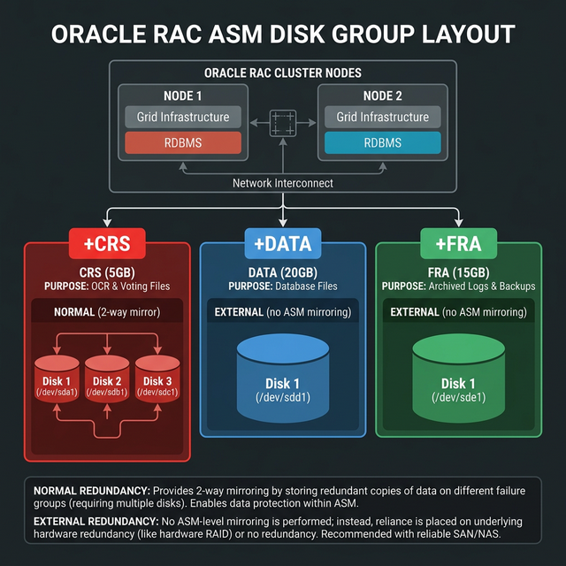
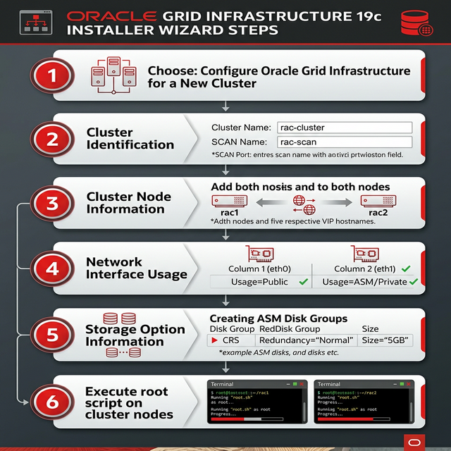
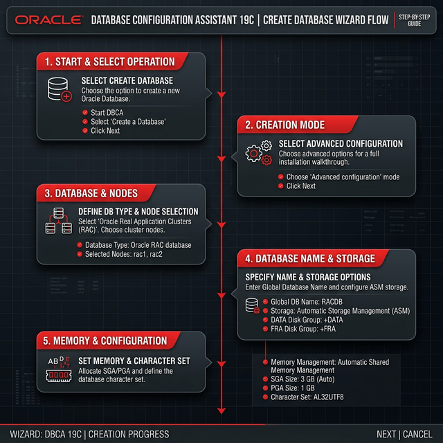

# FASE 2: Installazione Grid Infrastructure e Oracle RAC Primario

> Tutti i passaggi di questa fase si riferiscono ai nodi **rac1** e **rac2** (RAC Primario).
> Lo storage condiviso deve essere già visibile da entrambi i nodi prima di procedere.

> 🛑 **PRIMA DI CONTINUARE: CONNETTITI VIA MOBAXTERM!**
> Questa fase è densa di script e configurazioni grafiche. È **obbligatorio** usare MobaXterm con X11-Forwarding attivato. Apri due tab in MobaXterm per avere entrambi i nodi sottomano.
>
> **Tabella IP di Riferimento (Rete Pubblica):**
> - `rac1`: 192.168.56.101
> - `rac2`: 192.168.56.102

### 📸 Riferimenti Visivi







### Cosa Costruiamo in Questa Fase

```
╔═══════════════════════════════════════════════════════════════════════╗
║                     IL CLUSTER RAC (rac1 + rac2)                     ║
║                                                                       ║
║    ┌──────────────────────────────────────────────────────────┐       ║
║    │              Oracle Database 19c + RU + OJVM             │       ║
║    │         ┌──────────────┐  ┌──────────────┐               │       ║
║    │         │  Istanza     │  │  Istanza     │               │       ║
║    │         │  RACDB1      │  │  RACDB2      │               │       ║
║    │         │  (rac1)      │  │  (rac2)      │               │       ║
║    │         └──────┬───────┘  └──────┬───────┘               │       ║
║    └────────────────┼─────────────────┼───────────────────────┘       ║
║    ┌────────────────┼─────────────────┼───────────────────────┐       ║
║    │         Grid Infrastructure 19c + Release Update         │       ║
║    │         ┌──────┴───────┐  ┌──────┴───────┐               │       ║
║    │         │    ASM       │  │    ASM        │               │       ║
║    │         │  Instance    │  │  Instance     │               │       ║
║    │         │  (+ASM1)     │  │  (+ASM2)      │               │       ║
║    │         └──────┬───────┘  └──────┬───────┘               │       ║
║    │         Clusterware (CRS) ◄═══════════════►              │       ║
║    │           crsd, cssd, evmd, ohasd                        │       ║
║    └────────────────┼─────────────────┼───────────────────────┘       ║
║                     │                 │                               ║
║    ┌────────────────┴─────────────────┴───────────────────────┐       ║
║    │                  Dischi ASM Condivisi                     │       ║
║    │  ┌─────────┐     ┌──────────┐     ┌──────────┐          │       ║
║    │  │ +CRS    │     │ +DATA    │     │ +FRA     │          │       ║
║    │  │  5 GB   │     │  20 GB   │     │  15 GB   │          │       ║
║    │  │ OCR,    │     │ Datafile,│     │ Archive, │          │       ║
║    │  │ Voting  │     │ Redo,    │     │ Backup,  │          │       ║
║    │  │ Disk    │     │ Control  │     │ Flashback│          │       ║
║    │  └─────────┘     └──────────┘     └──────────┘          │       ║
║    └──────────────────────────────────────────────────────────┘       ║
╚═══════════════════════════════════════════════════════════════════════╝
```

### Ordine di Installazione in Questa Fase

```
Passo 1:  ASM Dischi        ━━━━━━━━━━━━━━━━━━━━━━━▶  oracleasm, partizioni
Passo 2:  cluvfy             ━━━━━━━━━━━━━━━━━━━━━━━▶  verifica prerequisiti
Passo 3:  Grid Infrastructure ━━━━━━━━━━━━━━━━━━━━━▶  gridSetup.sh + root.sh
Passo 4:  DATA + FRA          ━━━━━━━━━━━━━━━━━━━━━▶  asmca / sqlplus
Passo 5:  Patch Grid (RU)     ━━━━━━━━━━━━━━━━━━━━━▶  opatchauto (come root)
Passo 6:  DB Software          ━━━━━━━━━━━━━━━━━━━━▶  runInstaller + root.sh
Passo 7:  Patch DB Home (RU+OJVM)━━━━━━━━━━━━━━━━━▶  opatchauto + opatch
Passo 8:  DBCA                  ━━━━━━━━━━━━━━━━━━━▶  crea database RACDB
Passo 9:  datapatch              ━━━━━━━━━━━━━━━━━━▶  applica patch al dictionary
```

---

## 2.1 Preparazione Storage Condiviso (ASM)

### Creazione Dischi Condivisi in VirtualBox

Se usi VirtualBox, crea i dischi dal **Virtual Media Manager** (`Ctrl+D`):

| Disco | Dimensione | Uso |
|---|---|---|
| `asm_crs.vdi`  | 5 GB  | OCR + Voting Disk (Clusterware) |
| `asm_data.vdi` | 20 GB | Disk Group DATA (Datafile) |
| `asm_fra.vdi`  | 15 GB | Disk Group FRA (Archive/Recovery) |

**Proprietà importanti**:
- **Dimensione Fissa** (Fixed Size) — obbligatorio per i dischi condivisi.
- Dopo la creazione, seleziona ogni disco → **Proprietà** → **Tipo: Condivisibile (Shareable)**.
- Aggiungi tutti e 3 i dischi al controller SATA di **entrambe** le VM (`rac1` e `rac2`).

### Verifica Partizioni (su rac1 come root)

I dischi per ASM sono già stati partizionati manualmente nella [Fase 0](./GUIDA_FASE0_SETUP_MACCHINE.md) tramite `fdisk`. Verifichiamo che le partizioni siano visibili:
```bash
lsblk
# Devi vedere sdc1, sdd1, sde1, sdf1, sdg1
```


---

## 2.2 Download e Preparazione Binari

Scarica dal sito [Oracle eDelivery](https://edelivery.oracle.com):
- `LINUX.X64_193000_grid_home.zip` (Grid Infrastructure 19.3)
- `LINUX.X64_193000_db_home.zip` (Database 19.3)

Trasferisci i file su `rac1` (ad esempio in `/tmp/`):

```bash
# Scompatta Grid nella GRID_HOME (come utente grid)
su - grid
unzip -q /tmp/LINUX.X64_193000_grid_home.zip -d /u01/app/19.0.0/grid
```

> **Perché scompattare direttamente nella GRID_HOME?** A partire da Oracle 18c, la GRID_HOME È il software stesso. Non c'è più un "installer" separato: scompatti lo zip e quella diventa la home.

---

## 2.3 Installazione CVU Disk Package

```bash
# Come root su ENTRAMBI i nodi
rpm -ivh /u01/app/19.0.0/grid/cv/rpm/cvuqdisk-1.0.10-1.rpm
```

> **Perché cvuqdisk?** È il pacchetto del Cluster Verification Utility per la discovery dei dischi. Senza questo, il `runcluvfy.sh` e il Grid installer non riescono a trovare i dischi condivisi.

---

## 2.4 Pre-Check con Cluster Verification Utility

```bash
# Come utente grid su rac1
su - grid

cd /u01/app/19.0.0/grid

./runcluvfy.sh stage -pre crsinst \
    -n rac1,rac2 \
    -verbose
```

> **Perché cluvfy?** Questo strumento verifica TUTTI i prerequisiti prima dell'installazione: DNS, SSH, swap, kernel params, dischi, NTP... Se cluvfy passa con tutti PASSED, l'installazione andrà liscia. Se ci sono FAILED, risolvili PRIMA di procedere.


Errori comuni e soluzioni:
- **PRVG-11250 (RPM Database)**: Ignorabile (è un WARNING informativo).
- **PRVF-4664 (NTP)**: Configura chrony correttamente (vedi Fase 1).
- **SSH user equivalence FAILED**: Ripeti il setup SSH (Fase 1.12).

---

## 2.5 Installazione Grid Infrastructure

### Metodo GUI (Consigliato per imparare)

> ⚠️ **ATTENZIONE MOBAXTERM**: Questo step lancia un'interfaccia grafica (GUI). L'unico modo per vederla dal tuo PC Windows è aver effettuato l'accesso a `rac1` tramite **MobaXterm** con la spunta su **X11-Forwarding** (vedi Fase 0.12). 
> Se sei connesso dalla console nera di VirtualBox o da un Putty senza Xming, il comando fallirà dicendo "Display not set".

```bash
# Come utente grid su rac1 (connesso via MobaXterm)
# Il DISPLAY di solito viene settato in automatico da MobaXterm.
# Se hai problemi, verifica con `echo $DISPLAY` (dovrebbe darti qualcosa come localhost:10.0)

# Avvia l'installer  
cd /u01/app/19.0.0/grid
./gridSetup.sh
```

### Step-by-Step dell'Installer GUI

**Step 1 — Configuration Option**:
- Seleziona: **Configure Oracle Grid Infrastructure for a New Cluster**

> Questa opzione installa Clusterware + ASM da zero.

**Step 2 — Cluster Configuration**:
- Seleziona: **Configure an Oracle Standalone Cluster**

> Standalone = un cluster "normale" (non Domain Services Cluster, che è per cloud/grandi infrastrutture).

**Step 3 — Cluster Name e SCAN**:
- Cluster Name: `rac-cluster`
- SCAN Name: `rac-scan.localdomain`  
- SCAN Port: `1521`

> **Il nome SCAN deve corrispondere esattamente a quello nel DNS!** L'installer verifica il DNS in questo momento.

**Step 4 — Cluster Nodes**:
- Aggiungi `rac2` cliccando "Add":
  - Public Hostname: `rac2.localdomain`
  - Virtual Hostname: `rac2-vip.localdomain`
- `rac1` sarà già presente:
  - Virtual Hostname: `rac1-vip.localdomain`
- Clicca **SSH Connectivity** → inserisci password di `grid` → **Setup**
- Clicca **Test** per verificare la connettività

**Step 5 — Network Interface Usage**:
| Interface | Subnet | Use |
|---|---|---|
| eth0 | 192.168.1.0 | Public |
| eth1 | 192.168.1.0  | ASM & Private |

> L'Interconnect (Private) è la rete su cui transita Cache Fusion: le copie dei blocchi di dati tra i nodi. MAI mescolarla con la rete pubblica.

**Step 6 — Storage Option**:
- Seleziona: **Use Oracle Flex ASM for Storage**

**Step 7 — Grid Infrastructure Management Repository**:
- Seleziona: **No** (non ci serve il GIMR per un lab)

**Step 8 — Create ASM Disk Group** (per OCR e Voting Disk):
- Disk Group Name: `CRS`
- Redundancy: **Normal** (abbiamo 3 dischi per CRS)
- Seleziona i dischi: `ORCL:CRS1`, `ORCL:CRS2`, `ORCL:CRS3`

> **Perché Normal Redundancy?** Oracle raccomanda di usare 3 Voting Disk per formare un quorum (2 sopravvissuti su 3). Usando Normal Redundancy su 3 dischi fisici separati, se ne perdi uno il cluster rimane operativo!

**Step 9 — ASM Password**:
- Imposta la password per `SYS` e `ASMSNMP`

**Step 10 — IPMI**:
- Seleziona: **Do not use IPMI**

**Step 11 — EM Registration**:
- Deseleziona: **Register with Enterprise Manager**

**Step 12 — OS Groups**:
- OSASM Group: `asmadmin`
- OSDBA for ASM: `asmdba`
- OSOPER for ASM: `asmoper`

**Step 13 — Installation Locations**:
- Oracle Base: `/u01/app/grid`
- Software Location: `/u01/app/19.0.0/grid`

**Step 14 — Root Script Execution**:
- **DESELEZIONA** "Automatically run configuration scripts"
- Li eseguiremo noi manualmente, uno alla volta, per capire cosa fanno

**Step 15 — Summary**:
- Rivedi tutto e clicca **Install**

### Esecuzione degli Script root

L'installer si ferma e chiede di eseguire 2 script come `root`. **ESEGUILI UNO ALLA VOLTA, prima su rac1, poi su rac2!**

**Su rac1 (come root)**:

```bash
/u01/app/oraInventory/orainstRoot.sh
```

> Questo script registra la Central Inventory. Deve essere eseguito una sola volta.

```bash
/u01/app/19.0.0/grid/root.sh
```

> **Questo è lo script più importante**. Esegue:
> - Configura Oracle Clusterware (CRS)
> - Crea il CRS daemon (`crsd`, `cssd`, `evmd`)
> - Configura ASM
> - Avvia il cluster su questo nodo
>
> **ASPETTA** che finisca completamente prima di passare al nodo 2! Se lo esegui in parallelo, il cluster si corrompe.

**Su rac2 (come root)**:

```bash
/u01/app/oraInventory/orainstRoot.sh
/u01/app/19.0.0/grid/root.sh
```

> Sul nodo 2, `root.sh` aggiungerà questo nodo al cluster esistente (creato dal nodo 1).

Torna all'installer GUI e clicca **OK** per completare.


---

### 🚨 TROUBLESHOOTING: Cosa fare se l'installazione fallisce?

Se l'esecuzione di `root.sh` fallisce (es. per timeout SSH, problemi di rete o dischi formattati male), il cluster rimane a metà configurazione. Se provi a rilanciare `root.sh` o `gridSetup.sh`, otterrai un errore perché i file sono già presenti. 

**Per pulire l'installazione fallita e riprovare (da eseguire come `root`):**
```bash
# Sul nodo dove ha fallito (o su entrambi se necessario)
/u01/app/19.0.0/grid/crs/install/rootcrs.sh -deconfig -force
```
> Questo script "smonta" il cluster, pulisce le interfacce, killa i demoni e resetta i dischi ASM (header inclusi) permettendoti di ripartire pulito.

---

## 2.6 Verifica Cluster

```bash
# Come root o grid
# Stato generale del cluster
crsctl stat res -t

# Elenco nodi
olsnodes -n

# Stato CRS (deve essere tutto ONLINE)
crsctl check crs

# Verifica ASM
su - grid
asmcmd lsdg
# Dovrai vedere il disk group CRS
```

Output atteso di `crsctl check crs`:
```
CRS-4638: Oracle High Availability Services is online
CRS-4537: Cluster Ready Services is online
CRS-4529: Cluster Synchronization Services is online
CRS-4533: Event Manager is online
```

> Se vedi tutto ONLINE, il tuo cluster è vivo! 🎉

---

## 2.7 Creazione Disk Group DATA e FRA

Ora che il cluster è attivo, creiamo i disk group per il database:

```bash
# Come utente grid
su - grid
asmca
```

Oppure da linea di comando:

```sql
-- Connettiti ad ASM come SYSASM
sqlplus / as sysasm

-- Crea disk group DATA
CREATE DISKGROUP DATA EXTERNAL REDUNDANCY
  DISK 'ORCL:DATA'
  ATTRIBUTE 'compatible.asm' = '19.0.0.0.0',
            'compatible.rdbms' = '19.0.0.0.0';

-- Crea disk group RECO
CREATE DISKGROUP RECO EXTERNAL REDUNDANCY
  DISK 'ORCL:RECO'
  ATTRIBUTE 'compatible.asm' = '19.0.0.0.0',
            'compatible.rdbms' = '19.0.0.0.0';

-- Verifica
SELECT name, state, type, total_mb, free_mb FROM v$asm_diskgroup;

EXIT;
```

```bash
# Verifica da asmcmd
asmcmd lsdg
# Dovrai vedere: CRS, DATA, RECO tutti MOUNTED
```

> **Perché creare DATA e RECO separati?** DATA contiene i datafile (i dati veri). La Fast Recovery Area (situata nel disk group RECO) contiene gli archivelog, i backup RMAN e i flashback log. Separarli è una best practice fondamentale: se il disco DATA si riempie, hai ancora lo spazio per il recovery.

---

## 2.8 Patching Grid Infrastructure (Release Update)

> **Perché patchare?** Oracle 19c base (19.3) è la versione iniziale rilasciata nel 2019. Le Release Update (RU) contengono fix di sicurezza, bug fix e miglioramenti di stabilità. In produzione, patchare è **obbligatorio**. Nel lab, ti insegna il processo che userai nel mondo reale.

I patch che ti servono (già presenti nei tuoi download):

| Patch | Descrizione | Dove si Applica |
|---|---|---|
| **p6880880** | **OPatch** (utility per applicare patch) | Sostituisci in ogni ORACLE_HOME |
| **p37957391** | **Release Update (RU)** — Jan 2025 o successiva | Grid Home + DB Home |
| **p33803476** | **OJVM Release Update** o one-off patch | DB Home |

### Step 1: Aggiorna OPatch nella Grid Home

OPatch è lo strumento che applica le patch. La versione fornita con il software base 19.3 è troppo vecchia. Devi aggiornarla PRIMA di applicare qualsiasi patch.

```bash
# Come utente grid su rac1
su - grid

# Backup del vecchio OPatch
mv $ORACLE_HOME/OPatch $ORACLE_HOME/OPatch.bkp.$(date +%Y%m%d)

# Scompatta il nuovo OPatch
unzip -q /tmp/p6880880_230000_Linux-x86-64.zip -d $ORACLE_HOME/

# Verifica la versione
$ORACLE_HOME/OPatch/opatch version
# Deve mostrare: OPatch Version: 12.2.0.1.43 (o superiore)
```

> **Perché la versione 230000?** Il p6880880_**230000** è la versione di OPatch compatibile con Oracle 19c e le RU recenti. La versione nel nome (23.x) indica la build di OPatch, non la versione del database.

```bash
# Ripeti su rac2
ssh rac2
su - grid
mv $ORACLE_HOME/OPatch $ORACLE_HOME/OPatch.bkp.$(date +%Y%m%d)
unzip -q /tmp/p6880880_230000_Linux-x86-64.zip -d $ORACLE_HOME/
$ORACLE_HOME/OPatch/opatch version
```

### Step 2: Scompatta la Release Update

```bash
# Come root (o oracle/grid con permessi)
# Scompatta la RU in una directory temporanea
mkdir -p /tmp/patch
cd /tmp/patch
unzip -q /tmp/p37957391_190000_Linux-x86-64.zip

# Vedrai una directory con il numero del patch, es: 37957391/
ls -la
```

### Step 3: Applica la RU alla Grid Home con opatchauto

```bash
# FERMA il database prima del patching (come oracle)
su - oracle
srvctl stop database -d RACDB

# Come root su rac1 — opatchauto patcha sia Grid che ASM automaticamente
export ORACLE_HOME=/u01/app/19.0.0/grid
$ORACLE_HOME/OPatch/opatchauto apply /tmp/patch/37957391 -oh $ORACLE_HOME
```

> **Perché opatchauto?** Per la Grid Infrastructure, non puoi usare il semplice `opatch apply`. Devi usare `opatchauto` (come root), che:
> 1. Ferma il CRS automaticamente
> 2. Applica la patch
> 3. Riavvia il CRS
> Fa tutto in un colpo, gestendo anche le dipendenze dei servizi cluster.

```bash
# Verifica che il CRS si sia riavviato
crsctl check crs
# Deve mostrare tutto ONLINE

# Verifica la patch applicata
su - grid
$ORACLE_HOME/OPatch/opatch lspatches
# Deve mostrare il numero del patch RU (37957391)
```

```bash
# Ripeti su rac2 come root
ssh rac2
export ORACLE_HOME=/u01/app/19.0.0/grid
$ORACLE_HOME/OPatch/opatchauto apply /tmp/patch/37957391 -oh $ORACLE_HOME

# Verifica
crsctl check crs
su - grid
$ORACLE_HOME/OPatch/opatch lspatches
```

> 📸 **SNAPSHOT — "SNAP-04: Grid_Installato_e_Patchato" ⭐ MILESTONE**
> Il cluster è attivo e aggiornato all'ultima Release Update. Reinstallarlo richiederebbe ore. Se l'installazione del Database RDBMS fallisce, puoi tornare qui.
> ```bash
> VBoxManage snapshot "rac1" take "SNAP-04: Grid_Installato_e_Patchato"
> VBoxManage snapshot "rac2" take "SNAP-04: Grid_Installato_e_Patchato"
> ```

---

## 2.9 Installazione Software Database

```bash
# Come utente oracle
su - oracle

# Scompatta il DB nella ORACLE_HOME
unzip -q /tmp/LINUX.X64_193000_db_home.zip -d $ORACLE_HOME

# Avvia l'installer
cd $ORACLE_HOME
export DISPLAY=<IP_del_tuo_PC>:0.0
./runInstaller
```

### Step dell'Installer GUI

**Step 1**: Seleziona **Set Up Software Only**

> Installiamo SOLO i binari. Il database lo creiamo dopo con DBCA. Questo è il metodo professionale: prima installi, poi crei.

**Step 2**: Seleziona **Oracle Real Application Clusters database installation**

**Step 3**: Seleziona entrambi i nodi (`rac1`, `rac2`)

**Step 4**: Seleziona **Enterprise Edition**

**Step 5**: Verifica i path:
- Oracle Base: `/u01/app/oracle`
- Software Location: `/u01/app/oracle/product/19.0.0/dbhome_1`

**Step 6**: OS Groups:
- OSDBA: `dba`
- OSOPER: `oper`
- OSBACKUPDBA: `backupdba`
- OSDGDBA: `dgdba`
- OSKMDBA: `kmdba`
- OSRACDBA: `racdba`

**Step 7**: Deseleziona l'esecuzione automatica degli script root

**Step 8**: Rivedi Summary e clicca **Install**

### Esecuzione root.sh

**Su rac1 come root:**

```bash
/u01/app/oracle/product/19.0.0/dbhome_1/root.sh
```

**Su rac2 come root:**

```bash
/u01/app/oracle/product/19.0.0/dbhome_1/root.sh
```


---

## 2.11 Patching Database Home (Release Update + OJVM)

### Step 1: Aggiorna OPatch nella DB Home

```bash
# Come utente oracle su rac1
su - oracle

# Backup del vecchio OPatch
mv $ORACLE_HOME/OPatch $ORACLE_HOME/OPatch.bkp.$(date +%Y%m%d)

# Scompatta il nuovo OPatch
unzip -q /tmp/p6880880_230000_Linux-x86-64.zip -d $ORACLE_HOME/

# Verifica
$ORACLE_HOME/OPatch/opatch version

# Ripeti su rac2
ssh rac2
su - oracle
mv $ORACLE_HOME/OPatch $ORACLE_HOME/OPatch.bkp.$(date +%Y%m%d)
unzip -q /tmp/p6880880_230000_Linux-x86-64.zip -d $ORACLE_HOME/
$ORACLE_HOME/OPatch/opatch version
```

### Step 2: Applica la RU alla DB Home

```bash
# Come root su rac1
# Usiamo opatchauto anche per la DB Home (metodo RAC)
export ORACLE_HOME=/u01/app/oracle/product/19.0.0/dbhome_1
$ORACLE_HOME/OPatch/opatchauto apply /tmp/patch/37957391 -oh $ORACLE_HOME
```

> **Nota**: `opatchauto` riconosce automaticamente che è una DB Home in un cluster RAC e gestisce il patching di conseguenza.

```bash
# Ripeti su rac2
ssh rac2
export ORACLE_HOME=/u01/app/oracle/product/19.0.0/dbhome_1
$ORACLE_HOME/OPatch/opatchauto apply /tmp/patch/37957391 -oh $ORACLE_HOME
```

### Step 3: Applica il Patch OJVM (p33803476)

Il patch OJVM (Oracle Java Virtual Machine) è separato dalla RU e si applica con `opatch apply` standard.

```bash
# Scompatta il patch OJVM
cd /tmp/patch
unzip -q /tmp/p33803476_190000_Linux-x86-64.zip

# Come utente oracle su rac1
su - oracle
cd /tmp/patch/33803476
$ORACLE_HOME/OPatch/opatch apply

# Quando chiede "Is the local system ready for patching?" rispondi: y
# Ripeti su rac2
ssh rac2
su - oracle
cd /tmp/patch/33803476
$ORACLE_HOME/OPatch/opatch apply
```

> **Perché OJVM separato?** La OJVM è la Java Virtual Machine interna di Oracle (usata per stored procedure Java, APEX, etc.). Il patch OJVM non è incluso nella RU e va applicato separatamente. Dopo averlo applicato, al primo avvio del database dovrai eseguire `datapatch`.

### Step 4: Verifica Patch Applicati

```bash
# Come oracle su rac1
$ORACLE_HOME/OPatch/opatch lspatches
```

Output atteso:
```
37957391;Database Release Update : 19.x.0.0.xxxxxx (37957391)
33803476;OJVM RELEASE UPDATE: 19.x.0.0.xxxxxx (33803476)
```

### Step 5: datapatch (dopo la creazione del DB)

> **IMPORTANTE**: `datapatch` va eseguito DOPO aver creato il database con DBCA (sezione successiva). Non eseguirlo ora — non hai ancora un database!
> Dopo DBCA, esegui:

```bash
# Come oracle, DOPO aver creato il database
su - oracle
$ORACLE_HOME/OPatch/datapatch -verbose
```

> **Cos'è datapatch?** `opatch` aggiorna i binari (i file .o, le librerie). Ma alcune patch richiedono anche modifiche al Data Dictionary (le tabelle interne di Oracle). `datapatch` applica queste modifiche SQL al database. Senza datapatch, la patch è applicata solo a metà.

```sql
-- Verifica che datapatch sia andato a buon fine
SELECT patch_id, patch_uid, action, status, description
FROM dba_registry_sqlpatch
ORDER BY action_time DESC;
-- Deve mostrare SUCCESS per entrambi i patch
```

> 📸 **SNAPSHOT — "SNAP-05: DB_Software_Installato"**
> I binari del database sono installati e completamente patchati con RU + OJVM. Pronto per DBCA.
> ```bash
> VBoxManage snapshot "rac1" take "SNAP-05: DB_Software_Installato"
> VBoxManage snapshot "rac2" take "SNAP-05: DB_Software_Installato"
> ```

---

## 2.12 Creazione Database RAC con DBCA

> ⚠️ **ATTENZIONE MOBAXTERM**: Anche `dbca` lancia un'interfaccia grafica (GUI). Devi essere connesso a `rac1` tramite **MobaXterm** con la spunta su **X11-Forwarding** (vedi Fase 0.12). 

```bash
# Come utente oracle su rac1 (connesso via MobaXterm)
su - oracle
# Il DISPLAY di solito viene settato in automatico da MobaXterm.
dbca
```

### Step dell'Installer GUI

**Step 1**: **Create a database**

**Step 2**: **Advanced Configuration** (per avere pieno controllo)

**Step 3**: Database Type:
- **Oracle RAC database**
- Seleziona entrambi i nodi

**Step 4**: Template:
- **Custom Database** (per massimo controllo)

**Step 5**: Database Identification:
- Global Database Name: `RACDB`
- SID Prefix: `RACDB` (diventerà RACDB1 su rac1, RACDB2 su rac2)

**Step 6**: Storage:
- Use following for the database storage: **Automatic Storage Management (ASM)**
- Database Area: `+DATA`

**Step 7**: Fast Recovery Area:
- Recovery Area: `+RECO`
- Size: `10000` MB (o quanto hai disponibile)
- ✅ **Enable archiving** (FONDAMENTALE per Data Guard!)

> **Perché Enable Archiving?** Senza archivelog mode, Data Guard non funziona. L'archivelog è il "diario" di tutte le modifiche. È quello che viene spedito allo standby.

**Step 8**: Listener:
- Seleziona il listener del cluster (già configurato da Grid)

**Step 9**: Database Options:
- Puoi deselezionare componenti non necessari (Oracle Text, Spatial, etc.)

**Step 10**: Configuration Options:
- Memory: **Use Automatic Shared Memory Management**
- SGA: almeno 1500 MB
- PGA: almeno 500 MB
- Character Set: **AL32UTF8** (consigliato)

**Step 11**: Management Options:
- Deseleziona EM Express per semplicità

**Step 12**: Password:
- Imposta password per SYS, SYSTEM, etc.

**Step 13**: Creation Options:
- ✅ Create Database
- ✅ Save as a Database Template (opzionale)
- ✅ Generate Database Creation Scripts (utile per imparare!)

**Step 14**: Rivedi Summary → **Finish**

L'installazione richiederà 15-30 minuti a seconda dell'hardware.

---

## 2.13 Verifica Post-Installazione Database

```bash
# Come utente oracle
sqlplus / as sysdba

-- Verifica le istanze
SELECT inst_id, instance_name, host_name, status FROM gv$instance;
```

Output atteso:
```
   INST_ID INSTANCE_NAME    HOST_NAME       STATUS
---------- ---------------- --------------- --------
         1 RACDB1           rac1            OPEN
         2 RACDB2           rac2            OPEN
```

```bash
# Verifica servizi del cluster
srvctl status database -d RACDB
# Output: Instance RACDB1 is running on node rac1
#         Instance RACDB2 is running on node rac2

# Verifica listener SCAN
srvctl status scan
srvctl status scan_listener

# Verifica servizi del database
srvctl config database -d RACDB
```

> 📸 **SNAPSHOT — "SNAP-06: Database_RAC_Creato" ⭐ MILESTONE**
> Il tuo RAC primario è completamente operativo! Questo è lo snapshot più importante per non dover ripetere MAI PIÙ l'installazione del cluster.
> ```bash
> VBoxManage snapshot "rac1" take "SNAP-06: Database_RAC_Creato"
> VBoxManage snapshot "rac2" take "SNAP-06: Database_RAC_Creato"
> ```

### Abilitare Force Logging (necessario per Data Guard)

```sql
-- Come sysdba
ALTER DATABASE FORCE LOGGING;

-- Verifica
SELECT force_logging FROM v$database;
-- Deve restituire YES
```

> **Perché Force Logging?** Alcune operazioni (come `INSERT /*+ APPEND */ ...` o `CREATE TABLE ... NOLOGGING`) possono bypassare il redo log per velocità. Ma se non generi redo, lo standby non riceve le modifiche e i dati si corrompono. Force Logging impedisce questo bypass.

---

## ✅ Checklist Fine Fase 2

```bash
# 1. Cluster operativo
crsctl stat res -t | grep -E "ONLINE|OFFLINE"

# 2. ASM Disk Groups
su - grid -c "asmcmd lsdg"
# CRS, DATA, RECO tutti MOUNTED

# 3. Database RAC attivo
su - oracle -c "srvctl status database -d RACDB"

# 4. Archive logging attivo
su - oracle -c "sqlplus -s / as sysdba <<< \"SELECT log_mode FROM v\\\$database;\""

# 5. Force logging attivo
su - oracle -c "sqlplus -s / as sysdba <<< \"SELECT force_logging FROM v\\\$database;\""
```

---

**→ Prossimo: [FASE 3: Preparazione e Creazione Oracle RAC Standby](./GUIDA_FASE3_RAC_STANDBY.md)**
