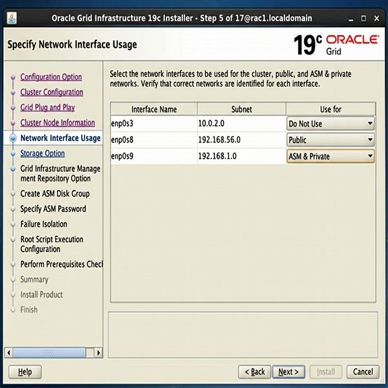
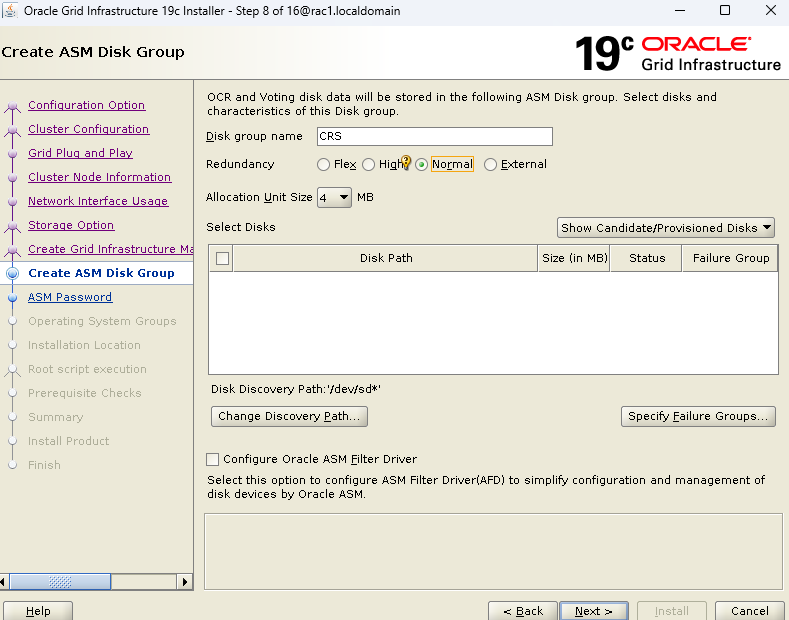
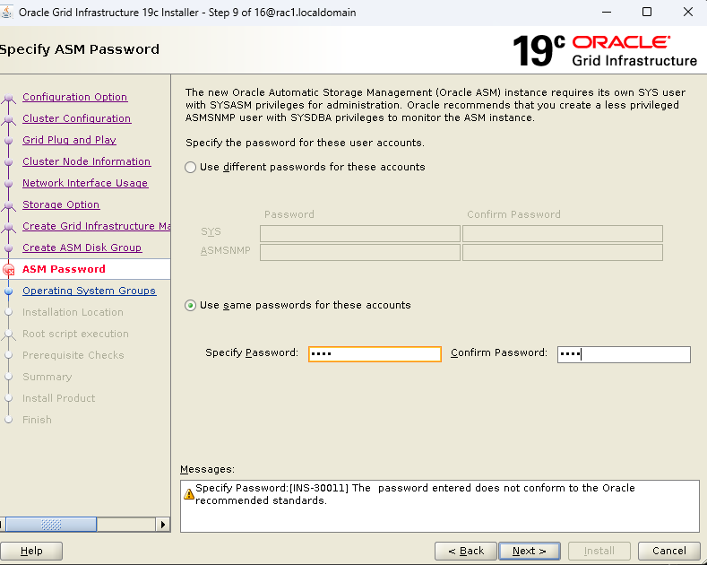
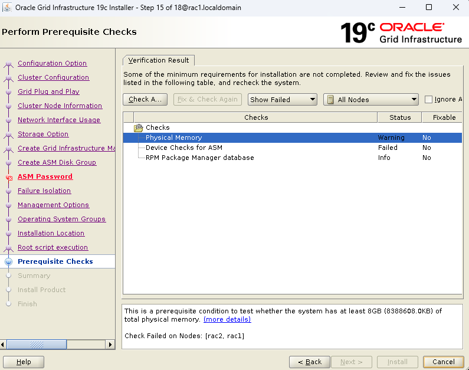
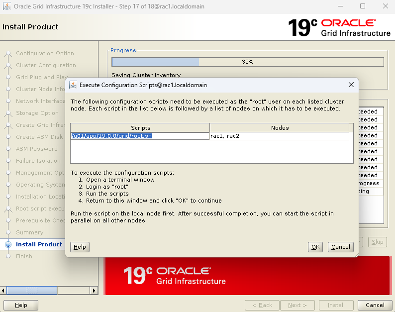

# FASE 2: Installazione Grid Infrastructure e Oracle RAC Primario

> Tutti i passaggi di questa fase si riferiscono ai nodi **rac1** e **rac2** (RAC Primario).
> Lo storage condiviso deve essere già visibile da entrambi i nodi prima di procedere.

> 🛑 **PRIMA DI CONTINUARE: CONNETTITI VIA MOBAXTERM!**
> Questa fase è densa di script e configurazioni grafiche. È **obbligatorio** usare MobaXterm con X11-Forwarding attivato. Apri due tab in MobaXterm per avere entrambi i nodi sottomano.
>
> **Tabella IP di Riferimento (Rete Pubblica):**
> - `rac1`: 192.168.56.101
> - `rac2`: 192.168.56.102

### 📸 Riferimenti Visivi


### Cosa Costruiamo in Questa Fase

```
╔═══════════════════════════════════════════════════════════════════════╗
║                     IL CLUSTER RAC (rac1 + rac2)                     ║
║                                                                       ║
║    ┌──────────────────────────────────────────────────────────┐       ║
║    │              Oracle Database 19c + RU + OJVM             │       ║
║    │         ┌──────────────┐  ┌──────────────┐               │       ║
║    │         │  Istanza     │  │  Istanza     │               │       ║
║    │         │  RACDB1      │  │  RACDB2      │               │       ║
║    │         │  (rac1)      │  │  (rac2)      │               │       ║
║    │         └──────┬───────┘  └──────┬───────┘               │       ║
║    └────────────────┼─────────────────┼───────────────────────┘       ║
║    ┌────────────────┼─────────────────┼───────────────────────┐       ║
║    │         Grid Infrastructure 19c + Release Update         │       ║
║    │         ┌──────┴───────┐  ┌──────┴───────┐               │       ║
║    │         │    ASM       │  │    ASM        │               │       ║
║    │         │  Instance    │  │  Instance     │               │       ║
║    │         │  (+ASM1)     │  │  (+ASM2)      │               │       ║
║    │         └──────┬───────┘  └──────┬───────┘               │       ║
║    │         Clusterware (CRS) ◄═══════════════►              │       ║
║    │           crsd, cssd, evmd, ohasd                        │       ║
║    └────────────────┼─────────────────┼───────────────────────┘       ║
║                     │                 │                               ║
║    ┌────────────────┴─────────────────┴───────────────────────┐       ║
║    │                  Dischi ASM Condivisi                     │       ║
║    │  ┌─────────┐     ┌──────────┐     ┌──────────┐          │       ║
║    │  │ +CRS    │     │ +DATA    │     │ +FRA     │          │       ║
║    │  │  5 GB   │     │  20 GB   │     │  15 GB   │          │       ║
║    │  │ OCR,    │     │ Datafile,│     │ Archive, │          │       ║
║    │  │ Voting  │     │ Redo,    │     │ Backup,  │          │       ║
║    │  │ Disk    │     │ Control  │     │ Flashback│          │       ║
║    │  └─────────┘     └──────────┘     └──────────┘          │       ║
║    └──────────────────────────────────────────────────────────┘       ║
╚═══════════════════════════════════════════════════════════════════════╝
```

### Ordine di Installazione in Questa Fase

```
Passo 1:  ASM Dischi        ━━━━━━━━━━━━━━━━━━━━━━━▶  oracleasm, partizioni
Passo 2:  cluvfy             ━━━━━━━━━━━━━━━━━━━━━━━▶  verifica prerequisiti
Passo 3:  Grid Infrastructure ━━━━━━━━━━━━━━━━━━━━━▶  gridSetup.sh + root.sh
Passo 4:  DATA + FRA          ━━━━━━━━━━━━━━━━━━━━━▶  asmca / sqlplus
Passo 5:  Patch Grid (RU)     ━━━━━━━━━━━━━━━━━━━━━▶  opatchauto (come root)
Passo 6:  DB Software          ━━━━━━━━━━━━━━━━━━━━▶  runInstaller + root.sh
Passo 7:  Patch DB Home (RU+OJVM)━━━━━━━━━━━━━━━━━▶  opatchauto + opatch
Passo 8:  DBCA                  ━━━━━━━━━━━━━━━━━━━▶  crea database RACDB
Passo 9:  datapatch              ━━━━━━━━━━━━━━━━━━▶  applica patch al dictionary
```

---

## 2.1 Preparazione Storage Condiviso (ASM)

### Creazione Dischi Condivisi in VirtualBox

Se usi VirtualBox, crea i dischi dal **Virtual Media Manager** (`Ctrl+D`):

| Disco | Dimensione | Uso |
|---|---|---|
| `asm_crs.vdi`  | 5 GB  | OCR + Voting Disk (Clusterware) |
| `asm_data.vdi` | 20 GB | Disk Group DATA (Datafile) |
| `asm_fra.vdi`  | 15 GB | Disk Group FRA (Archive/Recovery) |

**Proprietà importanti**:
- **Dimensione Fissa** (Fixed Size) — obbligatorio per i dischi condivisi.
- Dopo la creazione, seleziona ogni disco → **Proprietà** → **Tipo: Condivisibile (Shareable)**.
- Aggiungi tutti e 3 i dischi al controller SATA di **entrambe** le VM (`rac1` e `rac2`).

### Verifica Partizioni (su rac1 come root)

I dischi per ASM sono già stati partizionati manualmente nella [Fase 0](./GUIDA_FASE0_SETUP_MACCHINE.md) tramite `fdisk`. Verifichiamo che le partizioni siano visibili:
```bash
lsblk
# Devi vedere sdc1, sdd1, sde1, sdf1, sdg1
```


---

## 2.2 Download e Preparazione Binari

Scarica dal sito [Oracle eDelivery](https://edelivery.oracle.com):
- `LINUX.X64_193000_grid_home.zip` (Grid Infrastructure 19.3)
- `LINUX.X64_193000_db_home.zip` (Database 19.3)

Trasferisci i file su `rac1` (ad esempio in `/tmp/`):

```bash
# Scompatta Grid nella GRID_HOME (come utente grid)
su - grid
unzip -q /tmp/LINUX.X64_193000_grid_home.zip -d /u01/app/19.0.0/grid
```

> **Perché scompattare direttamente nella GRID_HOME?** A partire da Oracle 18c, la GRID_HOME È il software stesso. Non c'è più un "installer" separato: scompatti lo zip e quella diventa la home.

---

## 2.3 Installazione CVU Disk Package

> ⚠️ **ATTENZIONE**: Il file `cvuqdisk` si trova dentro la GRID_HOME che hai appena scompattato. Siccome lo zip è stato estratto **solo su `rac1`**, il path `/u01/app/19.0.0/grid/` **NON ESISTE ancora su `rac2`!** Devi quindi copiare il file RPM da `rac1` a `rac2` prima di installarlo.

**Step 1: Su `rac1` (come `root`) — Installa direttamente:**
```bash
# Su rac1 il file esiste già perché hai scompattato il Grid qui
rpm -ivh /u01/app/19.0.0/grid/cv/rpm/cvuqdisk-1.0.10-1.rpm
```

**Step 2: Copia il file RPM su `rac2`:**
```bash
# Ancora da rac1, spedisci il file a rac2 via scp
scp /u01/app/19.0.0/grid/cv/rpm/cvuqdisk-1.0.10-1.rpm root@rac2:/tmp/
```

**Step 3: Su `rac2` (come `root`) — Installa dalla copia in /tmp:**
```bash
# Su rac2, installa dalla copia che hai appena trasferito
rpm -ivh /tmp/cvuqdisk-1.0.10-1.rpm
```

> **Perché cvuqdisk?** È il pacchetto del Cluster Verification Utility per la discovery dei dischi. Senza questo, il `runcluvfy.sh` e il Grid installer non riescono a trovare i dischi condivisi. L'installer di Grid copierà poi automaticamente tutti i binari su `rac2` durante l'installazione — ma `cvuqdisk` serve **PRIMA** dell'installazione per il pre-check.

---

## 2.3b Creare il file Oracle Inventory Pointer (`/etc/oraInst.loc`)

> ⚠️ **Da fare su ENTRAMBI i nodi (`rac1` e `rac2`) come `root`**, altrimenti `cluvfy` fallisce con l'errore: `PRVG-10467: The default Oracle Inventory group could not be determined.`

**Perché serve?** Oracle usa il file `/etc/oraInst.loc` per sapere dove salvare il suo "registro di installazione" (l'Inventory) e quale gruppo Linux lo possiede. Questo file normalmente viene creato automaticamente alla prima installazione Oracle — ma siccome non hai ancora installato nulla, non esiste! Dobbiamo crearlo a mano prima di lanciare il pre-check.

**Su `rac1` E `rac2`, come utente `root`:**

```bash
# 1. Crea il file pointer che dice a Oracle dove sta l'Inventory
cat > /etc/oraInst.loc <<'EOF'
inventory_loc=/u01/app/oraInventory
inst_group=oinstall
EOF

# 2. Permessi corretti sul file
chown root:oinstall /etc/oraInst.loc
chmod 644 /etc/oraInst.loc

# 3. Crea la directory dell'Inventory (se non esiste già)
mkdir -p /u01/app/oraInventory
chown grid:oinstall /u01/app/oraInventory
chmod 775 /u01/app/oraInventory

# 4. Verifica
cat /etc/oraInst.loc
ls -ld /u01/app/oraInventory
```

## 2.3c Pulizia Interfacce di Rete "Fantasma" (Pre-Requisito per cluvfy)

> 🛑 **Questo step è OBBLIGATORIO prima di lanciare il pre-check cluvfy!**
> Se non lo fai, cluvfy segnalerà errori di connettività che non hanno nulla a che fare con il tuo RAC: interfacce virtuali con IP duplicati, IPv6 non raggiungibile, bridge inutil. Questi errori confondono e spaventano, ma la soluzione è semplice.

### Il Problema: Cosa vede cluvfy (e cosa NON dovrebbe vedere)

Quando lanci `cluvfy`, Oracle scansiona **TUTTE** le interfacce di rete del sistema, non solo quelle che userà il RAC. Nella nostra VM, dopo il clone, ci sono **4 interfacce attive**, ma Oracle ne usa solo 2:

```
╔══════════════════════════════════════════════════════════════════════════╗
║                INTERFACCE DI RETE SULLA VM                             ║
╠═══════════╦══════════════════╦═══════════════════════════╦═════════════╣
║ Interfac. ║ IP               ║ Ruolo                     ║ Serve a RAC?║
╠═══════════╬══════════════════╬═══════════════════════════╬═════════════╣
║ enp0s8    ║ 192.168.56.x     ║ 🌐 Rete PUBBLICA         ║ ✅ SÌ       ║
║ enp0s9    ║ 192.168.1.x      ║ 🔗 INTERCONNECT privata  ║ ✅ SÌ       ║
╠═══════════╬══════════════════╬═══════════════════════════╬═════════════╣
║ enp0s3    ║ 10.0.2.15        ║ NAT VirtualBox (internet) ║ ❌ NO       ║
║ virbr0    ║ 192.168.122.1    ║ Bridge libvirt (KVM)      ║ ❌ NO       ║
╚═══════════╩══════════════════╩═══════════════════════════╩═════════════╝
```

Le due interfacce "inutili" causano 3 errori specifici:

| Errore cluvfy | Causa | Interfaccia |
|---|---|---|
| `PRVG-1172`: IP duplicato su più nodi | La NAT di VirtualBox dà `10.0.2.15` a TUTTE le VM | `enp0s3` |
| `PRVG-1172`: IP duplicato su più nodi | `libvirtd` crea `192.168.122.1` su TUTTE le VM | `virbr0` |
| `PRVG-11891`: IPv6 non raggiungibile | IPv6 auto-configurato sulla NAT non sa raggiungere l'altra VM | `enp0s3` (IPv6) |

### È Best Practice Oracle? SÌ!

La documentazione Oracle (MOS Doc ID 1585184.1 — "Grid Infrastructure Preinstallation Steps") raccomanda esplicitamente:
- **Disabilitare le interfacce di rete non necessarie** prima dell'installazione Grid
- **Disabilitare IPv6** se non viene utilizzato nel cluster (il 99% dei lab non lo usa)
- **Rimuovere i bridge virtuali** come `virbr0` che non partecipano al cluster

Il motivo è che durante l'installazione, Grid Infrastructure **enumera tutte le interfacce** per decidere quali usare per il Cluster Interconnect e quali per la rete pubblica. Interfacce extra con IP duplicati o irraggiungibili possono causare **errori non solo nel pre-check, ma anche nell'installer stesso**.

### Comandi da eseguire

**Su `rac1` e `rac2`, come utente `root`:**

```bash
# ============================================================
# 1. ELIMINA virbr0 (bridge di libvirt/KVM — non serve a RAC)
# ============================================================
# virbr0 è creato dal demone libvirtd, che serve per gestire
# macchine virtuali KVM *dentro* la VM stessa.
# Nel nostro lab non faremo mai VM-in-VM, quindi lo disabilitiamo.
systemctl stop libvirtd
systemctl disable libvirtd
ip link set virbr0 down
brctl delbr virbr0 2>/dev/null

# Verifica: virbr0 non deve più comparire
ip addr show virbr0 2>&1
# Deve dire: "Device virbr0 does not exist."

# ============================================================
# 2. DISABILITA IPv6 SULLA NAT (enp0s3)
# ============================================================
# L'IPv6 auto-configurato sulla NAT di VirtualBox genera indirizzi
# IPv6 diversi su ogni VM, ma NON sono raggiungibili tra di loro
# perché la NAT è isolata. Cluvfy prova a fare ping IPv6 e fallisce.
echo "net.ipv6.conf.enp0s3.disable_ipv6 = 1" >> /etc/sysctl.conf
sysctl -p

# Verifica: enp0s3 non deve più mostrare indirizzi "inet6"
ip -6 addr show enp0s3
# Deve essere vuoto o mostrare solo link-local

# ============================================================
# 3. (OPZIONALE) NOTA SULL'INTERFACCIA NAT (enp0s3)
# ============================================================
# L'interfaccia enp0s3 (10.0.2.15) serve per dare internet alla
# VM (download pacchetti, yum update). NON la disabilitiamo
# perché ci serve, ma cluvfy darà comunque un WARNING perché
# entrambe le VM hanno lo stesso IP 10.0.2.15 sulla NAT.
# Questo WARNING è HARMLESS: Oracle non userà mai questa rete.
```

> 💡 **Perché non disabilitiamo anche `enp0s3`?** Perché è l'unica interfaccia che dà accesso a Internet alle VM (per `yum install`, download patch, ecc.). Il Warning di cluvfy sull'IP duplicato `10.0.2.15` è innocuo: durante l'installazione Grid, sceglieremo manualmente `enp0s8` come rete pubblica e `enp0s9` come interconnect. Oracle non toccherà mai la NAT.

---

## 2.4 Pre-Check con Cluster Verification Utility

```bash
# Come utente grid su rac1
su - grid
cd /u01/app/19.0.0/grid

./runcluvfy.sh stage -pre crsinst \
    -n rac1,rac2 \
    -verbose
```

> **Cosa aspettarsi?** Il pre-check segnalerà probabilmente dei **FAILED** su:
> - **RAM** (7.49 GB invece di 8 GB) — è normale in VirtualBox, il kernel riserva ~500 MB
> - **IP duplicato 10.0.2.15** — è la NAT di VirtualBox, identica su ogni VM per design
>
> **Questi warning NON sono bloccanti!** Il `cluvfy` è solo un "consulente" che ti avvisa. Il vero cancello è l'installer (`gridSetup.sh`), che ti mostrerà gli stessi avvisi ma avrà una **checkbox "Ignore All"** in basso a sinistra per proseguire.
>
> **Se puoi permettertelo**, aumenta la RAM delle VM a **9216 MB (9 GB)** in VirtualBox per eliminare il warning sulla RAM.

### Errori da risolvere vs Warning da ignorare

| Errore | Tipo | Azione |
|---|---|---|
| `PRVF-7530`: RAM insufficiente | ⚠️ Warning | Procedi — l'installer ha "Ignore All" (o alza la RAM a 9 GB) |
| `PRVG-1172`: IP 10.0.2.15 duplicato | ⚠️ Warning | Innocuo — è la NAT VirtualBox, Oracle non la usa |
| `PRVG-11250`: RPM Database check | ℹ️ Info | Ignorabile (serve root per questo check) |
| `PRVF-4664`: NTP non configurato | ❌ Errore | Configura chrony (vedi Fase 1) |
| SSH user equivalence FAILED | ❌ Errore | Ripeti il setup SSH (Fase 1.12) |

---

## 2.5 Installazione Grid Infrastructure

### Metodo GUI (Consigliato per imparare)

> ⚠️ **ATTENZIONE MOBAXTERM**: Questo step lancia un'interfaccia grafica (GUI). L'unico modo per vederla dal tuo PC Windows è aver effettuato l'accesso a `rac1` tramite **MobaXterm** con la spunta su **X11-Forwarding** (vedi Fase 0.12). 
> Se sei connesso dalla console nera di VirtualBox o da un Putty senza Xming, il comando fallirà dicendo "Display not set".

```bash
# Come utente grid su rac1 (connesso via MobaXterm)
# Il DISPLAY di solito viene settato in automatico da MobaXterm.
# Se hai problemi, verifica con `echo $DISPLAY` (dovrebbe darti qualcosa come localhost:10.0)

# Avvia l'installer  
cd /u01/app/19.0.0/grid
./gridSetup.sh
```

### Step-by-Step dell'Installer GUI

**Step 1 — Configuration Option**:
- Seleziona: **Configure Oracle Grid Infrastructure for a New Cluster**

> Questa opzione installa Clusterware + ASM da zero.

**Step 2 — Cluster Configuration**:
- Seleziona: **Configure an Oracle Standalone Cluster**

> Standalone = un cluster "normale" (non Domain Services Cluster, che è per cloud/grandi infrastrutture).

**Step 3 — Cluster Name e SCAN**:
- Cluster Name: `rac-cluster`
- SCAN Name: `rac-scan.localdomain`  
- SCAN Port: `1521`

> **Il nome SCAN deve corrispondere esattamente a quello nel DNS!** L'installer verifica il DNS in questo momento.

**Step 4 — Cluster Nodes**:
- Aggiungi `rac2` cliccando "Add":
  - Public Hostname: `rac2.localdomain`
  - Virtual Hostname: `rac2-vip.localdomain`
- `rac1` sarà già presente:
  - Virtual Hostname: `rac1-vip.localdomain`
- Clicca **SSH Connectivity** → inserisci password di `grid` → **Setup**
- Clicca **Test** per verificare la connettività

**Step 5 — Network Interface Usage**:

> ⚠️ **ATTENZIONE**: Le interfacce si chiamano `enp0sX`, NON `eth0`/`eth1`! Configura così:

| Interface | Subnet | Use for |
|---|---|---|
| `enp0s3` | 10.0.2.0 | ❌ **Do Not Use** (è la NAT VirtualBox) |
| `enp0s8` | 192.168.56.0 | ✅ **Public** |
| `enp0s9` | 192.168.1.0 | ✅ **ASM & Private** |



> **Perché questa configurazione?**
> - `enp0s8` (192.168.56.0) → È la rete **pubblica** (Host-Only). I client si connettono al database attraverso questa rete tramite SCAN.
> - `enp0s9` (192.168.1.0) → È la rete **privata** (Internal Network). Qui transita **Cache Fusion**: le copie dei blocchi di dati tra i nodi. MAI mescolarla con la rete pubblica!
> - `enp0s3` (10.0.2.0) → È la NAT di VirtualBox (per accesso Internet). Oracle non deve usarla: ogni VM ha lo stesso IP `10.0.2.15` e non possono comunicare tra loro su questa rete.

**Step 6 — Storage Option**:
- Seleziona: **Use Oracle Flex ASM for Storage**

**Step 7 — Grid Infrastructure Management Repository**:
- Seleziona: **No** (non ci serve il GIMR per un lab)

**Step 8 — Create ASM Disk Group** (per OCR e Voting Disk):



**Procedura passo-passo:**

1. **Disk Group Name**: `CRS`
2. **Redundancy**: seleziona **Normal**
3. **Allocation Unit Size**: lascia `4 MB` (default)
4. **Discovery Path**: clicca **"Change Discovery Path..."** e scrivi:
   ```text
   /dev/oracleasm/disks/*
   ```
5. **Seleziona SOLO questi 3 dischi** (metti la spunta ☑️):
   - ☑️ `/dev/oracleasm.../CRS1` (2047 MB)
   - ☑️ `/dev/oracleasm.../CRS2` (2047 MB)
   - ☑️ `/dev/oracleasm.../CRS3` (2047 MB)
6. **NON selezionare** `DATA` e `RECO`! Li userai dopo per creare disk group separati
7. **NON selezionare** "Configure Oracle ASM Filter Driver" (usiamo ASMLib, non AFD)
8. Clicca **Next**

> ⚠️ **Perché NON selezionare DATA e RECO qui?**
> Questo step crea il disk group `CRS` che conterrà **solo** i metadati del cluster (OCR e Voting Disk). I disk group `DATA` (per i datafile del database) e `RECO` (per i backup RMAN e gli archived log) verranno creati separatamente dopo l'installazione Grid, con il tool `asmca` o tramite SQL. Mescolare tutto in un unico disk group è una violazione delle best practice Oracle!

### Perché queste scelte? (Best Practice Oracle)

| Parametro | Scelta | Perché |
|---|---|---|
| **Disk Group** | `CRS` separato da `DATA` e `RECO` | Oracle raccomanda di separare i metadati del cluster dai dati del database (MOS Doc 1373437.1). Se il disk group DATA si corrompe, il cluster resta su. |
| **Redundancy** | Normal | Oracle richiede **almeno 3 Voting Disk** per il quorum (votazione a maggioranza). Normal = 3 dischi, se ne perdi 1 il cluster resta su (2 su 3). High = 5 dischi. |
| **Allocation Unit** | 4 MB | Default Oracle e raccomandato per disk group piccoli come CRS (contiene solo pochi MB di metadati). |
| **Discovery Path** | `/dev/oracleasm/disks/*` | Usiamo il path fisico del sistema operativo invece dell'alias `ORCL:*`. Questo aggira un bug noto dell'installer (PRVG-11800) dove il check `cluvfy` in background fallisce nel caricare la libreria `oracleasmlib` da remoto. Passando il path OS diretto, l'installer usa i permessi standard Linux (`grid:asmadmin`) e non fallisce mai. |

**Step 9 — ASM Password**:



- Seleziona: **"Use same passwords for these accounts"** (come nello screenshot)
- Inserisci la password sia in "Specify Password" che in "Confirm Password"
- Nel nostro lab usiamo la stessa password per tutti gli account (es. `oracle`) per semplicità

> ⚠️ **Warning INS-30011**: L'installer mostra un avviso giallo che dice *"The password entered does not conform to the Oracle recommended standards"*. Questo è perché Oracle in produzione richiede password di **almeno 8 caratteri** con maiuscole, minuscole, numeri e caratteri speciali (es. `Orcl_2024#`).
>
> **Per il lab**: ignora il warning e clicca **Next → Yes**. La password semplice funziona.
>
> **In produzione (Best Practice Oracle)**: Usa password separate per `SYS` e `ASMSNMP`, con complessità minima 8 caratteri, e salvale in un password vault (come Oracle Key Vault). L'utente `ASMSNMP` serve a Enterprise Manager per monitorare ASM — in produzione non deve avere la stessa password di `SYS`.

**Step 10 — IPMI**:
- Seleziona: **Do not use IPMI**

**Step 11 — EM Registration**:
- Deseleziona: **Register with Enterprise Manager**

**Step 12 — OS Groups**:
- OSASM Group: `asmadmin`
- OSDBA for ASM: `asmdba`
- OSOPER for ASM: `asmoper`

**Step 13 — Installation Locations**:
- Oracle Base: `/u01/app/grid`
- Software Location: `/u01/app/19.0.0/grid`

**Step 14 — Root Script Execution**:
- **DESELEZIONA** "Automatically run configuration scripts"
- Li eseguiremo noi manualmente, uno alla volta, per capire cosa fanno

**Step 15 — Prerequisite Checks**:



L'installer eseguirà un `cluvfy` interno. Ecco come interpretare i risultati:

| Controllo | Risultato | Cosa fare |
|---|---|---|
| **Physical Memory** (PRVF-7530) | ⚠️ Warning | **Ignoralo**. Hai 7.5 GB invece di 8 GB. È normale in VirtualBox. |
| **RPM Package Manager** (PRVG-11250) | ℹ️ Info | **Ignoralo**. Manca root per questo check. |
| **Network Interface** (PRVG-1172) | ⚠️ Warning | **Ignoralo** solo se riguarda l'IP NAT `10.0.2.15`. |
| 🛑 **Device Checks for ASM** (PRVG-11800) | ❌ Se **FAILED** | **DEVI RISOLVERLO!** (Vedi sotto) |

> 🛠️ **Troubleshooting: Errore PRVG-11800 (Failed to discover any devices...)**
> Se hai seguito la guida ma ottieni comunque questo FAILED, sei incappato in un **bug noto dell'installer su Oracle Linux 7**: il check in background (`cluvfy`) a volte non riesce a caricare la libreria `libasm.so` per risolvere l'alias `ORCL:*`, anche se la GUI te li ha fatti vedere allo Step 8!
> 
> **La soluzione (workaround ufficiale):**
> 1. Clicca **Back** fino a tornare allo **Step 8 (Create ASM Disk Group)**.
> 2. Clicca **"Change Discovery Path..."** e scrivi il percorso nativo Linux: `/dev/oracleasm/disks/*`
> 3. Clicca OK. I dischi appariranno con il nuovo path. Seleziona SOLO i tre CRS1, CRS2, CRS3.
> 4. Vai **Next** fino a tornare a questo Step 15. Ora il check passerà usando i permessi nativi del filesystem!

**Se tutti i FAILED sono risolti (e rimangono solo Warning):**
- Spunta la casella **"Ignore All"** in alto a destra.
- Clicca **Next → Yes** per proseguire.

L'installer si fermerà allo **Step 17** e ti mostrerà un pop-up che chiede di eseguire 2 script come `root`.



> 🛑 **ATTENZIONE:** ESEGUI GLI SCRIPT **UNO ALLA VOLTA**, prima su `rac1`, e **SOLO QUANDO HA FINITO** passali su `rac2`. Se li esegui in parallelo, il cluster si corromperà irrimediabilmente!

**Su `rac1` (come root)**:

```bash
/u01/app/oraInventory/orainstRoot.sh
```

> Questo script registra la Central Inventory (oraInventory). Deve essere eseguito una sola volta.

```bash
/u01/app/19.0.0/grid/root.sh
```

> 💡 **Cosa rispondere al prompt?**
> Appena lanciato, lo script chiederà: `Enter the full pathname of the local bin directory: [/usr/local/bin]:`
> Premi semplicemente **Invio** per accettare il default.
>
> **Questo è lo script più importante di tutta l'installazione**. Esegue:
> - Configura Oracle Clusterware (CRS) e OHAS
> - Crea il CRS daemon (`crsd`, `cssd`, `evmd`)
> - Inizializza il disk group ASM `CRS`
> - Avvia il cluster su questo nodo
>
> **ASPETTA (ci vorranno 5-10 minuti)** che finisca completamente e ritorni al prompt dei comandi prima di passare al nodo 2!

**Su rac2 (come root)**:

```bash
/u01/app/oraInventory/orainstRoot.sh
/u01/app/19.0.0/grid/root.sh
```

> Sul nodo 2, `root.sh` aggiungerà questo nodo al cluster esistente (creato dal nodo 1).

Torna all'installer GUI e clicca **OK** per completare lo step.

L'installer eseguirà un ultimo check automatico (`stage -post crsinst`).

> 🛠️ **Troubleshooting: Errore PRVG-13606 (NTP/Chrony non sincronizzato)**
> Se il check finale fallisce con l'errore `chrony daemon is not synchronized with any external time source`, è normalissimo su VirtualBox (l'orologio della VM fa fatica a stare dietro al PC fisico, specialmente se lo avevi ibernato).  
> **Soluzione:**
> 1. Apri un terminale `root` sul nodo indicato nell'errore (es. `rac2`).
> 2. Esegui: `systemctl restart chronyd`
> 3. Aspetta 10 secondi.
> 4. Ritorna nell'installer GUI e clicca su **Retry** (o passa oltre e ignoralo, il cluster funziona lo stesso, ma provare a fixarlo costa zero).


---

### 🚨 TROUBLESHOOTING: Cosa fare se l'installazione fallisce?

Se l'esecuzione di `root.sh` fallisce (es. per timeout SSH, problemi di rete o dischi formattati male), il cluster rimane a metà configurazione. Se provi a rilanciare `root.sh` o `gridSetup.sh`, otterrai un errore perché i file sono già presenti. 

**Per pulire l'installazione fallita e riprovare (da eseguire come `root`):**
```bash
# Sul nodo dove ha fallito (o su entrambi se necessario)
/u01/app/19.0.0/grid/crs/install/rootcrs.sh -deconfig -force
```
> Questo script "smonta" il cluster, pulisce le interfacce, killa i demoni e resetta i dischi ASM (header inclusi) permettendoti di ripartire pulito.

---

## 2.6 Verifica Cluster

```bash
# Come root o grid
# Stato generale del cluster
crsctl stat res -t

# Elenco nodi
olsnodes -n

# Stato CRS (deve essere tutto ONLINE)
crsctl check crs

# Verifica ASM
su - grid
asmcmd lsdg
# Dovrai vedere il disk group CRS
```

Output atteso di `crsctl check crs`:
```
CRS-4638: Oracle High Availability Services is online
CRS-4537: Cluster Ready Services is online
CRS-4529: Cluster Synchronization Services is online
CRS-4533: Event Manager is online
```

> Se vedi tutto ONLINE, il tuo cluster è vivo! 🎉

---

## 2.6b 📸 Snapshot di Sicurezza (MILESTONE: SNAP-05)

Questo è il momento perfetto per "congelare" la macchina. Hai un cluster Oracle 19c formattato e funzionante, ma ancora senza database. Se fai un errore nella creazione dei disk group dati o del database, potrai tornare qui e riprovare senza dover reinstallare tutto il Grid.

**Procedura per lo Snapshot a caldo/freddo:**

1. **Spegni il cluster in modo pulito (su `rac1` come root):**
   ```bash
   /u01/app/19.0.0/grid/bin/crsctl stop cluster -all
   ```
   *Attendi che tutti i servizi (ASM, GNS, VIP, ecc.) vadano offline su entrambi i nodi.*

2. **Spegni le macchine:**
   ```bash
   # Su rac1
   shutdown -h now
   # Su rac2
   shutdown -h now
   ```

3. **In VirtualBox, crea lo snapshot per ENTRAMBE le VM:**
   - Nome: `SNAP-05: Grid_Install_OK`
   - Descrizione: "Grid Infrastructure 19c installato con successo. CRS attivo su 3 dischi. Nessun database creato."

4. **Riaccendi le macchine** e attendi qualche minuto che il cluster riparta in automatico al boot.

---

## 2.7 Creazione Disk Group DATA e RECO

Ora che il cluster è attivo (e protetto da snapshot), creiamo i disk group per ospitare i dati veri e propri del database:

```bash
# Come utente grid (puoi farlo da un nodo qualsiasi, es. rac1)
su - grid
asmca
```

*(Con `asmca` l'interfaccia grafica ti guiderà nella creazione. Ricordati di selezionare i dischi usando il Discovery Path `/dev/oracleasm/disks/*` se non li vedi!).*

**Oppure da linea di comando sqlplus (più veloce):**

```sql
# Come utente grid
su - grid

-- Connettiti all'istanza ASM locale (+ASM1)
sqlplus / as sysasm

-- Crea disk group DATA (Usiamo il path fisico come fatto nell'installer!)
CREATE DISKGROUP DATA EXTERNAL REDUNDANCY
  DISK '/dev/oracleasm/disks/DATA'
  ATTRIBUTE 'compatible.asm' = '19.0.0.0.0',
            'compatible.rdbms' = '19.0.0.0.0';

-- Crea disk group RECO
CREATE DISKGROUP RECO EXTERNAL REDUNDANCY
  DISK '/dev/oracleasm/disks/RECO'
  ATTRIBUTE 'compatible.asm' = '19.0.0.0.0',
            'compatible.rdbms' = '19.0.0.0.0';

-- Verifica
SELECT name, state, type, total_mb, free_mb FROM v$asm_diskgroup;

EXIT;
```

```bash
# Verifica da asmcmd
asmcmd lsdg
# Dovrai vedere: CRS, DATA, RECO tutti MOUNTED
```

> **Perché creare DATA e RECO separati?** DATA contiene i datafile (i dati veri). La Fast Recovery Area (situata nel disk group RECO) contiene gli archivelog, i backup RMAN e i flashback log. Separarli è una best practice fondamentale: se il disco DATA si riempie, hai ancora lo spazio per il recovery.

---

## 2.8 Patching Grid Infrastructure (Release Update)

> **Perché patchare?** Oracle 19c base (19.3) è la versione iniziale rilasciata nel 2019. Le Release Update (RU) contengono fix di sicurezza, bug fix e miglioramenti di stabilità. In produzione, patchare è **obbligatorio**. Nel lab, ti insegna il processo che userai nel mondo reale.

I patch che ti servono (già presenti nei tuoi download):

| Patch | Descrizione | Dove si Applica |
|---|---|---|
| **p6880880** | **OPatch** (utility per applicare patch) | Sostituisci in ogni ORACLE_HOME |
| **p38658588** | **Combo Patch (GI RU + OJVM RU)** — Jan 2026 | Grid Home + DB Home |

### Step 1: Aggiorna OPatch nella Grid Home

OPatch è lo strumento che applica le patch. La versione fornita con il software base 19.3 è troppo vecchia. Devi aggiornarla PRIMA di applicare qualsiasi patch.

```bash
# ⚠️ Come ROOT su rac1 (la directory OPatch ha owner root dopo l'installazione!)
su - root

# Backup del vecchio OPatch
mv /u01/app/19.0.0/grid/OPatch /u01/app/19.0.0/grid/OPatch.bkp.$(date +%Y%m%d)

# Scompatta il nuovo OPatch
unzip -q /tmp/p6880880_190000_Linux-x86-64.zip -d /u01/app/19.0.0/grid/

# Rimetti i permessi corretti all'utente grid
chown -R grid:oinstall /u01/app/19.0.0/grid/OPatch

# Verifica la versione (torna a grid)
su - grid
$ORACLE_HOME/OPatch/opatch version
# Deve mostrare: OPatch Version: 12.2.0.1.48 (o superiore per patch Gennaio 2026)
```

> **Perché come root?** Dopo l'installazione di Grid Infrastructure, lo script `root.sh` cambia l'ownership di alcune directory della Grid Home a `root`. La directory `OPatch` è tra queste, quindi il `mv` come utente `grid` fallirà con "Permission denied".

> **⚠️ ATTENZIONE (Patch Gennaio 2026)**: Se stai applicando la Release Update di Gennaio 2026 (o successive), l'utility `opatch` **deve** essere almeno versione **12.2.0.1.48**. Se usi una versione precedente (es. .43 o .47), `opatchauto` fallirà con errore `CheckMinimumOPatchVersion`.

> **Come scaricare da MOS**: Vai su [support.oracle.com](https://support.oracle.com) → Patches & Updates → cerca **6880880** → seleziona la piattaforma (`Linux x86-64`) e la versione **19.0.0.0**. Il numero `190000` nel nome file indica la versione del database (19c). Non confondere con p6880880_**230000** che è per Oracle **23c**!

```bash
# Ripeti su rac2 (sempre come root!)
ssh rac2
su - root
mv /u01/app/19.0.0/grid/OPatch /u01/app/19.0.0/grid/OPatch.bkp.$(date +%Y%m%d)
unzip -q /tmp/p6880880_190000_Linux-x86-64.zip -d /u01/app/19.0.0/grid/
chown -R grid:oinstall /u01/app/19.0.0/grid/OPatch
su - grid
$ORACLE_HOME/OPatch/opatch version
```

### Step 2: Scompatta la Combo Patch

> ⚠️ **ATTENZIONE**: NON scompattare la patch in `/tmp`! Nelle nostre VM, `/tmp` è un disco RAM (tmpfs) di soli 4GB. La patch estratta occupa più di 3GB, riempendo `/tmp` al 100% e bloccando il nodo. Usa sempre `/u01` che ha 50GB di spazio!

```bash
# Scompatta su rac1 (come root)
mkdir -p /u01/app/patch
cd /u01/app/patch
unzip -q /tmp/p38658588_190000_Linux-x86-64.zip
chown -R grid:oinstall /u01/app/patch

# Identifica gli ID delle RU all'interno della Combo Patch:
ls -l /u01/app/patch/38658588
# Vedrai due cartelle numeriche: una per OJVM (38523609) e una per la vera e propria RU (38629535).
# Useremo il path 38629535 per opatchauto! 

# Ripeti l'estrazione su rac2!
# (La cartella /u01 non è condivisa, quindi la patch deve esistere fisicamente su entrambi i nodi)
ssh rac2
mkdir -p /u01/app/patch
cd /u01/app/patch
unzip -q /tmp/p38658588_190000_Linux-x86-64.zip
chown -R grid:oinstall /u01/app/patch
exit
```

### Step 3: Applica la RU alla Grid Home con opatchauto

> ⚠️ **Best Practice Oracle (MOS 2632107.1)**: Prima di applicare qualsiasi patch, esegui SEMPRE:
> 1. **Conflict check** — verifica che non ci siano conflitti con patch già applicate
> 2. **Space check** — verifica spazio disco sufficiente  
> 3. **Backup dell'ORACLE_HOME** — per poter fare rollback in caso di problemi

```bash
# Come root su rac1
su - root

# --- BEST PRACTICE 1: Verifica spazio disco (servono almeno 15 GB in /u01) ---
df -h /u01
# Se hai meno di 15 GB liberi, libera spazio prima di proseguire!

# --- BEST PRACTICE 2: Backup dell'ORACLE_HOME (per rollback) ---
tar czf /u01/app/grid_home_backup_$(date +%Y%m%d).tar.gz -C /u01/app/19.0.0 grid --exclude='*.log'

# --- BEST PRACTICE 3: Pre-check con opatchauto analyze (dry run senza applicare!) ---
export ORACLE_HOME=/u01/app/19.0.0/grid
$ORACLE_HOME/OPatch/opatchauto apply /u01/app/patch/38658588/38629535 -oh $ORACLE_HOME -analyze
# Sostituisci 38629535 con l'ID reale della RU che hai trovato nello step 2!
# Se mostra errori di conflitto, risolvili PRIMA di applicare!
# Se mostra "Patch analysis is complete" → puoi proseguire.

# --- APPLICAZIONE VERA (solo dopo che analyze è OK) ---
$ORACLE_HOME/OPatch/opatchauto apply /u01/app/patch/38658588/38629535 -oh $ORACLE_HOME
```

> **Perché opatchauto?** Per la Grid Infrastructure, non puoi usare il semplice `opatch apply`. Devi usare `opatchauto` (come root), che:
> 1. Ferma il CRS automaticamente
> 2. Applica la patch
> 3. Riavvia il CRS
> Fa tutto in un colpo, gestendo anche le dipendenze dei servizi cluster.

```bash
# Verifica che il CRS si sia riavviato
crsctl check crs
# Deve mostrare tutto ONLINE

# Verifica la patch applicata
su - grid
$ORACLE_HOME/OPatch/opatch lspatches
# Deve mostrare il numero del patch RU
```

```bash
# Ripeti su rac2 come root
ssh rac2
export ORACLE_HOME=/u01/app/19.0.0/grid
$ORACLE_HOME/OPatch/opatchauto apply /u01/app/patch/38658588/38629535 -oh $ORACLE_HOME

# Verifica
crsctl check crs
su - grid
$ORACLE_HOME/OPatch/opatch lspatches
```

> 📸 **SNAPSHOT — "SNAP-04: Grid_Installato_e_Patchato" ⭐ MILESTONE**
> Il cluster è attivo e aggiornato all'ultima Release Update. Reinstallarlo richiederebbe ore. Se l'installazione del Database RDBMS fallisce, puoi tornare qui.
> ```bash
> VBoxManage snapshot "rac1" take "SNAP-04: Grid_Installato_e_Patchato"
> VBoxManage snapshot "rac2" take "SNAP-04: Grid_Installato_e_Patchato"
> ```

---

## 2.9 Installazione Software Database

```bash
# Come utente oracle
su - oracle

# Scompatta il DB nella ORACLE_HOME
unzip -q /tmp/LINUX.X64_193000_db_home.zip -d $ORACLE_HOME

# Avvia l'installer
cd $ORACLE_HOME
export DISPLAY=<IP_del_tuo_PC>:0.0
./runInstaller
```

### Step dell'Installer GUI

**Step 1**: Seleziona **Set Up Software Only**

> Installiamo SOLO i binari. Il database lo creiamo dopo con DBCA. Questo è il metodo professionale: prima installi, poi crei.

**Step 2**: Seleziona **Oracle Real Application Clusters database installation**

**Step 3**: Seleziona entrambi i nodi (`rac1`, `rac2`)

**Step 4**: Seleziona **Enterprise Edition**

**Step 5**: Verifica i path:
- Oracle Base: `/u01/app/oracle`
- Software Location: `/u01/app/oracle/product/19.0.0/dbhome_1`

**Step 6**: OS Groups:
- OSDBA: `dba`
- OSOPER: `oper`
- OSBACKUPDBA: `backupdba`
- OSDGDBA: `dgdba`
- OSKMDBA: `kmdba`
- OSRACDBA: `racdba`

**Step 7**: Deseleziona l'esecuzione automatica degli script root

**Step 8**: Rivedi Summary e clicca **Install**

### Esecuzione root.sh

**Su rac1 come root:**

```bash
/u01/app/oracle/product/19.0.0/dbhome_1/root.sh
```

**Su rac2 come root:**

```bash
/u01/app/oracle/product/19.0.0/dbhome_1/root.sh
```


---

## 2.11 Patching Database Home (Release Update + OJVM)

### Step 1: Aggiorna OPatch nella DB Home

```bash
# ⚠️ Come ROOT su rac1 (anche la DB Home OPatch può avere owner root dopo root.sh)
su - root

# Backup del vecchio OPatch
mv /u01/app/oracle/product/19.0.0/dbhome_1/OPatch /u01/app/oracle/product/19.0.0/dbhome_1/OPatch.bkp.$(date +%Y%m%d)

# Scompatta il nuovo OPatch
unzip -q /tmp/p6880880_190000_Linux-x86-64.zip -d /u01/app/oracle/product/19.0.0/dbhome_1/

# Rimetti i permessi corretti all'utente oracle  
chown -R oracle:oinstall /u01/app/oracle/product/19.0.0/dbhome_1/OPatch

# Verifica (torna a oracle)
su - oracle
$ORACLE_HOME/OPatch/opatch version

# Ripeti su rac2 (come root!)
ssh rac2
su - root
mv /u01/app/oracle/product/19.0.0/dbhome_1/OPatch /u01/app/oracle/product/19.0.0/dbhome_1/OPatch.bkp.$(date +%Y%m%d)
unzip -q /tmp/p6880880_190000_Linux-x86-64.zip -d /u01/app/oracle/product/19.0.0/dbhome_1/
chown -R oracle:oinstall /u01/app/oracle/product/19.0.0/dbhome_1/OPatch
su - oracle
$ORACLE_HOME/OPatch/opatch version
```

### Step 2: Applica la RU alla DB Home

```bash
# Come root su rac1
su - root

# Cambia ownership della patch directory a oracle, altrimenti opatchauto fallisce (OPATCHAUTO-72083)
chown -R oracle:oinstall /u01/app/patch

# Backup DB Home (Best Practice)
tar czf /u01/app/dbhome_backup_$(date +%Y%m%d).tar.gz -C /u01/app/oracle/product/19.0.0 dbhome_1 --exclude='*.log'

# Pre-check (dry run)
export ORACLE_HOME=/u01/app/oracle/product/19.0.0/dbhome_1
$ORACLE_HOME/OPatch/opatchauto apply /u01/app/patch/38658588/38629535 -oh $ORACLE_HOME -analyze

# Se analyze OK → applica
$ORACLE_HOME/OPatch/opatchauto apply /u01/app/patch/38658588/38629535 -oh $ORACLE_HOME
```

> **Nota**: `opatchauto` riconosce automaticamente che è una DB Home in un cluster RAC e gestisce il patching di conseguenza.

```bash
# Ripeti su rac2
ssh rac2 "chown -R oracle:oinstall /u01/app/patch"
ssh rac2
export ORACLE_HOME=/u01/app/oracle/product/19.0.0/dbhome_1
$ORACLE_HOME/OPatch/opatchauto apply /u01/app/patch/38658588/38629535 -oh $ORACLE_HOME
```

### Step 3: Applica il Patch OJVM

Il patch OJVM è raggruppato all'interno della Combo Patch. Abbiamo già scompattato tutto allo Step 2 di Grid, quindi i file sono già pronti in `/u01/app/patch/38658588/`. Si applica con `opatch apply` standard puntando alla sottocartella OJVM.

```bash
# Come utente oracle su rac1
su - oracle
cd /u01/app/patch/38658588/38523609   # Usa l'ID reale della cartella OJVM trovato prima
$ORACLE_HOME/OPatch/opatch apply

# Quando chiede "Is the local system ready for patching?" rispondi: y

# Ripeti su rac2
ssh rac2
su - oracle
cd /u01/app/patch/38658588/38523609
$ORACLE_HOME/OPatch/opatch apply
```

> **Perché OJVM si applica così?** La OJVM (Java Virtual Machine interna di Oracle) si patcha usando il classico `opatch apply` direttamente sulla DB Home, a differenza del motore Grid/DB che richiede `opatchauto` per gestire il blocco/sblocco del sistema. Dopo averlo applicato, al primo avvio del database dovrai eseguire `datapatch`.

### Step 4: Verifica Patch Applicati e Pulizia

```bash
# Come oracle su rac1
$ORACLE_HOME/OPatch/opatch lspatches
```

Output atteso:
```
38629535;Database Release Update : 19.x.0.0.xxxxxx 
38523609;OJVM RELEASE UPDATE: 19.x.0.0.xxxxxx 
```

Una volta terminato, ricordati di liberare spazio su disco eliminando la patch scompattata come `root`:
```bash
su - root
rm -rf /u01/app/patch/*
rm -f /tmp/p*.zip
# Ripeti su rac2
```
```

### Step 5: datapatch (dopo la creazione del DB)

> **IMPORTANTE**: `datapatch` va eseguito DOPO aver creato il database con DBCA (sezione successiva). Non eseguirlo ora — non hai ancora un database!
> Dopo DBCA, esegui:

```bash
# Come oracle, DOPO aver creato il database
su - oracle
$ORACLE_HOME/OPatch/datapatch -verbose
```

> **Cos'è datapatch?** `opatch` aggiorna i binari (i file .o, le librerie). Ma alcune patch richiedono anche modifiche al Data Dictionary (le tabelle interne di Oracle). `datapatch` applica queste modifiche SQL al database. Senza datapatch, la patch è applicata solo a metà.

```sql
-- Verifica che datapatch sia andato a buon fine
SELECT patch_id, patch_uid, action, status, description
FROM dba_registry_sqlpatch
ORDER BY action_time DESC;
-- Deve mostrare SUCCESS per entrambi i patch
```

> 📸 **SNAPSHOT — "SNAP-05: DB_Software_Installato"**
> I binari del database sono installati e completamente patchati con RU + OJVM. Pronto per DBCA.
> ```bash
> VBoxManage snapshot "rac1" take "SNAP-05: DB_Software_Installato"
> VBoxManage snapshot "rac2" take "SNAP-05: DB_Software_Installato"
> ```

---

## 2.12 Creazione Database RAC con DBCA

> ⚠️ **ATTENZIONE MOBAXTERM**: Anche `dbca` lancia un'interfaccia grafica (GUI). Devi essere connesso a `rac1` tramite **MobaXterm** con la spunta su **X11-Forwarding** (vedi Fase 0.12). 

```bash
# Come utente oracle su rac1 (connesso via MobaXterm)
su - oracle
# Il DISPLAY di solito viene settato in automatico da MobaXterm.
dbca
```

### Step dell'Installer GUI

**Step 1**: **Create a database**

**Step 2**: **Advanced Configuration** (per avere pieno controllo)

**Step 3**: Database Type:
- **Oracle RAC database**
- Seleziona entrambi i nodi

**Step 4**: Template:
- **Custom Database** (per massimo controllo)

**Step 5**: Database Identification:
- Global Database Name: `RACDB`
- SID Prefix: `RACDB` (diventerà RACDB1 su rac1, RACDB2 su rac2)

**Step 6**: Storage:
- Use following for the database storage: **Automatic Storage Management (ASM)**
- Database Area: `+DATA`

**Step 7**: Fast Recovery Area:
- Recovery Area: `+RECO`
- Size: `10000` MB (o quanto hai disponibile)
- ✅ **Enable archiving** (FONDAMENTALE per Data Guard!)

> **Perché Enable Archiving?** Senza archivelog mode, Data Guard non funziona. L'archivelog è il "diario" di tutte le modifiche. È quello che viene spedito allo standby.

**Step 8**: Listener:
- Seleziona il listener del cluster (già configurato da Grid)

**Step 9**: Database Options:
- Puoi deselezionare componenti non necessari (Oracle Text, Spatial, etc.)

**Step 10**: Configuration Options:
- Memory: **Use Automatic Shared Memory Management**
- SGA: almeno 1500 MB
- PGA: almeno 500 MB
- Character Set: **AL32UTF8** (consigliato)

**Step 11**: Management Options:
- Deseleziona EM Express per semplicità

**Step 12**: Password:
- Imposta password per SYS, SYSTEM, etc.

**Step 13**: Creation Options:
- ✅ Create Database
- ✅ Save as a Database Template (opzionale)
- ✅ Generate Database Creation Scripts (utile per imparare!)

**Step 14**: Rivedi Summary → **Finish**

L'installazione richiederà 15-30 minuti a seconda dell'hardware.

---

## 2.13 Verifica Post-Installazione Database

```bash
# Come utente oracle
sqlplus / as sysdba

-- Verifica le istanze
SELECT inst_id, instance_name, host_name, status FROM gv$instance;
```

Output atteso:
```
   INST_ID INSTANCE_NAME    HOST_NAME       STATUS
---------- ---------------- --------------- --------
         1 RACDB1           rac1            OPEN
         2 RACDB2           rac2            OPEN
```

```bash
# Verifica servizi del cluster
srvctl status database -d RACDB
# Output: Instance RACDB1 is running on node rac1
#         Instance RACDB2 is running on node rac2

# Verifica listener SCAN
srvctl status scan
srvctl status scan_listener

# Verifica servizi del database
srvctl config database -d RACDB
```

> 📸 **SNAPSHOT — "SNAP-06: Database_RAC_Creato" ⭐ MILESTONE**
> Il tuo RAC primario è completamente operativo! Questo è lo snapshot più importante per non dover ripetere MAI PIÙ l'installazione del cluster.
> ```bash
> VBoxManage snapshot "rac1" take "SNAP-06: Database_RAC_Creato"
> VBoxManage snapshot "rac2" take "SNAP-06: Database_RAC_Creato"
> ```

### Abilitare Force Logging (necessario per Data Guard)

```sql
-- Come sysdba
ALTER DATABASE FORCE LOGGING;

-- Verifica
SELECT force_logging FROM v$database;
-- Deve restituire YES
```

> **Perché Force Logging?** Alcune operazioni (come `INSERT /*+ APPEND */ ...` o `CREATE TABLE ... NOLOGGING`) possono bypassare il redo log per velocità. Ma se non generi redo, lo standby non riceve le modifiche e i dati si corrompono. Force Logging impedisce questo bypass.

---

## 2.14 Pulizia File Temporanei e Patch

I file delle patch che abbiamo scompattato in `/u01/app/patch` e `/tmp` occupano diversi GB. Una volta che le patch sono applicate e il database è creato, **non servono più** e possono essere eliminati per liberare spazio prezioso sul disco virtuale.

```bash
# Come root su rac1
rm -rf /u01/app/patch
rm -f /tmp/p*.zip

# Come root su rac2
ssh rac2 "rm -rf /u01/app/patch && rm -f /tmp/p*.zip"
```

> **Nota sui backup**: NON cancellare invece i backup dell'ORACLE_HOME (`/u01/app/*_backup_*.tar.gz`) che hai creato come best practice. Quelli ti serviranno se in futuro dovessi fare un rollback di una patch difettosa!

---

## ✅ Checklist Fine Fase 2

```bash
# 1. Cluster operativo
crsctl stat res -t | grep -E "ONLINE|OFFLINE"

# 2. ASM Disk Groups
su - grid -c "asmcmd lsdg"
# CRS, DATA, RECO tutti MOUNTED

# 3. Database RAC attivo
su - oracle -c "srvctl status database -d RACDB"

# 4. Archive logging attivo
su - oracle -c "sqlplus -s / as sysdba <<< \"SELECT log_mode FROM v\\\$database;\""

# 5. Force logging attivo
su - oracle -c "sqlplus -s / as sysdba <<< \"SELECT force_logging FROM v\\\$database;\""
```

---

**→ Prossimo: [FASE 3: Preparazione e Creazione Oracle RAC Standby](./GUIDA_FASE3_RAC_STANDBY.md)**
