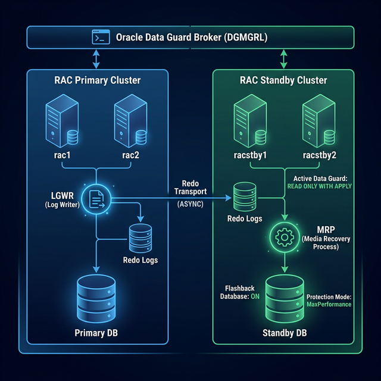

# FASE 3: Preparazione e Creazione Oracle RAC Standby (tramite RMAN Duplicate)

> Questa fase copre la preparazione dei nodi standby (`racstby1`, `racstby2`) e la creazione del database standby fisico usando RMAN Duplicate from Active Database.

> 🛑 **PRIMA DI CONTINUARE: CONNETTITI VIA MOBAXTERM!**
> Questa fase, come la Fase 2, richiede uso continuo di shell + GUI Oracle (`gridSetup.sh`, `runInstaller`) e copia/incolla preciso dei comandi.
>
> **Tabella IP di Riferimento (Rete Pubblica):**
> - `rac1`: 192.168.56.101
> - `rac2`: 192.168.56.102
> - `racstby1`: 192.168.56.111
> - `racstby2`: 192.168.56.112

### 📸 Riferimenti Visivi



### Cosa Succede in Questa Fase

```
  PRIMA                                           DOPO
  ═════                                           ════

┌─────────────┐                          ┌─────────────┐
│ RAC PRIMARY │                          │ RAC PRIMARY │
│   RACDB     │                          │   RACDB     │
│ ┌────┐┌────┐│                          │ ┌────┐┌────┐│
│ │DB1 ││DB2 ││                          │ │DB1 ││DB2 ││
│ └────┘└────┘│                          │ └────┘└────┘│
│ rac1  rac2  │                          │ rac1  rac2  │
└─────────────┘                          └──────┬──────┘
                                                │ Redo Shipping
                                                │ (LGWR ASYNC)
┌─────────────┐                                 ▼
│ RAC STANDBY │   RMAN Duplicate     ┌──────────────────┐
│  (vuoto)    │  ═══════════════►    │ RAC STANDBY      │
│ Grid + SW   │   Copia DB via       │ RACDB_STBY       │
│ NO database │   rete in tempo      │ ┌────┐ ┌────┐   │
│ racstby1/2  │   reale!             │ │DB1 │ │DB2 │   │
└─────────────┘                      │ └────┘ └────┘   │
                                     │ in tempo reale   │
                                     └──────────────────┘
```

### Ordine di Installazione in Questa Fase (stile Fase 2)

```text
Passo 1:  Golden Image clone standby        ━━━━━━━━━━━━━━━━━━━▶ racstby1/racstby2 pronti
Passo 2:  Rete + hostname + fix systemd     ━━━━━━━━━━━━━━━━━━━▶ nodi stabili e raggiungibili
Passo 3:  ASM dischi standby                ━━━━━━━━━━━━━━━━━━━▶ CRS/DATA/RECO visibili
Passo 4:  Grid Infrastructure standby       ━━━━━━━━━━━━━━━━━━━▶ cluster standby online
Passo 5:  Patch Grid RU                     ━━━━━━━━━━━━━━━━━━━▶ allineamento con primario
Passo 6:  DB Home Software Only             ━━━━━━━━━━━━━━━━━━━▶ motore DB installato
Passo 7:  Patch DB Home RU + OJVM           ━━━━━━━━━━━━━━━━━━━▶ home standby allineata
Passo 8:  Config DG network/listener/TNS    ━━━━━━━━━━━━━━━━━━━▶ connettivita primaria-standby
Passo 9:  RMAN Duplicate Active Database    ━━━━━━━━━━━━━━━━━━━▶ RACDB_STBY creato
Passo 10: OCR registration + MRP apply      ━━━━━━━━━━━━━━━━━━━▶ standby sincronizzato
```

### Percorso da seguire in pratica

1. **Percorso consigliato (default):** esegui la sezione `3.0B` (Golden Image) e poi continua da `3.1`.
2. **Percorso alternativo:** usa `3.0A` solo se lo standby era già stato preparato in Fase 2 e devi fare solo smoke-check.

---

## 3.0A Percorso Alternativo: Se hai già preparato lo Standby in Fase 2

Se durante la Fase 2 hai già installato anche su `racstby1`/`racstby2`:

- Grid Infrastructure
- disk group `+DATA` e `+RECO`
- DB Home software only (senza DBCA)
- patch RU/OJVM su Grid e DB Home

allora **non rifare** la sezione 3.0B. Esegui solo questo smoke-check e poi vai direttamente a `3.2`.

```bash
# Come grid su racstby1
crsctl check cluster -all
olsnodes -n
asmcmd lsdg

# Verifica patch Grid su entrambi i nodi
export ORACLE_HOME=/u01/app/19.0.0/grid
$ORACLE_HOME/OPatch/opatch lspatches
ssh racstby2 "export ORACLE_HOME=/u01/app/19.0.0/grid; \$ORACLE_HOME/OPatch/opatch lspatches"

# Verifica patch DB Home su entrambi i nodi
export ORACLE_HOME=/u01/app/oracle/product/19.0.0/dbhome_1
$ORACLE_HOME/OPatch/opatch lspatches
ssh racstby2 "export ORACLE_HOME=/u01/app/oracle/product/19.0.0/dbhome_1; \$ORACLE_HOME/OPatch/opatch lspatches"

# Verifica che NON esista un database standby gia creato
srvctl config database -d RACDB_STBY
# Se non esiste ancora, e normale in questa fase.
```

---

## 3.0B Percorso Consigliato (Default): Creazione Macchine Standby da Golden Image

Questo è il percorso principale della Fase 3. Prima di poter configurare Data Guard, devi **costruire fisicamente** il cluster Standby. Come spiegato in Fase 0, **non re-installare Linux da zero**. Usa `rac1` (esattamente allo stato post-Fase 1, prima di installare Grid) come tua **Golden Image**.

### Step 1: Clona le Macchine dalla Golden Image
1. Assicurati che `rac1` sia spento.
2. Apri **VirtualBox Manager**, fai clic sulla VM `rac1`, vai nella sezione "Istantanee" (Snapshots), seleziona `SNAP-04_Prerequisiti_Cloni_Pronti` e clicca su **Clona**. *(Devi partire da questo esatto snapshot, NON dallo stato attuale o da snapshot successivi!)*
3. Nome: `racstby1` -> Seleziona **Genera nuovi indirizzi MAC** -> Clonazione completa.
4. Ripeti l'operazione per creare `racstby2` (clonando sempre da `rac1`).
5. Assegna a `racstby1` e `racstby2` i 5 dischi condivisi fittizi creati per lo standby (`asm-stby-crs1`, `asm-stby-crs2`, ecc.).

### Step 2: Modifica IP e Hostname
Accendi **UNA VM ALLA VOLTA** (dalla console nera di VirtualBox, non usare MobaXterm ancora) ed esegui queste modifiche:

**Su `racstby1`:**
- `hostnamectl set-hostname racstby1.localdomain`
- Lancia `nmtui` e cambia Scheda Pubblica a **`192.168.56.111`**
- Lancia `nmtui` e cambia Scheda Privata (Interconnect) a **`192.168.2.111`** (Attenzione, rete 2.x!)
- Riavvia (`reboot`)

**Su `racstby2`:**
- `hostnamectl set-hostname racstby2.localdomain`
- Lancia `nmtui` e cambia Scheda Pubblica a **`192.168.56.112`**
- Lancia `nmtui` e cambia Scheda Privata (Interconnect) a **`192.168.2.112`**
- Riavvia (`reboot`)

> Se in `nmtui` non vedi il profilo `enp0s9` (oppure `nmcli ... | grep ':enp0s9'` non restituisce nulla), crea il profilo manualmente:
```bash
# racstby1
nmcli con add type ethernet ifname enp0s9 con-name stby-interconnect \
  ipv4.method manual ipv4.addresses 192.168.2.111/24 \
  ipv4.never-default yes ipv6.method ignore connection.autoconnect yes
nmcli con up stby-interconnect

# racstby2
nmcli con add type ethernet ifname enp0s9 con-name stby-interconnect \
  ipv4.method manual ipv4.addresses 192.168.2.112/24 \
  ipv4.never-default yes ipv6.method ignore connection.autoconnect yes
nmcli con up stby-interconnect

# verifica
ip -4 addr show enp0s9
```

### Step 2b: Applicare il Fix Systemd (CRITICO!)
Anche se le VM sono clonate, è bene assicurarsi che il fix per il bug IPC di Oracle Linux 7 sia applicato. Fallo su **entrambi** i nodi standby come `root`:
```bash
echo "RemoveIPC=no" >> /etc/systemd/logind.conf
systemctl restart systemd-logind
```

### Step 3: Inizializzazione Dischi ASM per lo Standby (SOLO su `racstby1`)
I 5 nuovi dischi che hai assegnato in VirtualBox sono "vergini". Devi partizionarli e renderli dischi ASMLib, esattamente come hai fatto in Fase 0 e Fase 2 per il primario.

1. **Partizionamento base:** Usa MobaXterm collegandoti a `racstby1` come `root`.
   Esegui `fdisk` per `/dev/sdc`, `/dev/sdd`, `/dev/sde`, `/dev/sdf`, `/dev/sdg`.
   La sequenza per ognuno è sempre: `n`, `p`, `1`, `Invio`, `Invio`, `w`.
   Infine lancia `partprobe`.

2. **Creazione Dischi ASM (Sempre su `racstby1` come `root`):**
   ```bash
   oracleasm createdisk CRS1 /dev/sdc1
   oracleasm createdisk CRS2 /dev/sdd1
   oracleasm createdisk CRS3 /dev/sde1
   oracleasm createdisk DATA /dev/sdf1
   oracleasm createdisk RECO /dev/sdg1
   
   oracleasm scandisks
   oracleasm listdisks
   ```

3. **Verifica su `racstby2` (come `root`):**
   ```bash
   oracleasm scandisks
   oracleasm listdisks
   ```
   *Se vedi i 5 dischi anche qui, lo storage condiviso dello standby è pronto!*

### Step 4: Installazione e Patching Grid e Database (Fase 2 Adattata per Standby)

Ora che i nodi standby esistono, la rete funziona e i dischi ASMLib sono pronti, dobbiamo ricreare l'infrastruttura Oracle. **Eseguiamo ESATTAMENTE i passaggi robusti che abbiamo usato sul primario**, adattando i nomi per lo standby.

#### 4.1 Preparazione Binari e Prerequisiti
1. **Scompatta Grid (`racstby1`)**:
   ```bash
   su - grid
   unzip -q /tmp/LINUX.X64_193000_grid_home.zip -d /u01/app/19.0.0/grid
   ```
2. **Setup CVU Disk (`racstby1` e `racstby2` come root)**:
   ```bash
   # racstby1
   rpm -ivh /u01/app/19.0.0/grid/cv/rpm/cvuqdisk-1.0.10-1.rpm
   scp /u01/app/19.0.0/grid/cv/rpm/cvuqdisk-1.0.10-1.rpm root@racstby2:/tmp/
   # racstby2
   ssh racstby2 "rpm -ivh /tmp/cvuqdisk-1.0.10-1.rpm"
   ```
3. **Pointers Inventory (`racstby1` e `racstby2` come root)**:
   ```bash
   # 1. Crea il file pointer che dice a Oracle dove sta l'Inventory
   cat > /etc/oraInst.loc <<'EOF'
   inventory_loc=/u01/app/oraInventory
   inst_group=oinstall
   EOF

   # 2. Permessi corretti sul file
   chown root:oinstall /etc/oraInst.loc
   chmod 644 /etc/oraInst.loc

   # 3. Crea la directory dell'Inventory (se non esiste già)
   mkdir -p /u01/app/oraInventory
   chown grid:oinstall /u01/app/oraInventory
   chmod 775 /u01/app/oraInventory

   # 4. Verifica
   cat /etc/oraInst.loc
   ls -ld /u01/app/oraInventory
   ```
4. **Pulizia Reti Fantasma (`racstby1` e `racstby2` come root)**:
   ```bash
```bash
# ============================================================
# 1. ELIMINA virbr0 (bridge di libvirt/KVM — non serve a RAC)
# ============================================================
# virbr0 è creato dal demone libvirtd, che serve per gestire
# macchine virtuali KVM *dentro* la VM stessa.
# Nel nostro lab non faremo mai VM-in-VM, quindi lo disabilitiamo.

# Esegui su entrambi i nodi per non far fallire cluvfy
   # 1) Libvirt/virbr0: se non esiste e' gia OK
   systemctl disable --now libvirtd 2>/dev/null || true
   if ip link show virbr0 >/dev/null 2>&1; then
     ip link set virbr0 down
     brctl delbr virbr0 2>/dev/null || true
   else
     echo "virbr0 non presente: OK (nessuna azione)"
   fi

# Verifica: virbr0 non deve più comparire
ip addr show virbr0 2>&1
# Deve dire: "Device virbr0 does not exist."

# ============================================================
# 2. DISABILITA IPv6 SULLA NAT (enp0s3)
# ============================================================
# L'IPv6 auto-configurato sulla NAT di VirtualBox genera indirizzi
# IPv6 diversi su ogni VM, ma NON sono raggiungibili tra di loro
# perché la NAT è isolata. Cluvfy prova a fare ping IPv6 e fallisce.
echo "net.ipv6.conf.enp0s3.disable_ipv6 = 1" >> /etc/sysctl.conf
sysctl -p

# Verifica: enp0s3 non deve più mostrare indirizzi "inet6"
ip -6 addr show enp0s3
# Deve essere vuoto o mostrare solo link-local

# ============================================================
# (OPZIONALE) NOTA SULL'INTERFACCIA NAT (enp0s3)
# ============================================================
# L'interfaccia enp0s3 (10.0.2.15) serve per dare internet alla
# VM (download pacchetti, yum update). NON la disabilitiamo
# perché ci serve, ma cluvfy darà comunque un WARNING perché
# entrambe le VM hanno lo stesso IP 10.0.2.15 sulla NAT.
# Questo WARNING è HARMLESS: Oracle non userà mai questa rete.

   sysctl --system | grep -E "enp0s3.disable_ipv6|Applying"

   # 3) Verifica rete cluster
   ip -4 addr show enp0s8
   ip -4 addr show enp0s9
   ip -6 addr show enp0s3
   ```
   > Se `enp0s9` non mostra un IPv4 (`192.168.2.111` su `racstby1`, `192.168.2.112` su `racstby2`), configura subito l'interconnect con `nmtui` prima di proseguire con `cluvfy`.

#### 4.1b Pre-check cluvfy (stesso standard della Fase 2)

```bash
# Su racstby1 come grid
export ORACLE_HOME=/u01/app/19.0.0/grid
$ORACLE_HOME/runcluvfy.sh stage -pre crsinst -n racstby1,racstby2 -verbose
```

Risolvi eventuali `FAILED` bloccanti prima di avviare `gridSetup.sh`. I warning noti su NAT (`enp0s3`) possono essere ignorati se hai gia impostato correttamente la rete pubblica/interconnect.

#### 4.2 Installazione Grid Infrastructure (GUI)

Avvia `gridSetup.sh` su `racstby1` (come `grid`, via MobaXterm con X11). Segui i passi, prestando attenzione a queste **differenze fondamentali** per lo standby:

| Parametro Installer | Valore per lo Standby |
|---|---|
| Cluster Name | `racstby-cluster` |
| SCAN Name | `racstby-scan.localdomain` |
| Nodo 1 | `racstby1.localdomain` / VIP: `racstby1-vip.localdomain` |
| Nodo 2 | `racstby2.localdomain` / VIP: `racstby2-vip.localdomain` |

> ⚠️ **Allo Step 5 (Network Interface Usage)**, usa la stessa configurazione: `enp0s8` (Pubblica), `enp0s9` (ASM & Private - 192.168.2.0), `enp0s3` (Do Not Use).
>
> 🛑 **Allo Step 8 (ASM Disk Group 'CRS') RICORDA IL WORKAROUND ASMLIB:**
> Cambia il Discovery Path in `/dev/oracleasm/disks/*`. Seleziona SOLO `CRS1`, `CRS2`, `CRS3`.

Procedi fino in fondo, ignora i warning su IP Duplicato (`enp0s3`) e RAM.  
Esegui gli script **COME ROOT** su `racstby1` (`orainstRoot.sh`, poi `root.sh`), e attendi la fine prima di farli su `racstby2`.

Verifica immediata post-installazione:

```bash
# Come grid su racstby1
crsctl check cluster -all
olsnodes -n
asmcmd lsdg
```

#### 4.3 Creazione Disk Group DATA e RECO (Standby)
Dopo che il cluster è online, crea i disk group per lo standby via `asmca` o SQL:
```sql
-- Su racstby1 come grid (sqlplus / as sysasm)
CREATE DISKGROUP DATA EXTERNAL REDUNDANCY DISK '/dev/oracleasm/disks/DATA' ATTRIBUTE 'compatible.asm'='19.0', 'compatible.rdbms'='19.0';
CREATE DISKGROUP RECO EXTERNAL REDUNDANCY DISK '/dev/oracleasm/disks/RECO' ATTRIBUTE 'compatible.asm'='19.0', 'compatible.rdbms'='19.0';
```
> **NOTA BENE**: I disk group si chiamano ESATTAMENTE come sul primario (`+DATA`, `+RECO`). Questo è fondamentale per l'RMAN Duplicate!

#### 4.4 Patching Grid Infrastructure (Combo Patch) sullo Standby

> [!IMPORTANT]
> **ORDINE DELLE OPERAZIONI**: Devi aggiornare l'utility OPatch **PRIMA** di lanciare `opatchauto apply`. Se provi ad applicare la RU di Gennaio 2026 con un OPatch vecchio (versione < 12.2.0.1.48), l'operazione fallirà.

Applica subito la stessa Combo Patch (RU + OJVM) scaricata per il primario.

1. **Aggiorna OPatch (su `racstby1` e `racstby2` come root):**
   ```bash
   # racstby1
   su - root
   mv /u01/app/19.0.0/grid/OPatch /u01/app/19.0.0/grid/OPatch.bkp
   unzip -q /tmp/p6880880_190000_Linux-x86-64.zip -d /u01/app/19.0.0/grid/
   chown -R grid:oinstall /u01/app/19.0.0/grid/OPatch
   
   # racstby2
   ssh racstby2 "mv /u01/app/19.0.0/grid/OPatch /u01/app/19.0.0/grid/OPatch.bkp && unzip -q /tmp/p6880880_190000_Linux-x86-64.zip -d /u01/app/19.0.0/grid/ && chown -R grid:oinstall /u01/app/19.0.0/grid/OPatch"
   ```

2. **Scompatta Combo Patch, fai analyze e poi apply (come root):**
   ```bash
   # racstby1
   mkdir -p /u01/app/patch
   cd /u01/app/patch
   unzip -q /tmp/p38658588_190000_Linux-x86-64.zip
   chown -R grid:oinstall /u01/app/patch
    
   # Identifica l'ID della RU dentro la Combo (es. 38629535)
   cd /u01/app/patch/38658588/38629535
   export ORACLE_HOME=/u01/app/19.0.0/grid
   $ORACLE_HOME/OPatch/opatchauto analyze /u01/app/patch/38658588/38629535 -oh $ORACLE_HOME
   $ORACLE_HOME/OPatch/opatchauto apply /u01/app/patch/38658588/38629535 -oh $ORACLE_HOME
     
   # racstby2
   ssh racstby2 "mkdir -p /u01/app/patch && cd /u01/app/patch && unzip -q /tmp/p38658588_190000_Linux-x86-64.zip && chown -R grid:oinstall /u01/app/patch"
   ssh racstby2 "cd /u01/app/patch/38658588/38629535; export ORACLE_HOME=/u01/app/19.0.0/grid; \$ORACLE_HOME/OPatch/opatchauto analyze /u01/app/patch/38658588/38629535 -oh \$ORACLE_HOME"
   ssh racstby2 "cd /u01/app/patch/38658588/38629535; export ORACLE_HOME=/u01/app/19.0.0/grid; \$ORACLE_HOME/OPatch/opatchauto apply /u01/app/patch/38658588/38629535 -oh \$ORACLE_HOME"

   # Verifica patch Grid
   export ORACLE_HOME=/u01/app/19.0.0/grid
   $ORACLE_HOME/OPatch/opatch lspatches
   ssh racstby2 "export ORACLE_HOME=/u01/app/19.0.0/grid; \$ORACLE_HOME/OPatch/opatch lspatches"
   ```

#### 4.5 Installazione Software Database (Software Only)
```bash
# Scompatta su racstby1 come oracle
su - oracle
unzip -q /tmp/LINUX.X64_193000_db_home.zip -d $ORACLE_HOME

# Avvia l'installer (MobaXterm)
cd $ORACLE_HOME && ./runInstaller
```
Seleziona **Set Up Software Only** → **Oracle RAC database installation** (seleziona `racstby1` e `racstby2`) → **Enterprise Edition**.
Ignora gli script root automatici. Alla fine, esegui il `root.sh` proposto su `racstby1` e poi su `racstby2`.
**⚠️ NON USARE DBCA! NON CREARE IL DATABASE!** Ci serve solo il software (motore spento) perché i dati li cloneremo via rete.

#### 4.6 Patching Database Home (Combo Patch) sullo Standby

> [!IMPORTANT]
> **ORDINE DELLE OPERAZIONI**: Anche per la DB Home, devi aggiornare OPatch alla versione **12.2.0.1.48** (o superiore) prima di applicare la combo patch.

1. **Aggiorna OPatch DB Home (su `racstby1` e `racstby2` come root):**
   ```bash
   # racstby1
   su - root
   mv /u01/app/oracle/product/19.0.0/dbhome_1/OPatch /u01/app/oracle/product/19.0.0/dbhome_1/OPatch.bkp
   unzip -q /tmp/p6880880_190000_Linux-x86-64.zip -d /u01/app/oracle/product/19.0.0/dbhome_1/
   chown -R oracle:oinstall /u01/app/oracle/product/19.0.0/dbhome_1/OPatch
   
   # racstby2
   ssh racstby2 "mv /u01/app/oracle/product/19.0.0/dbhome_1/OPatch /u01/app/oracle/product/19.0.0/dbhome_1/OPatch.bkp && unzip -q /tmp/p6880880_190000_Linux-x86-64.zip -d /u01/app/oracle/product/19.0.0/dbhome_1/ && chown -R oracle:oinstall /u01/app/oracle/product/19.0.0/dbhome_1/OPatch"
   ```

2. **Applica RU alla DB Home (come root):**
   ```bash
   # racstby1
   chown -R oracle:oinstall /u01/app/patch
   export ORACLE_HOME=/u01/app/oracle/product/19.0.0/dbhome_1
   $ORACLE_HOME/OPatch/opatchauto analyze /u01/app/patch/38658588/38629535 -oh $ORACLE_HOME
   $ORACLE_HOME/OPatch/opatchauto apply /u01/app/patch/38658588/38629535 -oh $ORACLE_HOME
   
   # racstby2
   ssh racstby2 "chown -R oracle:oinstall /u01/app/patch"
   ssh racstby2 "export ORACLE_HOME=/u01/app/oracle/product/19.0.0/dbhome_1; \$ORACLE_HOME/OPatch/opatchauto analyze /u01/app/patch/38658588/38629535 -oh \$ORACLE_HOME"
   ssh racstby2 "export ORACLE_HOME=/u01/app/oracle/product/19.0.0/dbhome_1; \$ORACLE_HOME/OPatch/opatchauto apply /u01/app/patch/38658588/38629535 -oh \$ORACLE_HOME"
   ```

3. **Applica Patch OJVM alla DB Home (come utente oracle):**
   ```bash
   # La Combo Patch è già scompattata in /u01/app/patch, usa l'ID OJVM (es. 38523609)
   # Come oracle su racstby1
   su - oracle
   cd /u01/app/patch/38658588/38523609
   $ORACLE_HOME/OPatch/opatch apply
   
   # Ripeti come oracle su racstby2
   ssh racstby2 "cd /u01/app/patch/38658588/38523609; \$ORACLE_HOME/OPatch/opatch apply -silent"
   ```

   Verifica patch DB Home su entrambi i nodi:
   ```bash
   export ORACLE_HOME=/u01/app/oracle/product/19.0.0/dbhome_1
   $ORACLE_HOME/OPatch/opatch lspatches
   ssh racstby2 "export ORACLE_HOME=/u01/app/oracle/product/19.0.0/dbhome_1; \$ORACLE_HOME/OPatch/opatch lspatches"
   ```

4. **Pulizia Patch (come root):**
   ```bash
   su - root
   rm -rf /u01/app/patch/*
   rm -f /tmp/p*.zip
   ssh racstby2 "rm -rf /u01/app/patch/* && rm -f /tmp/p*.zip"
   ```

A questo punto, l'infrastruttura Standby (motore Grid + RDBMS patchato) è identica al cluster Primario. Siamo pronti a connettere il database.

> Nota importante: in questa fase standby **non** devi eseguire `DBCA` e **non** devi eseguire `datapatch` sullo standby. Il dictionary patchato arrivera dal primario tramite redo dopo il duplicate.

---

## 3.1 Prerequisiti sui Nodi Standby

Per verificare di essere pronto per proseguire con Data Guard, fai questa check-list sui nodi standby:
- ✅ **Fase 1 completa** tramite clonazione (OS, DNS, utenti, SSH) su `racstby1` e `racstby2`.
- ✅ **Grid Infrastructure installata** (allineata ai passi Fase 2: 2.3-2.7) su `racstby1` e `racstby2`.
- ✅ **Patch Grid RU/OJVM applicate** (allineamento Fase 2: 2.8) e verificabili con `opatch lspatches`.
- ✅ **Software Database installato** (allineamento Fase 2: 2.9, solo Software Only, nessun DBCA).
- ✅ **Patch DB Home RU/OJVM applicate** (allineamento Fase 2: 2.11) e verificabili con `opatch lspatches`.
- ✅ I Disk Group **DATA** e **RECO** esistono sullo standby con gli stessi nomi del primario e discovery path `/dev/oracleasm/disks/*`.
- ✅ Nessun database standby creato via DBCA; verrà creato solo via RMAN Duplicate.

> **Perché stessi nomi dei Disk Group?** RMAN Duplicate cerca i disk group per nome. Se sul primario i datafile sono in `+DATA` e sullo standby non esiste `+DATA`, il duplicate fallisce.

---

## 3.2 Configurazione Listener Statico sul Primario

Il Listener dinamico (registrato da PMON) non è sufficiente per Data Guard. Dobbiamo aggiungere un'entry **statica** perché il database standby deve potersi connettere anche quando l'istanza primaria non è completamente aperta.

### Sul Primario (`rac1`, come utente `grid`)

```bash
su - grid
vi $ORACLE_HOME/network/admin/listener.ora
```

Aggiungi alla fine:

```
SID_LIST_LISTENER =
  (SID_LIST =
    (SID_DESC =
      (GLOBAL_DBNAME = RACDB_DGMGRL)
      (ORACLE_HOME = /u01/app/oracle/product/19.0.0/dbhome_1)
      (SID_NAME = RACDB1)
    )
    (SID_DESC =
      (GLOBAL_DBNAME = RACDB)
      (ORACLE_HOME = /u01/app/oracle/product/19.0.0/dbhome_1)
      (SID_NAME = RACDB1)
    )
  )
```

Fai lo stesso su `rac2` cambiando `SID_NAME = RACDB2`.

```bash
# Riavvia il listener
srvctl stop listener
srvctl start listener

# Verifica
lsnrctl status
# Deve mostrare le entry statiche
```

> **Perché il Listener Statico?** Quando il database è in mount (non aperto), il servizio PMON non fa la registrazione dinamica con il listener. Ma Data Guard ha bisogno di connettersi al database in mount per applicare i redo. Il listener statico risolve questo problema.

---

## 3.3 Configurazione Listener Statico sullo Standby

### Su `racstby1` (come utente `grid`)

```bash
su - grid
vi $ORACLE_HOME/network/admin/listener.ora
```

Aggiungi:

```
SID_LIST_LISTENER =
  (SID_LIST =
    (SID_DESC =
      (GLOBAL_DBNAME = RACDB_STBY_DGMGRL)
      (ORACLE_HOME = /u01/app/oracle/product/19.0.0/dbhome_1)
      (SID_NAME = RACDB1)
    )
    (SID_DESC =
      (GLOBAL_DBNAME = RACDB_STBY)
      (ORACLE_HOME = /u01/app/oracle/product/19.0.0/dbhome_1)
      (SID_NAME = RACDB1)
    )
  )
```

Stesso su `racstby2` con `SID_NAME = RACDB2`.

```bash
srvctl stop listener
srvctl start listener
```

---

## 3.4 Configurazione TNS Names

Il file `tnsnames.ora` deve essere identico su **TUTTI** i nodi (primario e standby).

### Sul Primario e Standby (`$ORACLE_HOME/network/admin/tnsnames.ora`, come utente `oracle`)

```bash
su - oracle
cat > $ORACLE_HOME/network/admin/tnsnames.ora <<'EOF'
RACDB =
  (DESCRIPTION =
    (ADDRESS = (PROTOCOL = TCP)(HOST = rac-scan.localdomain)(PORT = 1521))
    (CONNECT_DATA =
      (SERVER = DEDICATED)
      (SERVICE_NAME = RACDB)
    )
  )

RACDB_STBY =
  (DESCRIPTION =
    (ADDRESS = (PROTOCOL = TCP)(HOST = racstby-scan.localdomain)(PORT = 1521))
    (CONNECT_DATA =
      (SERVER = DEDICATED)
      (SERVICE_NAME = RACDB_STBY)
      (UR=A)
    )
  )

RACDB1 =
  (DESCRIPTION =
    (ADDRESS = (PROTOCOL = TCP)(HOST = rac1.localdomain)(PORT = 1521))
    (CONNECT_DATA =
      (SERVER = DEDICATED)
      (SID = RACDB1)
    )
  )

RACDB2 =
  (DESCRIPTION =
    (ADDRESS = (PROTOCOL = TCP)(HOST = rac2.localdomain)(PORT = 1521))
    (CONNECT_DATA =
      (SERVER = DEDICATED)
      (SID = RACDB2)
    )
  )

RACDB1_STBY =
  (DESCRIPTION =
    (ADDRESS = (PROTOCOL = TCP)(HOST = racstby1.localdomain)(PORT = 1521))
    (CONNECT_DATA =
      (SERVER = DEDICATED)
      (SID = RACDB1)
      (UR=A)
    )
  )

RACDB2_STBY =
  (DESCRIPTION =
    (ADDRESS = (PROTOCOL = TCP)(HOST = racstby2.localdomain)(PORT = 1521))
    (CONNECT_DATA =
      (SERVER = DEDICATED)
      (SID = RACDB2)
      (UR=A)
    )
  )
EOF
```

> **Perché tnsnames.ora identico ovunque?** Data Guard usa questi alias TNS per comunicare tra primario e standby. Se manca un'entry su un nodo, il redo shipping fallisce.

> **Cos'è `(UR=A)`?** "Use Role = Any" — permette la connessione anche quando il database è in stato NOMOUNT o MOUNT (non solo OPEN). Essenziale per lo standby che non è mai in READ WRITE. Senza `UR=A`, `tnsping` funziona ma `sqlplus sys@RACDB_STBY as sysdba` fallisce con timeout.

### Test Connettività TNS

```bash
# Da rac1 verso lo standby
tnsping RACDB1_STBY
tnsping RACDB_STBY

# Da racstby1 verso il primario
tnsping RACDB1
tnsping RACDB
```

---

## 3.5 Configurazione del Primario per Data Guard

```sql
-- Connettiti al primario come sysdba
sqlplus / as sysdba

-- 1. Verifica Force Logging (già fatto in Fase 2)
SELECT force_logging FROM v$database;

-- 2. Configura Standby Redo Logs
-- Regola: N. di Standby Redo Log Groups = (N. Online Redo Log Groups + 1) PER THREAD
-- Se hai 3 online redo log groups per thread, crea 4 standby redo log groups per thread

-- Verifica quanti online redo log groups hai
SELECT thread#, group#, bytes/1024/1024 size_mb FROM v$log ORDER BY thread#, group#;

-- Crea Standby Redo Logs (esempio: 3 ORL per thread -> 4 SRL per thread)
-- Thread 1 (rac1)
ALTER DATABASE ADD STANDBY LOGFILE THREAD 1
  GROUP 11 ('+DATA') SIZE 200M,
  GROUP 12 ('+DATA') SIZE 200M,
  GROUP 13 ('+DATA') SIZE 200M,
  GROUP 14 ('+DATA') SIZE 200M;

-- Thread 2 (rac2)
ALTER DATABASE ADD STANDBY LOGFILE THREAD 2
  GROUP 21 ('+DATA') SIZE 200M,
  GROUP 22 ('+DATA') SIZE 200M,
  GROUP 23 ('+DATA') SIZE 200M,
  GROUP 24 ('+DATA') SIZE 200M;

-- Verifica
SELECT group#, thread#, bytes/1024/1024 size_mb, status FROM v$standby_log;
```

> **Perché i Standby Redo Logs?** Quando i redo log arrivano dal primario, lo standby li scrive prima negli Standby Redo Logs e POI li applica. Senza SRL, usa gli archived redo logs, che sono più lenti. La regola "+1" garantisce che ci sia sempre uno SRL disponibile anche durante un log switch.

```sql
-- 3. Imposta i parametri Data Guard
ALTER SYSTEM SET log_archive_config='DG_CONFIG=(RACDB,RACDB_STBY)' SCOPE=BOTH SID='*';

ALTER SYSTEM SET log_archive_dest_1='LOCATION=USE_DB_RECOVERY_FILE_DEST VALID_FOR=(ALL_LOGFILES,ALL_ROLES) DB_UNIQUE_NAME=RACDB' SCOPE=BOTH SID='*';

ALTER SYSTEM SET log_archive_dest_2='SERVICE=RACDB_STBY LGWR ASYNC VALID_FOR=(ONLINE_LOGFILES,PRIMARY_ROLE) DB_UNIQUE_NAME=RACDB_STBY' SCOPE=BOTH SID='*';

ALTER SYSTEM SET log_archive_dest_state_1=ENABLE SCOPE=BOTH SID='*';
ALTER SYSTEM SET log_archive_dest_state_2=ENABLE SCOPE=BOTH SID='*';

ALTER SYSTEM SET fal_server='RACDB_STBY' SCOPE=BOTH SID='*';
ALTER SYSTEM SET fal_client='RACDB' SCOPE=BOTH SID='*';

ALTER SYSTEM SET standby_file_management=AUTO SCOPE=BOTH SID='*';

ALTER SYSTEM SET db_file_name_convert='+DATA/RACDB_STBY/','+DATA/RACDB/' SCOPE=SPFILE SID='*';
ALTER SYSTEM SET log_file_name_convert='+DATA/RACDB_STBY/','+DATA/RACDB/','+FRA/RACDB_STBY/','+FRA/RACDB/' SCOPE=SPFILE SID='*';
```

> **Spiegazione parametri chiave:**
> - `log_archive_dest_2`: Dice al primario "spedisci i redo allo standby tramite LGWR ASYNC". LGWR = Log Writer (più veloce di ARCH). ASYNC = non aspettare la conferma dallo standby (performance migliore, possibile perdita minima di dati).
> - `fal_server/fal_client`: "Fetch Archive Log" — se lo standby scopre un gap nei redo, sa dove andarli a prendere.
> - `standby_file_management=AUTO`: Se crei un tablespace sul primario, lo standby lo crea automaticamente.

### Come Funziona il Redo Shipping

```
PRIMARIO (RACDB)                              STANDBY (RACDB_STBY)
════════════════                              ═════════════════════

Utente fa COMMIT
     │
     ▼
┌──────────┐                                  
│  LGWR    │──── Scrive ───►┌──────────────┐  
│          │                │ Online Redo  │  
│          │                │ Log (locale) │  
│          │                └──────┬───────┘  
│          │                       │          
│          │── Spedisce ──────────────────────►┌──────────────┐
│          │   (ASYNC via rete)               │ Standby Redo │
└──────────┘                                  │ Log (SRL)    │
                                              └──────┬───────┘
                                                     │
                                                     ▼
                                              ┌──────────────┐
                                              │  MRP (Managed│
                                              │  Recovery    │
                                              │  Process)    │
                                              │              │
                                              │  Applica i   │
                                              │  redo ai     │
                                              │  datafile    │
                                              └──────────────┘
```

---

## 3.6 Creazione Password File e Copia

### Se il password file è su ASM (caso più comune in RAC)

```bash
# Sul primario (rac1) come oracle — prima trova il file in ASM
su - oracle
. grid.env
asmcmd
ASMCMD> cd +DATA/RACDB/PASSWORD
ASMCMD> ls
pwdracdb.256.1188432663
ASMCMD> pwcopy pwdracdb.256.1188432663 /tmp/orapwRACDB1
ASMCMD> exit
```

### Se il password file è nel filesystem

```bash
# Sul primario (rac1) come oracle
cd $ORACLE_HOME/dbs
orapwd file=orapwRACDB1 password=<tua_password_sys> entries=10 force=y
```

### Copia sullo standby (IMPORTANTE: nome = orapw<SID>)

```bash
# Il nome del password file DEVE essere orapw<SID>!
# Se il SID è RACDB1 → il file deve chiamarsi orapwRACDB1

scp /tmp/orapwRACDB1 oracle@racstby1:$ORACLE_HOME/dbs/orapwRACDB1
scp /tmp/orapwRACDB1 oracle@racstby2:$ORACLE_HOME/dbs/orapwRACDB2

# Verifica owner e permessi (DEVE essere oracle:oinstall)
ls -la $ORACLE_HOME/dbs/orapw*
# -rw-r----- 1 oracle oinstall 2048 ... orapwRACDB1
```

> **Perché copiare il password file?** Data Guard usa il password file per autenticare la connessione redo transport tra primario e standby. Le password SYS devono essere identiche. Se ricevi `ORA-01017: invalid username/password`, controlla che il nome del file sia `orapw<SID>` e che l'owner sia l'utente oracle.

---

## 3.7 Creazione del PFILE per lo Standby

```bash
# Sul primario come oracle
sqlplus / as sysdba
CREATE PFILE='/tmp/initRACDB_stby.ora' FROM SPFILE;
EXIT;
```

Modifica il pfile per lo standby:

```bash
vi /tmp/initRACDB_stby.ora
```

Modifica questi parametri:

```
*.db_unique_name='RACDB_STBY'
*.fal_server='RACDB'
*.fal_client='RACDB_STBY'
*.log_archive_dest_1='LOCATION=USE_DB_RECOVERY_FILE_DEST VALID_FOR=(ALL_LOGFILES,ALL_ROLES) DB_UNIQUE_NAME=RACDB_STBY'
*.log_archive_dest_2='SERVICE=RACDB LGWR ASYNC VALID_FOR=(ONLINE_LOGFILES,PRIMARY_ROLE) DB_UNIQUE_NAME=RACDB'
RACDB1.instance_number=1
RACDB2.instance_number=2
RACDB1.thread=1
RACDB2.thread=2
RACDB1.undo_tablespace='UNDOTBS1'
RACDB2.undo_tablespace='UNDOTBS2'
*.cluster_database=TRUE
*.remote_listener='racstby-scan.localdomain:1521'
```

Copia sullo standby:

```bash
scp /tmp/initRACDB_stby.ora oracle@racstby1:$ORACLE_HOME/dbs/initRACDB1.ora
```

---

## 3.8 Creazione Cartelle Audit sullo Standby

```bash
# Su racstby1 e racstby2 come oracle
mkdir -p /u01/app/oracle/admin/RACDB_STBY/adump
mkdir -p /u01/app/oracle/admin/RACDB/adump
```

---

## 3.9 Avvio Istanza Standby in NOMOUNT

```bash
# Su racstby1 come oracle
export ORACLE_SID=RACDB1
sqlplus / as sysdba
STARTUP NOMOUNT PFILE='$ORACLE_HOME/dbs/initRACDB1.ora';
EXIT;
```

---

## 3.10 RMAN Duplicate da Active Database

Questa è la magia! RMAN copia il database dal primario allo standby **in tempo reale**, senza bisogno di backup fisici.

> 📸 **SNAPSHOT — "SNAP-07: Standby_Grid_e_OS_Pronti" 🔴 CRITICO**
> L'RMAN Duplicate è l'operazione più delicata. Se fallisce (e succede spesso la prima volta), torni qui e risparmi MOLTO tempo.
> **Fai snapshot su TUTTE le VM (rac1, rac2, racstby1, racstby2)!**
> ```bash
> VBoxManage snapshot "rac1" take "SNAP-07: Standby_Grid_e_OS_Pronti"
> VBoxManage snapshot "rac2" take "SNAP-07: Standby_Grid_e_OS_Pronti"
> VBoxManage snapshot "racstby1" take "SNAP-07: Standby_Grid_e_OS_Pronti"
> VBoxManage snapshot "racstby2" take "SNAP-07: Standby_Grid_e_OS_Pronti"
> ```

```bash
# Da racstby1 come oracle
rman TARGET sys/<password>@RACDB AUXILIARY sys/<password>@RACDB1_STBY
```

> **Per database grandi (>50 GB)**, lancia con `nohup` o in un `screen`/`tmux` per evitare che un timeout SSH interrompa l'operazione:
> ```bash
> nohup rman TARGET sys/<password>@RACDB AUXILIARY sys/<password>@RACDB1_STBY <<EOF > /tmp/duplicate.log 2>&1 &
> DUPLICATE TARGET DATABASE FOR STANDBY FROM ACTIVE DATABASE DORECOVER ...
> EOF
> tail -f /tmp/duplicate.log   # Per monitorare il progresso
> ```

```rman
DUPLICATE TARGET DATABASE
  FOR STANDBY
  FROM ACTIVE DATABASE
  DORECOVER
  SPFILE
    SET db_unique_name='RACDB_STBY'
    SET cluster_database='TRUE'
    SET remote_listener='racstby-scan.localdomain:1521'
    SET fal_server='RACDB'
    SET log_archive_dest_2='SERVICE=RACDB LGWR ASYNC VALID_FOR=(ONLINE_LOGFILES,PRIMARY_ROLE) DB_UNIQUE_NAME=RACDB'
  NOFILENAMECHECK;
```

> **Spiegazione del comando RMAN:**
> - `FOR STANDBY`: Crea un database standby, non un clone.
> - `FROM ACTIVE DATABASE`: Copia i datafile direttamente via rete, senza bisogno di un backup su disco.
> - `DORECOVER`: Applica automaticamente gli archivelog mancanti dopo la copia.
> - `SPFILE SET ...`: Sovrascrive i parametri nel SPFILE dello standby.
> - `NOFILENAMECHECK`: Non verificare che i path dei file siano diversi (utile perché usiamo gli stessi nomi ASM).

L'operazione può richiedere 20-60 minuti a seconda della dimensione del DB.

---

## 3.11 Creazione SPFILE in ASM e Pointer File

Dopo il duplicate, l'SPFILE potrebbe essere nel filesystem locale. Per un RAC, deve stare in ASM (condiviso tra i nodi).

```sql
-- Su racstby1 come sysdba
sqlplus / as sysdba

-- Verifica dove si trova lo SPFILE attuale
SHOW PARAMETER spfile;

-- Se è locale, spostalo in ASM:
CREATE SPFILE='+DATA/RACDB_STBY/PARAMETERFILE/spfileRACDB_STBY.ora'
  FROM PFILE='$ORACLE_HOME/dbs/initRACDB1.ora';

-- Shutdown
SHUTDOWN IMMEDIATE;
```

```bash
# Crea pointer file su racstby1
cd $ORACLE_HOME/dbs
mv initRACDB1.ora initRACDB1.ora.bkp   # Backup del pfile
echo "SPFILE='+DATA/RACDB_STBY/PARAMETERFILE/spfileRACDB_STBY.ora'" > initRACDB1.ora

# Crea pointer file su racstby2
scp initRACDB1.ora oracle@racstby2:$ORACLE_HOME/dbs/initRACDB2.ora

# Verifica
more $ORACLE_HOME/dbs/initRACDB1.ora
# SPFILE='+DATA/RACDB_STBY/PARAMETERFILE/spfileRACDB_STBY.ora'
```

```sql
-- Riavvia e verifica
STARTUP MOUNT;
SHOW PARAMETER spfile;
-- Deve mostrare il path ASM: +DATA/RACDB_STBY/PARAMETERFILE/spfileRACDB_STBY.ora
```

> **Perché SPFILE in ASM?** In un RAC, i parametri devono essere condivisi tra tutti i nodi. Se l'SPFILE è nel filesystem locale di racstby1, racstby2 non lo troverà! Mettendolo in ASM, è accessibile da entrambi i nodi.

---

## 3.12 Registrazione nel Cluster (OCR) e Avvio Secondo Nodo

Dopo il duplicate, devi registrare il database standby nell'Oracle Cluster Registry (OCR) perché il Clusterware possa gestirlo.

```bash
# Su racstby1 come oracle
srvctl add database -d RACDB_STBY \
  -oraclehome $ORACLE_HOME \
  -spfile '+DATA/RACDB_STBY/PARAMETERFILE/spfileRACDB_STBY.ora' \
  -role PHYSICAL_STANDBY \
  -startoption MOUNT

srvctl add instance -d RACDB_STBY -instance RACDB1 -node racstby1
srvctl add instance -d RACDB_STBY -instance RACDB2 -node racstby2

# Copia password file su racstby2
scp $ORACLE_HOME/dbs/orapwRACDB1 oracle@racstby2:$ORACLE_HOME/dbs/orapwRACDB2

# Avvia il database (entrambe le istanze)
srvctl start database -d RACDB_STBY

# Verifica
srvctl status database -d RACDB_STBY -v
# Instance RACDB1 is running on node racstby1...
# Instance RACDB2 is running on node racstby2...

crsctl stat res -t | grep -A2 RACDB_STBY
```

---

## 3.13 Avvio Redo Apply (MRP)

```sql
-- Su racstby1 come sysdba
sqlplus / as sysdba

-- Avvia il Managed Recovery Process (MRP)
ALTER DATABASE RECOVER MANAGED STANDBY DATABASE USING CURRENT LOGFILE DISCONNECT FROM SESSION;

-- Verifica che MRP sia attivo
SELECT process, status, thread#, sequence# FROM v$managed_standby WHERE process = 'MRP0';
-- STATUS deve essere APPLYING_LOG
```

> **Perché `USING CURRENT LOGFILE`?** Questo abilita il **Real-Time Apply**: lo standby applica i redo APPENA arrivano, senza aspettare che l'archivelog sia completo. Il ritardo è tipicamente di pochi secondi.

```sql
-- Comandi utili per gestire MRP
-- Fermare MRP:
ALTER DATABASE RECOVER MANAGED STANDBY DATABASE CANCEL;

-- Verificare MRP a livello OS:
-- ps -ef | grep mrp
```

---

## 3.14 Configura Archivelog Deletion Policy

```bash
# Sullo standby come oracle
rman target /

RMAN> SHOW ARCHIVELOG DELETION POLICY;
# default: NONE

RMAN> CONFIGURE ARCHIVELOG DELETION POLICY TO APPLIED ON ALL STANDBY;

RMAN> SHOW ARCHIVELOG DELETION POLICY;
# CONFIGURE ARCHIVELOG DELETION POLICY TO APPLIED ON ALL STANDBY;
```

> **Perché?** Senza questa policy, gli archivelog si accumulano nella FRA fino a riempirla (ORA-19502). Con questa policy, RMAN elimina automaticamente gli archivelog che sono già stati applicati sullo standby.

---

## 3.15 Verifica Sincronizzazione

```sql
-- Sul PRIMARIO: esegui alcuni log switch per testare
ALTER SYSTEM SWITCH LOGFILE;   -- Thread 1
ALTER SYSTEM SWITCH LOGFILE;

-- Sul PRIMARIO: verifica ultimo sequence archiviato
SELECT thread#, MAX(sequence#) FROM v$archived_log
WHERE archived='YES' GROUP BY thread#;

-- Sullo STANDBY: verifica ultimo sequence applicato
SELECT thread#, MAX(sequence#) FROM v$archived_log
WHERE applied='YES' GROUP BY thread#;

-- I numeri DEVONO corrispondere!
```

---

## 3.16 Troubleshooting Fase 3

| Problema | Causa | Soluzione |
|---|---|---|
| `ORA-01017` su `sqlplus sys@RACDB_STBY` | Password file errato | Verifica nome = `orapw<SID>`, owner = `oracle` |
| `ORA-12528: TNS:listener: all ... blocked` | DB in NOMOUNT senza `UR=A` | Aggiungi `(UR=A)` nel TNS dello standby |
| `ORA-16055: FAL request rejected` | `log_archive_dest` errato | Correggi su ENTRAMBI i lati (vedi sotto) |
| RMAN Duplicate timeout/hang | Rete lenta o sessione SSH caduta | Usa `nohup` o `screen`, verifica rete |
| MRP non parte: `ORA-00270` | FRA piena sullo standby | Pulisci archivelog: `DELETE NOPROMPT ARCHIVELOG ALL COMPLETED BEFORE 'SYSDATE-2';` |
| `v$archive_gap` mostra gap | Archivelog mancante | `ALTER SYSTEM SET fal_server='RACDB' SCOPE=BOTH;` → FAL recupera automaticamente |

### Fix ORA-16055 (Comune!)

```sql
-- Il problema: i parametri log_archive_dest non sono simmetrici.
-- Fix sul PRIMARIO:
ALTER SYSTEM SET LOG_ARCHIVE_DEST_1='LOCATION=USE_DB_RECOVERY_FILE_DEST
  VALID_FOR=(ALL_LOGFILES,ALL_ROLES) DB_UNIQUE_NAME=RACDB' SID='*' SCOPE=BOTH;

ALTER SYSTEM SET LOG_ARCHIVE_DEST_2='SERVICE=RACDB_STBY ASYNC
  VALID_FOR=(ONLINE_LOGFILES,PRIMARY_ROLE) DB_UNIQUE_NAME=RACDB_STBY' SID='*' SCOPE=BOTH;

-- Fix sullo STANDBY:
ALTER SYSTEM SET LOG_ARCHIVE_DEST_1='LOCATION=USE_DB_RECOVERY_FILE_DEST
  VALID_FOR=(ALL_LOGFILES,ALL_ROLES) DB_UNIQUE_NAME=RACDB_STBY' SID='*' SCOPE=BOTH;

ALTER SYSTEM SET LOG_ARCHIVE_DEST_2='SERVICE=RACDB ASYNC
  VALID_FOR=(ONLINE_LOGFILES,PRIMARY_ROLE) DB_UNIQUE_NAME=RACDB' SID='*' SCOPE=BOTH;
```

> **Riferimento**: MOS Doc ID 2988948.1 — "ORA-16055: FAL Request Rejected on primary alert log"

---

## ✅ Checklist Fine Fase 3

```bash
# 1. Standby in mount su entrambi i nodi
srvctl status database -d RACDB_STBY -v

# 2. MRP attivo e APPLYING_LOG
sqlplus -s / as sysdba <<< "SELECT process, status FROM v\$managed_standby WHERE process='MRP0';"

# 3. Nessun gap
sqlplus -s / as sysdba <<< "SELECT * FROM v\$archive_gap;"
# (nessuna riga = tutto OK)

# 4. Sequence primario == standby
# Sul primario:
sqlplus -s / as sysdba <<< "SELECT thread#, max(sequence#) FROM v\$archived_log WHERE archived='YES' GROUP BY thread#;"

# Sullo standby:
sqlplus -s / as sysdba <<< "SELECT thread#, max(sequence#) FROM v\$archived_log WHERE applied='YES' GROUP BY thread#;"

# 5. SPFILE in ASM (non locale!)
SHOW PARAMETER spfile;
# +DATA/RACDB_STBY/PARAMETERFILE/spfileRACDB_STBY.ora

# 6. Archivelog deletion policy configurata
rman target / <<< "SHOW ARCHIVELOG DELETION POLICY;"

# 7. Errori nel alert log?
adrci
SHOW ALERT -tail 30
```

> 📸 **SNAPSHOT — "SNAP-08: RMAN_Duplicate_Finito" ⭐ MILESTONE**
> Lo standby è operativo con MRP attivo e 0 gap! Questo è probabilmente lo snapshot più importante dopo la creazione del primario.
> ```bash
> VBoxManage snapshot "rac1" take "SNAP-08: RMAN_Duplicate_Finito"
> VBoxManage snapshot "rac2" take "SNAP-08: RMAN_Duplicate_Finito"
> VBoxManage snapshot "racstby1" take "SNAP-08: RMAN_Duplicate_Finito"
> VBoxManage snapshot "racstby2" take "SNAP-08: RMAN_Duplicate_Finito"
> ```

---

## 📋 Comandi Data Guard Utili — Riferimento Rapido

```sql
-- Verificare errori DG sul primario
SELECT error FROM v$archive_dest WHERE dest_id = 2;

-- Stato MRP completo sullo standby
SELECT PROCESS, CLIENT_PROCESS, STATUS, THREAD#, SEQUENCE#, BLOCK#, BLOCKS
FROM GV$MANAGED_STANDBY;

-- Ruolo attuale del database
SELECT name, open_mode, database_role, db_unique_name FROM v$database;

-- Parametri DG attuali
SELECT name, value FROM v$parameter
WHERE name IN ('db_name','db_unique_name','log_archive_config',
  'log_archive_dest_1','log_archive_dest_2','fal_server','fal_client',
  'standby_file_management','db_file_name_convert','log_file_name_convert');
```

---

**→ Prossimo: [FASE 4: Configurazione Data Guard e DGMGRL](./GUIDA_FASE4_DATAGUARD_DGMGRL.md)**
