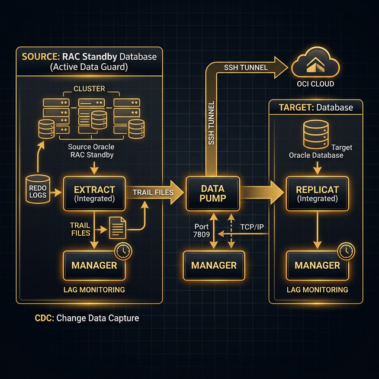

# FASE 5: Configurazione GoldenGate su Standby (Extract) verso Terzo DB (Replicat)

> In questa fase configuriamo Oracle GoldenGate per catturare le modifiche dal database standby (Active Data Guard) e replicarle verso un terzo database target indipendente (`dbtarget`).

### 📸 Flusso GoldenGate



---

## 5.1 Architettura GoldenGate con ADG Standby

L'architettura che implementiamo è chiamata **Downstream Integrated Extract**:

```
┌────────────────┐      Redo Shipping       ┌──────────────────┐
│  RAC PRIMARY   │ ─────────────────────────→│  RAC STANDBY     │
│  (RACDB)       │                           │  (RACDB_STBY)    │
│                │                           │  Active DG       │
└────────────────┘                           │                  │
                                             │  ┌────────────┐  │
                                             │  │ GG Extract │  │     Trails
                                             │  │ (Integrated│──│──────────────→ ┌────────────────────┐
                                             │  │  Capture)  │  │                │  TARGET VMS        │
                                             │  └────────────┘  │                │  ┌───────────────┐ │
                                             └──────────────────┘                │  │ GG Replicat   │ │
                                                                                 │  │ (Oracle dbtar)│ │
                                                                                 │  └───────────────┘ │
                                                                                 │  ┌───────────────┐ │
                                                                                 │  │ GG Replicat   │ │
                                                                                 │  │ (PostgreSQL)  │ │
                                                                                 │  └───────────────┘ │
                                                                                 └────────────────────┘
```

> **Perché estrarre dallo standby e non dal primario?**
> 1. **Zero impatto sul primario**: L'Extract legge i redo log sullo standby, non tocca il primario.
> 2. **Ridondanza**: Se il primario muore, l'Extract continua a lavorare sullo standby (che diventa primario dopo failover).
> 3. **Best practice Oracle**: Consigliato per ambienti mission-critical.

---

## 5.2 Prerequisiti Database

### Sul Primario (RACDB) — Abilitare GoldenGate Replication

```sql
sqlplus / as sysdba

-- Abilita GoldenGate
ALTER SYSTEM SET enable_goldengate_replication=TRUE SCOPE=BOTH SID='*';

-- Abilita supplemental logging minimale
ALTER DATABASE ADD SUPPLEMENTAL LOG DATA;

-- Abilita supplemental logging per le tabelle che vuoi replicare
-- Per TUTTE le tabelle (approccio semplice per lab):
ALTER DATABASE ADD SUPPLEMENTAL LOG DATA (ALL) COLUMNS;

-- Verifica
SELECT supplemental_log_data_min, supplemental_log_data_all FROM v$database;
-- Deve mostrare: YES / YES
```

> **Perché Supplemental Logging?** GoldenGate ha bisogno di informazioni aggiuntive nei redo log per ricostruire correttamente le operazioni DML. Senza supplemental logging, GG non sa quali colonne sono state modificate in un UPDATE.

### Sullo Standby (RACDB_STBY)

```sql
sqlplus / as sysdba

ALTER SYSTEM SET enable_goldengate_replication=TRUE SCOPE=BOTH SID='*';
```

### Sul Target (dbtarget)

```sql
sqlplus / as sysdba

ALTER SYSTEM SET enable_goldengate_replication=TRUE SCOPE=BOTH;
```

---

## 5.3 Creazione Utente GoldenGate

### Sul Primario (replicato automaticamente sullo standby da DG):

```sql
sqlplus / as sysdba

-- Crea utente GoldenGate
CREATE USER ggadmin IDENTIFIED BY <password>
    DEFAULT TABLESPACE USERS
    TEMPORARY TABLESPACE TEMP
    QUOTA UNLIMITED ON USERS;

-- Assegna privilegi necessari
GRANT DBA TO ggadmin;
GRANT SELECT ANY DICTIONARY TO ggadmin;
GRANT SELECT ANY TABLE TO ggadmin;
GRANT CREATE SESSION TO ggadmin;
GRANT ALTER SESSION TO ggadmin;
GRANT RESOURCE TO ggadmin;

-- Privilegi specifici GoldenGate
EXEC DBMS_GOLDENGATE_AUTH.GRANT_ADMIN_PRIVILEGE('GGADMIN');
```

### Sul Target (dbtarget):

```sql
sqlplus / as sysdba

CREATE USER ggadmin IDENTIFIED BY <password>
    DEFAULT TABLESPACE USERS
    TEMPORARY TABLESPACE TEMP
    QUOTA UNLIMITED ON USERS;

GRANT DBA TO ggadmin;
GRANT SELECT ANY DICTIONARY TO ggadmin;
GRANT CREATE SESSION TO ggadmin;
GRANT ALTER SESSION TO ggadmin;
GRANT RESOURCE TO ggadmin;

EXEC DBMS_GOLDENGATE_AUTH.GRANT_ADMIN_PRIVILEGE('GGADMIN');
```

---

## 5.4 Download e Installazione GoldenGate

Scarica Oracle GoldenGate 19c (o 21c) da [Oracle eDelivery](https://edelivery.oracle.com):
- Per lo Standby: **Oracle GoldenGate 19c for Oracle Database on Linux x86-64**
- Per il Target ARM (se OCI ARM): **Oracle GoldenGate for Oracle Database on Linux ARM**

> 📸 **SNAPSHOT — "SNAP-16: Pre-GoldenGate" 🔴 CRITICO**
> Fai snapshot PRIMA di installare GoldenGate. Se GG crea problemi, torni al tuo ambiente DG perfettamente funzionante.
> ```
> VBoxManage snapshot "rac1" take "SNAP-16_Pre_GoldenGate"
> VBoxManage snapshot "rac2" take "SNAP-16_Pre_GoldenGate"
> VBoxManage snapshot "racstby1" take "SNAP-16_Pre_GoldenGate"
> VBoxManage snapshot "racstby2" take "SNAP-16_Pre_GoldenGate"
> VBoxManage snapshot "dbtarget" take "SNAP-16_Pre_GoldenGate"
> ```

### Installazione sullo Standby (`racstby1`)

```bash
# Come root (crea la directory)
mkdir -p /u01/app/goldengate
chown oracle:oinstall /u01/app/goldengate

# Come oracle
su - oracle
cd /u01/app/goldengate

# Scompatta GoldenGate
unzip /tmp/fbo_ggs_Linux_x64_Oracle_shiphome.zip
cd fbo_ggs_Linux_x64_Oracle_shiphome/Disk1

# Lancia l'installer
export DISPLAY=<IP_PC>:0.0
./runInstaller
```

**Installer Steps:**
1. Software Location: `/u01/app/goldengate/ogg`
2. Database Location: Point al tuo ORACLE_HOME
3. Seleziona **Oracle GoldenGate for Oracle Database 19c**

Oppure **installazione silente**:

```bash
cat > /tmp/oggcore.rsp <<'EOF'
oracle.install.responseFileVersion=/oracle/install/rspfmt_ogginstall_response_schema_v19_1_0
INSTALL_OPTION=ORA19c
SOFTWARE_LOCATION=/u01/app/goldengate/ogg
INVENTORY_LOCATION=/u01/app/oraInventory
UNIX_GROUP_NAME=oinstall
EOF

cd fbo_ggs_Linux_x64_Oracle_shiphome/Disk1
./runInstaller -silent -responseFile /tmp/oggcore.rsp
```

### Installazione sul Target (`dbtarget`)

Stessa procedura, ma directory diversa se è una macchina diversa.

```bash
mkdir -p /u01/app/goldengate
chown oracle:oinstall /u01/app/goldengate
# ... stessi passi di scompattazione e installazione
```

---

## 5.5 Configurazione Variabili d'Ambiente GoldenGate

Su ogni macchina dove GG è installato:

```bash
cat >> /home/oracle/.bash_profile <<'EOF'
# GoldenGate Environment
export OGG_HOME=/u01/app/goldengate/ogg
export PATH=$OGG_HOME:$PATH
export LD_LIBRARY_PATH=$OGG_HOME/lib:$ORACLE_HOME/lib:$LD_LIBRARY_PATH
EOF

source /home/oracle/.bash_profile
```

---

## 5.6 Configurazione Manager (su Standby e Target)

Il Manager è il processo "supervisore" di GoldenGate: gestisce tutti gli altri processi.

### Sullo Standby (`racstby1`)

```bash
cd $OGG_HOME
./ggsci
```

```
GGSCI> CREATE SUBDIRS

GGSCI> EDIT PARAMS MGR

-- Inserisci:
PORT 7809
DYNAMICPORTLIST 7810-7820
AUTORESTART EXTRACT *, RETRIES 3, WAITMINUTES 5, RESETMINUTES 60
PURGEOLDEXTRACTS ./dirdat/*, USECHECKPOINTS, MINKEEPHOURS 24
```

> **Spiegazione parametri MGR:**
> - `PORT 7809`: Porta TCP su cui il Manager ascolta.
> - `DYNAMICPORTLIST`: Range di porte per i processi Extract/Pump/Replicat.
> - `AUTORESTART`: Se un Extract crasha, il Manager lo riavvia automaticamente (max 3 tentativi, aspetta 5 minuti tra un tentativo e l'altro).
> - `PURGEOLDEXTRACTS`: Pulisce automaticamente i trail file vecchi.

```
GGSCI> START MGR
GGSCI> INFO MGR
-- Output: Manager is running (port 7809).
```

### Sul Target (`dbtarget`)

```
GGSCI> CREATE SUBDIRS
GGSCI> EDIT PARAMS MGR

PORT 7809
DYNAMICPORTLIST 7810-7820
AUTORESTART REPLICAT *, RETRIES 3, WAITMINUTES 5, RESETMINUTES 60
PURGEOLDEXTRACTS ./dirdat/*, USECHECKPOINTS, MINKEEPHOURS 24

GGSCI> START MGR
```

---

## 5.7 Configurazione Extract (sullo Standby)

L'Extract cattura le modifiche dai redo log. Usiamo **Integrated Capture** che sfrutta il LogMiner interno di Oracle — è il metodo più robusto e supportato.

### Preparazione Database per Integrated Extract

```sql
-- Sullo standby come sysdba
sqlplus / as sysdba

-- Registra lo schema di heartbeat GoldenGate
@$OGG_HOME/admin_setup.sql
-- Quando richiesto:
-- Tablespace for GoldenGate: USERS
-- Temp tablespace: TEMP
```

### Creazione e Configurazione Extract

```bash
cd $OGG_HOME
./ggsci
```

```
-- Login al database
GGSCI> DBLOGIN USERID ggadmin@RACDB_STBY PASSWORD <password>

-- Registra l'Integrated Extract nel database
GGSCI> REGISTER EXTRACT ext_racdb DATABASE

-- Aggiungi l'Extract
GGSCI> ADD EXTRACT ext_racdb, INTEGRATED TRANLOG, BEGIN NOW

-- Aggiungi il Trail locale (dove l'Extract scrive le modifiche catturate)
GGSCI> ADD EXTTRAIL ./dirdat/ea, EXTRACT ext_racdb, MEGABYTES 100
```

> **Perché `INTEGRATED TRANLOG`?** A differenza del Classic Extract che legge direttamente i redo file, l'Integrated Extract usa il LogMiner Server integrato nel database. Questo è più efficiente, supporta più data types, e funziona nativamente con RAC/ADG.

### Creazione Parameter File dell'Extract

```
GGSCI> EDIT PARAMS ext_racdb
```

```
EXTRACT ext_racdb
USERID ggadmin@RACDB_STBY, PASSWORD <password>
EXTTRAIL ./dirdat/ea
LOGALLSUPCOLS
UPDATERECORDFORMAT COMPACT

-- Specifica lo schema e le tabelle da replicare
-- Esempio: replicare tutto lo schema HR
TABLE HR.*;

-- Oppure per tabelle specifiche:
-- TABLE HR.EMPLOYEES;
-- TABLE HR.DEPARTMENTS;
```

> **Spiegazione parametri:**
> - `LOGALLSUPCOLS`: Include tutte le colonne supplemental log nel trail (necessario per conflitti e CDC).
> - `UPDATERECORDFORMAT COMPACT`: Riduce la dimensione dei trail file includendo solo le colonne modificate.
> - `TABLE HR.*`: Cattura tutte le tabelle dello schema HR.

---

## 5.8 Configurazione Data Pump (sullo Standby)

Il Data Pump legge i trail locali e li trasmette via rete al Target.

```
GGSCI> ADD EXTRACT pump_racdb, EXTTRAILSOURCE ./dirdat/ea

GGSCI> ADD RMTTRAIL ./dirdat/ra, EXTRACT pump_racdb, MEGABYTES 100

GGSCI> EDIT PARAMS pump_racdb
```

```
EXTRACT pump_racdb
USERID ggadmin@RACDB_STBY, PASSWORD <password>
RMTHOST dbtarget.localdomain, MGRPORT 7809
RMTTRAIL ./dirdat/ra

TABLE HR.*;
```

> **Perché un Data Pump?** È un livello di indirezione: l'Extract scrive localmente, il Pump trasmette via rete. Se la rete cade, l'Extract non si ferma — il Pump accumula i trail e li spedisce quando la rete torna. Senza Pump, un problema di rete fermerebbe l'Extract.

---

## 5.9 Configurazione Replicat (sul Target)

Il Replicat legge i trail ricevuti dal Pump e applica le modifiche al database target.

```bash
# Sul target (dbtarget)
cd $OGG_HOME
./ggsci
```

```
GGSCI> DBLOGIN USERID ggadmin PASSWORD <password>

-- Aggiungi un checkpoint table
GGSCI> ADD CHECKPOINTTABLE ggadmin.checkpoint

-- Aggiungi il Replicat (Integrated mode)
GGSCI> ADD REPLICAT rep_racdb, INTEGRATED, EXTTRAIL ./dirdat/ra, CHECKPOINTTABLE ggadmin.checkpoint

GGSCI> EDIT PARAMS rep_racdb
```

```
REPLICAT rep_racdb
USERID ggadmin, PASSWORD <password>
ASSUMETARGETDEFS
DISCARDFILE ./dirrpt/rep_racdb.dsc, APPEND, MEGABYTES 50

MAP HR.*, TARGET HR.*;
```

> **Spiegazione parametri:**
> - `ASSUMETARGETDEFS`: Assume che la struttura delle tabelle sul target sia identica al source. Se le tabelle fossero diverse, useresti un file `DEFGEN`.
> - `DISCARDFILE`: Se una transazione non può essere applicata (es. conflitto chiave), viene scritta qui invece di fermare il Replicat.
> - `MAP ... TARGET`: Mappa le tabelle source alle tabelle target. `HR.* -> HR.*` significa "stesse tabelle".

---

## 5.10 Initial Load (Caricamento Iniziale)

Prima di avviare la replica continua, devi caricare i dati esistenti sul target.

### Metodo 1: Oracle Data Pump (Consigliato)

```bash
# Sullo Standby (in ADG Read Only) - esporta
expdp ggadmin/<password>@RACDB_STBY schemas=HR directory=DATA_PUMP_DIR dumpfile=hr_initial.dmp logfile=hr_export.log

# Trasferisci il dump
scp /path/to/hr_initial.dmp oracle@dbtarget:/path/to/

# Sul Target - importa
impdp ggadmin/<password> schemas=HR directory=DATA_PUMP_DIR dumpfile=hr_initial.dmp logfile=hr_import.log
```

### Metodo 2: GoldenGate Initial Load

```
-- Usa un Extract speciale in modalità "SOURCEISTABLE"
GGSCI> ADD EXTRACT initload, SOURCEISTABLE
GGSCI> ADD RMTTRAIL ./dirdat/il, EXTRACT initload
GGSCI> EDIT PARAMS initload

EXTRACT initload
USERID ggadmin@RACDB_STBY, PASSWORD <password>
RMTHOST dbtarget.localdomain, MGRPORT 7809
RMTTRAIL ./dirdat/il
TABLE HR.*;
```

---

## 5.11 Avvio dei Processi

### Sequenza di avvio (ORDINE IMPORTANTE):

```
-- 1. Avvia Manager (su entrambi, se non già attivo)
-- Già fatto in 5.6

-- 2. Avvia l'Extract sullo Standby
GGSCI> START EXTRACT ext_racdb

-- 3. Avvia il Data Pump sullo Standby
GGSCI> START EXTRACT pump_racdb

-- 4. Avvia il Replicat sul Target
-- Sul target:
GGSCI> START REPLICAT rep_racdb
```

### Verifica

```
-- Sullo Standby
GGSCI> INFO ALL

Program     Status      Group       Lag at Chkpt  Time Since Chkpt
MANAGER     RUNNING
EXTRACT     RUNNING     ext_racdb   00:00:02      00:00:05
EXTRACT     RUNNING     pump_racdb  00:00:00      00:00:03

-- Sul Target
GGSCI> INFO ALL

Program     Status      Group       Lag at Chkpt  Time Since Chkpt
MANAGER     RUNNING
REPLICAT    RUNNING     rep_racdb   00:00:03      00:00:04
```

> Se tutti i processi sono `RUNNING` con lag minimo, hai un sistema di replica funzionante! 🎉

> 📸 **SNAPSHOT — "SNAP-17: GoldenGate Running" ⭐ MILESTONE FINALE**
> L'intero ambiente è operativo: RAC + Data Guard + GoldenGate! Questo è il tuo punto di partenza "gold".
> ```
> VBoxManage snapshot "rac1" take "SNAP-17_GG_Running_FINALE"
> VBoxManage snapshot "rac2" take "SNAP-17_GG_Running_FINALE"
> VBoxManage snapshot "racstby1" take "SNAP-17_GG_Running_FINALE"
> VBoxManage snapshot "racstby2" take "SNAP-17_GG_Running_FINALE"
> VBoxManage snapshot "dbtarget" take "SNAP-17_GG_Running_FINALE"
> ```

---

## 5.12 Monitoraggio Continuo

```
-- Statistiche dettagliate dell'Extract
GGSCI> STATS EXTRACT ext_racdb, LATEST

-- Statistiche del Replicat
GGSCI> STATS REPLICAT rep_racdb, LATEST

-- Lag dell'Extract
GGSCI> LAG EXTRACT ext_racdb

-- Report dettagliato
GGSCI> VIEW REPORT ext_racdb
GGSCI> VIEW REPORT rep_racdb
```

---

## ✅ Checklist Fine Fase 5

```
-- Sullo Standby
GGSCI> INFO ALL
-- ext_racdb: RUNNING
-- pump_racdb: RUNNING

-- Sul Target
GGSCI> INFO ALL
-- rep_racdb: RUNNING

-- Lag < 10 secondi
GGSCI> LAG EXTRACT ext_racdb
GGSCI> LAG REPLICAT rep_racdb
```

---

**→ Prossimo: [FASE 6: Test di Verifica](./GUIDA_FASE6_TEST_VERIFICA.md)**

> 🌐 **Variante Cloud**: Se vuoi replicare verso Oracle Cloud Infrastructure (OCI) ARM Free Tier invece del dbtarget locale, consulta la **[GUIDA_CLOUD_GOLDENGATE.md](./GUIDA_CLOUD_GOLDENGATE.md)** — usa SSH tunnel e binari ARM (aarch64).
