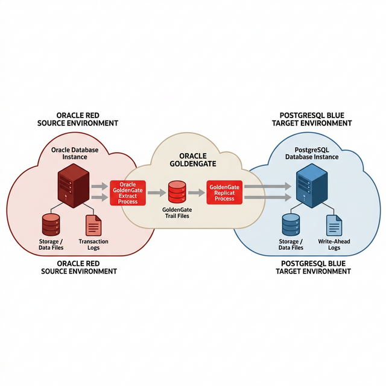

# Migrazione Oracle → PostgreSQL con GoldenGate

> **Obiettivo**: Migrare un database Oracle (dal nostro lab RAC) a PostgreSQL 16 usando Oracle GoldenGate per la replica in tempo reale con zero-downtime.
> **Durata stimata**: 5 giorni (Settimana 6 del piano di studio)

---

## Architettura della Migrazione



```
┌──────────────────────┐                    ┌──────────────────────┐
│   ORACLE RAC (Source) │                    │  POSTGRESQL (Target)  │
│                       │                    │                       │
│  ┌─────────────────┐  │    Trail Files     │  ┌─────────────────┐  │
│  │  RACDB (CDB)    │  │   ════════════►    │  │  app_db (PG 16) │  │
│  │  ├─ PDB1        │  │                    │  │                  │  │
│  │  │  ├─ HR       │  │  ┌───────────┐     │  │  ├─ hr (schema) │  │
│  │  │  └─ APP      │  │  │ GoldenGate│     │  │  └─ app (schema)│  │
│  │  └─ PDB2        │  │  │  Extract  │     │  │                  │  │
│  └─────────────────┘  │  │  Data Pump│     │  └─────────────────┘  │
│                       │  │  Replicat │     │                       │
│  GoldenGate for       │  └───────────┘     │  GoldenGate for       │
│  Oracle (Extract)     │                    │  PostgreSQL (Replicat)│
└──────────────────────┘                    └──────────────────────┘
```

---

## Prerequisiti

| Requisito | Oracle (Source) | PostgreSQL (Target) |
|---|---|---|
| **Versione** | 19c (nostro lab) | 16.x |
| **Archivelog** | Gia attivo (Fase 2) | N/A |
| **Supplemental Logging** | Da abilitare | N/A |
| **GoldenGate** | GG for Oracle 19c/21c | GG for PostgreSQL 21c |
| **ODBC** | N/A | PostgreSQL ODBC driver |
| **Tool DDL** | N/A | `ora2pg` per conversione schema |

---

## FASE 1: Preparazione Oracle (Source)

### 1.1 Abilita Supplemental Logging

GoldenGate necessita del supplemental logging per catturare tutte le colonne modificate:

```sql
-- Come SYSDBA sul database Oracle (su rac1)
sqlplus / as sysdba

-- Abilita supplemental logging a livello database
ALTER DATABASE ADD SUPPLEMENTAL LOG DATA;

-- Abilita per tutte le colonne sulle tabelle da migrare
ALTER TABLE hr.employees ADD SUPPLEMENTAL LOG DATA (ALL) COLUMNS;
ALTER TABLE hr.departments ADD SUPPLEMENTAL LOG DATA (ALL) COLUMNS;
ALTER TABLE hr.jobs ADD SUPPLEMENTAL LOG DATA (ALL) COLUMNS;

-- Verifica
SELECT SUPPLEMENTAL_LOG_DATA_MIN, SUPPLEMENTAL_LOG_DATA_ALL FROM v$database;
-- Deve mostrare YES
```

> **Perche supplemental logging?** Normalmente Oracle registra nel redo log solo le colonne modificate. GoldenGate ha bisogno di TUTTE le colonne (inclusa la chiave primaria) per poter costruire le istruzioni UPDATE/DELETE corrette sul target PostgreSQL.

### 1.2 Crea Utente GoldenGate Oracle

```sql
-- Utente dedicato per GoldenGate
CREATE USER ggadmin IDENTIFIED BY "GGadmin123!"
  DEFAULT TABLESPACE users TEMPORARY TABLESPACE temp;

GRANT DBA TO ggadmin;
GRANT SELECT ANY DICTIONARY TO ggadmin;
GRANT FLASHBACK ANY TABLE TO ggadmin;
GRANT SELECT ANY TABLE TO ggadmin;
GRANT EXECUTE ON DBMS_FLASHBACK TO ggadmin;
```

---

## FASE 2: Installazione PostgreSQL (Target)

### 2.1 Installa PostgreSQL 16

```bash
# Su una VM separata o sulla VM dbtarget (192.168.56.150)
# Per Oracle Linux 7/8:
yum install -y https://download.postgresql.org/pub/repos/yum/reporpms/EL-7-x86_64/pgdg-redhat-repo-latest.noarch.rpm
yum install -y postgresql16-server postgresql16-contrib

# Inizializza e avvia
/usr/pgsql-16/bin/postgresql-16-setup initdb
systemctl enable postgresql-16
systemctl start postgresql-16
```

### 2.2 Configura PostgreSQL per GoldenGate

```bash
# Modifica postgresql.conf
vim /var/lib/pgsql/16/data/postgresql.conf

# Aggiungi/modifica:
wal_level = logical              # CRITICO per GoldenGate
max_replication_slots = 4
max_wal_senders = 4
track_commit_timestamp = on      # Per monitoraggio lag
listen_addresses = '*'           # Accetta connessioni remote

# Modifica pg_hba.conf per accesso remoto
echo "host all ggadmin 192.168.56.0/24 md5" >> /var/lib/pgsql/16/data/pg_hba.conf

# Riavvia
systemctl restart postgresql-16
```

### 2.3 Crea Database e Utente Target

```bash
sudo -u postgres psql

-- Crea utente GoldenGate
CREATE USER ggadmin WITH PASSWORD 'GGadmin123!' REPLICATION;
ALTER USER ggadmin WITH SUPERUSER;

-- Crea database target
CREATE DATABASE app_db OWNER ggadmin;
\c app_db

-- Crea schema target
CREATE SCHEMA hr;
GRANT ALL ON SCHEMA hr TO ggadmin;
```

### 2.4 Converti Schema con ora2pg

```bash
# Installa ora2pg
yum install -y perl-DBI perl-DBD-Pg
# Scarica ora2pg da https://github.com/darold/ora2pg
tar xzf ora2pg-*.tar.gz && cd ora2pg-*
perl Makefile.PL && make && make install

# Configura ora2pg.conf
cat > /etc/ora2pg/ora2pg.conf <<'EOF'
ORACLE_DSN    dbi:Oracle:host=192.168.56.101;sid=RACDB;port=1521
ORACLE_USER   ggadmin
ORACLE_PWD    GGadmin123!
SCHEMA        HR
TYPE          TABLE
OUTPUT        /tmp/pg_schema.sql
PG_DSN        dbi:Pg:dbname=app_db;host=localhost;port=5432
PG_USER       ggadmin
PG_PWD        GGadmin123!
EOF

# Genera DDL PostgreSQL
ora2pg -c /etc/ora2pg/ora2pg.conf -t TABLE -o /tmp/tables.sql
ora2pg -c /etc/ora2pg/ora2pg.conf -t SEQUENCE -o /tmp/sequences.sql
ora2pg -c /etc/ora2pg/ora2pg.conf -t INDEX -o /tmp/indexes.sql
ora2pg -c /etc/ora2pg/ora2pg.conf -t CONSTRAINT -o /tmp/constraints.sql

# Applica DDL al database PostgreSQL
psql -U ggadmin -d app_db -f /tmp/tables.sql
psql -U ggadmin -d app_db -f /tmp/sequences.sql
```

> **Perche ora2pg?** I data type Oracle (NUMBER, VARCHAR2, DATE) sono diversi da PostgreSQL (INTEGER, VARCHAR, TIMESTAMP). ora2pg fa la conversione automatica e genera DDL PostgreSQL compatibile.

### 2.5 Configura REPLICA IDENTITY

```sql
-- Per ogni tabella nel target PostgreSQL
ALTER TABLE hr.employees REPLICA IDENTITY FULL;
ALTER TABLE hr.departments REPLICA IDENTITY FULL;
ALTER TABLE hr.jobs REPLICA IDENTITY FULL;
```

---

## FASE 3: Installazione GoldenGate

### 3.1 GoldenGate per Oracle (Source — rac1)

```bash
# Gia installato nella Fase 5 del lab!
# Verifica
cd $OGG_HOME
./ggsci
> INFO ALL
```

### 3.2 GoldenGate per PostgreSQL (Target — dbtarget)

```bash
# Scarica "Oracle GoldenGate for PostgreSQL" da Oracle eDelivery
# ATTENZIONE: e un pacchetto DIVERSO da GoldenGate for Oracle!

mkdir -p /u01/app/ogg_pg
cd /u01/app/ogg_pg
unzip /tmp/V983xxx_01of01.zip

# Configura environment
export OGG_HOME=/u01/app/ogg_pg
export LD_LIBRARY_PATH=$OGG_HOME/lib:$LD_LIBRARY_PATH
export PATH=$OGG_HOME:$PATH

# Crea sottodirectory
cd $OGG_HOME
./ggsci
> CREATE SUBDIRS
> EXIT
```

### 3.3 Configura ODBC per PostgreSQL

```bash
# Configura odbc.ini
cat > $OGG_HOME/odbc.ini <<'EOF'
[ODBC Data Sources]
PG_APP = PostgreSQL

[PG_APP]
Driver = /usr/pgsql-16/lib/psqlodbc.so
Description = PostgreSQL target
Servername = localhost
Port = 5432
Database = app_db
Username = ggadmin
Password = GGadmin123!
EOF

export ODBCINI=$OGG_HOME/odbc.ini
```

---

## FASE 4: Configurazione Processi GoldenGate

### 4.1 Manager (su entrambi i lati)

```bash
# Su Oracle (rac1)
cd $OGG_HOME && ./ggsci
> EDIT PARAM MGR
PORT 7809
AUTORESTART EXTRACT *, RETRIES 5, WAITMINUTES 3
PURGEOLDEXTRACTS ./dirdat/*, USECHECKPOINTS, MINKEEPDAYS 3
> START MGR

# Su PostgreSQL (dbtarget)
cd $OGG_HOME && ./ggsci
> EDIT PARAM MGR
PORT 7810
AUTORESTART REPLICAT *, RETRIES 5, WAITMINUTES 3
PURGEOLDEXTRACTS ./dirdat/*, USECHECKPOINTS, MINKEEPDAYS 3
> START MGR
```

### 4.2 Extract (Oracle Source)

```bash
# Configura Extract
./ggsci
> DBLOGIN USERID ggadmin, PASSWORD GGadmin123!

> EDIT PARAM EXT_PG
EXTRACT EXT_PG
USERID ggadmin, PASSWORD GGadmin123!
EXTTRAIL ./dirdat/pg
TABLE hr.employees;
TABLE hr.departments;
TABLE hr.jobs;

> ADD EXTRACT EXT_PG, TRANLOG, BEGIN NOW
> ADD EXTTRAIL ./dirdat/pg, EXTRACT EXT_PG
```

### 4.3 Data Pump (Oracle Source → trail remoto)

```bash
> EDIT PARAM PMP_PG
EXTRACT PMP_PG
RMTHOST 192.168.56.150, MGRPORT 7810
RMTTRAIL ./dirdat/rp
TABLE hr.employees;
TABLE hr.departments;
TABLE hr.jobs;

> ADD EXTRACT PMP_PG, EXTTRAILSOURCE ./dirdat/pg
> ADD RMTTRAIL ./dirdat/rp, EXTRACT PMP_PG
```

### 4.4 Replicat (PostgreSQL Target)

```bash
# Sul server PostgreSQL
cd $OGG_HOME && ./ggsci

> EDIT PARAM REP_PG
REPLICAT REP_PG
TARGETDB PG_APP, USERID ggadmin, PASSWORD GGadmin123!
DISCARDFILE ./dirrpt/rep_pg.dsc, PURGE
MAP hr.employees, TARGET hr.employees;
MAP hr.departments, TARGET hr.departments;
MAP hr.jobs, TARGET hr.jobs;

> ADD REPLICAT REP_PG, EXTTRAIL ./dirdat/rp
```

---

## FASE 5: Initial Load

### 5.1 Caricamento Iniziale con Data Pump

```bash
# Su Oracle — esporta i dati
expdp ggadmin/GGadmin123! SCHEMAS=hr DIRECTORY=dp_dir \
  DUMPFILE=hr_initial.dmp LOGFILE=hr_initial.log

# Converti e carica su PostgreSQL con ora2pg
ora2pg -c /etc/ora2pg/ora2pg.conf -t INSERT -o /tmp/data.sql
psql -U ggadmin -d app_db -f /tmp/data.sql
```

### 5.2 Avvia la Replica CDC

```bash
# Su Oracle
./ggsci
> START EXTRACT EXT_PG
> START EXTRACT PMP_PG

# Su PostgreSQL
./ggsci
> START REPLICAT REP_PG
```

### 5.3 Verifica

```bash
# Su Oracle
./ggsci
> INFO ALL
> STATS EXT_PG, TOTAL

# Su PostgreSQL
./ggsci
> INFO ALL
> STATS REP_PG, TOTAL
> LAG REPLICAT REP_PG
```

---

## FASE 6: Cutover (Zero-Downtime Switch)

### 6.1 Verifica Pre-Cutover

```bash
# Verifica che il lag e zero
./ggsci
> LAG REPLICAT REP_PG
# Lag at Checkpoint: 00:00:00

# Conta righe su entrambi i lati
# Oracle
sqlplus ggadmin/GGadmin123!
SELECT COUNT(*) FROM hr.employees;

# PostgreSQL
psql -U ggadmin -d app_db -c "SELECT COUNT(*) FROM hr.employees;"
```

### 6.2 Procedura di Cutover

```
1. Metti l'applicazione in READ-ONLY o maintenance mode
2. Aspetta che il lag GoldenGate scenda a 0
3. Ferma l'Extract su Oracle
4. Verifica i conteggi finali (Oracle vs PostgreSQL)
5. Cambia la connection string dell'applicazione:
   - DA: jdbc:oracle:thin:@rac-scan:1521/RACDB
   - A:  jdbc:postgresql://192.168.56.150:5432/app_db
6. Rimuovi l'applicazione dalla maintenance mode
7. Testa con query di verifica
```

### 6.3 Rollback Plan

```
Se qualcosa va storto:
1. Cambia la connection string INDIETRO a Oracle
2. Riavvia l'Extract su Oracle
3. I dati scritti su PostgreSQL durante il test vengono ignorati
4. Analizza il problema, correggi, riprova
```

---

## FASE 7: Validazione Post-Migrazione

```sql
-- Su PostgreSQL — verifica integrità
SELECT schemaname, tablename, n_live_tup
FROM pg_stat_all_tables
WHERE schemaname = 'hr'
ORDER BY tablename;

-- Confronta con Oracle
-- Su Oracle
SELECT table_name, num_rows FROM dba_tables WHERE owner = 'HR';
```

### Checklist di Validazione

| # | Check | Comando |
|---|---|---|
| 1 | Conteggio righe uguale | COUNT(*) su ogni tabella |
| 2 | Checksum dati | Confronto hash su colonne chiave |
| 3 | Constraint attivi | `\d+ tablename` in psql |
| 4 | Indici creati | `\di` in psql |
| 5 | Sequences aggiornate | `SELECT last_value FROM seq_name` |
| 6 | App funzionante | Test login + CRUD |
| 7 | Performance accettabile | EXPLAIN ANALYZE su query critiche |

---

## Data Type Mapping (Oracle → PostgreSQL)

| Oracle | PostgreSQL | Note |
|---|---|---|
| `NUMBER(p)` | `INTEGER` / `BIGINT` | p<=9 → INT, p<=18 → BIGINT |
| `NUMBER(p,s)` | `NUMERIC(p,s)` | Mapping diretto |
| `NUMBER` | `NUMERIC` | Senza precisione |
| `VARCHAR2(n)` | `VARCHAR(n)` | Identico |
| `CHAR(n)` | `CHAR(n)` | Identico |
| `CLOB` | `TEXT` | PostgreSQL non ha limiti |
| `BLOB` | `BYTEA` | Binary data |
| `DATE` | `TIMESTAMP` | Oracle DATE include ore! |
| `TIMESTAMP` | `TIMESTAMP` | Identico |
| `RAW(n)` | `BYTEA` | Binary data |
| `ROWID` | Nessuno | Non esiste in PG |
| `SYSDATE` | `NOW()` | Funzione diversa |
| `NVL()` | `COALESCE()` | Equivalente SQL standard |
| `DECODE()` | `CASE WHEN` | Standard SQL |

---

## Troubleshooting Comuni

| Problema | Soluzione |
|---|---|
| Extract non parte | Verifica supplemental logging: `SELECT SUPPLEMENTAL_LOG_DATA_MIN FROM v$database` |
| ODBC connection refused | Verifica `pg_hba.conf` e `listen_addresses` |
| Data type mismatch | Usa `COLMAP` nel Replicat per mapping esplicito |
| Performance lenta | Aumenta `GROUPTRANSOPS` nel Replicat (default 1000) |
| Sequenze non sincronizzate | Dopo initial load: `SELECT setval('seq_name', max_val)` |

---

> → **Precedente**: [GUIDA_ESAME_REVIEW.md](./GUIDA_ESAME_REVIEW.md) — Ripasso Esami Oracle
> → **Piano Studio**: [PIANO_STUDIO_GIORNALIERO.md](./PIANO_STUDIO_GIORNALIERO.md) — Vedi Settimana 6
