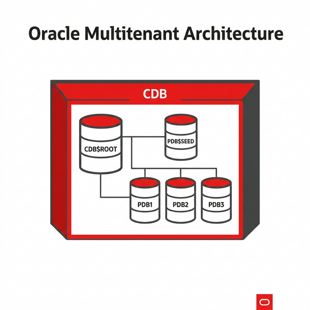

# Oracle Exam Review — Complete Topics

> **Exams covered**: 1Z0-082 (DB Administration I + SQL), 1Z0-083 (DB Administration II / DBA Professional 2)
> **Where to practice**: Each section has a reference to the lab guide where you can practice.

---

## PART 1: Oracle Database Architecture

> 📖 Riferimento Lab: [GUIDE_ORACLE_ARCHITECTURE.md](./GUIDE_ORACLE_ARCHITECTURE.md)

### 1.1 Instance Configurations

| Tipo |Description|In Our Lab|
|---|---|---|
| **Single Instance** | 1 DB, 1 instance, 1 server | `dbtarget` (GoldenGate target) |
| **RAC** | 1 DB, N istanze, N server | `rac1`+`rac2` (RACDB1/RACDB2) |
| **RAC One Node** | 1 DB, 1 active instance, automatic failover |Not configured|
| **Data Guard** | Primary + Standby (physical/logical) | `racstby1`+`racstby2` |

### 1.2 Memory Structures

```
┌─────────────── ORACLE INSTANCE ───────────────┐
│                                               │
│  ┌──── SGA (System Global Area) ────┐        │
│  │ Shared Pool (SQL cache, dict.)   │        │
│  │ Database Buffer Cache            │        │
│  │ Redo Log Buffer                  │        │
│  │ Large Pool (RMAN, shared server) │        │
│  │ Java Pool                        │        │
│  │ Streams Pool                     │        │
│  └──────────────────────────────────┘        │
│                                               │
│ ┌──── PGA (per session) ─────┐ │
│  │ Sort Area, Hash Area, Session    │        │
│  └──────────────────────────────────┘        │
└───────────────────────────────────────────────┘
```

**Key Commands**:
```sql
SHOW PARAMETER sga_target;
SHOW PARAMETER pga_aggregate_target;
SHOW PARAMETER memory_target;
SELECT * FROM v$sgainfo;
SELECT * FROM v$pgastat;
```

### 1.3 Processi in Background

|Process|Function| Critico? |
|---|---|---|
| **PMON** | Cleanup failed processes, record with listener | Si |
| **SMON** | Instance recovery, coalescing free space | Si |
| **DBWn** | Scrive dirty buffers su disco | Si |
| **LGWR** | Scrive redo log buffer su redo log files | Si |
| **CKPT** |Report checkpoint to DBWn| Si |
| **ARCn** |Archive full redo logs (ARCHIVELOG mode)| Si per DG |
| **MMON** | AWR snapshots, metriche | No |
| **MMAN** | Automatic Memory Management | No |
| **RECO** | Distributed transaction recovery | No |

### 1.4 Strutture Logiche e Fisiche

```
LOGICHE                          FISICHE
────────                         ────────
Tablespace ──────────────────── Datafile(s)
  └── Segment                    Control File(s)
       └── Extent                Redo Log File(s)
            └── Data Block       Archive Log File(s)
                                 Parameter File (spfile)
                                 Password File
```

---

## PART 2: Instance Management

> 📖 Riferimento Lab: [GUIDE_DBA_COMMANDS.md](./GUIDE_DBA_COMMANDS.md)

### 2.1 Startup e Shutdown

```sql
--Startup phases
STARTUP NOMOUNT;   -- Legge spfile, alloca SGA, avvia processi
ALTER DATABASE MOUNT;   -- Apre control file
ALTER DATABASE OPEN;    -- Apre datafile e redo log

--Or all at once
STARTUP;

-- Shutdown modes
SHUTDOWN IMMEDIATE;    -- Rollback transazioni attive, chiude pulito
SHUTDOWN TRANSACTIONAL; -- Aspetta fine transazioni, poi chiude
SHUTDOWN NORMAL;       -- Aspetta disconnessione di tutti
SHUTDOWN ABORT;        -- Crash! (richiede recovery al restart)
```

> **In RAC**: Usa `srvctl`instead of`SHUTDOWN`:
> ```bash
> srvctl stop instance -d RACDB -i RACDB1 -o immediate
> srvctl start instance -d RACDB -i RACDB1
> srvctl stop database -d RACDB -o immediate
> ```

### 2.2 Data Dictionary Views

| View | Contents |
|---|---|
| `DBA_USERS` | All users |
| `DBA_TABLESPACES` | All tablespaces |
| `DBA_DATA_FILES` |All datafiles|
| `DBA_SEGMENTS` | All segments (tables, indexes) |
| `DBA_OBJECTS` | All database objects |
| `DBA_TAB_COLUMNS` | Columns of all tables |
| `DBA_CONSTRAINTS` | All constraints |

### 2.3 Dynamic Performance Views (V$)

| View | What is it for? |
|---|---|
| `V$INSTANCE` | Instance status |
| `V$DATABASE` | Info sul database |
| `V$SESSION` |Active sessions|
| `V$PROCESS` |Server processes|
| `V$SGA` |SGA dimensions|
| `V$PARAMETER` |Initialization parameters|
| `V$LOG` | Redo log groups |
| `V$ARCHIVED_LOG` | Archived redo logs |
| `V$ASM_DISKGROUP` | Disk group ASM |
| `GV$INSTANCE` | Same as V$ but for all RAC instances |

### 2.4 ADR (Automatic Diagnostic Repository)

```bash
# ADR structure
$ORACLE_BASE/diag/rdbms/<db_name>/<instance_name>/
├── alert/     # Alert log in XML
├── trace/     # Trace files
├── incident/ # Accidents (crash, ORA-600)
└── cdump/     # Core dumps

# Usa ADRCI per navigare
adrci
> show homes
> set home diag/rdbms/racdb/racdb1
> show alert -tail 50
> show incident
```

### 2.5 Initialization Parameters

```sql
--View all parameters
SHOW PARAMETER;
SHOW PARAMETER db_name;

--Edit a parameter (spfile)
ALTER SYSTEM SET sga_target=2G SCOPE=BOTH;
--SCOPE: MEMORY (session only), SPFILE (spfile only), BOTH

-- Crea pfile da spfile (backup)
CREATE PFILE='/tmp/init_backup.ora' FROM SPFILE;
```

---

## PART 3: Users, Roles and Privileges

> 📖 Riferimento Lab: [GUIDE_CDB_PDB_USERS.md](./GUIDE_CDB_PDB_USERS.md)

### 3.1 Creation of Users and Quotas

```sql
--Create user with quota
CREATE USER app_user IDENTIFIED BY "SecurePass123!"
  DEFAULT TABLESPACE users
  TEMPORARY TABLESPACE temp
  QUOTA 500M ON users
UNLIMITED QUOTE ON app_data;

-- Assegna quota
ALTER USER app_user QUOTA 1G ON users;
```

### 3.2 Principle of Least Privilege

```sql
--NEVER do this in production:
GRANT DBA TO app_user;  -- ❌ MAI!

-- Fai questo:
GRANT CREATE SESSION TO app_user;           -- ✅ Login
GRANT SELECT ON hr.employees TO app_user;   -- ✅ Solo lettura
GRANT INSERT, UPDATE ON hr.departments TO app_user;  -- ✅ Solo scrittura specifica
```

### 3.3 Profili

```sql
--Profile to limit resources and passwords
CREATE PROFILE app_profile LIMIT
  SESSIONS_PER_USER          5
  CPU_PER_SESSION            UNLIMITED
  IDLE_TIME                  30
  CONNECT_TIME               480
  FAILED_LOGIN_ATTEMPTS      5
  PASSWORD_LOCK_TIME         1/24
  PASSWORD_LIFE_TIME         90
  PASSWORD_REUSE_TIME        365
  PASSWORD_REUSE_MAX         12
  PASSWORD_GRACE_TIME        7;

ALTER USER app_user PROFILE app_profile;
```

### 3.4 Ruoli

```sql
--Create custom role
CREATE ROLE app_readonly;
GRANT SELECT ANY TABLE TO app_readonly;
GRANT CREATE SESSION TO app_readonly;

--Assign role
GRANT app_readonly TO app_user;

--Important default roles
-- CONNECT, RESOURCE, DBA, SELECT_CATALOG_ROLE
```

---

## PART 4: Storage Management

> 📖 Riferimento Lab: [GUIDE_DBA_ACTIVITIES.md](./GUIDE_DBA_ACTIVITIES.md)

### 4.1 Resumable Space Allocation

```sql
--Enable resumable operations (they stop instead of failing if they run out of space)
ALTER SESSION ENABLE RESUMABLE;
ALTER SYSTEM SET RESUMABLE_TIMEOUT = 3600;  -- 1 ora di attesa

--Monitor
SELECT * FROM DBA_RESUMABLE;
```

### 4.2 Segment Shrink

```sql
--Reduce fragmented space in a table
ALTER TABLE hr.employees ENABLE ROW MOVEMENT;
ALTER TABLE hr.employees SHRINK SPACE CASCADE;
--CASCADE also includes indices
```

### 4.3 Deferred Segment Creation

```sql
--The table does not take up space until you insert data
ALTER SYSTEM SET DEFERRED_SEGMENT_CREATION=TRUE;

--Now empty tables have no segments
CREATE TABLE test_deferred (id NUMBER, name VARCHAR2(100));
--No extent allocated until first INSERT
```

### 4.4 Table and Row Compression

```sql
-- Basic compression (solo direct-path insert)
CREATE TABLE sales_archive COMPRESS BASIC AS SELECT * FROM sales;

-- Advanced compression (OLTP — anche DML normali)
ALTER TABLE orders COMPRESS FOR OLTP;

-- HCC (Hybrid Columnar Compression — solo Exadata)
-- CREATE TABLE ... COMPRESS FOR QUERY HIGH;
```

### 4.5 Block Space Management

```sql
-- ASSM (Automatic Segment Space Management) — default e consigliato
CREATE TABLESPACE app_data
  DATAFILE '+DATA' SIZE 1G
  AUTOEXTEND ON NEXT 100M MAXSIZE 10G
  SEGMENT SPACE MANAGEMENT AUTO;   -- ASSM

-- MSSM (Manual) — legacy, NON usare
-- SEGMENT SPACE MANAGEMENT MANUAL;
```

---

## PART 5: Data Movement

> 📖 Riferimento Lab: [GUIDE_DBA_ACTIVITIES.md](./GUIDE_DBA_ACTIVITIES.md)

### 5.1 External Tables

```sql
--Reads a CSV file as if it were an SQL table
CREATE DIRECTORY ext_dir AS '/tmp/data';

CREATE TABLE ext_employees (
  emp_id    NUMBER,
  emp_name  VARCHAR2(100),
  salary    NUMBER
)
ORGANIZATION EXTERNAL (
  TYPE ORACLE_LOADER
  DEFAULT DIRECTORY ext_dir
  ACCESS PARAMETERS (
    RECORDS DELIMITED BY NEWLINE
    FIELDS TERMINATED BY ','
    MISSING FIELD VALUES ARE NULL
  )
  LOCATION ('employees.csv')
);

SELECT * FROM ext_employees;  -- Legge direttamente il CSV!
```

### 5.2 Oracle Data Pump

```bash
# Export schema
expdp system/password SCHEMAS=hr DIRECTORY=dp_dir DUMPFILE=hr_export.dmp LOGFILE=hr_export.log

# Import schema
impdp system/password SCHEMAS=hr DIRECTORY=dp_dir DUMPFILE=hr_export.dmp LOGFILE=hr_import.log

# Export full database
expdp system/password FULL=y DIRECTORY=dp_dir DUMPFILE=full_%U.dmp PARALLEL=4

# Export metadata only (no data)
expdp system/password SCHEMAS=hr CONTENT=METADATA_ONLY DIRECTORY=dp_dir DUMPFILE=hr_ddl.dmp
```

### 5.3 SQL*Loader

```bash
# Control file (loader.ctl)
cat > loader.ctl <<'EOF'
LOAD DATA
INFILE 'employees.csv'
INTO TABLE hr.employees
FIELDS TERMINATED BY ','
OPTIONALLY ENCLOSED BY '"'
(employee_id, first_name, last_name, email, salary)
EOF

#Run the upload
sqlldr hr/password CONTROL=loader.ctl LOG=load.log BAD=load.bad DISCARD=load.dsc
```

---

## PART 6: Access Tools

> 📖 Riferimento Lab: [GUIDE_DBA_COMMANDS.md](./GUIDE_DBA_COMMANDS.md)

| Strumento | Uso | Comando/URL |
|---|---|---|
| **SQL*Plus** |Classic CLI, scripting| `sqlplus / as sysdba` |
| **SQL Developer** |GUI, SQL development| Download gratuito Oracle |
| **DBCA** | Crea/gestisce database | `dbca` (GUI) |
| **EM Express** | Web monitoring leggero | `https://rac1:5500/em` |
| **EM Cloud Control** |Enterprise monitoring| `https://oem:7803/em` |

---

## PARTE 7: Oracle Net Services

> 📖 Riferimento Lab: [GUIDE_LISTENER_SERVICES_DBA.md](./GUIDE_LISTENER_SERVICES_DBA.md)

### 7.1 Listeners

```bash
# Listener status
lsnrctl status

# In RAC, use SCAN listener (handled by Grid)
srvctl status scan_listener
srvctl config scan_listener

# Listener locale
srvctl status listener -l LISTENER
```

### 7.2 tnsnames.ora

```
RACDB =
  (DESCRIPTION =
    (ADDRESS = (PROTOCOL = TCP)(HOST = rac-scan.localdomain)(PORT = 1521))
    (CONNECT_DATA =
      (SERVER = DEDICATED)
      (SERVICE_NAME = RACDB)
    )
  )
```

### 7.3 Dedicated vs Shared Server

| | Dedicated | Shared |
|---|---|---|
|**Process**| 1 server process per sessione | Pool di shared server processes |
| **Memoria** | Multiple PGAs per session | Meno PGA, usa Large Pool |
| **Uso** | Default, OLTP |Lots of idle connections|
| **Config** | `SERVER=DEDICATED` | `SHARED_SERVERS=5` |

### 7.4 Naming Methods

| Metodo |File/Service| Uso |
|---|---|---|
| **Local Naming** | `tnsnames.ora` | Client → DB specifico |
| **Directory Naming** | LDAP/OID | Enterprise |
| **Easy Connect** |No files| `sqlplus user/pass@host:port/service` |

---

## PARTE 8: Tablespace e Datafile

> 📖 Riferimento Lab: [GUIDE_DBA_ACTIVITIES.md](./GUIDE_DBA_ACTIVITIES.md)

```sql
-- Crea tablespace
CREATE TABLESPACE app_data
  DATAFILE '+DATA' SIZE 1G
  AUTOEXTEND ON NEXT 100M MAXSIZE 10G;

-- Aggiungi datafile
ALTER TABLESPACE app_data ADD DATAFILE '+DATA' SIZE 500M;

--Resize datafile
ALTER DATABASE DATAFILE '+DATA/RACDB/datafile/app_data.dbf' RESIZE 2G;

--Read-only tablespace
ALTER TABLESPACE archive_data READ ONLY;

-- Drop tablespace
DROP TABLESPACE old_data INCLUDING CONTENTS AND DATAFILES;

--Oracle Managed Files (OMF) — Oracle manages file names
ALTER SYSTEM SET DB_CREATE_FILE_DEST='+DATA';
CREATE TABLESPACE omf_test;  -- Nessun DATAFILE specificato!

--Move/Rename datafile online (12c+)
ALTER DATABASE MOVE DATAFILE '+DATA/old_path' TO '+DATA/new_path';

--View info
SELECT tablespace_name, file_name, bytes/1024/1024 MB FROM dba_data_files;
SELECT tablespace_name, bytes/1024/1024 free_mb FROM dba_free_space;
```

---

## PART 9: Undo Management

```sql
--Check undo active tablespace
SHOW PARAMETER undo_tablespace;
-- RACDB1: UNDOTBS1, RACDB2: UNDOTBS2

--Undo retention (seconds)
SHOW PARAMETER undo_retention;
ALTER SYSTEM SET UNDO_RETENTION=1800;  -- 30 minuti

--Monitor undo usage
SELECT tablespace_name, status, COUNT(*) extents, SUM(bytes)/1024/1024 MB
FROM dba_undo_extents GROUP BY tablespace_name, status;
--status: ACTIVE (in use), UNEXPIRED (within retention), EXPIRED (recyclable)

-- Crea nuovo undo tablespace
CREATE UNDO TABLESPACE undotbs3 DATAFILE '+DATA' SIZE 500M AUTOEXTEND ON;

-- Temporary Undo (12c+) — undo per global temporary tables va in TEMP
ALTER SYSTEM SET TEMP_UNDO_ENABLED=TRUE;
```

> **Undo vs Redo**: The **undo** is used to cancel (rollback) and read consistent data (read consistency). **redo** is used to repeat (recover) changes after a crash. They are complementary.

---

## PARTE 10: SQL Fundamentals

### 10.1 SELECT and Filtering

```sql
-- SELECT base
SELECT employee_id, first_name || ' ' || last_name AS full_name, salary
FROM hr.employees
WHERE department_id = 50
  AND salary > 5000
ORDER BY salary DESC;

-- DISTINCT
SELECT DISTINCT department_id FROM hr.employees;

--Aliases with spaces (double quotes)
SELECT salary * 12 AS "Salario Annuale" FROM hr.employees;

--Alternative quote operator (q'')
SELECT q'[L'apostrofo non e' un problema]' FROM dual;

-- DESCRIBE
DESC hr.employees;

-- Precedence operators: (), *, /, +, -,||
SELECT first_name, salary, salary + salary * 0.1 AS "Con Bonus" FROM hr.employees;

--NULL: any operation with NULL = NULL
SELECT first_name, salary, salary + commission_pct FROM hr.employees;
--If commission_pct is NULL, the result is NULL!
```

### 10.2 Single-Row Functions

```sql
-- Stringhe
SELECT UPPER('hello'), LOWER('HELLO'), INITCAP('hello world') FROM dual;
SELECT SUBSTR('Oracle', 1, 3), LENGTH('Oracle'), INSTR('Oracle', 'a') FROM dual;
SELECT LPAD('42', 5, '0'), RPAD('Hi', 10, '.'), TRIM('  hello  ') FROM dual;
SELECT REPLACE('Hello World', 'World', 'Oracle') FROM dual;

-- Numeri
SELECT ROUND(45.926, 2), TRUNC(45.926, 2), MOD(1600, 300) FROM dual;
-- ROUND: 45.93, TRUNC: 45.92, MOD: 100

-- Date
SELECT SYSDATE, SYSDATE + 7, MONTHS_BETWEEN(SYSDATE, hire_date) FROM hr.employees;
SELECT ADD_MONTHS(SYSDATE, 6), NEXT_DAY(SYSDATE, 'MONDAY'), LAST_DAY(SYSDATE) FROM dual;
SELECT ROUND(SYSDATE, 'MONTH'), TRUNC(SYSDATE, 'YEAR') FROM dual;
```

### 10.3 Conversion Functions

```sql
-- TO_CHAR(number/date → string)
SELECT TO_CHAR(SYSDATE, 'DD-MON-YYYY HH24:MI:SS') FROM dual;
SELECT TO_CHAR(salary, '$99,999.00') FROM hr.employees;

-- TO_NUMBER (stringa → numero)
SELECT TO_NUMBER('1,234.56', '9,999.99') FROM dual;

-- TO_DATE (stringa → data)
SELECT TO_DATE('15-03-2025', 'DD-MM-YYYY') FROM dual;

-- NVL, NULLIF, COALESCE
SELECT NVL(commission_pct, 0) FROM hr.employees;                    -- If NULL, returns 0
SELECT NULLIF(length(first_name), length(last_name)) FROM hr.employees;  -- NULL se uguali
SELECT COALESCE(commission_pct, salary * 0.01, 0) FROM hr.employees;     -- Primo non-NULL
```

### 10.4 JOIN

```sql
-- INNER JOIN
SELECT e.first_name, d.department_name
FROM hr.employees e JOIN hr.departments d ON e.department_id = d.department_id;

--LEFT OUTER JOIN (all employees, even without a department)
SELECT e.first_name, d.department_name
FROM hr.employees e LEFT JOIN hr.departments d ON e.department_id = d.department_id;

-- RIGHT OUTER JOIN
SELECT e.first_name, d.department_name
FROM hr.employees e RIGHT JOIN hr.departments d ON e.department_id = d.department_id;

-- FULL OUTER JOIN
SELECT e.first_name, d.department_name
FROM hr.employees e FULL OUTER JOIN hr.departments d ON e.department_id = d.department_id;

-- SELF JOIN (manager)
SELECT e.first_name AS "Dipendente", m.first_name AS "Manager"
FROM hr.employees e JOIN hr.employees m ON e.manager_id = m.employee_id;

-- Non equijoin
SELECT e.first_name, e.salary, g.grade_level
FROM hr.employees e JOIN hr.job_grades g ON e.salary BETWEEN g.lowest_sal AND g.highest_sal;
```

### 10.5 Group Functions e SET Operators

```sql
-- Group Functions
SELECT department_id, COUNT(*), AVG(salary), MIN(salary), MAX(salary), SUM(salary)
FROM hr.employees GROUP BY department_id HAVING COUNT(*) > 5;

--SET Operators
SELECT employee_id FROM hr.employees WHERE department_id = 10
UNION -- Union without duplicates
SELECT employee_id FROM hr.employees WHERE department_id = 20;

--UNION ALL (with duplicates), INTERSECT, MINUS
SELECT department_id FROM hr.employees
MINUS
SELECT department_id FROM hr.departments WHERE location_id = 1700;
```

### 10.6 Subqueries

```sql
-- Single-row subquery
SELECT * FROM hr.employees
WHERE salary > (SELECT AVG(salary) FROM hr.employees);

-- Multi-row subquery (IN, ANY, ALL)
SELECT * FROM hr.employees
WHERE department_id IN (SELECT department_id FROM hr.departments WHERE location_id = 1700);

-- Correlated subquery
SELECT e.first_name, e.salary
FROM hr.employees e
WHERE e.salary > (SELECT AVG(salary) FROM hr.employees WHERE department_id = e.department_id);
```

### 10.7 DML, DDL, Transaction Control

```sql
-- DML
INSERT INTO hr.departments VALUES (300, 'AI Lab', NULL, 1700);
UPDATE hr.employees SET salary = salary * 1.10 WHERE department_id = 50;
DELETE FROM hr.departments WHERE department_id = 300;
MERGE INTO target t USING source s ON (t.id = s.id)
  WHEN MATCHED THEN UPDATE SET t.val = s.val
  WHEN NOT MATCHED THEN INSERT VALUES (s.id, s.val);

-- DDL
CREATE TABLE test (id NUMBER PRIMARY KEY, name VARCHAR2(100) NOT NULL);
ALTER TABLE test ADD (email VARCHAR2(200));
ALTER TABLE test MODIFY (name VARCHAR2(200));
DROP TABLE test PURGE;
TRUNCATE TABLE test;                    -- DDL! Non genera undo

-- Transaction Control
COMMIT;
ROLLBACK;
SAVEPOINT sp1;
ROLLBACK TO sp1;
```

### 10.8 Sequences, Synonyms, Indexes, Views

```sql
-- Sequences
CREATE SEQUENCE emp_seq START WITH 1000 INCREMENT BY 1 NOCACHE;
SELECT emp_seq.NEXTVAL FROM dual;

-- Synonyms
CREATE PUBLIC SYNONYM emp FOR hr.employees;

-- Indexes
CREATE INDEX idx_emp_name ON hr.employees(last_name);
CREATE UNIQUE INDEX idx_emp_email ON hr.employees(email);
CREATE BITMAP INDEX idx_emp_dept ON hr.employees(department_id);  -- Per low-cardinality

-- Views
CREATE OR REPLACE VIEW emp_summary AS
  SELECT department_id, COUNT(*) cnt, AVG(salary) avg_sal
  FROM hr.employees GROUP BY department_id;

-- Temporary tables
CREATE GLOBAL TEMPORARY TABLE temp_results (id NUMBER, result VARCHAR2(100))
  ON COMMIT DELETE ROWS;  -- o ON COMMIT PRESERVE ROWS

-- Constraints
ALTER TABLE hr.employees ADD CONSTRAINT chk_salary CHECK (salary > 0);
ALTER TABLE hr.employees MODIFY (email CONSTRAINT nn_email NOT NULL);
```

### 10.9 Time Zones

```sql
-- Current date/time functions
SELECT CURRENT_DATE, CURRENT_TIMESTAMP, LOCALTIMESTAMP FROM dual;
SELECT DBTIMEZONE, SESSIONTIMEZONE FROM dual;

-- INTERVAL types
SELECT SYSDATE + INTERVAL '30' DAY FROM dual;
SELECT SYSDATE + INTERVAL '3' MONTH FROM dual;
SELECT SYSDATE + INTERVAL '1-6' YEAR TO MONTH FROM dual;
SELECT TIMESTAMP '2025-01-01 00:00:00' + INTERVAL '10:30' HOUR TO MINUTE FROM dual;
```

---

## PARTE 11: DBA Professional 2 (1Z0-083) — Zero to Hero

> 📖 **Esame**: 1Z0-083 — Oracle Database Administration II
> Copre: Multitenant, RMAN avanzato, Deploy/Patch/Upgrade, 19c New Features, Performance Tuning, SQL Tuning, ASM, HA, Security.

### 11.1 ASM (Automatic Storage Management)

```sql
--ASM commands from SYSASM
sqlplus / as sysasm
SELECT name, state, type, total_mb, free_mb, usable_file_mb FROM v$asm_diskgroup;
SELECT name, path, mode_status, header_status FROM v$asm_disk;

-- Crea disk group
CREATE DISKGROUP DATA NORMAL REDUNDANCY
  FAILGROUP fg1 DISK '/dev/sdc1' NAME data_01
  FAILGROUP fg2 DISK '/dev/sdd1' NAME data_02
  FAILGROUP fg3 DISK '/dev/sde1' NAME data_03
  ATTRIBUTE 'compatible.asm'='19.0', 'compatible.rdbms'='19.0';

--Add disk
ALTER DISKGROUP data ADD DISK '/dev/sdh1' NAME data_04 FAILGROUP fg1;

-- Rebalance
ALTER DISKGROUP data REBALANCE POWER 8;

--Drop disk (automatic rebalance)
ALTER DISKGROUP data DROP DISK data_03;
```

> Nel nostro lab usiamo **ASMLib (`oracleasm`)** for disk management, see [Phase 0](./GUIDE_PHASE0_MACHINE_SETUP.md) and [Phase 2](./GUIDE_PHASE2_GRID_AND_RAC.md).

### 11.2 High Availability: RAC e Data Guard

> 📖 Lab Reference: [Phase 2](./GUIDE_PHASE2_GRID_AND_RAC.md), [Phase 3](./GUIDE_PHASE3_RAC_STANDBY.md), [Phase 4](./GUIDE_PHASE4_DATAGUARD_DGMGRL.md)

```bash
# RAC — key commands
crsctl stat res -t                    # Stato risorse cluster
srvctl status database -d RACDB       # Stato database RAC
srvctl config database -d RACDB # Configuration
srvctl relocate service -d RACDB -s svc1 -i RACDB1 -t RACDB2  # Sposta servizio

# Data Guard — DGMGRL
dgmgrl sys/<password>
> show configuration;
> show database 'RACDB';
> switchover to 'RACDB_STBY';
> failover to 'RACDB_STBY';
```

**Protection Modes**:
| Mode | Redo Transport |Data Loss?|
|---|---|---|
| Maximum Performance | ASYNC | Possibile |
| Maximum Availability | SYNC + fallback ASYNC | No (normalmente) |
| Maximum Protection |SYNC (primary stops if stby doesn't respond)| Mai |

### 11.3 Advanced RMAN

> 📖 Riferimento Lab: [GUIDE_PHASE7_RMAN_BACKUP.md](./GUIDE_PHASE7_RMAN_BACKUP.md)

```bash
# Backup incrementale Level 0 (full base)
RMAN> BACKUP INCREMENTAL LEVEL 0 DATABASE PLUS ARCHIVELOG;

# Level 1 incremental backup (changes only)
RMAN> BACKUP INCREMENTAL LEVEL 1 DATABASE PLUS ARCHIVELOG;

# Block Change Tracking (velocizza Level 1)
ALTER DATABASE ENABLE BLOCK CHANGE TRACKING USING FILE '+RECO/bct.dbf';

# Compressione backup
RMAN> CONFIGURE COMPRESSION ALGORITHM 'MEDIUM';
RMAN> BACKUP AS COMPRESSED BACKUPSET DATABASE;

# Encryption
RMAN> CONFIGURE ENCRYPTION FOR DATABASE ON;
RMAN> SET ENCRYPTION ON IDENTIFIED BY 'backup_password' ONLY;

# Multi-section backup (parallel for large files)
RMAN> BACKUP SECTION SIZE 2G DATABASE;

# Flashback database
ALTER DATABASE FLASHBACK ON;
FLASHBACK DATABASE TO TIMESTAMP (SYSTIMESTAMP - INTERVAL '1' HOUR);
ALTER DATABASE OPEN RESETLOGS;
```

### 11.4 CDB/PDB (Multitenant)

> 📖 Riferimento Lab: [GUIDE_CDB_PDB_USERS.md](./GUIDE_CDB_PDB_USERS.md)

```sql
-- Crea PDB
CREATE PLUGGABLE DATABASE pdb2 ADMIN USER pdb2admin IDENTIFIED BY "Pass123!"
  STORAGE (MAXSIZE 10G)
  FILE_NAME_CONVERT = ('+DATA/RACDB/pdbseed/', '+DATA/RACDB/pdb2/');

--Open and save state for auto-start
ALTER PLUGGABLE DATABASE pdb2 OPEN;
ALTER PLUGGABLE DATABASE pdb2 SAVE STATE;

-- Clona PDB
CREATE PLUGGABLE DATABASE pdb3 FROM pdb2;

-- Unplug/Plug
ALTER PLUGGABLE DATABASE pdb2 CLOSE IMMEDIATE;
ALTER PLUGGABLE DATABASE pdb2 UNPLUG INTO '/tmp/pdb2.xml';
DROP PLUGGABLE DATABASE pdb2 KEEP DATAFILES;
CREATE PLUGGABLE DATABASE pdb2_new USING '/tmp/pdb2.xml' NOCOPY;
```

### 11.5 Performance Tuning (AWR/ADDM/ASH)

> 📖 Riferimento Lab: [GUIDE_DBA_ACTIVITIES.md](./GUIDE_DBA_ACTIVITIES.md)

```sql
-- Genera AWR Report
@$ORACLE_HOME/rdbms/admin/awrrpt.sql
--Choose HTML, snap_id start and end

--ADDM (Automatic Database Diagnostic Monitor)
@$ORACLE_HOME/rdbms/admin/addmrpt.sql

-- ASH Report (Active Session History)
@$ORACLE_HOME/rdbms/admin/ashrpt.sql

-- SQL Tuning Advisor
DECLARE
  l_task VARCHAR2(64);
BEGIN
  l_task := DBMS_SQLTUNE.CREATE_TUNING_TASK(sql_id => 'abc123xyz');
  DBMS_SQLTUNE.EXECUTE_TUNING_TASK(l_task);
END;
/
SELECT DBMS_SQLTUNE.REPORT_TUNING_TASK('task_name') FROM dual;

-- Optimizer Statistics
EXEC DBMS_STATS.GATHER_SCHEMA_STATS('HR');
EXEC DBMS_STATS.GATHER_TABLE_STATS('HR', 'EMPLOYEES');

-- Resource Manager
BEGIN
  DBMS_RESOURCE_MANAGER.CREATE_PENDING_AREA();
  DBMS_RESOURCE_MANAGER.CREATE_PLAN(plan => 'DAY_PLAN', comment => 'Plan for daytime');
  DBMS_RESOURCE_MANAGER.CREATE_CONSUMER_GROUP(consumer_group => 'OLTP_GROUP', comment => 'OLTP');
  DBMS_RESOURCE_MANAGER.SUBMIT_PENDING_AREA();
END;
/
```

### 11.6 Security Avanzata

```sql
-- Unified Auditing (19c+)
CREATE AUDIT POLICY sensitive_ops
  ACTIONS DELETE ON hr.employees,
          ALTER TABLE,
          DROP TABLE;
AUDIT POLICY sensitive_ops;

-- TDE (Transparent Data Encryption)
--1. Configure wallet
ALTER SYSTEM SET WALLET_ROOT='/u01/app/oracle/admin/RACDB/wallet' SCOPE=SPFILE;
ALTER SYSTEM SET TDE_CONFIGURATION='KEYSTORE_CONFIGURATION=FILE' SCOPE=BOTH;
STARTUP FORCE;

-- 2. Crea keystore
ADMINISTER KEY MANAGEMENT CREATE KEYSTORE '/u01/app/oracle/admin/RACDB/wallet' IDENTIFIED BY "<wallet_password>";
ADMINISTER KEY MANAGEMENT SET KEYSTORE OPEN IDENTIFIED BY "<wallet_password>";
ADMINISTER KEY MANAGEMENT SET KEY IDENTIFIED BY "<wallet_password>" WITH BACKUP;

-- 3. Cripta tablespace
ALTER TABLESPACE sensitive_data ENCRYPTION ONLINE ENCRYPT;

-- Network Encryption (sqlnet.ora)
-- SQLNET.ENCRYPTION_SERVER=REQUIRED
-- SQLNET.ENCRYPTION_TYPES_SERVER=(AES256)
```

### 11.7 Patching e Upgrades

> 📖 Lab Reference: [Phase 2 — section 2.8](./GUIDE_PHASE2_GRID_AND_RAC.md)

```bash
# Workflow patching RAC
#1. Update OPatch
mv $ORACLE_HOME/OPatch $ORACLE_HOME/OPatch.bkp
unzip -q p6880880_190000_Linux-x86-64.zip -d $ORACLE_HOME/

# 2. Applica RU alla Grid Home (es. da Combo Patch)
chown -R grid:oinstall /u01/app/patch
cd /u01/app/patch/38658588/38629535
$GRID_HOME/OPatch/opatchauto apply /u01/app/patch/38658588/38629535 -oh $GRID_HOME

#3. Apply RU to Home DB
chown -R oracle:oinstall /u01/app/patch
cd /u01/app/patch/38658588/38629535
$ORACLE_HOME/OPatch/opatchauto apply /u01/app/patch/38658588/38629535 -oh $ORACLE_HOME

#4. Apply datapatch (like oracle)
$ORACLE_HOME/OPatch/datapatch -verbose

#5. Check
$ORACLE_HOME/OPatch/opatch lspatches
SELECT patch_id, status FROM dba_registry_sqlpatch;
```

---

### 11.8 Multitenant Architecture — CDB e PDB (Approfondimento)

> 📖 Riferimento Lab: [GUIDE_CDB_PDB_USERS.md](./GUIDE_CDB_PDB_USERS.md)
> **Corso**: Oracle Database: Managing Multitenant Architecture Ed 1



#### 11.8.1 Creare CDB e PDB

```sql
--Structure of a CDB
-- CDB$ROOT(root container) → contains common metadata
-- PDB$SEED(template) → used as a basis for creating new PDBs
-- PDB1, PDB2... → le Pluggable Database reali

--Check if you are in a CDB
SELECT name, cdb, open_mode FROM v$database;
SELECT con_id, name, open_mode FROM v$pdbs;

-- Crea PDB da seed
CREATE PLUGGABLE DATABASE pdb_app
  ADMIN USER pdbadmin IDENTIFIED BY "PdbApp123!"
  STORAGE (MAXSIZE 10G MAX_SHARED_TEMP_SIZE 512M)
  DEFAULT TABLESPACE app_data
    DATAFILE '+DATA' SIZE 500M AUTOEXTEND ON
  FILE_NAME_CONVERT = ('+DATA/RACDB/pdbseed/', '+DATA/RACDB/pdb_app/');

--Open the PDB and save its state for auto-start after reboot
ALTER PLUGGABLE DATABASE pdb_app OPEN;
ALTER PLUGGABLE DATABASE pdb_app SAVE STATE;

--Connect to the PDB
ALTER SESSION SET CONTAINER = pdb_app;
-- oppure
CONNECT pdbadmin/PdbApp123!@rac-scan:1521/pdb_app
```

> **Why SAVE STATE?** Without SAVE STATE, after a CDB reboot the PDBs remain in MOUNTED state. The DBA must open them manually each time. SAVE STATE automates the opening.

#### 11.8.2 CDB and PDB management

```sql
--Change PDB mode
ALTER PLUGGABLE DATABASE pdb_app CLOSE IMMEDIATE;
ALTER PLUGGABLE DATABASE pdb_app OPEN READ ONLY;  -- Active Data Guard style
ALTER PLUGGABLE DATABASE pdb_app OPEN READ WRITE;

-- Parametri: CDB-level vs PDB-level
--Some parameters can be set for PDB:
ALTER SESSION SET CONTAINER = pdb_app;
ALTER SYSTEM SET open_cursors = 400 SCOPE=BOTH;

--Check parameters that can be modified at PDB level
SELECT name, ispdb_modifiable FROM v$system_parameter WHERE ispdb_modifiable = 'TRUE';

--Service names for PDB (each PDB has its own service)
SELECT name, network_name, pdb FROM cdb_services;
```

#### 11.8.3 Cloning and Plug/Unplug

```sql
-- Clona PDB (hot clone — 12.2+)
CREATE PLUGGABLE DATABASE pdb_clone FROM pdb_app;
ALTER PLUGGABLE DATABASE pdb_clone OPEN;

--Duplicate PDB active (requires ARCHIVELOG)
CREATE PLUGGABLE DATABASE pdb_copy FROM pdb_app@dblink_to_remote;

--Unplug PDB (detaches it from the CDB)
ALTER PLUGGABLE DATABASE pdb_app CLOSE IMMEDIATE;
ALTER PLUGGABLE DATABASE pdb_app UNPLUG INTO '/tmp/pdb_app.xml';
DROP PLUGGABLE DATABASE pdb_app KEEP DATAFILES;

--Plug PDB into another (or the same) CDB
CREATE PLUGGABLE DATABASE pdb_app USING '/tmp/pdb_app.xml'
  SOURCE_FILE_NAME_CONVERT = ('+DATA/OLDCDB/', '+DATA/RACDB/');
ALTER PLUGGABLE DATABASE pdb_app OPEN;
```

#### 11.8.4 Application Containers (19c)

```sql
--Application Root: A CDB within a CDB to manage multi-tenant apps
ALTER PLUGGABLE DATABASE APPLICATION app_root BEGIN INSTALL 'MYAPP' 1.0;
  --Create shared objects in the root app
  CREATE TABLE common_config (key VARCHAR2(100), value VARCHAR2(500)) SHARING=DATA;
ALTER PLUGGABLE DATABASE APPLICATION app_root END INSTALL 'MYAPP' 1.0;

--"Child" PDBs inherit tables from the root app
--Sync PDB from application root:
ALTER SESSION SET CONTAINER = app_pdb1;
ALTER PLUGGABLE DATABASE APPLICATION MYAPP SYNC;
```

#### 11.8.5 Local Undo vs Shared Undo

```sql
-- Shared Undo (default CDB): un solo undo tablespace nel CDB$ROOT
-- Local Undo: ogni PDB ha il suo undo tablespace

--Check current mode
SELECT PROPERTY_VALUE FROM database_properties WHERE PROPERTY_NAME = 'LOCAL_UNDO_ENABLED';

--Enable Local Undo (requires reboot in UPGRADE mode)
STARTUP UPGRADE;
ALTER DATABASE LOCAL UNDO ON;
SHUTDOWN IMMEDIATE;
STARTUP;
```

> **Why Local Undo?** With Shared Undo, you can't do Flashback PDB (because the undo is shared). With Local Undo, each PDB has its own undo and you can Flashback PDB independently!

#### 11.8.6 Security Multitenant

```sql
--Common User (user in the CDB$ROOT, visibile in tutte le PDB)
CREATE USER C##admin IDENTIFIED BY "Admin123!" CONTAINER=ALL;
GRANT DBA TO C##admin CONTAINER=ALL;

--Local User (user only in a specific PDB)
ALTER SESSION SET CONTAINER = pdb_app;
CREATE USER app_user IDENTIFIED BY "App123!";

--PDB Lockdown Profiles (limits what PDBs can do)
CREATE LOCKDOWN PROFILE prod_lockdown;
ALTER LOCKDOWN PROFILE prod_lockdown DISABLE STATEMENT = ('ALTER SYSTEM');
ALTER LOCKDOWN PROFILE prod_lockdown DISABLE OPTION = ('NETWORK ACCESS');
ALTER SYSTEM SET PDB_LOCKDOWN = 'prod_lockdown';

-- Audit in CDB e PDB
CREATE AUDIT POLICY pdb_security_audit
  ACTIONS CREATE USER, DROP USER, ALTER USER, GRANT, REVOKE;
AUDIT POLICY pdb_security_audit;

--Audit verification
SELECT * FROM unified_audit_trail WHERE dbusername = 'APP_USER' ORDER BY event_timestamp DESC;
```

---

### 11.9 RMAN Backup & Recovery Workshop (Approfondimento)

> 📖 Riferimento Lab: [GUIDE_PHASE7_RMAN_BACKUP.md](./GUIDE_PHASE7_RMAN_BACKUP.md)
> **Corso**: Oracle Database: Backup and Recovery Workshop

#### 11.9.1 Strategies and Terminology

```bash
# Backup Set vs Image Copy
RMAN> BACKUP AS BACKUPSET DATABASE;    # Compresso, solo blocchi usati
RMAN> BACKUP AS COPY DATABASE;         # Copia 1:1, piu veloce per restore

#Duplexed backup sets (2 copies of the same backup)
RMAN> CONFIGURE DEVICE TYPE DISK BACKUP TYPE TO BACKUPSET;
RMAN> BACKUP COPIES 2 DATABASE;

# Archival backup (per long term retention)
RMAN> BACKUP DATABASE TAG 'ARCHIVAL_Q1_2025' KEEP UNTIL TIME 'SYSDATE+365';

# Multi-section backup (parallel for files > 2GB)
RMAN> BACKUP SECTION SIZE 2G DATABASE;

# Backup ASM metadata
RMAN> BACKUP DEVICE TYPE DISK FORMAT '/tmp/asm_md_%U' SPFILE;
--For full ASM metadata backup: asmcmd md_backup
```

#### 11.9.2 Backup CDB e PDB

```bash
# Backup intero CDB
RMAN> BACKUP DATABASE PLUS ARCHIVELOG;

# Backup singola PDB
RMAN> BACKUP PLUGGABLE DATABASE pdb_app PLUS ARCHIVELOG;

# PDB-specific datafile backup
RMAN> BACKUP DATAFILE '+DATA/RACDB/pdb_app/users01.dbf';

# Restore and Recovery of a PDB (the other PDBs remain online!)
RMAN> ALTER PLUGGABLE DATABASE pdb_app CLOSE;
RMAN> RESTORE PLUGGABLE DATABASE pdb_app;
RMAN> RECOVER PLUGGABLE DATABASE pdb_app;
RMAN> ALTER PLUGGABLE DATABASE pdb_app OPEN RESETLOGS;
```

#### 11.9.3 Flashback Technologies

```sql
-- Flashback Database (richiede Flashback ON + ARCHIVELOG)
ALTER DATABASE FLASHBACK ON;

-- Flashback intero database
SHUTDOWN IMMEDIATE;
STARTUP MOUNT;
FLASHBACK DATABASE TO TIMESTAMP (SYSTIMESTAMP - INTERVAL '2' HOUR);
ALTER DATABASE OPEN RESETLOGS;

-- Flashback PDB (richiede Local Undo!)
ALTER PLUGGABLE DATABASE pdb_app CLOSE;
FLASHBACK PLUGGABLE DATABASE pdb_app TO TIMESTAMP
  (SYSTIMESTAMP - INTERVAL '1' HOUR);
ALTER PLUGGABLE DATABASE pdb_app OPEN RESETLOGS;

-- Flashback Table
FLASHBACK TABLE hr.employees TO TIMESTAMP (SYSTIMESTAMP - INTERVAL '30' MINUTE);

--Flashback Drop (recover table from trash)
FLASHBACK TABLE hr.employees TO BEFORE DROP;
SELECT * FROM recyclebin;
```

#### 11.9.4 Duplication

```bash
# Duplicate database (to create standby or test clone)
RMAN> DUPLICATE TARGET DATABASE TO testdb
  FROM ACTIVE DATABASE
  SPFILE
    SET db_unique_name='TESTDB'
    SET log_archive_dest_1='LOCATION=+RECO'
  NOFILENAMECHECK;

# Duplicate PDB active
RMAN> DUPLICATE TARGET DATABASE TO testdb
  PLUGGABLE DATABASE pdb_app
  FROM ACTIVE DATABASE;
```

#### 11.9.5 Diagnosing Failures e Block Corruption

```bash
# Detect corruptions
RMAN> VALIDATE DATABASE;
RMAN> VALIDATE DATAFILE 5 BLOCK 100 TO 200;

# Repair corrupt blocks with Block Media Recovery
RMAN> BLOCKRECOVER DATAFILE 5 BLOCK 100;

# Data Recovery Advisor (DRA)
RMAN> LIST FAILURE;
RMAN> ADVISE FAILURE;
RMAN> REPAIR FAILURE;

#Verify integrity with DBVerify
dbv FILE='+DATA/RACDB/datafile/users01.dbf' BLOCKSIZE=8192
```

#### 11.9.6 RMAN Troubleshooting e Tuning

```bash
# Interpreta output RMAN
RMAN> LIST BACKUP SUMMARY;           # Lista tutti i backup
RMAN> LIST BACKUP OF DATABASE;       # Backup del database
RMAN> REPORT OBSOLETE;               # Backup scaduti
RMAN> DELETE OBSOLETE;               # Rimuove backup scaduti

# Performance tuning
RMAN> CONFIGURE DEVICE TYPE DISK PARALLELISM 4;  # Parallelismo
RMAN> CONFIGURE CHANNEL DEVICE TYPE DISK MAXPIECESIZE 2G;

# Recovery catalog
RMAN> CONNECT CATALOG rman_user/password@catdb
RMAN> REGISTER DATABASE;
RMAN> RESYNC CATALOG;
```

---

### 11.10 Deploy, Patch e Upgrade Workshop

> 📖 Lab Reference: [Phase 0](./GUIDE_PHASE0_MACHINE_SETUP.md), [Phase 2 — sec. 2.8](./GUIDE_PHASE2_GRID_AND_RAC.md)
> **Corso**: Oracle Database: Deploy, Patch and Upgrade Workshop

#### 11.10.1 Grid Infrastructure per Standalone Server

```bash
# Oracle Restart (Grid Infrastructure Standalone) — gestisce auto-restart  
# of databases, listeners, ASM on a single server
srvctl add database -d MYDB -o $ORACLE_HOME
srvctl add listener -l LISTENER
srvctl enable database -d MYDB
srvctl start database -d MYDB

#Check components managed by Oracle Restart
crsctl stat res -t
```

#### 11.10.2 Image e RPM-Based Installation (19c)

```bash
#19c introduces image-based installation (zip →ORACLE_HOME)
# There is no longer the traditional runInstaller for the software

# Grid Infrastructure
unzip -q LINUX.X64_193000_grid_home.zip -d /u01/app/19.0.0/grid

# Database (lo zip E il software!)
mkdir -p /u01/app/oracle/product/19.0.0/dbhome_1
unzip -q LINUX.X64_193000_db_home.zip -d /u01/app/oracle/product/19.0.0/dbhome_1

# RPM-based installation (alternativa)
yum install -y oracle-database-ee-19c
```

#### 11.10.3 DBCA Create/Delete/Configure

```bash
# Create database with DBCA silent
dbca -silent -createDatabase \
  -templateName General_Purpose.dbc \
  -gdbName MYDB -sid MYDB \
  -createAsContainerDatabase true \
  -numberOfPDBs 1 -pdbName pdb1 \
  -characterSet AL32UTF8 \
  -memoryPercentage 40 \
  -storageType ASM -diskGroupName +DATA \
  -recoveryGroupName +RECO \
  -sysPassword "SysPass123!" -systemPassword "SysPass123!" \
  -pdbAdminPassword "PdbPass123!"

# Deleta database
dbca -silent -deleteDatabase -sourceDB MYDB

# Configure existing database (add components)
dbca -silent -configureDatabase -sourceDB MYDB \
  -registerWithDirService false
```

#### 11.10.4 Upgrade Oracle Database

```bash
# Pre-upgrade check
$NEW_ORACLE_HOME/jdk/bin/java -jar $NEW_ORACLE_HOME/rdbms/admin/preupgrade.jar \
  TERMINAL TEXT DIR /tmp/preupgrade

# Upgrade con DBUA (GUI)
$NEW_ORACLE_HOME/bin/dbua

# Upgrade manuale
#1. Shutdown with old home
sqlplus / as sysdba <<< "SHUTDOWN IMMEDIATE;"

# 2. Cambia ORACLE_HOMEto the new version
export ORACLE_HOME=/u01/app/oracle/product/21.0.0/dbhome_1

# 3. Startup upgrade
sqlplus / as sysdba <<< "STARTUP UPGRADE;"

#4. Run upgrade script
$ORACLE_HOME/perl/bin/perl $ORACLE_HOME/rdbms/admin/catctl.pl \
  -l /tmp/upgrade_log -n 4 $ORACLE_HOME/rdbms/admin/catupgrd.sql

# 5. Post-upgrade
@$ORACLE_HOME/rdbms/admin/utlrp.sql     -- Ricompila invalidi
@$ORACLE_HOME/rdbms/admin/catcon.pl -n 1 -e -b postupgrade \
  -d $ORACLE_HOME/rdbms/admin postupgrade_fixups.sql
```

#### 11.10.5 Rapid Home Provisioning (RHP)

```bash
# RHP allows you to create, patch and upgrade Oracle Homes
# centrally via Gold Images

# Crea Gold Image da una home esistente
rhpctl add image -image db19_gi -path /u01/app/19.0.0/grid

# Provision a new home from Gold Image
rhpctl add workingcopy -workingcopy wc_db19 -image db19_gi \
  -path /u01/app/oracle/product/19.0.0/dbhome_2
```

---

### 11.11 Oracle Database 19c: New Features

#### 11.11.1 Automatic Indexing

```sql
--19c creates and manages indexes automatically
EXEC DBMS_AUTO_INDEX.CONFIGURE('AUTO_INDEX_MODE','IMPLEMENT');
--Monitor
SELECT * FROM DBA_AUTO_INDEX_CONFIG;
SELECT index_name, table_name, visibility FROM DBA_AUTO_INDEX_IND_ACTIONS;
```

#### 11.11.2 Real-Time Statistics (19c+)

```sql
--Statistics are collected in real time during DML
--Enabled by default, no configuration necessary
--Verify
SELECT table_name, num_rows, last_analyzed, notes
FROM dba_tab_statistics WHERE owner = 'HR' AND notes IS NOT NULL;
```

#### 11.11.3 SQL Quarantine (19c)

```sql
--Block SQL statements that consume too many resources
BEGIN
  DBMS_SQLQ.CREATE_QUARANTINE_BY_SQL_ID(
    sql_id        => 'abc123xyz',
    plan_hash_value => 12345,
    quarantine_name => 'q_bad_sql');
END;
/
```

#### 11.11.4 Private Temporary Tables (19c)

```sql
--Visible ONLY in the session that creates them, they disappear at the end of the transaction
CREATE PRIVATE TEMPORARY TABLE ORA$PTT_temp_results (
  id NUMBER, result VARCHAR2(200)
) ON COMMIT DROP DEFINITION;
```

---

### 11.12 Performance Monitoring e Tuning (Approfondimento)

> 📖 Riferimento Lab: [GUIDE_DBA_ACTIVITIES.md](./GUIDE_DBA_ACTIVITIES.md)
> **Corso**: Oracle Database: Administration Workshop — Performance Monitoring

#### 11.12.1 Memory Management

```sql
-- Automatic Memory Management (AMM) — Oracle gestisce SGA+PGA
ALTER SYSTEM SET MEMORY_TARGET = 4G SCOPE=SPFILE;
ALTER SYSTEM SET MEMORY_MAX_TARGET = 4G SCOPE=SPFILE;

-- Automatic Shared Memory Management (ASMM) — solo SGA automatica
ALTER SYSTEM SET SGA_TARGET= 3G SCOPE=BOTH;       -- Total SGA
ALTER SYSTEM SET PGA_AGGREGATE_TARGET = 1G SCOPE=BOTH;

--Monitor allocation
SELECT component, current_size/1024/1024 MB FROM v$sga_dynamic_components;
SELECT name, value/1024/1024 MB FROM v$pgastat WHERE name LIKE '%target%';

-- Memory Advisor
SELECT * FROM v$memory_target_advice ORDER BY memory_size;
SELECT * FROM v$sga_target_advice ORDER BY sga_size;
```

#### 11.12.2 AWR (Automatic Workload Repository)

```sql
--AWR takes automatic snapshots every hour
--Retention default: 8 days

--Configure
EXEC DBMS_WORKLOAD_REPOSITORY.MODIFY_SNAPSHOT_SETTINGS(interval=>30, retention=>43200);
--interval=30 minutes, retention=30 days

-- Crea snapshot manuale
EXEC DBMS_WORKLOAD_REPOSITORY.CREATE_SNAPSHOT;

-- Genera AWR Report
@$ORACLE_HOME/rdbms/admin/awrrpt.sql
-- Scegli: HTML, snap_begin, snap_end

-- AWR per RAC (Global AWR)
@$ORACLE_HOME/rdbms/admin/awrgrpt.sql

--AWR Diff (compare 2 periods)
@$ORACLE_HOME/rdbms/admin/awrddrpt.sql
```

#### 11.12.3 ADDM (Automatic Database Diagnostic Monitor)

```sql
--ADDM analyzes AWR and produces automatic recommendations
@$ORACLE_HOME/rdbms/admin/addmrpt.sql

--Programmatically
DECLARE
  task_name VARCHAR2(64) := 'ADDM_TASK_1';
BEGIN
  DBMS_ADVISOR.CREATE_TASK('ADDM', task_name);
  DBMS_ADVISOR.SET_TASK_PARAMETER(task_name, 'START_SNAPSHOT', 100);
  DBMS_ADVISOR.SET_TASK_PARAMETER(task_name, 'END_SNAPSHOT', 110);
  DBMS_ADVISOR.EXECUTE_TASK(task_name);
END;
/
SELECT DBMS_ADVISOR.GET_TASK_REPORT('ADDM_TASK_1') FROM dual;
```

#### 11.12.4 Wait Events, Sessions e Services

```sql
-- Top wait events
SELECT event, total_waits, time_waited_micro/1000000 secs
FROM v$system_event WHERE wait_class != 'Idle' ORDER BY time_waited_micro DESC;

--Active sessions (what are they waiting for?)
SELECT sid, serial#, username, event, wait_class, state, seconds_in_wait
FROM v$session WHERE status = 'ACTIVE' AND username IS NOT NULL;

-- ASH (Active Session History) — campionamento ogni secondo
SELECT sql_id, event, COUNT(*) samples
FROM v$active_session_history
WHERE sample_time > SYSTIMESTAMP - INTERVAL '10' MINUTE
GROUP BY sql_id, event ORDER BY samples DESC;

--Monitor Services
SELECT service_name, stat_name, value FROM v$service_stats;
```

#### 11.12.5 Metrics, Thresholds and Alerts

```sql
--View metrics
SELECT metric_name, value, metric_unit FROM v$sysmetric WHERE group_id = 2;

--Configure alert thresholds
EXEC DBMS_SERVER_ALERT.SET_THRESHOLD(
  metrics_id   => DBMS_SERVER_ALERT.TABLESPACE_PCT_FULL,
  warning_value => '85',
  critical_value => '95',
  observation_period => 1,
  consecutive_occurrences => 1,
  instance_name => NULL,
  object_type => DBMS_SERVER_ALERT.OBJECT_TYPE_TABLESPACE,
  object_name => 'USERS');

--Check alert
SELECT * FROM dba_outstanding_alerts;
SELECT * FROM dba_alert_history ORDER BY creation_time DESC;
```

#### 11.12.6 Resource Manager in CDB/PDB

```sql
--Resource Manager for CDB — controls resources across PDBs
BEGIN
  DBMS_RESOURCE_MANAGER.CREATE_PENDING_AREA();
  
  -- Crea CDB Resource Plan
  DBMS_RESOURCE_MANAGER.CREATE_CDB_PLAN(plan => 'CDB_PROD_PLAN', comment => 'Prod');
  
  --Assign shares and limits to PDBs
  DBMS_RESOURCE_MANAGER.CREATE_CDB_PLAN_DIRECTIVE(
    plan => 'CDB_PROD_PLAN',
    pluggable_database => 'PDB_APP',
shares => 3, -- 3x resources compared to test PDB
    utilization_limit => 80,  -- Max 80% CPU
parallel_server_limit => 50);
  
  DBMS_RESOURCE_MANAGER.SUBMIT_PENDING_AREA();
END;
/

ALTER SYSTEM SET RESOURCE_MANAGER_PLAN='CDB_PROD_PLAN';
```

---

### 11.13 SQL Tuning (Approfondimento)

> **Corso**: Oracle Database: Administration Workshop — Tuning SQL Statements

#### 11.13.1 Oracle Optimizer

```sql
--The Cost-Based Optimizer (CBO) chooses the best execution plan
--Factors: statistics, indices, constraints, parameters

--View the execution plan
EXPLAIN PLAN FOR SELECT * FROM hr.employees WHERE department_id = 50;
SELECT * FROM TABLE(DBMS_XPLAN.DISPLAY);

--Real execution plan (with runtime statistics)
SELECT /*+ GATHER_PLAN_STATISTICS */ * FROM hr.employees WHERE department_id = 50;
SELECT * FROM TABLE(DBMS_XPLAN.DISPLAY_CURSOR(NULL, NULL, 'ALLSTATS LAST'));

--Hints (forcing an optimizer behavior)
SELECT /*+ FULL(e) */ * FROM hr.employees e WHERE employee_id = 100;
SELECT /*+ INDEX(e idx_emp_dept) */ * FROM hr.employees e WHERE department_id = 50;
SELECT /*+ PARALLEL(e, 4) */ * FROM hr.employees e;
```

#### 11.13.2 SQL Tuning Advisor

```sql
--Create and run tuning tasks for a specific SQL
DECLARE
  l_task VARCHAR2(64);
BEGIN
  l_task := DBMS_SQLTUNE.CREATE_TUNING_TASK(
    sql_id          => '3nkd305d1g5a2',
    scope           => DBMS_SQLTUNE.SCOPE_COMPREHENSIVE,
    time_limit      => 300,
    task_name       => 'tune_slow_query');
  DBMS_SQLTUNE.EXECUTE_TUNING_TASK('tune_slow_query');
END;
/

--Read the report (recommendations)
SET LONG 10000
SELECT DBMS_SQLTUNE.REPORT_TUNING_TASK('tune_slow_query') FROM dual;

--Accept a SQL Profile (if recommended)
EXEC DBMS_SQLTUNE.ACCEPT_SQL_PROFILE(task_name => 'tune_slow_query', replace => TRUE);
```

#### 11.13.3 Optimizer Statistics

```sql
--Collect statistics (FUNDAMENTAL for good execution plan)
EXEC DBMS_STATS.GATHER_DATABASE_STATS;
EXEC DBMS_STATS.GATHER_SCHEMA_STATS('HR');
EXEC DBMS_STATS.GATHER_TABLE_STATS('HR', 'EMPLOYEES');
EXEC DBMS_STATS.GATHER_TABLE_STATS('HR', 'EMPLOYEES', METHOD_OPT => 'FOR ALL COLUMNS SIZE AUTO');

-- Statistiche pendenti (test-before-publish)
EXEC DBMS_STATS.SET_TABLE_PREFS('HR','EMPLOYEES','PUBLISH','FALSE');
--Collect (go pending)
EXEC DBMS_STATS.GATHER_TABLE_STATS('HR','EMPLOYEES');
--Test impact without publishing
SELECT * FROM dba_tab_pending_stats;
--Post if satisfied
EXEC DBMS_STATS.PUBLISH_PENDING_STATS('HR','EMPLOYEES');

--Lock statistics (prevents the auto job from overwriting them)
EXEC DBMS_STATS.LOCK_TABLE_STATS('HR', 'EMPLOYEES');
```

#### 11.13.4 SQL Access Advisor

```sql
--Recommends indexes, materialized views, and partitions
DECLARE
  task_name VARCHAR2(64) := 'access_advisor_task';
BEGIN
  DBMS_ADVISOR.CREATE_TASK('SQL Access Advisor', task_name);
  
  -- Usa workload dall'AWR
  DBMS_ADVISOR.SET_TASK_PARAMETER(task_name, 'ANALYSIS_SCOPE', 'ALL');
  DBMS_ADVISOR.SET_TASK_PARAMETER(task_name, 'MODE', 'COMPREHENSIVE');
  
  --Add SQL from cache
  DBMS_ADVISOR.ADD_STS_REF(task_name, 'HR', 'STS_HR_WORKLOAD');
  
  DBMS_ADVISOR.EXECUTE_TASK(task_name);
END;
/

--Read recommendations
SELECT DBMS_ADVISOR.GET_TASK_SCRIPT(task_name => 'access_advisor_task') FROM dual;
```

---

## ✅ Complete Exam Map → Lab

### 1Z0-082 — Oracle Database Administration I + SQL

| Argomento Esame |Where you practice it in the Lab|
|---|---|
| DB Architecture | [GUIDE_ORACLE_ARCHITECTURE.md](./GUIDE_ORACLE_ARCHITECTURE.md) |
| Instance Management | [GUIDE_DBA_COMMANDS.md](./GUIDE_DBA_COMMANDS.md) |
| Users/Roles/Privileges | [GUIDE_CDB_PDB_USERS.md](./GUIDE_CDB_PDB_USERS.md) |
| Storage Management | [GUIDE_DBA_ACTIVITIES.md](./GUIDE_DBA_ACTIVITIES.md) |
| Data Pump / SQL*Loader | [GUIDE_DBA_ACTIVITIES.md](./GUIDE_DBA_ACTIVITIES.md) |
| Net Services / Listeners | [GUIDE_LISTENER_SERVICES_DBA.md](./GUIDE_LISTENER_SERVICES_DBA.md) |
| Tablespaces / Undo | [GUIDE_DBA_ACTIVITIES.md](./GUIDE_DBA_ACTIVITIES.md) |
| SQL Fundamentals | Part 10 of this guide |

### 1Z0-083 — Oracle Database Administration II (DBA Professional 2)

| Argomento Esame |Where you practice it in the Lab|
|---|---|
| ASM | [Phase 0](./GUIDE_PHASE0_MACHINE_SETUP.md) + [Phase 2](./GUIDE_PHASE2_GRID_AND_RAC.md) |
| RAC (High Availability) | [Phase 2](./GUIDE_PHASE2_GRID_AND_RAC.md) |
| Data Guard | [Phase 3](./GUIDE_PHASE3_RAC_STANDBY.md) + [Phase 4](./GUIDE_PHASE4_DATAGUARD_DGMGRL.md) |
| Switchover/Failover | [GUIDA_SWITCHOVER](./GUIDE_FULL_SWITCHOVER.md) + [GUIDA_FAILOVER](./GUIDE_FAILOVER_AND_REINSTATE.md) |
| Multitenant (CDB/PDB) | [GUIDE_CDB_PDB_USERS.md](./GUIDE_CDB_PDB_USERS.md) + Section 11.8 |
| RMAN Backup/Recovery | [GUIDE_PHASE7_RMAN_BACKUP.md](./GUIDE_PHASE7_RMAN_BACKUP.md) + Section 11.9 |
| Flashback Technologies | Section 11.9.3 |
| Deploy/Patch/Upgrade | [Phase 2 - sec. 2.8](./GUIDE_PHASE2_GRID_AND_RAC.md) + Section 11.10 |
| 19c New Features | Section 11.11 |
| Performance Tuning (AWR/ADDM) | [GUIDE_DBA_ACTIVITIES.md](./GUIDE_DBA_ACTIVITIES.md) + Section 11.12 |
| SQL Tuning | Section 11.13 |
| Security (TDE, Audit) | [GUIDE_CDB_PDB_USERS.md](./GUIDE_CDB_PDB_USERS.md) + Section 11.6 |
| GoldenGate | [Phase 5](./GUIDE_PHASE5_GOLDENGATE.md) |
| Oracle→PostgreSQL | [GUIDA_MIGRAZIONE_PG](./GUIDE_ORACLE_TO_POSTGRES_MIGRATION.md) |

---

> → **Prossimo**: [GUIDE_ORACLE_TO_POSTGRES_MIGRATION.md](./GUIDE_ORACLE_TO_POSTGRES_MIGRATION.md) — Oracle → PostgreSQL migration with GoldenGate
