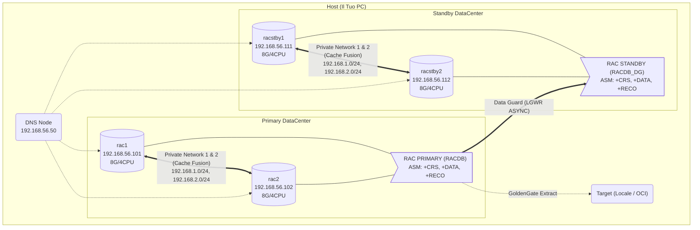

# 🏛️ Oracle RAC + Data Guard — Enterprise DBA Lab

[](https://www.oracle.com/database/)
[](./automation/)
[](./libreria_oracle/)
[](./docs/10_esami_carriera/VALIDAZIONE_BEST_PRACTICES.md)
[](./LICENSE)

> Guida completa passo-passo per costruire un'architettura Oracle Enterprise in laboratorio.
> **Validata al 98%** contro le best practice ufficiali Oracle MAA Gold.

### 📑 Navigazione Rapida

[⚡ Cosa Contiene](#-cosa-trovi-in-questo-repository) · [🚀 Quick Start](#-quick-start-5-minuti) · [📖 Lab Fasi 0→8](#-esegui-il-lab-fase-0--8) · [📚 Guide Tematiche](#-guide-per-area-tematica) · [🛠️ Strumenti](#️-strumenti-operativi) · [📅 Roadmap](#-roadmap-lab-8-settimane-3hgiorno) · [🌐 Piano IP](#-piano-ip)

---

## 🚀 Quick Start (5 minuti)

```bash
# 1. Clona il repo
git clone https://github.com/Mohamed-DN/dba_oracle_lab.git
cd dba_oracle_lab

# 2A. PERCORSO MANUALE (impari di più, ~30 ore)
#     Segui le 9 guide in ordine → docs/01_lab_setup/GUIDA_FASE0_SETUP_MACCHINE.md

# 2B. PERCORSO AUTOMATICO (1-click, servono 33GB RAM)
cd vagrant_rac_dataguard
vagrant up    # → crea DNS + 2 nodi RAC Primary + 2 nodi Standby + Data Guard

# 3. Dopo il lab, usa gli script operativi ogni giorno
#    → scripts_operativi/    (10 script SQL per emergenze)
#    → procedure_operative/  (13 runbook DBA)
```

> 💡 **Primo giorno?** Leggi prima [Architettura Oracle](./docs/00_fondamenti/GUIDA_ARCHITETTURA_ORACLE.md) e [Glossario](./docs/00_fondamenti/GLOSSARIO_ORACLE.md).

---

## ⚡ Cosa Trovi in Questo Repository

| Sezione | Contenuto | Quantità |
|---|---|---|
| 📖 [Guide Lab (Fasi 0→8)](#-esegui-il-lab-fase-0--8) | Costruisci da zero un RAC + Data Guard + GoldenGate | 9 guide |
| 📚 [Documentazione](./docs/) | Guide tematiche per ogni area DBA | 40+ guide |
| 🛠️ [Script Operativi](./scripts_operativi/) | SQL pronti al copia-incolla per scenari reali | 10 script |
| 📂 [Libreria Oracle](./libreria_oracle/) | Raccolta Enterprise di script e procedure | **~1000 script** |
| 📋 [Procedure Operative](./procedure_operative/) | Runbook giornalieri per attività DBA | 13 runbook |
| 🤖 [Automazione Ansible](./automation/) | Playbook production-grade | 10 playbook |
| 🖥️ [Vagrant One-Click](./vagrant_rac_dataguard/) | Ambiente completo automatizzato (Fasi 0→4) | 1-click setup |

---

## ⚠️ Prima di Iniziare

| Requisito | Dettaglio |
|---|---|
| **RAM minima** | **32GB** per l'intero ambiente (4 nodi RAC + DNS). Con 16GB: solo 2 nodi, senza Standby |
| **Disco** | ~150GB liberi (VM + ASM disks + software Oracle) |
| **CPU** | 4+ core consigliati (VirtualBox con VT-x/AMD-V abilitato) |
| **OS Host** | Windows, Linux, o macOS con VirtualBox 7+ |

> 💡 **Non vuoi fare tutto a mano?**
> - **Parziale**: La cartella `scripts/` ha bash script per storage e Grid.
> - **Completa**: [`vagrant_rac_dataguard/`](vagrant_rac_dataguard/README.md) automatizza le **Fasi 0→4** in un click (33GB RAM).

---

## 🏗️ Architettura del Lab



---

## 📖 Esegui il Lab (Fase 0 → 8)

Segui le fasi **in ordine**. Ogni fase dipende dalla precedente.

| # | Fase | Guida | Cosa Fai | Tempo |
|---|---|---|---|---|
| 0 | **Setup Macchine** | [GUIDA_FASE0](./docs/01_lab_setup/GUIDA_FASE0_SETUP_MACCHINE.md) | Crea VM VirtualBox, DNS, dischi ASM | 3-4h |
| 1 | **Preparazione OS** | [GUIDA_FASE1](./docs/01_lab_setup/GUIDA_FASE1_PREPARAZIONE_OS.md) | Rete, DNS, utenti, SSH, kernel | 2-3h |
| 2 | **Grid + RAC** | [GUIDA_FASE2](./docs/01_lab_setup/GUIDA_FASE2_GRID_E_RAC.md) | Grid Infrastructure, ASM, Database | 4-5h |
| 3 | **RAC Standby** | [GUIDA_FASE3](./docs/02_high_availability/GUIDA_FASE3_RAC_STANDBY.md) | RMAN Duplicate, Listener statico, MRP | 3-4h |
| 4 | **Data Guard** | [GUIDA_FASE4](./docs/02_high_availability/GUIDA_FASE4_DATAGUARD_DGMGRL.md) | DGMGRL Broker, Protection Mode, FASTSYNC | 2-3h |
| 5 | **RMAN Backup** | [GUIDA_FASE5](./docs/03_backup_recovery/GUIDA_FASE5_RMAN_BACKUP.md) | Strategia backup, cron, BCT, restore | 2h |
| 6 | **Enterprise Manager** | [GUIDA_FASE6](./docs/08_monitoring/GUIDA_FASE6_ENTERPRISE_MANAGER_13C.md) | OEM Cloud Control 13.5 + Agent | 4-5h |
| 7 | **GoldenGate** | [GUIDA_FASE7](./docs/07_replication/GUIDA_FASE7_GOLDENGATE.md) | Extract, Pump, Replicat (Oracle + PG) | 3-4h |
| 8 | **Test Verifica** | [GUIDA_FASE8](./docs/01_lab_setup/GUIDA_FASE8_TEST_VERIFICA.md) | Test end-to-end, stress, node crash | 2-3h |

> **Tempo totale stimato**: ~30 ore di lavoro pratico.

---

## 📚 Guide per Area Tematica

### 🟢 Fondamenti — leggi prima del lab

| Guida | Cosa Impari |
|---|---|
| [Architettura Oracle](./docs/00_fondamenti/GUIDA_ARCHITETTURA_ORACLE.md) | SGA, PGA, Redo Log, Undo, ASM, Cache Fusion |
| [**Memory Architecture (SGA/PGA)**](./docs/00_fondamenti/GUIDA_MEMORIA_ORACLE_SGA_PGA.md) | Deep Dive: Buffer Cache, Shared Pool, AMM vs ASMM, HugePages |
| [**Redo/Undo & Crash Recovery**](./docs/00_fondamenti/GUIDA_REDO_UNDO_CRASH_RECOVERY.md) | Deep Dive: Write-Ahead Logging, Checkpoint, Roll Forward/Back |
| [**Locking, Concurrency & Wait Events**](./docs/00_fondamenti/GUIDA_LOCKING_CONCURRENCY_WAIT_EVENTS.md) | Deep Dive: MVCC, ITL, Deadlocks, e Top 15 Wait Events |
| [Comandi DBA](./docs/00_fondamenti/GUIDA_COMANDI_DBA.md) | 100+ query SQL essenziali per il DBA |
| [Glossario](./docs/00_fondamenti/GLOSSARIO_ORACLE.md) | 100+ acronimi e termini Oracle spiegati |
| [Piano Laboratorio](./docs/00_fondamenti/PIANO_LABORATORIO.md) | 8 settimane × 3h/giorno, roadmap completa |

---

### 🔵 High Availability — Data Guard, Switchover, Failover

| Guida | Cosa Impari |
|---|---|
| [Switchover Completo](./docs/02_high_availability/GUIDA_SWITCHOVER_COMPLETO.md) | Switchover + Switchback passo-passo |
| [Failover + Reinstate](./docs/02_high_availability/GUIDA_FAILOVER_E_REINSTATE.md) | ⚠️ **NON obbligatorio nel lab** — vedi nota sotto |
| [Flashback Database](./docs/02_high_availability/GUIDA_FLASHBACK_DATABASE.md) | "Macchina del tempo" Oracle |
| [MAA Best Practices](./docs/02_high_availability/GUIDA_MAA_BEST_PRACTICES.md) | Oracle Maximum Availability Architecture |

> ⚠️ **FAILOVER**: Operazione distruttiva. **Prima** di tentarla:
> 1. Spegni TUTTE le VM
> 2. **Copia/zippa l'intera cartella VirtualBox VMs** come backup
> 3. Poi prosegui — se si rompe tutto, ripristini dalla copia

---

### 🟡 Backup & Recovery

| Guida | Cosa Impari |
|---|---|
| [RMAN Completa 19c](./docs/03_backup_recovery/GUIDA_RMAN_COMPLETA_19C.md) | Backup, restore, recovery, catalog, test pratici |
| [Data Pump](./docs/03_backup_recovery/GUIDA_DATA_PUMP.md) | Export/Import con expdp/impdp |

---

### 🟠 Amministrazione

| Guida | Cosa Impari |
|---|---|
| [CDB/PDB/Utenti](./docs/04_administration/GUIDA_CDB_PDB_UTENTI.md) | Multitenant, PDB create/clone/plug, ruoli |
| [Listener e Services](./docs/04_administration/GUIDA_LISTENER_SERVICES_DBA.md) | Listener, TNS, services in dettaglio |
| [Servizi Applicativi RAC](./docs/04_administration/GUIDA_SERVIZI_APPLICATIVI_RAC.md) | TAF, FAN, CLB/RLB, Application Continuity |
| [Ansible Response Templates](./docs/04_administration/GUIDA_ANSIBLE_TEMPLATES.md) | **Nuovo**: Come fare *silent install* al 100% con Jinja2 |
| [Gestione Dischi ASM](./docs/04_administration/GUIDA_AGGIUNTA_DISCHI_ASM.md) | Add/remove dischi ASM (ASMLib + AFD) |
| [Oracle Scheduler](./docs/04_administration/GUIDA_SCHEDULER_JOBS.md) | Job, chain, auto-tasks, monitoring |
| [Security Hardening](./docs/04_administration/GUIDA_SECURITY_HARDENING.md) | TDE, Auditing, Encryption, Password Profiles |
| [**Identità Oracle e Servizi**](./docs/04_administration/GUIDA_IDENTITA_ORACLE_E_SERVIZI.md) | **MEGA-GUIDA**: DB_NAME vs SID vs SERVICE_NAME, Listener, Role-Based Services, Switchover |

---

### 🔴 Performance & Diagnostica

| Guida | Cosa Impari |
|---|---|
| [Troubleshooting Completo](./docs/05_performance/GUIDA_TROUBLESHOOTING_COMPLETO.md) | **MEGA-GUIDA**: metodo da zero, wait events, scenari reali |
| [AWR/ASH/ADDM](./docs/05_performance/GUIDA_AWR_ASH_ADDM.md) | SQL Monitor, SPM, SQL Quarantine |
| [Top 100 Script DBA](./docs/05_performance/TOP_100_SCRIPT_DBA.md) | I 100 script più utili ogni giorno |

---

### 🟣 Patching & Upgrade

| Guida | Cosa Impari |
|---|---|
| [Patching RAC](./docs/06_patching_upgrade/GUIDA_PATCHING_RAC.md) | Combo Patch, OJVM, cleanup |
| [Upgrade RU RAC](./docs/06_patching_upgrade/GUIDA_UPGRADE_RU_RAC.md) | Rolling upgrade, skip version, rollback |
| [AutoUpgrade 12c → 19c](./docs/06_patching_upgrade/GUIDA_AUTOUPGRADE_12C_TO_19C.md) | AutoUpgrade completo con config.cfg |
| [AutoUpgrade 19c → 26c](./docs/06_patching_upgrade/GUIDA_AUTOUPGRADE_19C_TO_26.md) | Nuova Long-Term Release |

---

### 🔄 Replica & Migrazione

| Guida | Cosa Impari |
|---|---|
| [Migrazione GoldenGate](./docs/07_replication/GUIDA_MIGRAZIONE_GOLDENGATE.md) | Zero-downtime migration |
| [Oracle → PostgreSQL](./docs/07_replication/GUIDA_MIGRAZIONE_ORACLE_POSTGRES.md) | Migrazione con GG, ora2pg, ODBC |

---

### 📊 Monitoring

| Guida | Cosa Impari |
|---|---|
| [Monitoring Opensource](./docs/08_monitoring/GUIDA_MONITORING_OPENSOURCE.md) | **Checkmk vs Zabbix vs Prometheus+Grafana** — guida installazione completa |
| [Enterprise Manager 13c](./docs/08_monitoring/GUIDA_FASE6_ENTERPRISE_MANAGER_13C.md) | OEM Cloud Control: OMS, Agent, discovery |

---

### ☁️ Cloud OCI — Opzionale

> Percorso alternativo avanzato: replicare verso Oracle Cloud (OCI ARM Free Tier).

| Guida | Cosa Impari |
|---|---|
| [GoldenGate verso OCI](./docs/09_cloud_oci/GUIDA_GOLDENGATE_OCI_ARM.md) | Target su OCI, Free vs Enterprise |
| [Rete Lab ↔ OCI](./docs/09_cloud_oci/GUIDA_RETE_LAB_OCI_GOLDENGATE.md) | VPN, SSH tunnel, NSG |

---

### 🎓 Esami & Carriera

| Guida | Cosa Impari |
|---|---|
| [Ripasso Concetti DBA](./docs/10_esami_carriera/GUIDA_RIPASSO_CONCETTI_DBA.md) | 12 sezioni Q&A su architettura, RAC, DG, performance, scenari |
| [Preparazione Esami](./docs/10_esami_carriera/GUIDA_ESAME_REVIEW.md) | 1Z0-082 + 1Z0-083 completo |
| [Da Lab a Produzione](./docs/10_esami_carriera/GUIDA_DA_LAB_A_PRODUZIONE.md) | Sizing, HugePages, security |
| [Attività DBA](./docs/10_esami_carriera/GUIDA_ATTIVITA_DBA.md) | Batch Jobs, AWR, Patching, DataPump |
| [Validazione Best Practices](./docs/10_esami_carriera/VALIDAZIONE_BEST_PRACTICES.md) | Audit 54 punti, scorecard 98% |

---

## 🛠️ Strumenti Operativi

### Script SQL per Scenario (`scripts_operativi/`)

> **10 script pronti al copia-incolla** — [Indice completo](./scripts_operativi/README.md)

| Script | Scenario | Errori Coperti |
|---|---|---|
| [01 Tablespace/Datafile](./scripts_operativi/01_tablespace_datafile.sql) | Bigfile vs Smallfile, maxsize, resize | ORA-01654, ORA-01653 |
| [02 UNDO/TEMP](./scripts_operativi/02_undo_temp.sql) | Undo pieno, temp piena, retention | ORA-01555, ORA-30036 |
| [03 FRA/Archivelog](./scripts_operativi/03_fra_archivelog.sql) | FRA piena → DB SUSPEND! Data Pump impact | ORA-19815, ORA-00257 |
| [04 Data Pump](./scripts_operativi/04_datapump_operativo.sql) | Export/Import sicuri, pre-check FRA | Prevenzione |
| [05 ASM Storage](./scripts_operativi/05_asm_storage.sql) | Diskgroup, AU_SIZE, limiti | Capacity planning |
| [06 Sessioni/Lock](./scripts_operativi/06_sessioni_lock.sql) | Chi blocca chi, kill session | "App bloccata!" |
| [07 Performance](./scripts_operativi/07_performance_quick.sql) | Top SQL, wait events, hit ratio | "DB lento!" |
| [08 RMAN Backup](./scripts_operativi/08_rman_backup_status.sql) | Ultimo backup, fallimenti | Morning check |
| [09 Data Guard](./scripts_operativi/09_dataguard_status.sql) | Lag, GAP, MRP, switchover ready | Morning check |
| [10 Oggetti/Schema](./scripts_operativi/10_oggetti_schema.sql) | Invalidi, segmenti grandi, recyclebin | Post-upgrade |

---

### Procedure Operative (`procedure_operative/`)

> **13 runbook giornalieri** — [Indice completo](./procedure_operative/README.md)

| # | Procedura | Frequenza |
|---|---|---|
| 01 | [Morning Health Check](./procedure_operative/01_MORNING_HEALTH_CHECK.md) | Ogni mattina |
| 02 | [Verifica Backup](./procedure_operative/02_VERIFICA_BACKUP.md) | Ogni mattina |
| 03 | [Check Data Guard](./procedure_operative/03_CHECK_DATAGUARD.md) | Ogni mattina |
| 04-08 | Lock, Query Lenta, TBS Pieno, CPU, ORA-Errors | Su richiesta / alert |
| 09-11 | Gestione Utenti, Start/Stop RAC, Review AWR | Settimanale |
| 12-13 | Capacity Planning, Refresh Schema Test | Mensile |

---

### Ansible Automation (`automation/`)

> **10 playbook production-grade** — [Indice completo](./automation/README.md)

| Playbook | Cosa Fa |
|---|---|
| [01 Oracle Install](./automation/playbooks/01_oracle_install.yml) | Installazione 19c silent |
| [02 Oracle Patching](./automation/playbooks/02_oracle_patching.yml) | Rolling patch (zero downtime) |
| [03 AutoUpgrade](./automation/playbooks/03_oracle_autoupgrade.yml) | 3 fasi: pre_upgrade → upgrade → finalize |
| [04 Health Check](./automation/playbooks/04_daily_health_check.yml) | Morning check automatizzato |
| [05 RMAN Backup](./automation/playbooks/05_rman_backup.yml) | Backup + crosscheck + validate |
| [06 DG Switchover](./automation/playbooks/06_dataguard_switchover.yml) | Switchover Data Guard automatizzato |
| [07 Users & TBS](./automation/playbooks/07_create_users_tablespaces.yml) | Creazione BIGFILE Tablespace e Utenti |
| [08 Gather Stats](./automation/playbooks/08_gather_stats.yml) | DBMS_STATS automatizzato via Ansible |
| [09 DataPump Export](./automation/playbooks/09_datapump_export.yml) | Export parallelo di schemi applicativi |
| [10 RAC Services](./automation/playbooks/10_manage_services.yml) | Start/Stop srvctl dei servizi RAC |

---

### Libreria Oracle (`libreria_oracle/`)

> **~1000 script** dalla community Oracle — [Indice completo](./libreria_oracle/README.md)

| Area | Script | Cosa Trovi |
|---|---|---|
| [Monitoring](./libreria_oracle/03_monitoring_scripts/) | 586 | Sessioni, lock, CPU, I/O, ASH, rete |
| [Performance](./libreria_oracle/07_performance_tuning/) | 225 | SPM, AWR, statistiche, SQL tuning |
| [Utilities](./libreria_oracle/12_utilities/) | 103 | Scheduler, storage, CDB/PDB, profili |
| [Altro](./libreria_oracle/README.md) | 86 | ASM, DG, utenti, patching, TDE, partizioni |

---

### Extra DBA (`extra_dba/`)

| Documento | Descrizione |
|---|---|
| [Catalogo Attività DBA](./extra_dba/GUIDA_CATALOGO_ATTIVITA_DBA.md) | Panorama completo delle attività DBA reali |
| [Checklist Operativa](./extra_dba/GUIDA_CHECKLIST_ATTIVITA_DBA.md) | Runbook giornaliero/settimanale/mensile |
| [Domande Tecniche DBA](./extra_dba/GUIDA_DOMANDE_DBA_ORACLE.md) | Domande e risposte per esami e certificazioni |

---

## 📅 Roadmap Lab (8 settimane, 3h/giorno)

| Settimana | Focus | Output |
|---|---|---|
| 1 | OS + Grid + ASM | Grid stabile, prerequisiti chiusi |
| 2 | RAC + standby | RAC operativo + standby pronto |
| 3 | Data Guard + RMAN + GG | Broker OK, backup validato, GG base |
| 4 | GG avanzato + HA test | 24+ test GoldenGate completati |
| 5 | EM + monitoring + cloud | OMS/Agent attivi, alerting funzionante |
| 6 | Migrazione Oracle → PG | Flusso end-to-end completato |
| 7 | Esame 1Z0-082 | 2 mock exam + revisione errori |
| 8 | Esame 1Z0-083 | 2 mock exam + runbook finali |

> Piano dettagliato giorno per giorno: [PIANO_LABORATORIO.md](./docs/00_fondamenti/PIANO_LABORATORIO.md)

---

## 🌐 Piano IP

| Hostname | IP Pubblica | IP Privata | IP VIP | Ruolo |
|---|---|---|---|---|
| dnsnode | 192.168.56.50 | — | — | DNS (Dnsmasq) |
| rac1 | 192.168.56.101 | 192.168.1.101 | .56.103 | RAC Primary N.1 |
| rac2 | 192.168.56.102 | 192.168.1.102 | .56.104 | RAC Primary N.2 |
| rac-scan | .56.105-107 | — | — | SCAN Primary |
| racstby1 | 192.168.56.111 | 192.168.2.111 | .56.113 | Standby N.1 |
| racstby2 | 192.168.56.112 | 192.168.2.112 | .56.114 | Standby N.2 |
| racstby-scan | .56.115-117 | — | — | SCAN Standby |

---

## 📦 Software Necessario

| Software | Versione | Download |
|---|---|---|
| Oracle Linux | 7.9 | [Oracle Linux ISOs](https://yum.oracle.com/oracle-linux-isos.html) |
| Grid Infrastructure | 19c (19.3) | [eDelivery](https://edelivery.oracle.com) |
| Oracle Database | 19c (19.3) | [eDelivery](https://edelivery.oracle.com) |
| Oracle GoldenGate | 19c / 21c | [eDelivery](https://edelivery.oracle.com) |
| Enterprise Manager | 13.5 | [eDelivery](https://edelivery.oracle.com) |
| VirtualBox | 7.x | [virtualbox.org](https://www.virtualbox.org/wiki/Downloads) |

> 💡 Scarica TUTTO prima di iniziare! Lista completa in [Fase 0](./docs/01_lab_setup/GUIDA_FASE0_SETUP_MACCHINE.md).

---

## 📎 Riferimenti

| Risorsa | Link |
|---|---|
| Oracle Base — RAC 19c on VirtualBox | [oracle-base.com](https://oracle-base.com/articles/19c/oracle-db-19c-rac-installation-on-oracle-linux-7-using-virtualbox) |
| Oracle MAA Best Practices | [oracle.com/maa](https://www.oracle.com/database/technologies/high-availability/maa.html) |
| My Oracle Support | [support.oracle.com](https://support.oracle.com) — Doc ID 2118136.2 |
| Ansible Oracle Collection | [oravirt/ansible-oracle](https://github.com/oravirt/ansible-oracle) |
| Ansible DB Upgrade | [CruGlobal/ansible-oracle-db-upgrade](https://github.com/CruGlobal/ansible-oracle-db-upgrade) |
| Oracle DB 19c Docs | [docs.oracle.com](https://docs.oracle.com/en/database/oracle/oracle-database/19/) |

---

<p align="center">
  <sub>Built with ☕ and <code>ORA-00001</code> errors — <a href="./LICENSE">MIT License</a> — <a href="./CONTRIBUTING.md">Contributing</a></sub>
</p>
