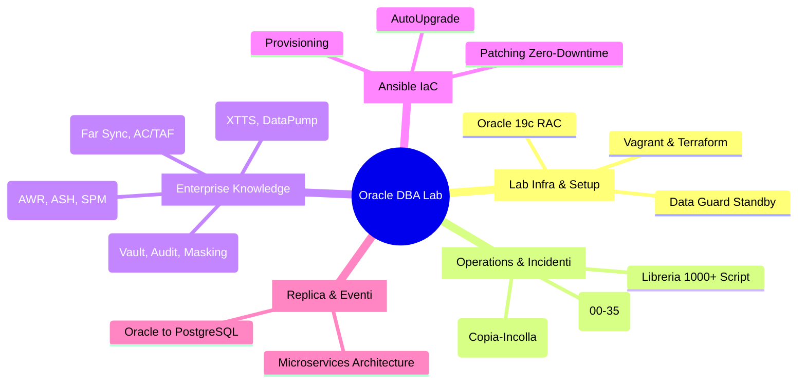
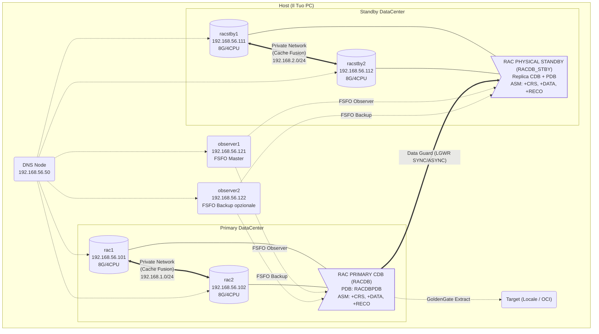

# 🏛️ Oracle RAC + Data Guard — Enterprise DBA Lab

[](https://www.oracle.com/database/)
[](https://github.com/Mohamed-DN/dba_oracle_lab/actions/workflows/ci.yml)
[](https://github.com/Mohamed-DN/dba_oracle_lab/actions/workflows/security-gates.yml)
[](https://github.com/Mohamed-DN/dba_oracle_lab/actions/workflows/release-governance.yml)
[](./automation/)
[](./docs/01_operations/04_libreria_script_completa/)
[](./docs/04_governance_learning/03_esami_e_carriera/VALIDAZIONE_BEST_PRACTICES.md)
[](./LICENSE)

> Guida pratica e operativa per costruire e gestire un laboratorio Oracle RAC + Data Guard.
> **Core del repository: Lab Fase 0→8.** Tutto il resto è estensione operativa/avanzata.

## 📑 Navigazione Rapida (livello 1)

- 🧭 **Start Here:** [mappa operativa rapida](./START_HERE.md)
- 🟢 **Fondamenti:** [Indice area](./docs/04_governance_learning/01_fondamenti_teorici/README.md)
- 🏛️ **Core Lab 0→8:** [Indice area](./docs/03_infra_lab/02_oracle_installation_asm/README.md) · [Vagrant Lab](./vagrant_rac_dataguard/README.md)
- 🔵 **High Availability:** [Indice area](./docs/02_core_dba/04_high_availability_and_rac/README.md)
- **SHAMS PROJECT Data Guard:** [blueprint S1-S4 e SOP PEYTECH](./docs/02_core_dba/04_high_availability_and_rac/SHAMS_PROJECT/README.md)
- 🟡 **Backup & Recovery:** [Indice area](./docs/02_core_dba/02_backup_and_recovery/README.md)
- 🟠 **Amministrazione:** [Indice area](./docs/02_core_dba/01_administration_and_security/README.md)
- 🔴 **Performance & Diagnostica:** [Indice area](./docs/02_core_dba/03_performance_and_diagnostics/README.md)
- 🟣 **Patching & Upgrade:** [Indice area](./docs/02_core_dba/05_patching_and_upgrades/README.md) · [Upgrade 19c → 26ai](./docs/02_core_dba/05_patching_and_upgrades/GUIDA_UPGRADE_19C_TO_26AI.md)
- 🔄 **Replica & Migrazione:** [Indice area](./docs/02_core_dba/07_replication_goldengate/README.md)
- 📊 **Monitoring:** [Indice area](./docs/02_core_dba/06_monitoring_systems/README.md)
- ☁️ **Cloud OCI & Terraform:** [Indice area](./docs/03_infra_lab/03_cloud_oci/README.md) · [Codice Terraform](./terraform/oci_base_infrastructure/README.md)
- 🐳 **Containerizzazione 26ai:** [Guida Podman/Docker](./docs/03_infra_lab/04_containerization/GUIDA_ORACLE_26AI_PODMAN_DOCKER.md)
- 🎓 **Esami & Carriera:** [Indice area](./docs/04_governance_learning/03_esami_e_carriera/README.md)
- 🛠️ **Strumenti operativi:** [Command Center](./docs/01_operations/01_cheat_sheets/CS_ORACLE_TOOLS_COMMAND_CENTER.md) · [Runbook](./docs/01_operations/02_runbooks_incidenti/README.md) · [Script SQL](./docs/01_operations/03_scripts_pronti/README.md) · [Libreria script](./docs/01_operations/04_libreria_script_completa/README.md)
- 🤖 **Automazione/IaC:** [Ansible](./automation/README.md)
- 🧭 **Indice totale unico:** [docs/README.md](./docs/README.md)

---

## 🗺️ Mappa del Repository (Ecosistema Enterprise)



---

## 📂 Struttura del Repository (Come orientarsi)
Questo laboratorio è diviso in 4 macro-aree principali per facilitare la navigazione:

*   🛠️ **`01_operations/`**: Il tuo "Pronto Soccorso". Contiene script pronti all'uso, Cheat Sheets rapidi e i Runbook per risolvere gli incidenti di produzione (es. database bloccato, performance degradate). **(Da usare durante le emergenze)**.
*   🧠 **`02_core_dba/`**: La libreria della conoscenza Enterprise. Contiene tutte le guide approfondite e le procedure architetturali (Data Guard, Backup RMAN, Patching, Tuning, Security, GoldenGate). **(Da usare per studiare e progettare)**.
*   🏗️ **`03_infra_lab/`**: Le guide per preparare infrastruttura, macchine virtuali, cloud e container e per installare Oracle. Il codice eseguibile Vagrant e Terraform vive nelle directory dedicate alla radice. **(Da usare per tirare su il lab)**.
*   🎓 **`04_governance_learning/`**: Regole d'oro, standard architetturali, roadmap di studio per Junior/Senior e preparazione per le certificazioni OCP. **(Da usare per la crescita professionale)**.

Le quattro macro-aree precedenti vivono sotto `docs/`. Le directory operative alla radice
completano il repository:

| Directory | Contenuto |
|---|---|
| [`automation/`](./automation/) | Playbook Ansible per installazione, manutenzione e controlli |
| [`scripts/`](./scripts/) | Script SQL e shell mantenuti dal progetto |
| [`vagrant_rac_dataguard/`](./vagrant_rac_dataguard/) | Provisioning Vagrant del lab RAC + Data Guard |
| [`terraform/`](./terraform/) | Infrastruttura OCI gestita con Terraform |
| [`.github/`](./.github/) · [`policy/`](./policy/) · [`security/`](./security/) · [`reliability/`](./reliability/) · [`tests/`](./tests/) | CI, policy, controlli di sicurezza, KPI e test |
| [`images/`](./images/) | Asset grafici usati dalla documentazione |

<details>
<summary>🌲 <b>Clicca per espandere l'alberatura documentale principale (sintesi)</b></summary>

```text
docs/
+-- 01_operations
|   +-- 01_cheat_sheets
|   |   +-- CS_ADRCI.md
|   |   +-- CS_ASMCMD.md
|   |   +-- CS_DGMGRL.md
|   |   +-- CS_GOLDENGATE.md
|   |   +-- CS_LSNRCTL_NET.md
|   |   +-- CS_MASTER_DBA.md
|   |   +-- CS_OPATCH_DATAPATCH.md
|   |   +-- CS_ORACLE_TOOLS_COMMAND_CENTER.md
|   |   +-- CS_RMAN.md
|   |   +-- CS_SQLPLUS_SQLCL_DBCA_NETCA.md
|   |   +-- CS_SQL_ASSESSMENT.md
|   |   +-- CS_SRVCTL_CRSCTL.md
|   +-- 02_runbooks_incidenti
|       +-- GUIDA_MIGRAZIONE_MAA_BEST_PRACTICES.md
|       +-- RUNBOOK_00_TRIAGE_INCIDENTI_ORACLE.md
|       +-- RUNBOOK_01_MORNING_HEALTH_CHECK.md
|       +-- RUNBOOK_02_VERIFICA_BACKUP.md
|       +-- RUNBOOK_03_CHECK_DATAGUARD.md
|       +-- RUNBOOK_04_LOCK_SESSIONI_BLOCCATE.md
|       +-- RUNBOOK_05_QUERY_LENTA.md
|       +-- RUNBOOK_06_TABLESPACE_PIENO.md
|       +-- RUNBOOK_07_CPU_ALTA.md
|       +-- RUNBOOK_08_ORA_ERRORS.md
|       +-- RUNBOOK_09_GESTIONE_UTENTI.md
|       +-- RUNBOOK_10_START_STOP_RAC.md
|       +-- RUNBOOK_11_REVIEW_AWR.md
|       +-- RUNBOOK_12_CAPACITY_PLANNING_LIMITI.md
|       +-- RUNBOOK_13_REFRESH_SCHEMA_TEST.md
|       +-- RUNBOOK_14_CHAOS_NETWORK_PARTITION_DATAGUARD.md
|       +-- RUNBOOK_15_CHECKMK_AGENT_TLS_SMART_RAID_TROUBLESHOOTING.md
|       +-- RUNBOOK_16_RESIZE_TEMP.md
|       +-- RUNBOOK_17_PURGE_LOG_ORACLE.md
|       +-- RUNBOOK_18_GESTIONE_STATISTICHE_OPTIMIZER.md
|       +-- RUNBOOK_19_DIAGNOSI_BACKUP_RMAN_FALLITI_E_RESTORE_SENZA_BACKUP.md
|       +-- RUNBOOK_20_EXPORT_IMPORT_PROD_PREPROD.md
|       +-- RUNBOOK_21_GESTIONE_DB_LINK.md
|       +-- RUNBOOK_22_RMAN_DATAGUARD_CASI_RECOVERY_DR.md
|       +-- RUNBOOK_23_SQL_TUNING_CASI_ENTERPRISE.md
|       +-- RUNBOOK_24_GAP_ANALYSIS_COPERTURA_DBA.md
|       +-- RUNBOOK_25_ASM_STORAGE_INCIDENTI_ENTERPRISE.md
|       +-- RUNBOOK_26_LISTENER_SCAN_SERVICES_RAC.md
|       +-- RUNBOOK_27_TDE_WALLET_KEYSTORE_RUNBOOK.md
|       +-- RUNBOOK_28_SCHEDULER_JOBS_AUTOTASKS_RUNBOOK.md
|       +-- RUNBOOK_29_PATCHING_ORACLE_RAC_DATAGUARD.md
|       +-- RUNBOOK_30_MULTITENANT_PDB_OPERATIONS.md
|       +-- RUNBOOK_31_GOLDENGATE_INCIDENT_RUNBOOK.md
|       +-- RUNBOOK_32_ENTERPRISE_MANAGER_ALERT_RUNBOOK.md
|       +-- RUNBOOK_33_AUDIT_COMPLIANCE_EVIDENCE.md
|       +-- RUNBOOK_34_TCPS_WALLET_CERTIFICATI.md
|       +-- RUNBOOK_35_CAPACITY_FORECAST_ENTERPRISE.md
+-- 02_core_dba
|   +-- 01_administration_and_security
|   |   +-- GUIDA_ACL_NETWORK_ORACLE.md
|   |   +-- GUIDA_AGGIUNTA_DISCHI_ASM.md
|   |   +-- GUIDA_ANSIBLE_TEMPLATES.md
|   |   +-- GUIDA_CDB_PDB_UTENTI.md
|   |   +-- GUIDA_CHECKLIST_SECURITY_BASELINE.md
|   |   +-- GUIDA_DATABASE_VAULT_ENTERPRISE.md
|   |   +-- GUIDA_DATA_MASKING_REDACTION.md
|   |   +-- GUIDA_IDENTITA_ORACLE_E_SERVIZI.md
|   |   +-- GUIDA_LISTENER_SERVICES_DBA.md
|   |   +-- GUIDA_PACKAGE_MONITOR_DDL.md
|   |   +-- GUIDA_PASSWORD_ROLLOUT_ENTERPRISE.md
|   |   +-- GUIDA_SCHEDULER_JOBS.md
|   |   +-- GUIDA_SECURITY_HARDENING.md
|   |   +-- GUIDA_SERVIZI_APPLICATIVI_RAC.md
|   |   +-- GUIDA_SETUP_LDAP_ENTERPRISE.md
|   |   +-- GUIDA_STORAGE_LUN_LVM_UDEV_ASM_ASMLIB_AFD.md
|   |   +-- GUIDA_TDE_IN_PROFONDITA.md
|   |   +-- GUIDA_UNIFIED_AUDITING_MIGRAZIONE.md
|   +-- 02_backup_and_recovery
|   |   +-- GUIDA_DATA_PUMP.md
|   |   +-- GUIDA_FASE5_RMAN_BACKUP.md
|   |   +-- GUIDA_MIGRAZIONE_XTTS_RMAN.md
|   |   +-- GUIDA_RMAN_COMANDI_ENTERPRISE.md
|   |   +-- GUIDA_RMAN_COMPLETA_19C.md
|   |   +-- GUIDA_TUNING_DATA_PUMP_ENTERPRISE.md
|   +-- 03_performance_and_diagnostics
|   |   +-- GUIDA_ADRCI_DIAGNOSTICA_ORACLE.md
|   |   +-- GUIDA_ADRCI_TRACE_ENTERPRISE.md
|   |   +-- GUIDA_AWR_ASH_ADDM.md
|   |   +-- GUIDA_SQL_PLAN_MANAGEMENT_BASELINES.md
|   |   +-- GUIDA_SQL_TUNING_SET_ADVISORS.md
|   |   +-- GUIDA_TOP_100_SCRIPT_DBA.md
|   |   +-- GUIDA_TROUBLESHOOTING_COMPLETO.md
|   +-- 04_high_availability_and_rac
|   |   +-- GUIDA_APPLICATION_CONTINUITY_TAF.md
|   |   +-- GUIDA_FAILOVER_E_REINSTATE.md
|   |   +-- GUIDA_FAR_SYNC_DATAGUARD.md
|   |   +-- GUIDA_FASE3_RAC_STANDBY.md
|   |   +-- GUIDA_FASE4_DATAGUARD_DGMGRL.md
|   |   +-- GUIDA_FASE4B_FSFO_OBSERVER.md
|   |   +-- GUIDA_FLASHBACK_DATABASE.md
|   |   +-- GUIDA_MAA_BEST_PRACTICES.md
|   |   +-- GUIDA_PDB_DATAGUARD_SERVICES.md
|   |   +-- GUIDA_PRODUZIONE_RAC_DATAGUARD_NON_CDB.md
|   |   +-- GUIDA_PRODUZIONE_SINGLE_NODE_DATAGUARD_NON_CDB.md
|   |   +-- SHAMS_PROJECT/
|   |   +-- GUIDA_SWITCHOVER_COMPLETO.md
|   +-- 05_patching_and_upgrades
|   |   +-- GUIDA_AUTOUPGRADE_12C_TO_19C.md
|   |   +-- GUIDA_AUTOUPGRADE_19C_TO_26.md
|   |   +-- GUIDA_PATCHING_RAC.md
|   |   +-- GUIDA_UPGRADE_19C_TO_26AI.md
|   |   +-- GUIDA_UPGRADE_RU_RAC.md
|   +-- 06_monitoring_systems
|   |   +-- GUIDA_FASE6_ENTERPRISE_MANAGER.md
|   |   +-- GUIDA_MONITORING_OPENSOURCE.md
|   |   +-- GUIDA_SETUP_CHECKMK_ORACLE_ENTERPRISE.md
|   +-- 07_replication_goldengate
|       +-- GUIDA_FASE7_GOLDENGATE.md
|       +-- GUIDA_GOLDENGATE_19C_CHEAT_SHEET.md
|       +-- GUIDA_GOLDENGATE_19C_COMPLETA.md
|       +-- GUIDA_GOLDENGATE_26AI_NOVITA.md
|       +-- GUIDA_GOLDENGATE_AMBIENTI_CRITICI_BANCARI.md
|       +-- GUIDA_GOLDENGATE_CLASSIC_ARCHITECTURE_19C.md
|       +-- GUIDA_GOLDENGATE_COLLEGAMENTO_SOURCE_TARGET.md
|       +-- GUIDA_GOLDENGATE_GRANTS_PRIVILEGI_19C.md
|       +-- GUIDA_GOLDENGATE_MICROSERVICES_ARCHITECTURE_19C.md
|       +-- GUIDA_GOLDENGATE_ORACLE_TO_POSTGRESQL.md
|       +-- GUIDA_GOLDENGATE_PREREQUISITI_DB_ARCHITETTURA.md
|       +-- GUIDA_GOLDENGATE_QA_PROFESSIONALE.md
|       +-- GUIDA_GOLDENGATE_RUNBOOK_END_TO_END_19C.md
|       +-- GUIDA_GOLDENGATE_UPGRADE_19C_TO_26AI.md
|       +-- GUIDA_GOLDENGATE_USE_CASES_KNOWLEDGE_HUB.md
|       +-- GUIDA_MIGRAZIONE_GOLDENGATE.md
|       +-- GUIDA_MIGRAZIONE_ORACLE_POSTGRES.md
|       +-- GUIDA_TESTLOG_GOLDENGATE_TEMPLATE.md
|       +-- use_cases
|           +-- GUIDA_UC01_NO_DOWNTIME_MIGRATIONS.md
|           +-- GUIDA_UC02_HIGH_AVAILABILITY.md
|           +-- GUIDA_UC03_ANALYTICAL_DATA_INGEST.md
|           +-- GUIDA_UC04_AI_READY_DATA.md
|           +-- GUIDA_UC05_MULTICLOUD_DATA_INTEGRATION.md
|           +-- GUIDA_UC06_APPLICATION_DATA_STREAMS.md
|           +-- GUIDA_UC07_STREAM_PROCESSING_ANALYTICS.md
+-- 03_infra_lab
|   +-- 01_proxmox_hardware
|   |   +-- GUIDA_TRACK_PROXMOX_PRODUCTION_END_TO_END.md
|   +-- 02_oracle_installation_asm
|   |   +-- GUIDA_FASE0_SETUP_MACCHINE.md
|   |   +-- GUIDA_FASE1_PREPARAZIONE_OS.md
|   |   +-- GUIDA_FASE2_GRID_E_RAC.md
|   |   +-- GUIDA_FASE8_TEST_VERIFICA.md
|   |   +-- GUIDA_PERCORSO_ORACLE_LINUX8_ASMLIB_V3.md
|   |   +-- GUIDA_PERCORSO_LITE_SINGLE_NODE.md
|   |   +-- GUIDA_SSH_KEYS_RAC.md
|   |   +-- OBIETTIVI_E_CHECKLIST_FASI_0_8.md
|   +-- 03_cloud_oci
|   |   +-- GUIDA_CLOUD_GOLDENGATE.md
|   |   +-- GUIDA_RETE_LAB_OCI_GOLDENGATE.md
|   +-- 04_containerization
|       +-- GUIDA_ORACLE_26AI_PODMAN_DOCKER.md
+-- 04_governance_learning
    +-- 01_fondamenti_teorici
    |   +-- ANALISI_ORACLEBASE_VAGRANT.md
    |   +-- DIARIO_DI_BORDO.md
    |   +-- GLOSSARIO_ORACLE.md
    |   +-- GUIDA_ARCHITETTURA_ORACLE.md
    |   +-- GUIDA_CICLO_DI_VITA_TRANSAZIONE.md
    |   +-- GUIDA_COMANDI_DBA.md
    |   +-- GUIDA_LOCKING_CONCURRENCY_WAIT_EVENTS.md
    |   +-- GUIDA_MEMORIA_ORACLE_SGA_PGA.md
    |   +-- GUIDA_REDO_UNDO_CRASH_RECOVERY.md
    |   +-- LEARNING_PATH_JUNIOR_MID_SENIOR.md
    |   +-- PIANO_LABORATORIO.md
    |   +-- QUIZ_HANDS_ON_JUNIOR_MID_SENIOR.md
    |   +-- TEMPLATE_GUIDA_STANDARD.md
    +-- 02_enterprise_standards
    |   +-- COMMUNITY_ONBOARDING_PATH.md
    |   +-- COMMUNITY_ROADMAP.md
    |   +-- COMPATIBILITY_BY_AREA_19c_21c_23ai_26c.md
    |   +-- COMPATIBILITY_MATRIX.md
    |   +-- COMPATIBILITY_POLICY.md
    |   +-- DIDACTIC_COMPLIANCE_CHECKLIST.md
    |   +-- DIDACTIC_EXCELLENCE_STANDARD.md
    |   +-- GO_NO_GO_MASTER_MERGE_POLICY.md
    |   +-- MAA_SCORECARD.md
    |   +-- PRODUCTION_PROFILE.md
    |   +-- PUBLIC_KPI_SCOREBOARD.md
    |   +-- QUICKSTART_10_MINUTI.md
    |   +-- RELEASE_ENGINEERING_POLICY.md
    |   +-- RELIABILITY_FRAMEWORK.md
    |   +-- TROUBLESHOOTING_DECISION_TREE.md
    |   +-- VULNERABILITY_DISCLOSURE_POLICY.md
    +-- 03_esami_e_carriera
        +-- GUIDA_ATTIVITA_LAB_RAC.md
        +-- GUIDA_CATALOGO_ATTIVITA_DBA.md
        +-- GUIDA_CHECKLIST_ATTIVITA_DBA.md
        +-- GUIDA_COLLOQUIO_ORACLE_DBA_PRODUZIONE.md
        +-- GUIDA_DA_LAB_A_PRODUZIONE.md
        +-- GUIDA_ESAME_REVIEW.md
        +-- GUIDA_RIPASSO_CONCETTI_DBA.md
        +-- VALIDAZIONE_BEST_PRACTICES.md
```
</details>


---

## 🏗️ Architettura del Lab



### Contratto del Core Lab

| Elemento | Baseline |
|---|---|
| Database primary | CDB RAC `RACDB`, istanze `RACDB1` e `RACDB2` |
| PDB applicativa | `RACDBPDB` |
| Standby | physical standby RAC `RACDB_STBY` |
| Observer | `observer1` manuale, `observer2` opzionale |
| OS | OL7.9 track legacy; OL8 raccomandato per nuove VM |

Per nuove VM consulta l'[appendice Oracle Linux 8 e ASMLib v3](./docs/03_infra_lab/02_oracle_installation_asm/GUIDA_PERCORSO_ORACLE_LINUX8_ASMLIB_V3.md).

Feature opzionali soggette a gate licenza in produzione: Active Data Guard
`READ ONLY WITH APPLY`, algoritmi RMAN `LOW`/`MEDIUM`/`HIGH`, Management Pack e
altre opzioni richiamate dalle guide specialistiche.

---

## 📖 Esegui il Lab (Fase 0 → 8)

Segui le fasi **in ordine**. Ogni fase dipende dalla precedente.

> 📍 **[Indice centralizzato del percorso](./docs/04_governance_learning/03_esami_e_carriera/README.md)** — tabella completa, prerequisiti, roadmap e link a tutte le guide.

| # | Fase | Guida | Cosa Fai | Tempo |
|---|---|---|---|---|
| 0 | **Setup Macchine** | [GUIDA_FASE0](./docs/03_infra_lab/02_oracle_installation_asm/GUIDA_FASE0_SETUP_MACCHINE.md) | Crea VM VirtualBox, DNS, dischi ASM | 3-4h |
| 1 | **Preparazione OS** | [GUIDA_FASE1](./docs/03_infra_lab/02_oracle_installation_asm/GUIDA_FASE1_PREPARAZIONE_OS.md) | Rete, DNS, utenti, SSH, kernel | 2-3h |
| 2 | **Grid + RAC** | [GUIDA_FASE2](./docs/03_infra_lab/02_oracle_installation_asm/GUIDA_FASE2_GRID_E_RAC.md) | Grid, ASM, CDB `RACDB`, PDB `RACDBPDB` | 4-5h |
| 3 | **RAC Standby** | [GUIDA_FASE3](./docs/02_core_dba/04_high_availability_and_rac/GUIDA_FASE3_RAC_STANDBY.md) | RMAN Duplicate, Listener statico, MRP | 3-4h |
| 4 | **Data Guard** | [GUIDA_FASE4](./docs/02_core_dba/04_high_availability_and_rac/GUIDA_FASE4_DATAGUARD_DGMGRL.md) | DGMGRL Broker, Protection Mode, FASTSYNC | 2-3h |
| 4B | **Observer FSFO** | [GUIDA_FASE4B](./docs/02_core_dba/04_high_availability_and_rac/GUIDA_FASE4B_FSFO_OBSERVER.md) | Observer dedicato, wallet SEPS, failover automatico | 1-2h |
| 5 | **RMAN Backup** | [GUIDA_FASE5](./docs/02_core_dba/02_backup_and_recovery/GUIDA_FASE5_RMAN_BACKUP.md) | Strategia backup, cron, BCT, restore | 2h |
| 6 | **Enterprise Manager** | [GUIDA_FASE6](./docs/02_core_dba/06_monitoring_systems/GUIDA_FASE6_ENTERPRISE_MANAGER.md) | OEM Cloud Control 24ai + Agent | 4-5h |
| 7 | **GoldenGate** | [GUIDA_FASE7](./docs/02_core_dba/07_replication_goldengate/GUIDA_FASE7_GOLDENGATE.md) | MA TLS: Extract, Distribution Path, Replicat | 3-4h |
| 8 | **Test Verifica** | [GUIDA_FASE8](./docs/03_infra_lab/02_oracle_installation_asm/GUIDA_FASE8_TEST_VERIFICA.md) | Test end-to-end, stress, node crash | 2-3h |

> **Tempo totale stimato**: ~31-32 ore di lavoro pratico.

---

## ⚡ Procedure Utili e Pronto Intervento

Oltre alle 10 Guide Monumentali, ecco i link diretti agli strumenti più utili per salvarti la vita in produzione:

### 🔥 Top 5 Cheat Sheets (Comandi Rapidi)
1. 🩺 [Triage e Caccia all'Incidente](./docs/01_operations/01_cheat_sheets/CS_MASTER_DBA.md): Il punto di partenza per ogni disastro.
2. 💾 [RMAN 19c](./docs/01_operations/01_cheat_sheets/CS_RMAN.md): comandi, casi d'uso e recovery al volo.
3. 🛡️ [Data Guard (DGMGRL)](./docs/01_operations/01_cheat_sheets/CS_DGMGRL.md): Gestione standby e failover.
4. 🔄 [GoldenGate](./docs/01_operations/01_cheat_sheets/CS_GOLDENGATE.md): AdminClient MA e GGSCI Classic legacy.
5. 💽 [Storage ASM (ASMCMD)](./docs/01_operations/01_cheat_sheets/CS_ASMCMD.md): Gestione dischi e spazio esaurito.

### 🚨 Top 5 Runbooks (Risoluzione Incidenti)
1. 🔴 [Database Crash / Non Raggiungibile](./docs/01_operations/02_runbooks_incidenti/RUNBOOK_00_TRIAGE_INCIDENTI_ORACLE.md)
2. 🐢 [Query Lenta Improvvisa](./docs/01_operations/02_runbooks_incidenti/RUNBOOK_05_QUERY_LENTA.md)
3. 🔒 [Sessioni Bloccate (Lock/Deadlock)](./docs/01_operations/02_runbooks_incidenti/RUNBOOK_04_LOCK_SESSIONI_BLOCCATE.md)
4. 📈 [CPU al 100% o Memoria Esaurita](./docs/01_operations/02_runbooks_incidenti/RUNBOOK_07_CPU_ALTA.md)
5. 💾 [Spazio Tablespace Esaurito](./docs/01_operations/02_runbooks_incidenti/RUNBOOK_06_TABLESPACE_PIENO.md)

## 🏆 Le 10 Guide Monumentali (Livello Senior/Architect)
Abbiamo elevato le documentazioni chiave a veri e propri **Masterpiece Architetturali**. Queste guide contengono spiegazioni approfondite, diagrammi di flusso visivi, scenari di triage, comandi completi e best practices aziendali:

1. 🛡️ **[Database Vault Enterprise](./docs/02_core_dba/01_administration_and_security/GUIDA_DATABASE_VAULT_ENTERPRISE.md)**: Separation of Duties, Realms, e Command Rules.
2. 🛡️ **[Unified Auditing & Compliance](./docs/02_core_dba/01_administration_and_security/GUIDA_UNIFIED_AUDITING_MIGRAZIONE.md)**: Pure Mode, AUDSYS purge, e offload su SIEM Syslog.
3. 🛡️ **[Data Masking & Redaction](./docs/02_core_dba/01_administration_and_security/GUIDA_DATA_MASKING_REDACTION.md)**: Dynamic redaction in-transit vs Static masking per UAT/DEV.
4. ⚡ **[SQL Plan Management (SPM)](./docs/02_core_dba/03_performance_and_diagnostics/GUIDA_SQL_PLAN_MANAGEMENT_BASELINES.md)**: Prevenzione regressioni query, Baseline evolution e Adaptive Cursor Sharing.
5. ⚡ **[AWR, ASH & ADDM](./docs/02_core_dba/03_performance_and_diagnostics/GUIDA_AWR_ASH_ADDM.md)**: Analisi profonda Wait Events, estrazione HTML batch e diagnostica AI.
6. 💾 **[Migrazione Cross-Platform XTTS](./docs/02_core_dba/02_backup_and_recovery/GUIDA_MIGRAZIONE_XTTS_RMAN.md)**: Zero-downtime da AIX a Linux tramite Cross-Platform Transportable Tablespaces.
7. 💾 **[Tuning Data Pump Enterprise](./docs/02_core_dba/02_backup_and_recovery/GUIDA_TUNING_DATA_PUMP_ENTERPRISE.md)**: Parallelismo estremo e ottimizzazione per database multiterabyte.
8. 🔄 **[Application Continuity & TAF](./docs/02_core_dba/04_high_availability_and_rac/GUIDA_APPLICATION_CONTINUITY_TAF.md)**: Failover client trasparente, FAN e configuration jdbc.
9. 🔄 **[Far Sync Data Guard](./docs/02_core_dba/04_high_availability_and_rac/GUIDA_FAR_SYNC_DATAGUARD.md)**: Zero Data Loss geografico a lunghissima distanza senza penalità.
10. 🎯 **[Troubleshooting Completo](./docs/02_core_dba/03_performance_and_diagnostics/GUIDA_TROUBLESHOOTING_COMPLETO.md)**: La guida definitiva alla caccia al problema in ambienti Enterprise.

---

## Ordine Consigliato di Lettura / Esecuzione

Non leggere il repository in ordine alfabetico. Usa questo ordine, altrimenti rischi di entrare in GoldenGate, RMAN o troubleshooting senza avere prima rete, RAC, Data Guard e servizi stabili.

| Ordine | Modulo | Quando leggerlo/eseguirlo | Output atteso |
|---|---|---|---|
| 0 | [Fondamenti Oracle](./docs/04_governance_learning/01_fondamenti_teorici/README.md) | Prima di creare le VM | Capisci architettura Oracle, redo/undo, memoria, lock, wait event |
| 1 | [Lab Core Fase 0 -> 4B](./docs/03_infra_lab/02_oracle_installation_asm/README.md) | Primo blocco pratico obbligatorio | VM, DNS, OS, Grid, RAC, standby, Broker, Observer FSFO |
| 2 | [Backup & Monitoring Fase 5 -> 6](./docs/02_core_dba/02_backup_and_recovery/README.md) | Dopo Data Guard stabile | RMAN, restore, BCT, Enterprise Manager/monitoring |
| 3 | [GoldenGate prerequisiti e collegamento](./docs/02_core_dba/07_replication_goldengate/GUIDA_GOLDENGATE_PREREQUISITI_DB_ARCHITETTURA.md) | Prima della Fase 7 | Logging, GGADMIN, FRA, TNS, credential store, source/target connectivity |
| 4 | [GoldenGate 19c operativo](./docs/02_core_dba/07_replication_goldengate/GUIDA_GOLDENGATE_19C_COMPLETA.md) | Prima o durante Fase 7 | Concetti Extract, trail, Replicat, checkpoint, lag, troubleshooting |
| 5 | [Fase 7 GoldenGate Microservices](./docs/02_core_dba/07_replication_goldengate/GUIDA_FASE7_GOLDENGATE.md) | Dopo prerequisiti GoldenGate | Replica lab source -> target con Microservices Architecture |
| 6 | [GoldenGate Classic + migrazioni](./docs/02_core_dba/07_replication_goldengate/README.md) | Dopo il lab Microservices | GGSCI, Classic, Oracle->Oracle, Oracle->PostgreSQL, cutover, scenari enterprise |
| 7 | [Patching, upgrade e 26ai](./docs/02_core_dba/05_patching_and_upgrades/README.md) | Solo dopo 19c stabile | Upgrade DB, upgrade GoldenGate 19c->26ai, rollback, compatibilita |
| 8 | [Runbook, script e automazione](./docs/01_operations/02_runbooks_incidenti/README.md) | Day-2 operations | Health check, incident response, script SQL, Ansible |

Regole pratiche:

- Se stai costruendo il lab: esegui **Fase 0 -> 8** in sequenza.
- Se stai studiando GoldenGate: segui l'ordine della sezione **Replica & Migrazione**, non partire direttamente dalla Fase 7.
- Non fare upgrade 19c -> 26ai prima di conoscere bene GoldenGate 19c Microservices e Classic.

---

## 📚 Guide per Area Tematica

### 🟢 Fondamenti — leggi prima del lab

| Guida | Cosa Impari |
|---|---|
| [Architettura Oracle](./docs/04_governance_learning/01_fondamenti_teorici/GUIDA_ARCHITETTURA_ORACLE.md) | SGA, PGA, Redo Log, Undo, ASM, Cache Fusion |
| [**Ciclo di Vita di una Transazione**](./docs/04_governance_learning/01_fondamenti_teorici/GUIDA_CICLO_DI_VITA_TRANSAZIONE.md) | Anatomia di un UPDATE: Parsing, Cache, ITL, Redo, DBWR, LGWR |
| [Memory Architecture (SGA/PGA)](./docs/04_governance_learning/01_fondamenti_teorici/GUIDA_MEMORIA_ORACLE_SGA_PGA.md) | Deep Dive: Buffer Cache, Shared Pool, AMM vs ASMM, HugePages |
| [Redo/Undo & Crash Recovery](./docs/04_governance_learning/01_fondamenti_teorici/GUIDA_REDO_UNDO_CRASH_RECOVERY.md) | Deep Dive: Write-Ahead Logging, Checkpoint, Roll Forward/Back |
| [Locking, Concurrency & Wait Events](./docs/04_governance_learning/01_fondamenti_teorici/GUIDA_LOCKING_CONCURRENCY_WAIT_EVENTS.md) | Deep Dive: MVCC, ITL, Deadlocks, e Top 15 Wait Events |
| [Comandi DBA](./docs/04_governance_learning/01_fondamenti_teorici/GUIDA_COMANDI_DBA.md) | 100+ query SQL essenziali per il DBA |
| [**Analisi Base Vagrant**](./docs/04_governance_learning/01_fondamenti_teorici/ANALISI_ORACLEBASE_VAGRANT.md) | Studio approfondito della configurazione automatizzata |
| [Glossario](./docs/04_governance_learning/01_fondamenti_teorici/GLOSSARIO_ORACLE.md) | 100+ acronimi e termini Oracle spiegati |
| [Piano Laboratorio](./docs/04_governance_learning/01_fondamenti_teorici/PIANO_LABORATORIO.md) | 8 settimane × 3h/giorno, roadmap completa |
| [Diario di Bordo](./docs/04_governance_learning/01_fondamenti_teorici/DIARIO_DI_BORDO.md) | Note e avanzamento lavori del lab |

---

### 🔵 High Availability — Data Guard, Switchover, Failover

| Guida | Cosa Impari |
|---|---|
| [Switchover Completo](./docs/02_core_dba/04_high_availability_and_rac/GUIDA_SWITCHOVER_COMPLETO.md) | Switchover + Switchback passo-passo |
| [Failover + Reinstate](./docs/02_core_dba/04_high_availability_and_rac/GUIDA_FAILOVER_E_REINSTATE.md) | ⚠️ **NON obbligatorio nel lab** — vedi nota sotto |
| [Fase 4B — Observer FSFO](./docs/02_core_dba/04_high_availability_and_rac/GUIDA_FASE4B_FSFO_OBSERVER.md) | Observer dedicato, wallet SEPS e failover automatico |
| [SHAMS PROJECT: Blueprint Data Guard](./docs/02_core_dba/04_high_availability_and_rac/SHAMS_PROJECT/README.md) | PEYTECH: single/RAC, CDB/non-CDB, Broker, Active Data Guard e Observer FSFO |
| [Flashback Database](./docs/02_core_dba/04_high_availability_and_rac/GUIDA_FLASHBACK_DATABASE.md) | "Macchina del tempo" Oracle |
| [MAA Best Practices](./docs/02_core_dba/04_high_availability_and_rac/GUIDA_MAA_BEST_PRACTICES.md) | Oracle Maximum Availability Architecture |
| [Data Guard Far Sync](./docs/02_core_dba/04_high_availability_and_rac/GUIDA_FAR_SYNC_DATAGUARD.md) | **Nuovo**: Zero Data Loss a distanza geografica con istanza Far Sync |
| [Application Continuity & TAF](./docs/02_core_dba/04_high_availability_and_rac/GUIDA_APPLICATION_CONTINUITY_TAF.md) | **Nuovo**: Configurazione failover client trasparente lato DB e pool JDBC/UCP |

> ⚠️ **FAILOVER**: Operazione distruttiva. **Prima** di tentarla:
> 1. Spegni TUTTE le VM
> 2. **Copia/zippa l'intera cartella VirtualBox VMs** come backup
> 3. Poi prosegui — se si rompe tutto, ripristini dalla copia

---

### 🟡 Backup & Recovery

| Guida | Cosa Impari |
|---|---|
| [RMAN Completa 19c](./docs/02_core_dba/02_backup_and_recovery/GUIDA_RMAN_COMPLETA_19C.md) | Backup, restore, recovery, catalog, test pratici |
| [RMAN Comandi Enterprise](./docs/02_core_dba/02_backup_and_recovery/GUIDA_RMAN_COMANDI_ENTERPRISE.md) | Comandi RMAN, runbook e troubleshooting avanzato |
| [Data Pump](./docs/02_core_dba/02_backup_and_recovery/GUIDA_DATA_PUMP.md) | Export/Import con expdp/impdp |
| [Cross-Platform XTTS](./docs/02_core_dba/02_backup_and_recovery/GUIDA_MIGRAZIONE_XTTS_RMAN.md) | **Nuovo**: Migrazione cross-endian AIX/Solaris -> Linux con downtime minimo |
| [Tuning Data Pump Enterprise](./docs/02_core_dba/02_backup_and_recovery/GUIDA_TUNING_DATA_PUMP_ENTERPRISE.md) | **Nuovo**: Ottimizzazione Data Pump per database di grandi dimensioni (>10 TB) |

---

### 🟠 Amministrazione

| Guida | Cosa Impari |
|---|---|
| [CDB/PDB/Utenti](./docs/02_core_dba/01_administration_and_security/GUIDA_CDB_PDB_UTENTI.md) | Multitenant, PDB create/clone/plug, ruoli |
| [Listener e Services](./docs/02_core_dba/01_administration_and_security/GUIDA_LISTENER_SERVICES_DBA.md) | Listener, TNS, services in dettaglio |
| [Servizi Applicativi RAC](./docs/02_core_dba/01_administration_and_security/GUIDA_SERVIZI_APPLICATIVI_RAC.md) | TAF, FAN, CLB/RLB, Application Continuity |
| [Ansible Response Templates](./docs/02_core_dba/01_administration_and_security/GUIDA_ANSIBLE_TEMPLATES.md) | **Nuovo**: Come fare *silent install* al 100% con Jinja2 |
| [Gestione Dischi ASM](./docs/02_core_dba/01_administration_and_security/GUIDA_AGGIUNTA_DISCHI_ASM.md) | Add/remove dischi ASM (ASMLib + AFD) |
| [Storage LUN/LVM/udev/ASM](./docs/02_core_dba/01_administration_and_security/GUIDA_STORAGE_LUN_LVM_UDEV_ASM_ASMLIB_AFD.md) | LUN, PV/VG/LV, multipath, udev, ASMLib, AFD deprecato, scelte storage |
| [Oracle Scheduler](./docs/02_core_dba/01_administration_and_security/GUIDA_SCHEDULER_JOBS.md) | Job, chain, auto-tasks, monitoring |
| [Security Hardening](./docs/02_core_dba/01_administration_and_security/GUIDA_SECURITY_HARDENING.md) | TDE, Auditing, Encryption, Password Profiles |
| [TDE in Profondità](./docs/02_core_dba/01_administration_and_security/GUIDA_TDE_IN_PROFONDITA.md) | Keystore, master key, colonna/tablespace encryption, backup e operatività RAC/DG |
| [**Identità Oracle e Servizi**](./docs/02_core_dba/01_administration_and_security/GUIDA_IDENTITA_ORACLE_E_SERVIZI.md) | **MEGA-GUIDA**: DB_NAME vs SID vs SERVICE_NAME, Listener, Role-Based Services, Switchover |
| [LDAP / EUS / CMU](./docs/02_core_dba/01_administration_and_security/GUIDA_SETUP_LDAP_ENTERPRISE.md) | Integrazione Active Directory, EUSM, Wallet Orapki, Kerberos SSO, Proxy Auth |
| [Password Rollout](./docs/02_core_dba/01_administration_and_security/GUIDA_PASSWORD_ROLLOUT_ENTERPRISE.md) | Rotazione Password Zero-Downtime, Integrazione PAM, Verify Functions |
| [Oracle Database Vault](./docs/02_core_dba/01_administration_and_security/GUIDA_DATABASE_VAULT_ENTERPRISE.md) | **Nuovo**: Setup Database Vault, realms, realms authorization, separation of duties |
| [Unified Auditing & Compliance](./docs/02_core_dba/01_administration_and_security/GUIDA_UNIFIED_AUDITING_MIGRAZIONE.md) | **Nuovo**: Migrazione da traditional audit, custom policy, storage SYSAUX e purge automatico |
| [Data Masking & Redaction](./docs/02_core_dba/01_administration_and_security/GUIDA_DATA_MASKING_REDACTION.md) | **Nuovo**: Mascheramento dinamico con DBMS_REDACT e statico con Data Pump |

---

### 🔴 Performance & Diagnostica

| Guida | Cosa Impari |
|---|---|
| [Troubleshooting Completo](./docs/02_core_dba/03_performance_and_diagnostics/GUIDA_TROUBLESHOOTING_COMPLETO.md) | **MEGA-GUIDA**: metodo da zero, wait events, scenari reali |
| [AWR/ASH/ADDM](./docs/02_core_dba/03_performance_and_diagnostics/GUIDA_AWR_ASH_ADDM.md) | SQL Monitor, SPM, SQL Quarantine |
| [Top 100 Script DBA](./docs/02_core_dba/03_performance_and_diagnostics/GUIDA_TOP_100_SCRIPT_DBA.md) | I 100 script più utili ogni giorno |
| [ADRCI & Trace Enterprise](./docs/02_core_dba/03_performance_and_diagnostics/README.md) | ADR, alert log, trace file, incident package |
| [SQL Plan Management (SPM)](./docs/02_core_dba/03_performance_and_diagnostics/GUIDA_SQL_PLAN_MANAGEMENT_BASELINES.md) | **Nuovo**: Prevenzione delle regressioni delle query, baselines, evoluzione dei piani |
| [SQL Tuning Set & Advisors](./docs/02_core_dba/03_performance_and_diagnostics/GUIDA_SQL_TUNING_SET_ADVISORS.md) | **Nuovo**: DBMS_SQLTUNE, creazione STS, SQL Tuning Advisor, SQL Access Advisor |

---

### 🟣 Patching & Upgrade

| Guida | Cosa Impari |
|---|---|
| [Patching RAC](./docs/02_core_dba/05_patching_and_upgrades/GUIDA_PATCHING_RAC.md) | Combo Patch, OJVM, cleanup |
| [Upgrade RU RAC](./docs/02_core_dba/05_patching_and_upgrades/GUIDA_UPGRADE_RU_RAC.md) | Rolling upgrade, skip version, rollback |
| [AutoUpgrade 12c → 19c](./docs/02_core_dba/05_patching_and_upgrades/GUIDA_AUTOUPGRADE_12C_TO_19C.md) | AutoUpgrade completo con config.cfg |
| [AutoUpgrade 19c → 26c](./docs/02_core_dba/05_patching_and_upgrades/GUIDA_AUTOUPGRADE_19C_TO_26.md) | Nuova Long-Term Release |

---

### 🔄 Replica & Migrazione

> Ordine consigliato: prima prerequisiti, grant e collegamento, poi GoldenGate 19c, poi esecuzione Microservices, poi Classic/migrazioni, infine 26ai.

| Ordine | Guida | Cosa Impari |
|---|---|---|
| 1 | [Prerequisiti DB GoldenGate](./docs/02_core_dba/07_replication_goldengate/GUIDA_GOLDENGATE_PREREQUISITI_DB_ARCHITETTURA.md) | Logging, supplemental logging, GGADMIN, FRA, trail retention |
| 2 | [Grant e Privilegi GoldenGate 19c](./docs/02_core_dba/07_replication_goldengate/GUIDA_GOLDENGATE_GRANTS_PRIVILEGI_19C.md) | `DBMS_GOLDENGATE_AUTH`, CDB/PDB, target DML, PostgreSQL, no `GRANT DBA` |
| 3 | [Collegamento Source e Target](./docs/02_core_dba/07_replication_goldengate/GUIDA_GOLDENGATE_COLLEGAMENTO_SOURCE_TARGET.md) | TNS, credential store, Distribution/Receiver, Classic Pump, PostgreSQL/ODBC, firewall |
| 4 | [GoldenGate in ambienti critici/bancari](./docs/02_core_dba/07_replication_goldengate/GUIDA_GOLDENGATE_AMBIENTI_CRITICI_BANCARI.md) | Rete segregata, firewall, TLS/WSS/mTLS, target-initiated path, audit, governance |
| 5 | [GoldenGate 19c Completa](./docs/02_core_dba/07_replication_goldengate/GUIDA_GOLDENGATE_19C_COMPLETA.md) | Manuale enterprise: architettura, security, RAC/DG, troubleshooting |
| 6 | [Runbook End-to-End GoldenGate 19c](./docs/02_core_dba/07_replication_goldengate/GUIDA_GOLDENGATE_RUNBOOK_END_TO_END_19C.md) | Procedura da zero: assessment, grant, Extract, trail, Replicat, heartbeat, cutover |
| 7 | [Microservices Architecture 19c](./docs/02_core_dba/07_replication_goldengate/GUIDA_GOLDENGATE_MICROSERVICES_ARCHITECTURE_19C.md) | Service Manager, Admin Server, Distribution/Receiver, REST, Admin Client |
| 8 | [Fase 7 GoldenGate](./docs/02_core_dba/07_replication_goldengate/GUIDA_FASE7_GOLDENGATE.md) | Esecuzione pratica del lab Microservices |
| 9 | [Classic Architecture 19c](./docs/02_core_dba/07_replication_goldengate/GUIDA_GOLDENGATE_CLASSIC_ARCHITECTURE_19C.md) | GGSCI, Manager, Extract, Pump, Collector, Replicat |
| 10 | [Migrazione GoldenGate Oracle -> Oracle](./docs/02_core_dba/07_replication_goldengate/GUIDA_MIGRAZIONE_GOLDENGATE.md) | Zero-downtime migration Oracle -> Oracle |
| 11 | [Oracle -> PostgreSQL](./docs/02_core_dba/07_replication_goldengate/GUIDA_GOLDENGATE_ORACLE_TO_POSTGRESQL.md) | Replica eterogenea, datatype mapping, initial load e cutover |
| 12 | [Cheat Sheet GoldenGate 19c](./docs/02_core_dba/07_replication_goldengate/GUIDA_GOLDENGATE_19C_CHEAT_SHEET.md) | Comandi GGSCI, Admin Client, SQL e troubleshooting |
| 13 | [Q&A Tecnico GoldenGate](./docs/02_core_dba/07_replication_goldengate/GUIDA_GOLDENGATE_QA_PROFESSIONALE.md) | Domande/risposte professionali su GoldenGate |
| 14 | [Use Case e Knowledge Hub](./docs/02_core_dba/07_replication_goldengate/GUIDA_GOLDENGATE_USE_CASES_KNOWLEDGE_HUB.md) | Topologie, top 7 use case con link alle guide operative dedicate |
| 15 | [Novita GoldenGate 26ai](./docs/02_core_dba/07_replication_goldengate/GUIDA_GOLDENGATE_26AI_NOVITA.md) | Evoluzione 26ai, AI service, nuove compatibilita, Microservices-first |
| 16 | [Upgrade GoldenGate 19c -> 26ai](./docs/02_core_dba/07_replication_goldengate/GUIDA_GOLDENGATE_UPGRADE_19C_TO_26AI.md) | Upgrade MA, percorso Classic, backup, rollback e validazioni |

---

### 📊 Monitoring

| Guida | Cosa Impari |
|---|---|
| [Monitoring Enterprise](./docs/02_core_dba/06_monitoring_systems/GUIDA_SETUP_CHECKMK_ORACLE_ENTERPRISE.md) | Guida completa all'installazione, UI, Agent, regole Oracle, BI, Distributed Monitoring e Grafana. |
| [Monitoring Opensource](./docs/02_core_dba/06_monitoring_systems/GUIDA_MONITORING_OPENSOURCE.md) | **Checkmk vs Zabbix vs Prometheus+Grafana** — guida installazione completa |
| [Enterprise Manager 24ai](./docs/02_core_dba/06_monitoring_systems/GUIDA_FASE6_ENTERPRISE_MANAGER.md) | OEM Cloud Control 24ai: OMS, Agent, discovery |

---

### ☁️ Cloud OCI — Opzionale

> Percorso alternativo avanzato: replicare verso Oracle Cloud (OCI ARM Free Tier).

| Guida | Cosa Impari |
|---|---|
| [GoldenGate verso OCI](./docs/03_infra_lab/03_cloud_oci/GUIDA_CLOUD_GOLDENGATE.md) | Target su OCI, Free vs Enterprise |
| [Rete Lab ↔ OCI](./docs/03_infra_lab/03_cloud_oci/GUIDA_RETE_LAB_OCI_GOLDENGATE.md) | VPN, SSH tunnel, NSG |

---

### 🎓 Esami & Carriera

| Guida | Cosa Impari |
|---|---|
| [Dossier Colloquio Oracle DBA Produzione](./docs/04_governance_learning/03_esami_e_carriera/GUIDA_COLLOQUIO_ORACLE_DBA_PRODUZIONE.md) | 260 domande, 15 drill Sev1, piano di studio e mock interview |
| [Ripasso Concetti DBA](./docs/04_governance_learning/03_esami_e_carriera/GUIDA_RIPASSO_CONCETTI_DBA.md) | 12 sezioni Q&A su architettura, RAC, DG, performance, scenari |
| [Preparazione Esami](./docs/04_governance_learning/03_esami_e_carriera/GUIDA_ESAME_REVIEW.md) | 1Z0-082 + 1Z0-083 completo |
| [Da Lab a Produzione](./docs/04_governance_learning/03_esami_e_carriera/GUIDA_DA_LAB_A_PRODUZIONE.md) | Sizing, HugePages, security |
| [Attività DBA](./docs/04_governance_learning/03_esami_e_carriera/GUIDA_ATTIVITA_DBA.md) | Batch Jobs, AWR, Patching, DataPump |
| [Preparazione Attività DBA](./docs/04_governance_learning/03_esami_e_carriera/GUIDA_ATTIVITA_LAB_RAC.md) | Attività reali, responsabilità operative e mindset professionale |
| [Validazione Best Practices](./docs/04_governance_learning/03_esami_e_carriera/VALIDAZIONE_BEST_PRACTICES.md) | Audit 54 punti, scorecard 98% |

---

## 🛠️ Strumenti Operativi

### Script SQL per Scenario (`docs/01_operations/03_scripts_pronti/`)

> **15 script pronti al copia-incolla, inclusi controlli RAC con GV$** — [Indice completo](./docs/01_operations/03_scripts_pronti/README.md)

| Script | Scenario | Errori Coperti |
|---|---|---|
| [01 Tablespace/Datafile](./docs/01_operations/03_scripts_pronti/01_tablespace_datafile.sql) | Bigfile vs Smallfile, maxsize, resize | ORA-01654, ORA-01653 |
| [02 UNDO/TEMP](./docs/01_operations/03_scripts_pronti/02_undo_temp.sql) | Undo pieno, temp piena, retention | ORA-01555, ORA-30036 |
| [03 FRA/Archivelog](./docs/01_operations/03_scripts_pronti/03_fra_archivelog.sql) | FRA piena → DB SUSPEND! Data Pump impact | ORA-19815, ORA-00257 |
| [04 Data Pump](./docs/01_operations/03_scripts_pronti/04_datapump_operativo.sql) | Export/Import sicuri, pre-check FRA | Prevenzione |
| [05 ASM Storage](./docs/01_operations/03_scripts_pronti/05_asm_storage.sql) | Diskgroup, AU_SIZE, limiti | Capacity planning |
| [06 Sessioni/Lock](./docs/01_operations/03_scripts_pronti/06_sessioni_lock.sql) | Chi blocca chi, kill session | "App bloccata!" |
| [07 Performance](./docs/01_operations/03_scripts_pronti/07_performance_quick.sql) | Top SQL, wait events, hit ratio | "DB lento!" |
| [08 RMAN Backup](./docs/01_operations/03_scripts_pronti/08_rman_backup_status.sql) | Ultimo backup, fallimenti | Morning check |
| [09 Data Guard](./docs/01_operations/03_scripts_pronti/09_dataguard_status.sql) | Lag, GAP, MRP, switchover ready | Morning check |
| [10 Oggetti/Schema](./docs/01_operations/03_scripts_pronti/10_oggetti_schema.sql) | Invalidi, segmenti grandi, recyclebin | Post-upgrade |
| [11 TEMP Resize](./docs/01_operations/03_scripts_pronti/11_temp_resize.sql) | TEMP/tempfile, ORA-01652 | Capacity |
| [12 Log Purge/Audit](./docs/01_operations/03_scripts_pronti/12_log_purge_audit.sql) | FRA, audit cleanup | Manutenzione |
| [13 Monitor DDL](./docs/01_operations/03_scripts_pronti/13_monitor_ddl_package.sql) | Audit DDL con package/trigger | Governance |
| [14 Optimizer Stats](./docs/01_operations/03_scripts_pronti/14_optimizer_stats.sql) | Stale stats, gather mirato | Performance |
| [15 RAC Global Health](./docs/01_operations/03_scripts_pronti/15_rac_global_health.sql) | GV$, servizi, blocker cross-instance | RAC |

---

### Runbook Operativi (`docs/01_operations/02_runbooks_incidenti/`)

> **36 runbook operativi (`00`-`35`)** — [Indice completo](./docs/01_operations/02_runbooks_incidenti/README.md)

| # | Procedura | Frequenza |
|---|---|---|
| 01 | [Morning Health Check](./docs/01_operations/02_runbooks_incidenti/RUNBOOK_01_MORNING_HEALTH_CHECK.md) | Ogni mattina |
| 02 | [Verifica Backup](./docs/01_operations/02_runbooks_incidenti/RUNBOOK_02_VERIFICA_BACKUP.md) | Ogni mattina |
| 03 | [Check Data Guard](./docs/01_operations/02_runbooks_incidenti/RUNBOOK_03_CHECK_DATAGUARD.md) | Ogni mattina |
| 04-08 | [Lock, Query Lenta, TBS Pieno, CPU, ORA-Errors](./docs/01_operations/02_runbooks_incidenti/README.md) | Su richiesta / alert |
| 09-11 | [Gestione Utenti, Start/Stop RAC, Review AWR](./docs/01_operations/02_runbooks_incidenti/README.md) | Settimanale |
| 12-13 | [Capacity Planning, Refresh Schema Test](./docs/01_operations/02_runbooks_incidenti/README.md) | Mensile |
| 14-35 | [Drill ed estensioni enterprise](./docs/01_operations/02_runbooks_incidenti/README.md) | Incidenti complessi, manutenzione e review |

---

### Ansible Automation (`automation/`)

> **14 playbook production-grade** + ruoli modulari — [Indice completo](./automation/README.md)

| Playbook | Cosa Fa |
|---|---|
| [01 Oracle Install](./automation/playbooks/oracle_install.yml) | Installazione 19c silent |
| [02 Oracle Patching](./automation/playbooks/oracle_patching.yml) | Rolling patch (zero downtime) |
| [03 AutoUpgrade](./automation/playbooks/oracle_autoupgrade.yml) | 3 fasi: pre_upgrade → upgrade → finalize |
| [04 Health Check](./automation/playbooks/daily_health_check.yml) | Morning check automatizzato |
| [05 RMAN Backup](./automation/playbooks/rman_backup.yml) | Backup + crosscheck + validate |
| [06 DG Switchover](./automation/playbooks/dataguard_switchover.yml) | Switchover Data Guard automatizzato |
| [07 Users & TBS](./automation/playbooks/create_users_tablespaces.yml) | Creazione BIGFILE Tablespace e Utenti |
| [08 Gather Stats](./automation/playbooks/gather_stats.yml) | DBMS_STATS automatizzato via Ansible |
| [09 DataPump Export](./automation/playbooks/datapump_export.yml) | Export parallelo di schemi applicativi |
| [10 RAC Services](./automation/playbooks/manage_services.yml) | Start/Stop srvctl dei servizi RAC |
| [11 CDB/PDB](./automation/playbooks/create_cdb_pdb.yml) | Creazione CDB/PDB idempotente |
| [12 DBA Maintenance](./automation/playbooks/dba_maintenance.yml) | Maintenance periodica DB |
| [13 MAA Guardrails](./automation/playbooks/maa_guardrails.yml) | Validazioni MAA e compliance DG |
| [14 Checkmk Bootstrap](./automation/playbooks/checkmk_oracle_checks_setup.yml) | Bootstrap Checkmk + check Oracle/SMART |

---

### Libreria Oracle (`docs/01_operations/04_libreria_script_completa/`)

> **~1000 script** dalla community Oracle — [Indice completo](./docs/01_operations/04_libreria_script_completa/README.md)

| Area | Script | Cosa Trovi |
|---|---|---|
| [Monitoring](./docs/01_operations/04_libreria_script_completa/monitoring_scripts/) | 586 | Sessioni, lock, CPU, I/O, ASH, rete |
| [Performance](./docs/01_operations/04_libreria_script_completa/performance_tuning/) | 225 | SPM, AWR, statistiche, SQL tuning |
| [Utilities](./docs/01_operations/04_libreria_script_completa/utilities/) | 103 | Scheduler, storage, CDB/PDB, profili |
| [Altro](./docs/01_operations/04_libreria_script_completa/README.md) | 86 | ASM, DG, utenti, patching, TDE, partizioni |

---

### Risorse Extra (Archivio)

| Documento | Descrizione |
|---|---|
| [Catalogo Attività DBA](./docs/04_governance_learning/03_esami_e_carriera/GUIDA_CATALOGO_ATTIVITA_DBA.md) | Panorama completo delle attività DBA reali |
| [Checklist Operativa](./docs/04_governance_learning/03_esami_e_carriera/GUIDA_CHECKLIST_ATTIVITA_DBA.md) | Runbook giornaliero/settimanale/mensile |
| [Dossier Colloquio Oracle DBA Produzione](./docs/04_governance_learning/03_esami_e_carriera/GUIDA_COLLOQUIO_ORACLE_DBA_PRODUZIONE.md) | 260 domande tecniche e 15 drill Sev1 per colloqui senior |
| [Domande Tecniche DBA](./docs/04_governance_learning/03_esami_e_carriera/GUIDA_RIPASSO_CONCETTI_DBA.md) | Domande e risposte per esami e certificazioni |

---

## 📅 Roadmap Lab (8 settimane, 3h/giorno)

| Settimana | Focus | Output |
|---|---|---|
| 1 | OS + Grid + ASM | Grid stabile, prerequisiti chiusi |
| 2 | RAC + standby | RAC operativo + standby pronto |
| 3 | Data Guard + RMAN + GG | Broker OK, backup validato, GG base |
| 4 | GG avanzato + HA test | 24+ test GoldenGate completati |
| 5 | EM + monitoring + cloud | OMS/Agent attivi, alerting funzionante |
| 6 | Migrazione Oracle → PG | Flusso end-to-end completato |
| 7 | Esame 1Z0-082 | 2 mock exam + revisione errori |
| 8 | Esame 1Z0-083 | 2 mock exam + runbook finali |

> Piano dettagliato giorno per giorno: [PIANO_LABORATORIO.md](./docs/04_governance_learning/01_fondamenti_teorici/PIANO_LABORATORIO.md)

---

## 🌐 Piano IP

| Hostname | IP Pubblica | IP Privata | IP VIP | Ruolo |
|---|---|---|---|---|
| dnsnode | 192.168.56.50 | — | — | DNS (Dnsmasq) |
| rac1 | 192.168.56.101 | 192.168.1.101 | .56.103 | RAC Primary N.1 |
| rac2 | 192.168.56.102 | 192.168.1.102 | .56.104 | RAC Primary N.2 |
| rac-scan | .56.105-107 | — | — | SCAN Primary |
| racstby1 | 192.168.56.111 | 192.168.2.111 | .56.113 | Standby N.1 |
| racstby2 | 192.168.56.112 | 192.168.2.112 | .56.114 | Standby N.2 |
| racstby-scan | .56.115-117 | — | — | SCAN Standby |
| observer1 | 192.168.56.121 | — | — | FSFO Observer dedicato |
| observer2 | 192.168.56.122 | — | — | FSFO backup Observer opzionale |

> Le VM Observer sono create manualmente e non fanno parte dello schema Vagrant del laboratorio.

---

## 📦 Software Necessario

| Software | Versione | Download |
|---|---|---|
| Oracle Linux | 7.9 track legacy / 8 raccomandato | [Oracle Linux ISOs](https://yum.oracle.com/oracle-linux-isos.html) |
| Grid Infrastructure | 19c (19.3) | [eDelivery](https://edelivery.oracle.com) |
| Oracle Database | 19c (19.3) | [eDelivery](https://edelivery.oracle.com) |
| Oracle Client Administrator | 19c | [eDelivery](https://edelivery.oracle.com) |
| Oracle GoldenGate | 19c core lab / 26ai upgrade awareness | [eDelivery](https://edelivery.oracle.com) |
| Enterprise Manager | 24ai per la Fase 6 del lab | [eDelivery](https://edelivery.oracle.com) |
| VirtualBox | 7.x | [virtualbox.org](https://www.virtualbox.org/wiki/Downloads) |

> 💡 Scarica TUTTO prima di iniziare! Lista completa in [Fase 0](./docs/03_infra_lab/02_oracle_installation_asm/GUIDA_FASE0_SETUP_MACCHINE.md).

---

## 📎 Riferimenti e Crediti

> Documentazione ufficiale Oracle, repository di ispirazione e tool di terze parti raccolti in un unico documento.

👉 **[REFERENCES.md](./REFERENCES.md)** — Oracle Docs · GoldenGate · OCI · Community repos (oraclebase, gwenshap, oravirt…) · Monitoring · IaC

---

<p align="center">
  <sub>Built with ☕ and <code>ORA-00001</code> errors — <a href="./LICENSE">MIT License</a> — <a href="./CONTRIBUTING.md">Contributing</a></sub>
</p>
