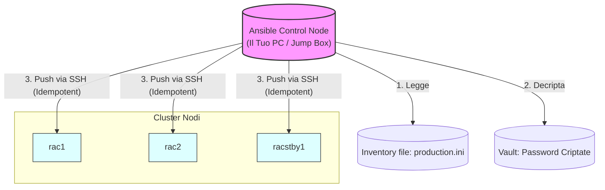

# 🤖 Automazione Oracle DBA con Ansible

> Playbook **production-grade** progettati per eliminare l'errore umano e standardizzare le attività critiche (Install, Patch, Upgrade).

---

## 🏗️ Ansible Workflow
Ansible agisce come un'orchestratore "Agentless", connettendosi via SSH ai nodi del cluster per eseguire operazioni atomiche e idempotenti.



---

## ⚖️ Perché Ansible (e NON altri strumenti)

| Forza | Dettaglio | Perché per il DBA? |
|---|---|---|
| **Agentless** | Zero software da installare sui server DB | Non sporca l'OS del database, evita problemi di versionamento Java/Python. |
| **Idempotenza** | Se un task è già fatto, non viene rieseguito | Posso lanciare un `01_install.yml` 10 volte: la prima installa, le altre 9 dicono "OK" in pochi secondi. |
| **Vault** | Sicurezza delle credenziali (SYS/SYSTEM/RMAN) | Permette di archiviare le password nel Git in formato criptato (AES-256). |

---

## 📂 Struttura Directory

- `ansible.cfg`: Configurazione globale per ottimizzare i timeout SSH.
- `inventory/`: Definizione degli host suddivisi per ambiente.
- `group_vars/`: Configurazioni specifiche (es. `ORACLE_BASE`, `ORACLE_HOME`).
- `playbooks/`: I "telecomandi" per le operazioni (es. Patching, Backup).
- `roles/`: La logica riutilizzabile (Pre-checks, Install, Monitoring).

---

## 🚀 Uso Rapido (Morning Health Check)

Il check più importante della giornata, automatizzato su tutti i nodi con un solo comando:

```bash
ansible-playbook -i inventory/production.ini playbooks/04_daily_health_check.yml
```

### Altre Operazioni Critiche:
- **Patching Rolling**: `ansible-playbook -i ... 02_oracle_patching.yml` (Applica patch un nodo alla volta senza fermare il servizio).
- **AutoUpgrade**: `ansible-playbook -i ... 03_oracle_autoupgrade.yml` (Migra il DB con la logica in 3 fasi).

---

## 🔐 Sicurezza: Ansible Vault

Non salvare MAI le password in chiaro. Usa il Vault:

```bash
# Crea un file criptato per le credenziali
ansible-vault create group_vars/vault.yml

# Esegui il playbook passando la password del vault
ansible-playbook playbooks/05_rman_backup.yml --ask-vault-pass
```

---

## 📎 Risorse Esterne Master
- [oravirt/ansible-oracle](https://github.com/oravirt/ansible-oracle) — Lo standard industriale (Collection ufficiale).
- [CruGlobal Upgrade Pattern](https://github.com/CruGlobal/ansible-oracle-db-upgrade) — Eccellenza nelle procedure di migrazione.
- [Oracle DevOps Series: Automate 19c with Ansible](https://medium.com/oracledevs/devops-series-automate-oracle-19c-rdbms-installations-with-ansible-github-43cfdf344a4a)
- [oravirt Feature List](https://github.com/oravirt/ansible-oracle/blob/master/doc/featurelist.adoc) — Matrice compatibilità completa
