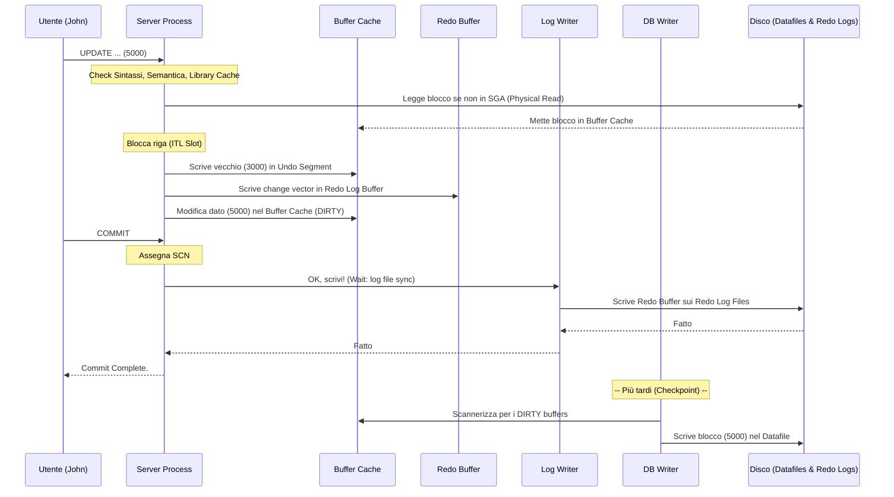

# 🧬 Il Ciclo di Vita di una Transazione: Anatomia di un UPDATE

> **Questa guida** è la risposta definitiva alla classica (e temutissima) domanda da colloquio per DBA Senior: *"Cosa succede ESATTAMENTE a livello di memoria, processi e disco quando un utente lancia un comando UPDATE e poi un COMMIT?"*.
>
> Spiegheremo la catena esatta degli eventi, millisecondo per millisecondo.

---

## 📑 Indice

1. [Fase 1: Arrivo e Parsing (Il Controllo)](#-fase-1-arrivo-e-parsing)
2. [Fase 2: Fetch e Buffer Cache (Il Recupero)](#-fase-2-fetch-e-buffer-cache)
3. [Fase 3: ITL e Locking (La Prenotazione)](#-fase-3-itl-e-locking)
4. [Fase 4: Undo e Redo (La Tripla Scrittura)](#-fase-4-undo-e-redo)
5. [Fase 5: Il COMMIT (Il Sigillo)](#-fase-5-il-commit)
6. [Fase 6: Il "Dopo" (DBWR e Checkpoint)](#-fase-6-il-dopo)
7. [Riassunto Visivo (Diagramma)](#-riassunto-visivo)
8. [Archivelog: Il Destino Finale del Redo](#-archivelog-il-destino-finale-del-redo)

---

**Lo Scenario**: L'utente John lancia il seguente comando tramite SQL*Plus:
```sql
UPDATE impiegati SET stipendio = 5000 WHERE id = 100;
```
*(Lo stipendio precedente era 3000)*. Assumiamo che la sessione non abbia ancora fatto COMMIT.

Ecco cosa fa Oracle, passo dopo passo.

---

## 🔍 Fase 1: Arrivo e Parsing

Quando il comando arriva al database (tramite il Listener), viene preso in carico dal **Server Process** dedicato alla sessione di John. 

1. **Syntax Check**: Sbagliato a scrivere `UPDATE`? Manca una virgola? Se sì, errore immediato (`ORA-00900`).
2. **Semantic Check**: Esiste la tabella `impiegati`? Esiste la colonna `stipendio`? John ha i permessi per modificarla? Oracle controlla il Data Dictionary.
3. **Shared Pool (Library Cache) Check**: Oracle trasforma la query in un hash e lo cerca nella **Library Cache**.
   - Se lo trova → **Soft Parse**. Riusa il piano di esecuzione già calcolato.
   - Se NON lo trova → **Hard Parse**. L'ottimizzatore (CBO) calcola il miglior piano di esecuzione (es: usare l'indice sulla colonna `id`). Questo consuma molta CPU.

---

## 💾 Fase 2: Fetch e Buffer Cache

Ora che Oracle sa *come* recuperare la riga (es. tramite un indice), deve portarla in memoria. In Oracle **nessuna modifica avviene direttamente su disco**.

1. Il Server Process cerca il **Blocco Dati** (tipicamente 8KB) che contiene la riga `id = 100` nel **Database Buffer Cache** (SGA).
2. **Logical Read**: Se il blocco è già in memoria, la query è super veloce.
3. **Physical Read**: Se il blocco non è nel Buffer Cache, il Server Process lo legge dal datafile su disco e lo copia nel Buffer Cache. (Wait event: `db file sequential read`).

---

## 🔐 Fase 3: ITL e Locking

Prima di modificare la riga nel Buffer Cache, Oracle deve assicurarsi che nessun altro la stia toccando.

1. **ITL (Interested Transaction List)**: Il Server Process guarda l'**header del blocco dati**. Cerca uno slot ITL libero. Se non c'è, prova a crearlo (fino al limite). Se il blocco è pieno zeppo e non c'è spazio per un nuovo slot ITL, l'utente aspetta (Wait event: `enq: TX - allocate ITL entry`).
2. **Record Locking**: La transazione scrive il suo ID (TxID) nello slot ITL e imposta un "lock bit" (un byte specifico) direttamente sulla riga `id = 100` all'interno del blocco. 
3. **Contesa**: Se quel lock bit era già impostato da un'altra transazione (es. Mary sta modificando lo stesso impiegato e non ha fatto commit), John viene **bloccato** in attesa (Wait event: `enq: TX - row lock contention`).

---

## 🧬 Fase 4: Undo e Redo (La Tripla Scrittura)

Se il lock ha successo, Oracle inizia la "tripla scrittura" interamente in memoria. Questa è l'essenza della sicurezza di Oracle.

1. **Undo (Il Passato)**: 
   - Oracle deve salvare il vecchio stipendio (`3000`) per permettere a John di fare `ROLLBACK` in caso di errore, e per permettere alle altre query lette nel frattempo di vedere il vecchio valore (Read Consistency - MVCC).
   - Genera l'undo record nel blocco dell'Undo Segment (anch'esso nel Buffer Cache).
2. **Redo (Il Futuro)**:
   - Oracle registra un "vettore di cambiamento" (change vector) nel **Redo Log Buffer** (SGA).
   - *Cosa c'è in questo redo?* Entrambe le modifiche! Dice: "Ho cambiato il valore in 5000 nel blocco X" + "Ho scritto il valore 3000 nel blocco undo Y". **Tutto genera redo**.
3. **Data Block (Il Presente)**:
   - Infine, modifica effettivamente il valore da `3000` a `5000` nel blocco dati situato nel Buffer Cache.
   - Questo blocco dati ora è segnato come **DIRTY** (sporco), perché il dato in memoria (5000) è diverso dal dato su disco (3000).

> [!WARNING]
> Fino a questo punto, **NULLA** è stato scritto sui dischi fisici. Tutto è successo velocissimamente nella RAM (SGA).

---

## 🛡️ Fase 5: Il COMMIT (Il Sigillo)

John è soddisfatto e lancia:
```sql
COMMIT;
```

Questo è il momento più critico. Il COMMIT de-sincronizza deliberatamente i dati dal loro registro di sicurezza.

1. **Assegnazione SCN**: Alla transazione viene assegnato un **System Change Number (SCN)** ufficiale (es: 98765432).
2. **LGWR Writes (La Magia)**: Il trucco di Oracle è qui. Il Server Process dice al processo background **LGWR** (Log Writer): *"Ehi, salva il Redo Log Buffer su disco, ora!"*
3. LGWR raccoglie tutto il Redo Log Buffer (comprese le registrazioni della transazione di John) e lo **scrive sequenzialmente** sui **Redo Log Files** su disco. LGWR è ultra-veloce perché fa una scrittura sequenziale e snella.
4. John aspetta finché riceve la conferma dal disco (Wait event: `log file sync`). Appena LGWR finisce, John riceve a video: `Commit complete`.
5. I lock vengono rilasciati e gli slot ITL vengono segnati come "liberi" per le transazioni future.

> [!IMPORTANT]
> **Dove sono i dati di John adesso?** 
> Il nuovo stipendio `5000` si trova nel **Buffer Cache (RAM)** e nei **Redo Log Files (Disco)**. 
> Nei *Datafiles* su disco c'è **ancora** il vecchio stipendio `3000`. 
> Se l'istanza crolla (power off) un nanosecondo dopo il "Commit complete", nessun problema: al riavvio, Oracle vedrà il commmit nei Redo e applicherà l'UPDATE ai datafiles prima di aprire il DB (Crash Recovery).

---

## 🧹 Fase 6: Il "Dopo" (DBWR e Checkpoint)

Ora il database è consistenze e sicuro, ma la memoria (Buffer Cache) è piena di blocchi "sporchi". Dobbiamo pulirli per fare spazio a nuove query.

1. **Il DBWR si sveglia**: In un momento indefinito *nel futuro*, il processo background **DBWR** (Database Writer) entra in azione. 
2. Perché si sveglia?
   - Si è raggiunto un **Checkpoint**.
   - Il Buffer Cache non ha più spazio vuoto.
   - È scattato un timeout interno (solitamente ogni 3 secondi c'è un checkpoint incrementale).
3. DBWR prende i buffer "dirty" (incluso il blocco dell'impiegato) e li scrive finalmente nei **Datafiles** su disco.
4. Solo da questo momento in poi, il disco contiene il valore `5000`.

---

## 🔄 Riassunto Visivo



---

## 🗄️ Archivelog: Il Destino Finale del Redo

I **Redo Log Files** sono circolari. Quando il Gruppo 1 è pieno, LGWR passa al Gruppo 2. Quando l'ultimo gruppo è pieno, LGWR ricomincia dal Gruppo 1 sovrascrivendolo.

*Cosa succede se sovrascriviamo una modifica prima di aver fatto un backup? La perdiamo per sempre.*

### ARCHIVELOG Mode

Se il database è in modalità `ARCHIVELOG` (ed in produzione lo è **sempre**), subentra un altro processo: l'**ARCn (Archiver)**.

1. Quando LGWR riempie il Redo Log Group 1 e fa lo "switch" al Group 2, il Group 1 diventa temporaneamente bloccato.
2. Si sveglia l'**ARCn**, che prende il Group 1 pieno e lo **copia per intero** in una cartella sicura (tipicamente nel Fast Recovery Area - FRA). Questa copia si chiama **Archived Redo Log**.
3. Solo quando l'ARCn (Archiver) ha confermato la fine della copia, il Gruppo 1 nel Redo Log circolare viene liberato e può essere sovrascritto da LGWR al prossimo giro.

```
Se il database si corrompe domani, possiamo usare:
1. Il Full Backup (RMAN) di domenica scorsa.
2. Gli Archived Redo Logs da domenica fino a oggi (ARCn).
3. Gli Online Redo Logs correnti (LGWR).
E recuperare il database fino all'ultimo COMMIT prima dell'errore (Point-in-Time Recovery).
```

### Riassunto della triade di scrittura

- **LGWR**: Scrive **piccolo, veloce, sequenziale, subito** (sui Redo Log). Garantisce che i dati non vadano mai persi (ACID Durability).
- **DBWR**: Scrive **grande, sparso, "con calma"** (sui Datafiles). Ottimizzato per non interferire con le performance del database.
- **ARCn**: Copia **a blocchi enormi, in background** (crea gli Archivelog). Garantisce il ripristino Point-in-Time.
