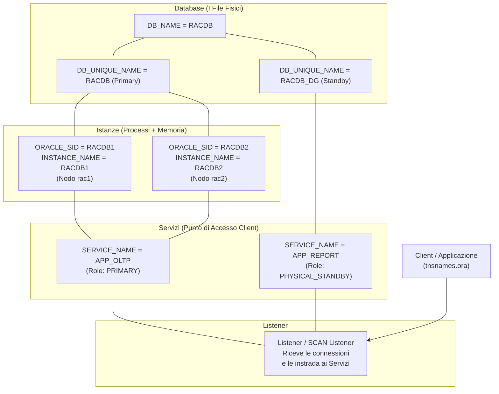

# 🔑 Guida Completa: Le Identità Oracle e l'Architettura dei Servizi

> **Questa guida** ti spiega **una volta per tutte** la differenza tra `DB_NAME`, `DB_UNIQUE_NAME`, `ORACLE_SID`, `SERVICE_NAME`, `INSTANCE_NAME`, e come si legano al Listener, al Data Guard, allo Switchover, e ai Servizi Applicativi.
>
> **Fonti**: Oracle Database Net Services Administrator's Guide 19c, Oracle Data Guard Concepts and Administration 19c, Oracle Maximum Availability Architecture (MAA) White Papers, My Oracle Support (MOS).

---

## 📑 Indice

1. [La Mappa delle Identità Oracle](#-1-la-mappa-delle-identità-oracle)
2. [Ogni Identità Spiegata nel Dettaglio](#-2-ogni-identità-spiegata-nel-dettaglio)
3. [Come si Collegano Tra Loro (Diagramma)](#-3-come-si-collegano-tra-loro)
4. [Il Listener: Registrazione Statica e Dinamica](#-4-il-listener-registrazione-statica-e-dinamica)
5. [Servizi Applicativi: Cosa Sono e Come Funzionano](#-5-servizi-applicativi-cosa-sono-e-come-funzionano)
6. [Data Guard e Switchover: Cosa Succede ai Servizi](#-6-data-guard-e-switchover-cosa-succede-ai-servizi)
7. [Il Pericolo: SERVICE_NAME Uguali su Primary e Standby](#-7-il-pericolo-service_name-uguali-su-primary-e-standby)
8. [L'Architettura Migliore: Role-Based Services](#-8-larchitettura-migliore-role-based-services)
9. [Strategia di Backup RMAN: Archivelog + Incremental + Full](#-9-strategia-di-backup-rman)
10. [Quick Reference: Comandi di Verifica](#-10-quick-reference-comandi-di-verifica)

---

## 🧬 1. La Mappa delle Identità Oracle

Prima di tutto, ecco la tabella riassuntiva. Dopo la tabella, ogni voce è spiegata in dettaglio.

| Parametro | Cosa Identifica | Dove Si Imposta | Può Cambiare? | Esempio nel Lab |
|---|---|---|---|---|
| **DB_NAME** | Il **database** (i file fisici) | `CREATE DATABASE`, `init.ora` | ❌ Quasi mai (richiede ricreazione del controlfile) | `RACDB` |
| **DB_UNIQUE_NAME** | La **copia specifica** del database | `init.ora` | ✅ Sì (con cautela) | `RACDB` (Primary), `RACDB_DG` (Standby) |
| **ORACLE_SID** | L'**istanza** (processo + memoria) sulla macchina | Variabile d'ambiente OS | ✅ Sì (ogni nodo ha il suo) | `RACDB1` (nodo 1), `RACDB2` (nodo 2) |
| **INSTANCE_NAME** | Nome dell'istanza **dentro Oracle** | `init.ora` | ❌ Fisso per istanza | `RACDB1`, `RACDB2` |
| **SERVICE_NAME** | Il **punto di connessione logico** per i client | `SERVICE_NAMES` param, `srvctl`, `DBMS_SERVICE` | ✅ Sì, multipli possibili | `APP_OLTP`, `APP_REPORTING` |
| **GLOBAL_DBNAME** | Il nome completo con **dominio** | `listener.ora` (static) | N/A | `RACDB.world` |

---

## 📖 2. Ogni Identità Spiegata nel Dettaglio

### 2.1 DB_NAME — L'Identità del DNA

```
Il DB_NAME è come il tuo COGNOME. Non cambia mai (o quasi).
```

- **Cos'è**: Il nome interno del database, scritto nel **controlfile** e nell'header di ogni **datafile**.
- **Quando si decide**: Al momento del `CREATE DATABASE racdb;`.
- **Dove si trova**: Nel parametro `db_name` dell'init.ora/spfile e fisicamente nei file.
- **Regola d'oro Data Guard**: In una configurazione Data Guard, il **Primary** e lo **Standby** hanno **sempre lo stesso DB_NAME**. Perché? Perché lo standby è una copia fisica block-for-block del primary. I controlfile e i datafile portano impresso lo stesso nome.

```sql
-- Come verificarlo
SELECT name FROM v$database;

-- Output:
-- NAME
-- ---------
-- RACDB
```

> [!IMPORTANT]
> Il DB_NAME è limitato a **8 caratteri**. Questo è un retaggio storico di Oracle. Se ci provi con un nome più lungo, il database troncherà silenziosamente.

---

### 2.2 DB_UNIQUE_NAME — Il Codice Fiscale

```
Se il DB_NAME è il cognome, il DB_UNIQUE_NAME è il CODICE FISCALE.
Identifica in modo UNIVOCO ogni copia del database nell'intera azienda.
```

- **Cos'è**: Un nome che deve essere **globalmente unico** per ogni database installato nell'enterprise.
- **Perché esiste**: Perché se hai un Primary `RACDB` e uno Standby `RACDB`, come fa RMAN a sapere quale backup appartiene a chi? Come fa il Data Guard Broker a distinguerli? Risposta: tramite `DB_UNIQUE_NAME`.
- **Convenzione standard**: Il Primary tiene il DB_NAME come unique name, lo Standby aggiunge un suffisso.

| Database | DB_NAME | DB_UNIQUE_NAME |
|---|---|---|
| Primary (Roma) | RACDB | RACDB |
| Standby (Milano) | RACDB | RACDB_DG |
| Standby DR (Cloud) | RACDB | RACDB_OCI |

```sql
-- Come verificarlo
SELECT db_unique_name FROM v$database;

-- Sul Primary: RACDB
-- Sullo Standby: RACDB_DG
```

```sql
-- Dove si imposta
ALTER SYSTEM SET db_unique_name = 'RACDB_DG' SCOPE=SPFILE;
-- ⚠️ Richiede RESTART del database
```

> [!WARNING]
> **Mai** dare lo stesso `DB_UNIQUE_NAME` a Primary e Standby. Il Data Guard Broker **rifiuterà** di funzionare e RMAN genererà confusione catastrofica sui backup.

---

### 2.3 ORACLE_SID — Il Badge del Processo

```
L'ORACLE_SID è come il tuo BADGE AZIENDALE. Identifica il tuo posto di lavoro
in quel momento, su quella macchina specifica.
```

- **Cos'è**: Una variabile d'ambiente del **sistema operativo** (`$ORACLE_SID` su Linux) che dice "su questo server, l'istanza Oracle che stai usando si chiama X."
- **Chi la usa**: L'OS e i tool Oracle (sqlplus, lsnrctl, srvctl) per sapere a quale processo collegarsi localmente.
- **In RAC**: Ogni nodo **deve** avere un SID diverso, altrimenti i processi andrebbero in conflitto.

```bash
# Su rac1:
export ORACLE_SID=RACDB1

# Su rac2:
export ORACLE_SID=RACDB2

# Sullo standby nodo 1:
export ORACLE_SID=RACDB1    # ← Sì, può essere uguale al primary!
                             # Perché? Perché è su un'altra MACCHINA.
```

> [!TIP]
> **Domanda Trappola da Colloquio**: "L'ORACLE_SID dello standby può essere uguale a quello del primary?"
> **Risposta**: Sì, **purché siano su macchine diverse**. L'SID è locale alla macchina. Due macchine diverse possono avere lo stesso SID senza conflitti. Quello che **non** può essere uguale è il `DB_UNIQUE_NAME`.

---

### 2.4 INSTANCE_NAME — Il Nome sul Badge

- **Cos'è**: Il nome dell'istanza **come Oracle la conosce internamente**, impostato nel `init.ora`.
- **Relazione con ORACLE_SID**: Di norma sono identici. Ma tecnicamente `INSTANCE_NAME` è il parametro del database, mentre `ORACLE_SID` è la variabile d'ambiente dell'OS.

```sql
-- Come verificarlo
SELECT instance_name, host_name, status FROM v$instance;

-- INSTANCE_NAME  HOST_NAME  STATUS
-- -------------- --------- ------
-- RACDB1         rac1       OPEN
```

---

### 2.5 SERVICE_NAME — Il Numero Verde per i Clienti

```
Il SERVICE_NAME è come il NUMERO VERDE dell'azienda.
Il cliente chiama quel numero e viene indirizzato automaticamente
all'operatore (istanza) libero. Non gli importa di sapere chi risponde.
```

- **Cos'è**: Un nome logico che le applicazioni usano **per connettersi**. Non puntano a un'istanza specifica (che potrebbe morire), ma a un "servizio" astratto che Oracle sa come instradare.
- **Perché è fondamentale**: Un database può esporre **multipli** SERVICE_NAME contemporaneamente. Ogni servizio può essere associato a istanze diverse, con regole di failover e load balancing diverse.

```sql
-- Esempio: Un solo database può avere diversi servizi
-- Servizio 1: per l'ERP (transazionale, solo sul Primary)
-- Servizio 2: per il reporting (read-only, solo sullo Standby)
-- Servizio 3: per i batch notturni (su nodo 2 del RAC)
```

**Dove si configura**:

| Metodo | Quando Usarlo | Persistente? |
|---|---|---|
| `SERVICE_NAMES` (init.ora) | Setup base, legacy | Sì (al restart) |
| `srvctl add service` | **RAC + Data Guard** (raccomandato) | Sì (permanente, gestito da CRS) |
| `DBMS_SERVICE.CREATE_SERVICE` | Single Instance, avanzato | Sì (nel dizionario dati) |

```sql
-- Vedere tutti i servizi attivi ADESSO
SELECT name, network_name, pdb FROM v$services ORDER BY name;

-- Vedere i servizi registrati nel dizionario
SELECT name FROM dba_services;
```

---

### 2.6 La Differenza Critica: SERVICE_NAME vs ORACLE_SID nella Connessione

Quando un client si collega usando `tnsnames.ora` o Easy Connect, ci sono **due modi** per indicare il target:

```
-- METODO 1: Usando SERVICE_NAME (RACCOMANDATO)
ORCL_PROD =
  (DESCRIPTION =
    (ADDRESS = (PROTOCOL = TCP)(HOST = scan-rac)(PORT = 1521))
    (CONNECT_DATA =
      (SERVICE_NAME = APP_OLTP)    ← Punta al SERVIZIO logico
    )
  )

-- METODO 2: Usando SID (LEGACY, SCONSIGLIATO)
ORCL_PROD =
  (DESCRIPTION =
    (ADDRESS = (PROTOCOL = TCP)(HOST = rac1)(PORT = 1521))
    (CONNECT_DATA =
      (SID = RACDB1)               ← Punta all'ISTANZA specifica
    )
  )
```

> [!CAUTION]
> **Non usare MAI il SID nelle connessioni applicative in produzione.**
> Se il nodo 1 muore, la connessione via SID non può fare failover al nodo 2. Con il SERVICE_NAME, il Listener/SCAN Listener instrada la connessione automaticamente a un nodo sopravvissuto.

---

## 🔗 3. Come si Collegano Tra Loro



---

## 📡 4. Il Listener: Registrazione Statica e Dinamica

Il Listener è il **portiere** che riceve le connessioni dei client sulla porta 1521 e le indirizza all'istanza giusta. Ma come fa il Listener a **sapere** quali servizi esistono? Attraverso la **registrazione**.

### 4.1 Registrazione Dinamica (LREG)

```
COME FUNZIONA:
Ogni 60 secondi, il processo background LREG (ex-PMON) dell'istanza
"bussa" al Listener dicendo: "Ehi, io sono l'istanza RACDB1, offro
i servizi APP_OLTP e APP_REPORT, sono OPEN e ho un carico del 35%."
```

- **Dove si configura**: Parametro `LOCAL_LISTENER` (e `REMOTE_LISTENER` in RAC).
- **Come appare**: Nello stato del Listener, il servizio appare come `READY`.
- **Vantaggio**: Se l'istanza muore, il Listener se ne accorge e smette di inviare connessioni.

```sql
-- Forzare la registrazione immediata (non aspettare 60 secondi)
ALTER SYSTEM REGISTER;

-- Verificare dove LREG sta registrando
SHOW PARAMETER local_listener;
SHOW PARAMETER remote_listener;
```

### 4.2 Registrazione Statica

```
COME FUNZIONA:
Tu scrivi MANUALMENTE nel file listener.ora: "Su questa macchina esiste
l'istanza RACDB1 che offre il database RACDB."
```

- **Dove si configura**: Direttamente nel file `$ORACLE_HOME/network/admin/listener.ora`.
- **Come appare**: Nello stato del Listener, il servizio appare come `UNKNOWN` (il Listener non sa se è davvero su!).
- **Quando è NECESSARIA**:
  1. Per poter fare **`STARTUP`** del database da remoto (via OEM/RMAN). Se l'istanza è giù, LREG non può registrarla. Serve la statica.
  2. Per l'**RMAN Duplicate** durante la creazione dello Standby (il DB è in `NOMOUNT`, LREG non gira).
  3. Per il **Data Guard Broker** che deve poter collegarsi anche quando il DB è spento.

```
# Esempio di registrazione statica in listener.ora
SID_LIST_LISTENER =
  (SID_LIST =
    (SID_DESC =
      (GLOBAL_DBNAME = RACDB_DG)       ← usa il DB_UNIQUE_NAME
      (ORACLE_HOME = /u01/app/oracle/product/19.0.0/dbhome_1)
      (SID_NAME = RACDB1)              ← usa l'ORACLE_SID locale
    )
  )
```

> [!IMPORTANT]
> **Perché nel Data Guard devi avere SEMPRE la registrazione statica?**
> Perché durante uno switchover/failover, il database potrebbe trovarsi in `MOUNT` (non ancora OPEN). In quello stato, LREG non registra nulla. Se non hai la statica, il Broker non riesce a parlare con lo Standby e lo switchover **fallisce**.

### 4.3 LOCAL_LISTENER e REMOTE_LISTENER (RAC)

| Parametro | Cosa Fa | Quando Usarlo |
|---|---|---|
| `LOCAL_LISTENER` | Dice all'istanza **dove si trova il Listener locale** su questa macchina | Sempre. Oracle lo imposta di default al `hostname:1521`. |
| `REMOTE_LISTENER` | Dice all'istanza di **registrarsi anche su altri Listener** (tipicamente i 3 SCAN Listener del RAC) | **Solo in RAC**. Permette al SCAN di sapere che l'istanza esiste e fare load balancing. |

```sql
-- Esempio tipico nei nostri nodi RAC
ALTER SYSTEM SET local_listener = '(ADDRESS=(PROTOCOL=TCP)(HOST=rac1-vip)(PORT=1521))' SCOPE=BOTH SID='RACDB1';
ALTER SYSTEM SET remote_listener = 'rac-scan:1521' SCOPE=BOTH;
```

---

## ⚙️ 5. Servizi Applicativi: Cosa Sono e Come Funzionano

Un **Servizio Oracle** è un'entità logica che rappresenta un carico di lavoro (workload). È il **livello di astrazione** tra l'applicazione e le istanze fisiche.

### 5.1 Perché i Servizi Esistono

Immagina: hai un cluster RAC a 2 nodi. Hai 3 applicazioni:
- **ERP** (transazionale, critico)
- **Reporting** (query pesanti, può andare lento)
- **Batch** (job notturni, non prioritario)

Senza servizi, tutte e 3 si connettono allo stesso "database" e competono per le stesse risorse.
Con i servizi, puoi fare:

```bash
# Servizio ERP: preferisce nodo 1, failover su nodo 2
srvctl add service -db RACDB -service ERP_SVC \
  -preferred RACDB1 -available RACDB2 \
  -failovertype AUTO -commit_outcome TRUE

# Servizio Reporting: preferisce nodo 2 (isolato dall'ERP)
srvctl add service -db RACDB -service REP_SVC \
  -preferred RACDB2 -available RACDB1

# Servizio Batch: solo nodo 2, nessun failover
srvctl add service -db RACDB -service BATCH_SVC \
  -preferred RACDB2
```

### 5.2 Servizio Default (il Pericolo Nascosto)

Quando crei un database, Oracle crea automaticamente un servizio con lo stesso nome del `DB_NAME` (es. `RACDB`). Questo è il **servizio default**.

> [!CAUTION]
> **MAI usare il servizio default per le applicazioni in produzione.**
>
> Perché:
> 1. **Non supporta il failover controllato**: Non puoi fare `srvctl relocate service` sul servizio default.
> 2. **Non supporta Application Continuity (TAC)**: Il replay trasparente delle transazioni **non funziona** col servizio default.
> 3. **Non è role-aware**: È attivo sia sul Primary che sullo Standby. Dopo uno switchover, l'applicazione potrebbe connettersi al vecchio Primary (ora Standby) in errore.
> 4. **Oracle lo definisce "per la gestione interna"**: Non è progettato per il traffico applicativo.

---

## 🔄 6. Data Guard e Switchover: Cosa Succede ai Servizi

Questa è la sezione più importante. Capiamo cosa succede **passo per passo** quando fai un switchover.

### 6.1 Stato PRE-Switchover

```
PRIMA:
+------------------------+         +--------------------------+
| PRIMARY (RACDB)        |         | STANDBY (RACDB_DG)       |
| Role: PRIMARY          | --DG--▶ | Role: PHYSICAL STANDBY   |
| Open Mode: READ WRITE  |         | Open Mode: READ ONLY     |
|                        |         |   (Active Data Guard)    |
| Servizi attivi:        |         | Servizi attivi:          |
|  ✅ APP_OLTP (RW)      |         |  ✅ APP_REPORT (RO)      |
|  ❌ APP_REPORT          |         |  ❌ APP_OLTP              |
+------------------------+         +--------------------------+
```

### 6.2 Durante lo Switchover (DGMGRL)

Quando esegui:
```
DGMGRL> SWITCHOVER TO 'RACDB_DG';
```

Ecco la sequenza interna:

| Step | Cosa Succede | Impatto sui Servizi |
|---|---|---|
| 1 | Il Broker **ferma** tutti i servizi sul Primary | `APP_OLTP` viene stoppato (*le connessioni pendenti ricevono un errore*) |
| 2 | Il Primary va in `MOUNT` | Il Primary non accetta più connessioni |
| 3 | Lo Standby diventa il **nuovo Primary** | Role diventa `PRIMARY` |
| 4 | Il nuovo Primary va in `READ WRITE` | |
| 5 | Il Broker **avvia** i servizi con `-role PRIMARY` sul nuovo Primary | `APP_OLTP` parte automaticamente su RACDB_DG |
| 6 | Il vecchio Primary diventa il **nuovo Standby** | Role diventa `PHYSICAL STANDBY` |
| 7 | Il Broker **avvia** i servizi con `-role PHYSICAL_STANDBY` sul nuovo Standby | `APP_REPORT` parte automaticamente sul vecchio Primary |

### 6.3 Stato POST-Switchover

```
DOPO:
+------------------------+         +--------------------------+
| STANDBY (RACDB)        |         | PRIMARY (RACDB_DG)       |
| Role: PHYSICAL STANDBY | ◀--DG-- | Role: PRIMARY            |
| Open Mode: READ ONLY   |         | Open Mode: READ WRITE    |
|                        |         |                          |
| Servizi attivi:        |         | Servizi attivi:          |
|  ✅ APP_REPORT (RO)    |         |  ✅ APP_OLTP (RW)        |
|  ❌ APP_OLTP            |         |  ❌ APP_REPORT            |
+------------------------+         +------------------------------+
```

> [!TIP]
> **La magia**: L'applicazione che usa `APP_OLTP` **non cambia il suo tnsnames.ora**. Il TNS contiene sia l'indirizzo del Primary che dello Standby. Dopo lo switchover, si riconnette automaticamente al nuovo Primary perché solo lì trova il servizio `APP_OLTP` registrato sul Listener.

---

## ⚠️ 7. Il Pericolo: SERVICE_NAME Uguali su Primary e Standby

### 7.1 Lo Scenario del Disastro

Immagina questa configurazione **ERRATA**:

```
Primary  (RACDB):    SERVICE_NAMES = 'MYAPP'    (READ WRITE)
Standby  (RACDB_DG): SERVICE_NAMES = 'MYAPP'    (READ ONLY)
```

**Cosa succede?**

1. L'applicazione ha nel tnsnames.ora sia l'IP del Primary che dello Standby.
2. Il servizio `MYAPP` è registrato **su entrambi i Listener** (perché entrambi i database lo offrono).
3. Un client si connette. Il SCAN Listener vede 2 candidati. **Potrebbe mandarlo sullo Standby** (che è READ ONLY).
4. L'applicazione prova a fare un `INSERT`. **ERRORE**: `ORA-16000: database or pluggable database is open for read-only access`.
5. **Risultato**: L'applicazione si pianta. Il ticket P1 arriva. La notte è rovinata.

### 7.2 Perché È Ancora Più Pericoloso di Quanto Pensi

- **Dopo uno switchover**: Se non hai gestito i servizi con `-role`, il vecchio Primary (ora Standby, READ ONLY) continua a offrire il servizio `MYAPP`. Le nuove connessioni hanno il **50% di probabilità** di finire sul database sbagliato.
- **Con Active Data Guard**: Lo Standby è OPEN READ ONLY. Il Listener lo vede come "disponibile" e gli manda connessioni.
- **Con connection pooling**: Un pool che fa connessioni in batch potrebbe aprire 50 sessioni, di cui 25 finiscono sul Primary (OK) e 25 sullo Standby (KO). **Errori intermittenti**, il peggior tipo di bug.

### 7.3 Quando È SICURO Usare lo Stesso Nome

Usare lo stesso SERVICE_NAME su Primary e Standby è **sicuro** solo se:

1. Il servizio è **gestito con il parametro `-role`** in `srvctl`. In questo caso, Oracle garantisce che:
   - Il servizio con `-role PRIMARY` parte **solo** quando `database_role = PRIMARY`.
   - Il servizio con `-role PHYSICAL_STANDBY` parte **solo** quando `database_role = PHYSICAL STANDBY`.
2. Oppure usi un **trigger `DB_ROLE_CHANGE`** per gestire manualmente start/stop (vedi sotto).

---

## 🏆 8. L'Architettura Migliore: Role-Based Services

### 8.1 La Configurazione Gold Standard

Questa è l'architettura raccomandata da Oracle MAA (Maximum Availability Architecture) per un ambiente RAC + Data Guard.

#### Step 1: Crea i servizi sul PRIMARY (con `-role`)

```bash
# ⬇️ Esegui sul PRIMARY (rac1 o rac2)

# Servizio per il traffico transazionale (ERP, App OLTP)
# → Si attiva SOLO quando il database è PRIMARY
srvctl add service -db RACDB -service APP_OLTP \
  -preferred RACDB1,RACDB2 \
  -role PRIMARY \
  -failovertype AUTO \
  -failover_restore AUTO \
  -commit_outcome TRUE \
  -notification TRUE

# Servizio per il reporting (BI, Query)
# → Si attiva SOLO quando il database è STANDBY (Active Data Guard)
srvctl add service -db RACDB -service APP_REPORT \
  -preferred RACDB1,RACDB2 \
  -role PHYSICAL_STANDBY \
  -notification TRUE
```

> [!IMPORTANT]
> **Devi creare ENTRAMBI i servizi sul PRIMARY.** Perché? Perché le definizioni dei servizi vivono nel **dizionario dati** (dentro i datafile). Quando il redo viene applicato sullo Standby, anche le definizioni dei servizi vengono replicate. Se crei il servizio solo sullo Standby, viene perso al primo switchover.

#### Step 2: Avvia i servizi

```bash
# Sul Primary: avvia solo il servizio transazionale
srvctl start service -db RACDB -service APP_OLTP

# Sullo Standby: avvia solo il servizio reporting
srvctl start service -db RACDB_DG -service APP_REPORT
```

#### Step 3: Configura il TNS dei client

```
# L'applicazione ERP (Read/Write) usa questo TNS:
APP_OLTP =
  (DESCRIPTION =
    (CONNECT_TIMEOUT = 3)(RETRY_COUNT = 3)(RETRY_DELAY = 1)
    (ADDRESS_LIST =
      (LOAD_BALANCE = ON)(FAILOVER = ON)
      (ADDRESS = (PROTOCOL = TCP)(HOST = rac-scan)(PORT = 1521))
      (ADDRESS = (PROTOCOL = TCP)(HOST = racstby-scan)(PORT = 1521))
    )
    (CONNECT_DATA =
      (SERVICE_NAME = APP_OLTP)
    )
  )

# L'applicazione di Reporting (Read-Only) usa questo TNS:
APP_REPORT =
  (DESCRIPTION =
    (ADDRESS_LIST =
      (LOAD_BALANCE = ON)(FAILOVER = ON)
      (ADDRESS = (PROTOCOL = TCP)(HOST = racstby-scan)(PORT = 1521))
      (ADDRESS = (PROTOCOL = TCP)(HOST = rac-scan)(PORT = 1521))
    )
    (CONNECT_DATA =
      (SERVICE_NAME = APP_REPORT)
    )
  )
```

> [!TIP]
> **Nota tecnica**: Nel TNS, entrambi gli indirizzi (Primary e Standby) sono presenti. La connessione prova il primo; se non trova il servizio registrato (perché il database è nello stato sbagliato), passa automaticamente al secondo. Questo è il **Connect-Time Failover** nativo di Oracle Net.

### 8.2 Alternativa: Trigger DB_ROLE_CHANGE (Non-RAC / Single Instance)

Se non usi Clusterware (ambiente Single Instance senza Grid Infrastructure):

```sql
-- Trigger: gestisce i servizi al cambio ruolo
CREATE OR REPLACE TRIGGER manage_services_on_role_change
AFTER DB_ROLE_CHANGE ON DATABASE
DECLARE
    v_role VARCHAR2(30);
BEGIN
    SELECT database_role INTO v_role FROM v$database;

    IF v_role = 'PRIMARY' THEN
        DBMS_SERVICE.START_SERVICE('APP_OLTP');
        BEGIN DBMS_SERVICE.STOP_SERVICE('APP_REPORT');
        EXCEPTION WHEN OTHERS THEN NULL; END;

    ELSIF v_role = 'PHYSICAL STANDBY' THEN
        BEGIN DBMS_SERVICE.STOP_SERVICE('APP_OLTP');
        EXCEPTION WHEN OTHERS THEN NULL; END;
        DBMS_SERVICE.START_SERVICE('APP_REPORT');
    END IF;
END;
/

-- Trigger: gestisce i servizi dopo il riavvio del database
CREATE OR REPLACE TRIGGER manage_services_on_startup
AFTER STARTUP ON DATABASE
DECLARE
    v_role VARCHAR2(30);
BEGIN
    SELECT database_role INTO v_role FROM v$database;

    IF v_role = 'PRIMARY' THEN
        DBMS_SERVICE.START_SERVICE('APP_OLTP');
    ELSIF v_role = 'PHYSICAL STANDBY' THEN
        DBMS_SERVICE.START_SERVICE('APP_REPORT');
    END IF;
END;
/
```

---

## 💾 9. Strategia di Backup RMAN

### 9.1 Best Practice: Backup Offload sullo Standby

In un ambiente Data Guard (come quello che hai visto in Peytech), la strategia migliore è:

| Tipo Backup | Dove Gira | Frequenza | Perché |
|---|---|---|---|
| **Full (Level 0)** | Standby | Settimanale (Sabato/Domenica notte) | Scarica il carico da Primary. Lo Standby ha gli stessi datafile. |
| **Incremental (Level 1)** | Standby | Giornaliero (ogni notte) | Veloce; registra solo i blocchi cambiati dal Level 0. |
| **Archivelog** | **Entrambi** | Ogni 30 min / Continuo | Sul Primary: per non perdere transazioni. Sullo Standby: per backup. |
| **Controlfile Autobackup** | Entrambi | Automatico (dopo ogni backup) | Obbligatorio per il restore. |

### 9.2 Perché Funziona su Entrambi i Nodi

```
FATTO CHIAVE:
In un Physical Standby, i datafile sono una copia BLOCK-FOR-BLOCK
del Primary. Questo significa che un backup fatto sullo Standby
è IDENTICO a uno fatto sul Primary.

RMAN può usare un backup dello Standby per ripristinare il Primary
e viceversa. L'unico requisito è che usino lo stesso Recovery Catalog.
```

> [!IMPORTANT]
> **Requisiti per il Backup Offload**:
> 1. **Recovery Catalog condiviso**: Usare un catalog centralizzato che conosce sia Primary che Standby (tramite `DB_UNIQUE_NAME`).
> 2. **Block Change Tracking (BCT)**: Abilitarlo sullo Standby per rendere gli incrementali 10x più veloci:
> ```sql
> ALTER DATABASE ENABLE BLOCK CHANGE TRACKING USING FILE '+RECO/RACDB_DG/bct.dbf';
> ```
> 3. **Archivelog Deletion Policy**: Configurare RMAN affinché non cancelli archivelog finché non sono stati backuppati e applicati:
> ```
> CONFIGURE ARCHIVELOG DELETION POLICY TO BACKED UP 1 TIMES TO DEVICE TYPE DISK;
> ```

### 9.3 Architettura Peytech (Quello Che Hai Osservato)

Quello che hai visto nei database Peytech è esattamente il pattern MAA Gold:

```
+-----------------------------+
| PRIMARY (Read/Write)        |
| → Archivelog ogni 30 min    |
| → Redo spediti allo Standby |
+--------------+--------------+
               | Data Guard (LGWR ASYNC/SYNC)
               v
+-----------------------------+
| STANDBY (Read Only / Mount) |
| → Full backup (Level 0)    |
| → Incremental (Level 1)    |
| → Archivelog backup         |
+-----------------------------+
```

Questo schema scarica completamente il workload di backup dal Primary (che può continuare a servire le applicazioni al 100% della velocità) e lo addossa allo Standby (che tanto sta lì ad applicare redo).

---

## 🔍 10. Quick Reference: Comandi di Verifica

### Identità del Database

```sql
-- Tutto in una query
SELECT
    d.name            AS db_name,
    d.db_unique_name  AS db_unique_name,
    i.instance_name   AS instance_name,
    i.host_name       AS host_name,
    d.open_mode       AS open_mode,
    d.database_role   AS database_role,
    d.protection_mode AS protection_mode,
    d.force_logging   AS force_logging
FROM v$database d, v$instance i;
```

### Servizi Attivi

```sql
-- Servizi registrati e attivi
SELECT name, network_name, pdb,
       DECODE(con_id, 0, 'CDB', 1, 'CDB$ROOT', 'PDB') AS scope
FROM v$services
ORDER BY name;
```

### Stato Listener

```bash
# Stato completo del Listener
lsnrctl status

# Servizi registrati sul Listener
lsnrctl services

# Forzare la ri-registrazione
sqlplus / as sysdba -e "ALTER SYSTEM REGISTER;"
```

### Servizi srvctl (RAC)

```bash
# Lista tutti i servizi del database
srvctl status service -db RACDB

# Dettaglio configurazione di un servizio
srvctl config service -db RACDB -service APP_OLTP

# Verificare il ruolo associato
srvctl config service -db RACDB | grep -i role
```

### Verifica Post-Switchover

```sql
-- Dopo un switchover, verifica SEMPRE:
-- 1. Il ruolo è cambiato?
SELECT database_role, open_mode FROM v$database;

-- 2. I servizi giusti sono attivi?
SELECT name FROM v$services WHERE name NOT LIKE 'SYS%';

-- 3. Il Listener li vede?
-- (da bash)
-- lsnrctl status | grep -i "service\|instance"
```

---

> **Riferimenti Ufficiali Oracle**:
> - Oracle Database Net Services Administrator's Guide 19c — [docs.oracle.com](https://docs.oracle.com/en/database/oracle/oracle-database/19/netag/)
> - Oracle Data Guard Concepts and Administration 19c — [docs.oracle.com](https://docs.oracle.com/en/database/oracle/oracle-database/19/sbydb/)
> - Oracle MAA Best Practices — [oracle.com/goto/maa](https://www.oracle.com/goto/maa)
> - MOS Note 1072543.1 — "Role-Based Oracle Database Service"
> - MOS Note 1495676.1 — "Best Practices for Data Guard and Services"
