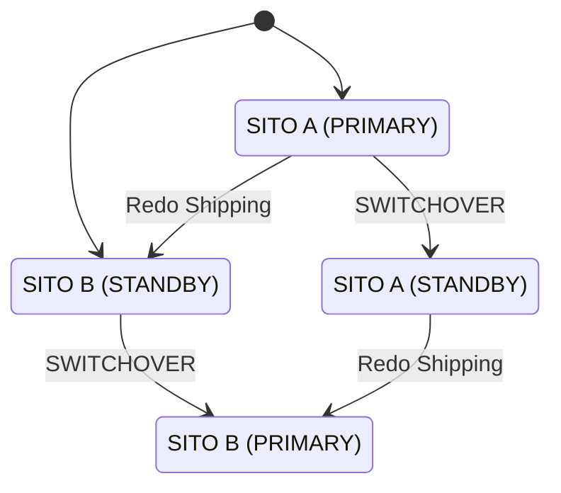

# Guida Completa: Switchover Data Guard (Passo per Passo)

## Obiettivo operativo

Invertire i ruoli Data Guard in modo pianificato, osservabile e reversibile.

## Procedura operativa

Porta Broker in `SUCCESS`, verifica lag e readiness, esegui lo switchover con DGMGRL e completa
smoke test applicativi prima di chiudere il change.

## Validazione finale

Conferma ruoli, redo transport, apply e connessioni ai service sul nuovo primary.

## Troubleshooting rapido

Se Broker segnala warning o gap, interrompi lo switchover e risolvi la sincronizzazione.

> [!NOTE]
> **DOCUMENTI CORRELATI - ALTA AFFIDABILITÀ, RAC E DATA GUARD (SCEGLI QUELLO PIÙ ADATTO):**
> - **Procedure di Produzione (Non-CDB)**:
>   - **Single Node Data Guard**: [GUIDA_PRODUZIONE_SINGLE_NODE_DATAGUARD_NON_CDB.md](./GUIDA_PRODUZIONE_SINGLE_NODE_DATAGUARD_NON_CDB.md) (architettura a singolo nodo primario e standby).
>   - **RAC Data Guard**: [GUIDA_PRODUZIONE_RAC_DATAGUARD_NON_CDB.md](./GUIDA_PRODUZIONE_RAC_DATAGUARD_NON_CDB.md) (architettura multi-nodo primario e standby).
> - **Guide di Laboratorio (RAC 19c Multi-Tenant/CDB)**:
>   - **Preparazione e Creazione Standby (Fase 3)**: [GUIDA_FASE3_RAC_STANDBY.md](./GUIDA_FASE3_RAC_STANDBY.md) (RMAN duplicate active database).
>   - **Configurazione Broker DGMGRL (Fase 4)**: [GUIDA_FASE4_DATAGUARD_DGMGRL.md](./GUIDA_FASE4_DATAGUARD_DGMGRL.md) (creazione e ottimizzazione broker).
>   - **Manuale Switchover Completo (questa guida)**: [GUIDA_SWITCHOVER_COMPLETO.md](./GUIDA_SWITCHOVER_COMPLETO.md) (passaggi sicuri di switchover).
>   - **Manuale Failover & Reinstate**: [GUIDA_FAILOVER_E_REINSTATE.md](./GUIDA_FAILOVER_E_REINSTATE.md) (gestione dei disastri e ripristino).
> - **Cheat Sheet Operativi (Pronto Intervento)**:
>   - **DGMGRL (Broker)**: [CS_DGMGRL.md](../../01_operations/01_cheat_sheets/CS_DGMGRL.md) (lag, switchover rapido, comandi broker).
>   - **SRVCTL & CRSCTL**: [CS_SRVCTL_CRSCTL.md](../../01_operations/01_cheat_sheets/CS_SRVCTL_CRSCTL.md) (gestione risorse cluster RAC e Grid).
>   - **ASMCMD**: [CS_ASMCMD.md](../../01_operations/01_cheat_sheets/CS_ASMCMD.md) (gestione storage ASM).
>   - **Master DBA Cheat Sheet**: [CS_MASTER_DBA.md](../../01_operations/01_cheat_sheets/CS_MASTER_DBA.md) (tutti i comandi consolidati).

> Lo switchover è un'operazione **pianificata** che inverte i ruoli tra Primary e Standby con **zero data loss**. È usato per manutenzione, patching, o test DR.

---

## Cosa Succede durante uno Switchover

Lo switchover inverte i ruoli tra Primary e Standby.



### Flusso Operativo:
1. **DGMGRL** chiude il Primary (flush redo finale).
2. Il Primary diventa Standby.
3. Lo Standby riceve l'ultimo redo e lo applica.
4. Lo Standby diventa Primary.
5. Si aprono i nuovi ruoli.
   ⚠️ I client vengono disconnessi per ~30-60 secondi!

---

## Preparazione (PRIMA di iniziare)

### 1. Verifica che Data Guard sia sano

```bash
dgmgrl /@RACDB

SHOW CONFIGURATION;
# Configuration Status: SUCCESS  ← OBBLIGATORIO!
# Se mostra WARNING o ERROR → NON procedere, risolvi prima

SHOW DATABASE RACDB;
SHOW DATABASE RACDB_STBY;
# Entrambi: SUCCESS
```

### 2. Verifica che la sincronizzazione sia completa

```sql
-- Sul Primary: ultimo redo archiviato
SELECT thread#, MAX(sequence#) FROM v$archived_log
GROUP BY thread# ORDER BY thread#;

-- Sullo Standby
SELECT thread#, MAX(sequence#) FROM v$archived_log WHERE applied='YES' 
GROUP BY thread# ORDER BY thread#;

-- I numeri di sequenza devono corrispondere!
```

### 3. Verifica che lo switchover sia possibile

```
DGMGRL> VALIDATE DATABASE RACDB_STBY;
```

Output atteso:
```
  Ready for Switchover:  Yes       ← QUESTO È L'OK!
  
  Verify Flashback:      On
  Verify Redo Apply:     Running
  Verify Media Recovery: On
```

> ⚠️ Se mostra "Ready for Switchover: No", controlla i "Warnings" nel report e risolvili.

### 4. Rollback del laboratorio

Non usare snapshot VM come rollback quando la topologia include dischi ASM
condivisi: il ripristino parziale puo' disallineare OS, Clusterware e storage.
Per un test distruttivo usa un backup fisico consistente a VM spente oppure
ricostruisci il lab con la procedura documentata.

---

## Esecuzione dello Switchover

### Step 1: Switchover con DGMGRL

```bash
dgmgrl /@RACDB

# Comando singolo — DGMGRL gestisce tutto automaticamente
SWITCHOVER TO RACDB_STBY;
```

### Cosa fa DGMGRL internamente:

```
1. Verifica che tutti i redo siano stati spediti
2. Chiude il database RACDB (Primary → Standby)
   → ALTER DATABASE COMMIT TO SWITCHOVER TO STANDBY WITH SESSION SHUTDOWN
3. Monta RACDB come physical standby
4. Apre RACDB_STBY come Primary
   → ALTER DATABASE COMMIT TO SWITCHOVER TO PRIMARY
5. Avvia redo apply sul nuovo standby (RACDB)
6. Riapre il database se configurato per AUTO open
```

### Step 2: Verifica il nuovo stato

```
DGMGRL> SHOW CONFIGURATION;
```

Output atteso:
```
Configuration - dg_config
  Protection Mode: MaxPerformance
  Members:
  RACDB_STBY - Primary database     ← ERA Standby, ora è Primary!
    RACDB    - Physical standby      ← ERA Primary, ora è Standby!

Fast-Start Failover: DISABLED
Configuration Status: SUCCESS
```

### Step 3: Verifica le istanze

```bash
# Sul NUOVO Primary (racstby1)
srvctl status database -d RACDB_STBY
# Instance RACDB_STBY1 is running on node racstby1
# Instance RACDB_STBY2 is running on node racstby2

# Sul NUOVO Standby (rac1)
srvctl status database -d RACDB
# Instance RACDB1 is running on node rac1
# Instance RACDB2 is running on node rac2
```

### Step 4: Verifica che redo shipping funzioni al contrario

```sql
-- Sul NUOVO Primary (RACDB_STBY)
SELECT dest_id, status, error FROM v$archive_dest WHERE dest_id = 2;
-- STATUS = VALID → redo viene spedito al nuovo standby

-- Sul NUOVO Standby (RACDB)
SELECT process, status FROM v$managed_standby WHERE process = 'MRP0';
-- STATUS = APPLYING_LOG → redo viene applicato
```

### Step 5: Test DML sul nuovo Primary

```sql
sqlplus testdg@RACDB_STBY

INSERT INTO test_replica VALUES (7777, 'Switchover completato!', SYSTIMESTAMP);
COMMIT;

-- Verifica sul nuovo standby
sqlplus / as sysdba @RACDB
SELECT * FROM testdg.test_replica WHERE id = 7777;
-- Deve esistere!
```

---

## Switchback (Ritorno alla Configurazione Originale)

```bash
dgmgrl /@RACDB_STBY

# Verifica
VALIDATE DATABASE RACDB;
# Ready for Switchover: Yes

# Esegui
SWITCHOVER TO RACDB;

# Verifica
SHOW CONFIGURATION;
# RACDB è di nuovo Primary
# RACDB_STBY è di nuovo Standby
```

---

## Troubleshooting Switchover

| Problema | Causa | Soluzione |
|---|---|---|
| "Ready for Switchover: No" | Apply lag, redo gap | Aspetta che il lag scenda a 0, forza log switch |
| ORA-16467: switchover target is not in sync | Redo non applicato | `ALTER SYSTEM SWITCH LOGFILE;` sul primary, aspetta |
| Switchover stalled | Sessioni attive resistono | Aggiungi `WITH SESSION SHUTDOWN` se manuale |
| Nuovo standby non applica redo | Listener non raggiungibile | `lsnrctl status` sul nuovo standby, controlla tnsnames |
| ORA-01017 dopo switchover | Password file non sincronizzato | Copia `orapw` dal nuovo primary al nuovo standby |

---

## Quando Usare lo Switchover

| Scenario | Switchover? |
|---|---|
| Patching programmato del primario | ✅ Sì — switchover, patcha, switchback |
| Test annuale di DR | ✅ Sì — verifica che tutto funzioni |
| Migrazione verso nuovo hardware | ✅ Sì — switchover verso nuovo HW |
| Hardware failure del primario | ❌ No — usa **Failover** (vedi guida dedicata) |
| Corruzione dati sul primario | ❌ No — usa **Flashback Database** o RMAN restore |
