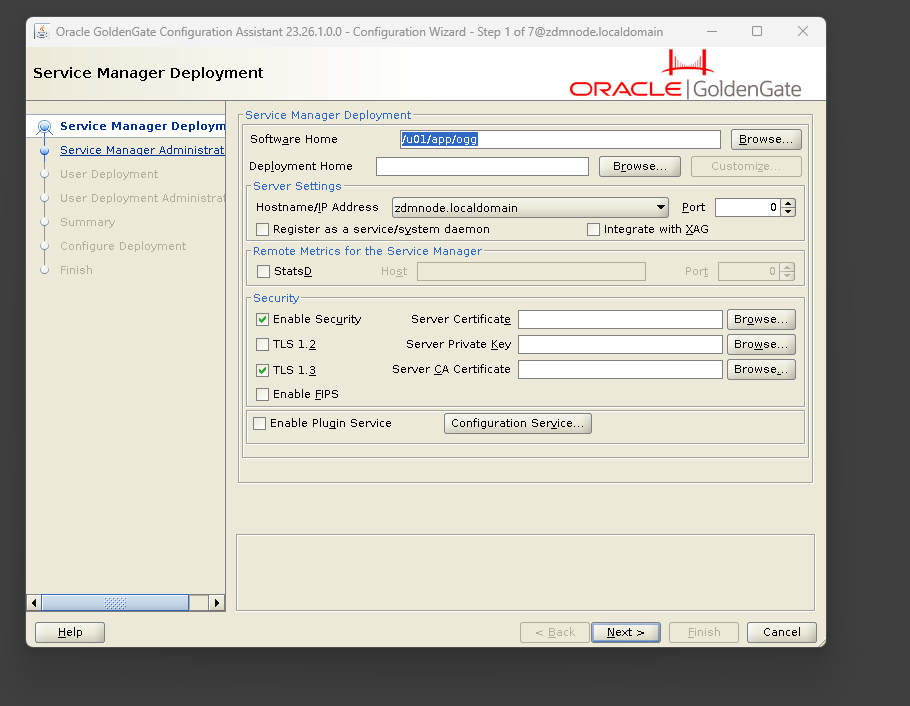
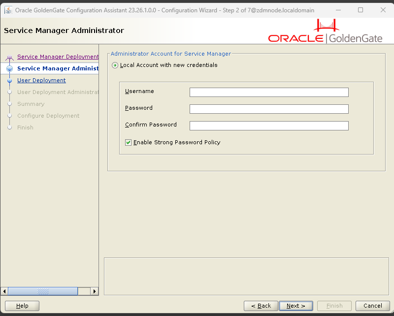

# Guida all'Installazione Bare Metal di Oracle GoldenGate 23ai (Microservices)

Questa guida illustra la procedura di installazione "Bare Metal" (tradizionale, senza container Docker) di **Oracle GoldenGate 23ai Microservices Architecture** su un server Linux (Oracle Linux / Red Hat). 

A partire dalla release 23ai, Oracle ha rimosso l'architettura *Classic*, rendendo *Microservices* l'unico standard supportato.

---

## 1. Prerequisiti di Sistema (Utente `root`)

In ambito Enterprise, i binari di GoldenGate non vanno mai mischiati con quelli del database o di ZDM. Si crea un'utenza isolata (`ogg`) per garantire la **Separation of Duties** (SoD) e una maggiore sicurezza.

```bash
# 1. Creazione gruppo e utente Oracle GoldenGate (ogg)
# Usiamo il gruppo 'oinstall' per uniformità con le installazioni Oracle standard.
sudo groupadd -g 54321 oinstall
sudo useradd -u 54322 -g oinstall ogg

# Impostiamo una password per l'utente (utile per le sessioni SSH)
echo "ogg2026" | sudo passwd --stdin ogg

# 2. Creazione della struttura directory
# /u01 ospiterà i binari "statici" del software (es. gli eseguibili).
# /u02 ospiterà i dati dinamici (i file Trail, le configurazioni, i log). 
# Questa separazione evita che un log impazzito riempia il disco di sistema.
sudo mkdir -p /u01/app/ogg
sudo mkdir -p /u02/deployments

# 3. Assegnazione permessi
# Diamo all'utente 'ogg' il controllo totale sulle sue directory.
sudo chown -R ogg:oinstall /u01 /u02
sudo chmod -R 775 /u01 /u02
```

---

## 2. Installazione dei Binari (Utente `ogg`)

Questa fase piazza fisicamente i binari (eseguibili e librerie) dentro `/u01`. **Attenzione:** installare il software non avvia ancora nessun servizio di replica, è come installare Word sul PC prima di scriverci un documento.

L'installazione del "motore" di GoldenGate può essere fatta in due modi: tramite interfaccia grafica (GUI) o in modalità silenziosa (Silent Mode). In un ambiente di laboratorio, la GUI è ottima per prendere confidenza con i parametri.

1. Accedi al server come utente `ogg` (assicurati di avere il forwarding X11 attivo se usi SSH/MobaXterm):
   ```bash
   su - ogg
   ```

2. Scompatta il pacchetto software (es. `V1054774-01.zip`) in una directory temporanea. L'installer non va mai lasciato nella directory finale.
   ```bash
   mkdir -p /tmp/ogg_installer
   unzip /tmp/V1054774-01.zip -d /tmp/ogg_installer
   cd /tmp/ogg_installer/fbo_ggs_Linux_x64_Oracle_services_shiphome/Disk1
   ```

### Opzione A: Installazione Grafica (Consigliata per i Lab)
Se hai un server X11 configurato, lancia semplicemente:
```bash
./runInstaller
```
Si aprirà l'Oracle Universal Installer. I parametri chiave da inserire nelle schermate saranno:
- **Software Location:** `/u01/app/ogg`
- **Database Version:** Scegli l'opzione unificata 23ai/Oracle.
- **Inventory Directory:** `/u01/app/oraInventory` (gruppo `oinstall`).

### Opzione B: Installazione Silenziosa (Per Automazioni)
Se non hai accesso grafico, crea un file di risposta:
```bash
cat <<EOF > /tmp/ogg_installer/oggcore.rsp
oracle.install.responseFileVersion=/oracle/install/rspfmt_ogginstall_response_schema_v23_0_0
INSTALL_OPTION=ORA23ai
SOFTWARE_LOCATION=/u01/app/ogg
INVENTORY_LOCATION=/u01/app/oraInventory
UNIX_GROUP_NAME=oinstall
EOF
```
E lancialo:
```bash
./runInstaller -silent -nowait -responseFile /tmp/ogg_installer/oggcore.rsp
```

### Script Root Finale
Al termine dell'installazione (sia Grafica che Silenziosa), l'installer ti chiederà di eseguire uno script come utente `root`. Apri un'altra finestra terminale ed esegui:
```bash
sudo /u01/app/oraInventory/orainstRoot.sh
```

---

## 3. Creazione del Service Manager e del Deployment (Utente `ogg`)

L'installazione dei binari (Fase 2) non avvia alcun servizio. Per utilizzare GoldenGate 23ai, devi inizializzare il **Service Manager** (il coordinatore Web) e creare un **Deployment** (l'istanza di replica).

Questo si fa lanciando il tool grafico `oggca.sh` (Oracle GoldenGate Configuration Assistant).

1. Assicurati di essere loggato come `ogg` con il forwarding X11 attivo.
2. Lancia il Configuration Assistant:
   ```bash
   cd /u01/app/ogg/bin
   ./oggca.sh
   ```

### Step 1: Service Manager Deployment (Schermata Iniziale)

Appena si apre l'assistente, seleziona **"Add New Service Manager"** e premi Next. Ti troverai davanti a questa schermata:



Ecco esattamente cosa inserire e perché:

1. **Software Home:** `/u01/app/ogg` (Dovrebbe essere già popolato. È dove hai appena installato i binari).
2. **Deployment Home:** Digita `/u02/deployments`. (È la cartella che abbiamo creato apposta per separare i dati dal software).
3. **Port:** Digita `7300`. (È la porta standard su cui risponderà il portale Web di amministrazione).
4. **Register as a service/system daemon:** ✔️ **Spunta questa casella!** (In questo modo, se riavvii la VM, GoldenGate ripartirà da solo senza doverlo accendere a mano).
   
   > [!TIP]
   > **Enterprise High Availability (Integrazione XAG):**
   > Nello screenshot c'è anche una casellina chiamata **"Integrate with XAG"**. Nel nostro lab la ignoriamo perché GoldenGate è su una VM singola (`zdmnode`). Ma nel mondo reale, se installi GoldenGate direttamente sui nodi di un **Cluster RAC** (es. i tuoi nodi AWS), spuntando questa opzione trasformi GoldenGate in una risorsa Cluster! Significa che se il Nodo 1 prende fuoco, il Clusterware accende automaticamente GoldenGate sul Nodo 2 e la migrazione riprende senza perdere un singolo dato e senza intervento umano!

5. **Enable Security:** ❌ **Togli la spunta.** 
   *Perché:* Se lasci la spunta, l'installer (a partire dalla versione 21c/23ai) pretende che tu gli fornisca manualmente i file dei certificati crittografici (Server Certificate, Private Key). Se provi ad andare avanti con i campi vuoti, ti darà l'errore `[INS-85126] Server certificate was not provided`. Togliendo la spunta, il nostro portale web funzionerà in chiaro (HTTP) senza richiedere certificati SSL. (In produzione, ovviamente, i sistemisti ti fornirebbero i certificati ufficiali dell'azienda da caricare qui!).

Premi **Next >** per procedere.

### Step 2: Service Manager Administrator

Qui andiamo a creare l'utenza con i massimi privilegi per amministrare GoldenGate via Web.



Ecco cosa inserire:

1. **Username:** Scrivi `oggadmin` (Questo è un utente fittizio Web, NON è l'utente di Linux e NON è l'utente del database).
2. **Password:** Inserisci una password (es. `OggAdmin_2026`).
3. **Confirm Password:** Reinserisci la password.
4. **Enable Strong Password Policy:** ❌ **Togli la spunta.**
   *Perché:* Nei laboratori è fastidioso dover rispettare policy rigide (caratteri speciali, lunghezze minime) se vogliamo usare password semplici come `ogg2026`. Togliendo la spunta, GoldenGate accetterà qualsiasi password gli passiamo.

Premi **Next >** per andare allo Step 3 (User Deployment).
