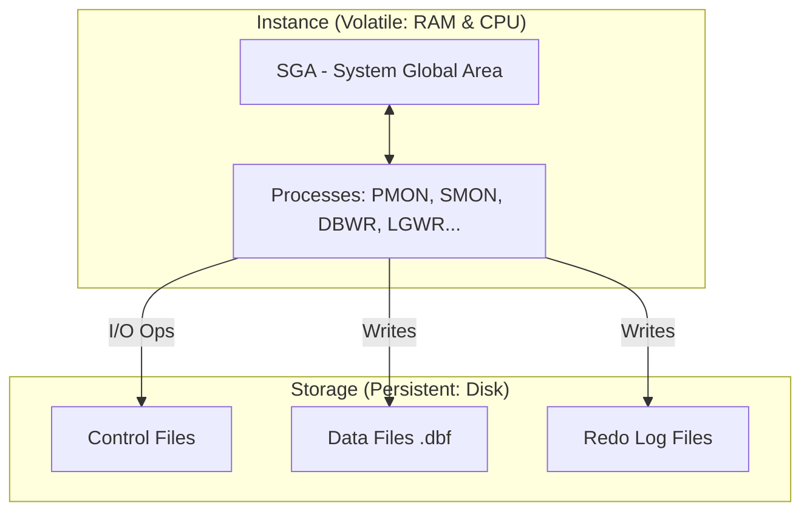
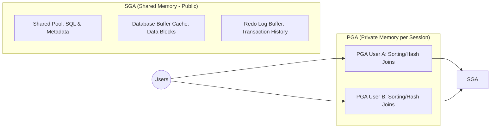
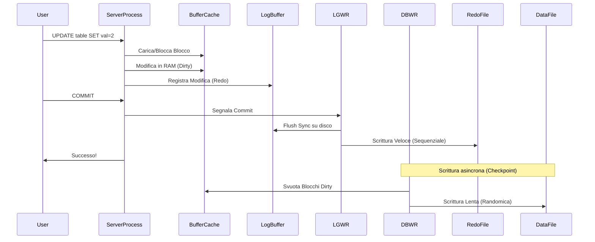
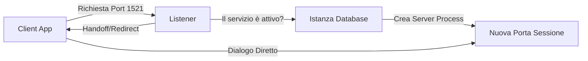
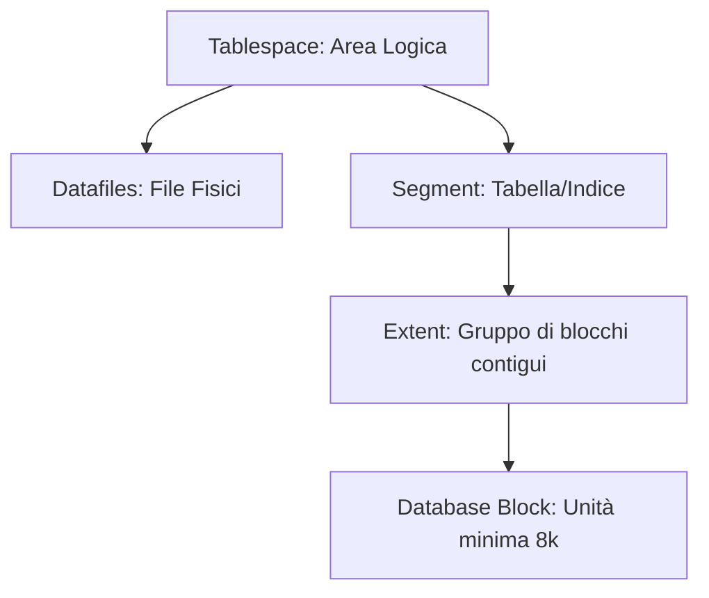
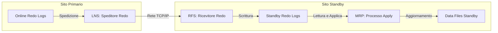
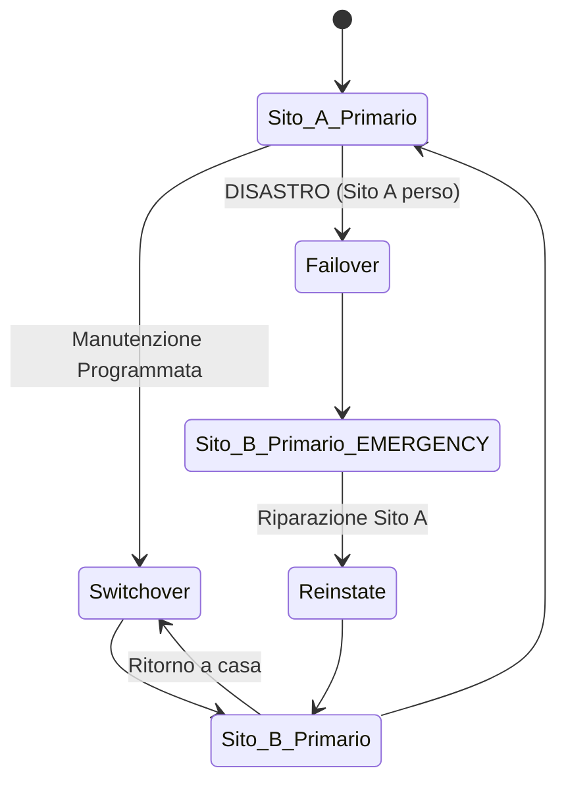
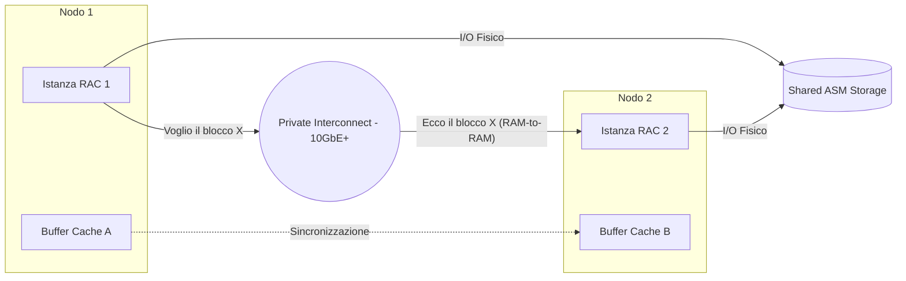
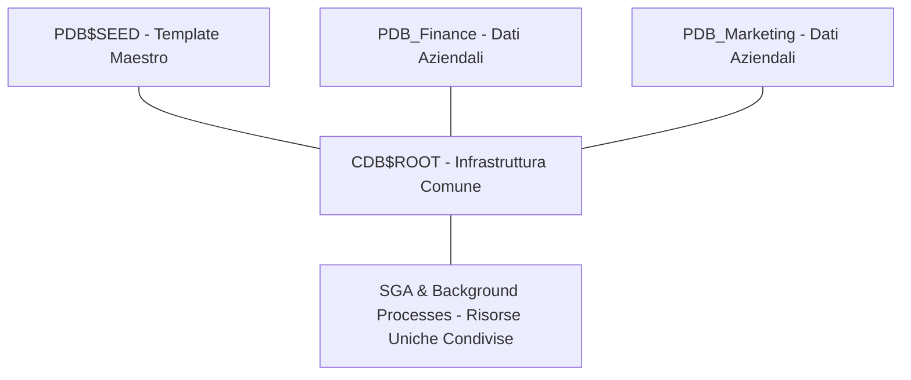

# 🎯 Guida Definitiva Ripasso Oracle DBA & Preparazione Colloqui

> **Obiettivo**: Questa è la "Master Guide" definitiva del repository. Unifica tutta la teoria architettonica, i runbook operativi e gli scenari di crisi in un'unica lista sequenziale di domande e risposte (Q1 - Q106).
> 
> ⏱️ **Utilizzo**: Ogni risposta è strutturata in 3 strati (Senior Answer):
> 1. **Definizione**: Cos'è l'oggetto/concetto in modo preciso.
> 2. **Impatto**: Perché conta per il business e la produzione.
> 3. **Operatività**: Come si verifica (viste V$, comandi, file log).

---

## Obiettivo

Usare questa guida come ripasso tecnico strutturato per colloqui, supporto operativo e consolidamento dei concetti Oracle DBA.

## Procedura operativa

1. Seleziona il blocco tematico da ripassare (Core, RMAN, DG, RAC, Security, Performance).
2. Associa ogni blocco ai runbook e script pratici collegati.
3. Verifica i concetti direttamente con query/comandi in laboratorio.

## Validazione finale

- Riesci a spiegare il concetto in termini di definizione, impatto e operatività.
- Sai indicare almeno un comando/query per verificare il tema in ambiente reale.
- Riesci a collegare il tema a un runbook operativo.

## Troubleshooting rapido

- Se un concetto non è chiaro, riparti dai fondamenti correlati in `docs/00_fondamenti`.
- Se manca contesto operativo, apri prima runbook e cheat sheet specialistiche.
- Se il problema è di memorizzazione, usa il percorso rapido e ripeti i blocchi ad alta frequenza.

---

## ⚡ Come usare questa guida (modalità operativa)

> **Quando usarla:** prima di colloqui tecnici, prima di una maintenance window, o come ripasso veloce post-incidente.

### Percorso rapido consigliato

1. Ripassa blocchi Core: architettura, RMAN, Data Guard, RAC/ASM
2. Esegui in parallelo i runbook correlati:
   - [Runbook operativi](../../01_operations/02_runbooks_incidenti/README.md)
   - [Script SQL pronti](../../01_operations/03_scripts_pronti/README.md)
3. Per comandi veloci usa cheat sheet:
   - [RMAN](../../01_operations/02_runbooks_incidenti/CHEAT_SHEET_RMAN.md)
   - [DGMGRL](../../01_operations/02_runbooks_incidenti/CHEAT_SHEET_DGMGRL.md)
   - [GoldenGate](../../01_operations/02_runbooks_incidenti/CHEAT_SHEET_GOLDENGATE.md)

---

## 🧠 0. MINDSET E STRATEGIA DI RISPOSTA

### Il Mindset del DBA Senior
Un DBA Junior risponde dicendo *quale comando lanciare*. Un DBA Senior risponde spiegando *perché lo lancia* e *come funziona il motore sotto il cofano*.

**Regole d'Oro per il Colloquio:**
1. **Padroneggia il vocabolario**: Non dire "la memoria sbarella". Di' "ho una forte contesa di latch sulla shared pool, causando il wait event `cursor: pin S wait on X`".
2. **Vai a fondo**: Se ti chiedono un comando, tu spiega prima la teoria (es: "Faccio `ALTER SYSTEM SWITCH LOGFILE`, questo forza il processo LGWR a chiudere il gruppo corrente, scatenando poi l'ARCn...").
3. **Pensa in ottica MAA**: Ogni risposta deve contemplare l'impatto sul business (niente downtime, niente perdita dati).
4. **Non indovinare**: Se non sai un comando a memoria, dillo: *"Non ricordo la sintassi esatta, ma so che serve per fare X tramite il processo Y."*

### La Metodologia STAR
Quando ti chiedono incidenti passati, usa questo framework:
*   **S (Situation)**: Contesto tecnico (es. RAC 2 nodi su 19c).
*   **T (Task)**: Il problema (es. nodo crashava ogni notte).
*   **A (Action)**: Cosa hai fatto TU (es. analisi AWR/Wait Events).
*   **R (Result)**: L'impatto (es. uptime garantito e performance +40%).

---

## 🏗️ ARCHITETTURA E CONCETTI BASE

### Q1: Qual è la differenza reale tra Instance e Database?
*   **Definizione**: Questa è la distinzione fondamentale che separa il "motore" dai "dati". L'**Istanza** è l'entità volatile, composta dall'allocazione di memoria RAM (SGA) e dai processi operativi che girano sulla CPU del server. Se riavvii il server, l'istanza scompare. Il **Database** è invece l'entità persistente: l'insieme dei file fisici salvati sui dischi (Datafiles, Redo Logs, Control Files).
*   **Visualizzazione**:

*   **Impatto**: Questa separazione permette l'esistenza di tecnologie come **Oracle RAC**, dove più istanze (su server diversi) lavorano contemporaneamente sullo stesso database fisico. In caso di crash dell'istanza, i dati restano integri sui dischi; se invece il database è corrotto fisicamente, l'istanza non può fare nulla senza un backup.
*   **Operatività**: Utilizza `SELECT * FROM v$instance;` per vedere lo stato dell'istanza (STARTED, MOUNTED, OPEN) e `SELECT * FROM v$database;` per i parametri del DB.

### Q2: Qual è la differenza tra SGA e PGA? (Dettaglio Senior)
*   **Definizione**: La **SGA** (System Global Area) è l'area di memoria *condivisa* (pubblica): tutti i processi dell'istanza possono accedervi per leggere o scrivere blocchi e metadati. La **PGA** (Program Global Area) è invece memoria *privata*: ogni singolo processo server ha la sua, isolata da tutti gli altri, per svolgere compiti riservati.
*   **Dettaglio Componenti SGA**:
    1.  **Database Buffer Cache**: Il magazzino dove Oracle appoggia i blocchi letti dal disco per evitare di rileggerli (Logical Reads).
    2.  **Shared Pool**: Il "cervello" che contiene gli SQL già analizzati (Library Cache) e i metadati del dizionario (Dictionary Cache).
    3.  **Redo Log Buffer**: Un buffer circolare velocissimo dove vengono scritte le modifiche prima di essere riversate nei Redo Log files.
    4.  **Large Pool**: Usata per alleggerire la Shared Pool da compiti pesanti come backup RMAN o parallel execution.
*   **Dettaglio PGA**:
    **Session Memory**: Memorizza i dati del logon e le variabili di sessione.  
    **SQL Work Areas**: Fondamentale per le performance, qui avvengono i **Sort** (ordinamenti) e gli **Hash Joins**. Se questa zona è troppo piccola, Oracle trasloca il calcolo sul disco (Tablespace TEMP), causando rallentamenti drammatici.
*   **Visualizzazione**:

*   **Impatto**: Se la SGA finisce lo spazio (errore `ORA-04031`), tutto il database o molti utenti ne risentono. Se una PGA finisce lo spazio, crasha solo la singola sessione dell'utente interessato.
*   **Operatività**: Verifica `v$sga_dynamic_components` per la SGA e `v$pgastat` per monitorare il consumo totale e l'efficienza degli ordinamenti in memoria.

### Q3: A cosa serve la Buffer Cache e come riduce l'I/O?
*   **Definizione**: Immaginala come una scrivania di lavoro. È l'area della SGA dove Oracle deposita le copie dei blocchi dati prelevati dai datafile.
*   **Impatto**: L'obiettivo è minimizzare i **Physical Reads** (letture da disco, lente) massimizzando i **Logical Reads** (letture da RAM, veloci). Se una query trova il dato in cache (Buffer Hit), la risposta è istantanea. Se deve andare su disco, deve aspettare la latenza dello storage.
*   **Operatività**: Monitora il parametro `db_cache_size` e presta attenzione al wait event `db file sequential read` (che indica che Oracle sta leggendo un blocco tramite indice dal disco perché non lo ha trovato in cache).

### Q4: Cos'è la Shared Pool e quali sono i rischi di frammentazione?
*   **Definizione**: È l'area SGA dedicata alla memorizzazione delle istruzioni SQL parsate e dei metadati. È divisa principalmente in **Library Cache** (piani di esecuzione) e **Data Dictionary Cache** (permessi, definizioni tabelle).
*   **Impatto**: Senza di essa, ogni volta che lanci `SELECT * FROM emp`, Oracle dovrebbe ricontrollare se la tabella esiste, se hai i permessi e come recuperare i dati. Questo "Hard Parse" consuma molta CPU. Se la Shared Pool è frammentata, si ottiene l'errore `ORA-04031`.
*   **Operatività**: Utilizza `v$sgastat` per vedere l'allocazione e controlla nel report AWR la sezione "SQL ordered by Parse Calls".

### Q5: Che differenza c'è tra Hard Parse e Soft Parse?
*   **Definizione**: Un **Hard Parse** avviene quando Oracle riceve un SQL mai visto prima: deve analizzarlo da zero e creare un piano di esecuzione (costosissimo in CPU). Un **Soft Parse** avviene quando Oracle trova lo stesso identico SQL già presente in Library Cache e ne riutilizza il piano.
*   **Impatto**: In un'applicazione ad alta frequenza, l'uso di **Bind Variables** (es. `WHERE id = :1`) è obbligatorio. Senza bind, ogni query è vista come diversa (Hard Parse), causando contese di latch e il "collo di bottiglia" della CPU.
*   **Operatività**: In un report AWR, il valore di `Soft Parse %` deve essere idealmente superiore al 95-98%.

### Q6: Spiegami il ciclo di vita di una transazione (UPDATE + COMMIT).
*   **Definizione**: È il processo che garantisce le proprietà ACID. Ecco cosa succede: 
    1.  Il Server Process cerca il blocco in Buffer Cache; se non c'è, lo legge dal disco. 
    2.  Blocca la riga (Lock) e scrive il vecchio valore nel Tablespace **UNDO** (per il rollback). 
    3.  Modifica il blocco in RAM (diventa un **Dirty Block**) e registra la modifica nel **Redo Log Buffer**.
    4.  Al **COMMIT**, il processo **LGWR** scrive immediatamente il Redo Log Buffer sui file di log fisici su disco. Solo ora l'utente riceve "Commit Complete".
*   **Visualizzazione**:

*   **Impatto**: Il COMMIT è veloce perché scrive solo pochi KB di Redo in modo sequenziale. La scrittura vera e propria sui Datafiles (lenta) avviene dopo, in modo asincrono, tramite il processo **DBWR**.
*   **Operatività**: Controlla lo stato dei log in `v$log` e i wait events come `log file sync`.

### Q7: Redo vs Undo: qual è la differenza fondamentale?
*   **Definizione**: Il **REDO** serve per "rifare" (Recovery). Registra ogni cambiamento per poterlo ricostruire in caso di crash. L'**UNDO** serve per "disfare" (Rollback). Registra come erano i dati prima della modifica per poter tornare indietro o garantire il **Read Consistency**.
*   **Impatto**: Senza Redo non puoi recuperare nulla se il server si spegne improvvisamente. Senza Undo non puoi fare `ROLLBACK` e le tue `SELECT` fallirebbero se qualcuno stesse modificando i dati contemporaneamente (errore `ORA-01555`).
*   **Operatività**: Gestisci i gruppi di Redo Log e monitora lo spazio nel Tablespace UNDO.

### Q8: Cos'è lo SCN (System Change Number)?
*   **Definizione**: È l'orologio "atomico" di Oracle. Un numero logico che incrementa ad ogni commit. Non è basato sull'orario del server, ma sulla sequenza degli eventi.
*   **Impatto**: Serve a tutto il motore: garantisce che i dati letti siano consistenti, permette a Data Guard di sapere cosa replicare e a RMAN di sapere fino a che punto recuperare un backup.
*   **Operatività**: Puoi vedere lo SCN attuale con `SELECT current_scn FROM v$database;`.

### Q9: Perché i Control Files sono considerati il "cervello" del database?
*   **Definizione**: Sono piccoli file binari che contengono la "mappa" fisica del database: dove sono i datafiles, dove sono i redo logs, e qual è lo SCN corrente per ogni file.
*   **Impatto**: Senza control file, l'istanza non sa nemmeno dove siano i suoi dati. Se ne perdi uno e non hai il multiplexing (copie multiple), il database non si avvia.
*   **Operatività**: Verifica il parametro `CONTROL_FILES` e assicurati di averne almeno 2 o 3 su dischi diversi (Multiplexing).

### Q10: SPFILE vs PFILE: quale usi in un ambiente RAC?
*   **Definizione**: Il **PFILE** è un file di testo statico (`init.ora`). L'**SPFILE** è un file binario gestito direttamente dal comando `ALTER SYSTEM`.
*   **Impatto**: In un cluster **RAC**, l'SPFILE deve risiedere su uno storage condiviso (ASM) affinché tutti i nodi leggano e scrivano la stessa identica configurazione.
*   **Operatività**: Verifica quale stai usando con `SHOW PARAMETER spfile;`. Se il valore è vuoto, stai usando un vecchio PFILE.

### Q11: A cosa serve il Password File?
*   **Definizione**: È un file fisico che permette l'autenticazione di utenti con privilegi amministrativi (`SYSDBA`, `SYSBACKUP`) quando si connettono via rete.
*   **Impatto**: Senza di esso non potresti gestire il database da remoto (es. tramite OEM o script RMAN da un altro server). È critico per **Data Guard**, poiché lo Standby deve autenticarsi col Primary per ricevere i log.
*   **Operatività**: Gestito tramite l'utility `orapwd` e il parametro `REMOTE_LOGIN_PASSWORDFILE`.

### Q12: Il Listener e il processo di connessione.
*   **Definizione**: Il Listener è un processo separato dal database (vive in Grid Infrastructure o Network Oracle Home) che sta in ascolto sulla porta (tipicamente 1521).
*   **Visualizzazione**:

*   **Impatto**: Se il Listener cade, le persone già connesse continuano a lavorare, ma **nessuno nuovo** può entrare.
*   **Operatività**: Comandi `lsnrctl status` e `lsnrctl services`.

### Q13: Service Name vs SID.
*   **Definizione**: Il **SID** (System ID) identifica la singola istanza sul server. Il **Service Name** è un identificatore logico che può rappresentare un intero cluster RAC o uno specifico gruppo di istanze.
*   **Impatto**: Le applicazioni devono usare il **Service Name**. Questo permette al DBA di spostare il carico tra i nodi RAC o fare switchover in Data Guard senza che l'applicazione debba cambiare la sua stringa di connessione.
*   **Operatività**: Controlla i servizi registrati con `lsnrctl services`.

### Q14: Logical Read vs Physical Read.
*   **Definizione**: Una **Logical Read** avviene quando il dato viene trovato nella Database Buffer Cache (RAM). Una **Physical Read** avviene quando Oracle deve scendere sul disco perché il dato non è in memoria.
*   **Impatto**: La lettura fisica è migliaia di volte più lenta di quella logica. Un database performante deve avere un elevato **Buffer Cache Hit Ratio** (> 95%).
*   **Operatività**: Verifica i wait events: se vedi molto tempo perso in `db file sequential read`, significa che stai facendo troppe letture fisiche.

### Q15: Cos'è l'ITL (Interested Transaction List)?
*   **Definizione**: È una lista presente nell'header di ogni blocco dati che tiene traccia di quali transazioni lo stanno modificando. 
*   **Impatto**: Se molte sessioni cercano di modificare righe diverse ma nello stesso blocco e non ci sono abbastanza slot ITL, le sessioni si bloccheranno in attesa (`enq: TX - allocate ITL entry`), anche se non c'è un vero lock sulla riga.
*   **Operatività**: Si ottimizza aumentando il parametro `INITRANS` (default 2 per tabelle, 1 per indici) se prevedi alta concorrenza.

### Q16: Cos'è un Checkpoint?
*   **Definizione**: È l'evento in cui il processo **CKPT** segnala al **DBWR** di scrivere finalmente i blocchi "sporchi" (Dirty Blocks) dalla memoria ai Datafiles fisici. Contemporaneamente aggiorna gli header dei file con l'ultimo SCN salvato.
*   **Impatto**: Serve a rendere il database consistente e a ridurre il tempo di **Instance Recovery**. Più frequenti sono i checkpoint, meno redo log dovranno essere riletti al riavvio dopo un crash.
*   **Operatività**: Avviene automaticamente durante un log switch o può essere forzato con `ALTER SYSTEM CHECKPOINT;`.

### Q17: Shutdown Immediate vs Abort.
*   **Definizione**: `IMMEDIATE` scollega gli utenti, fa il rollback delle transazioni non committate e chiude i file in modo pulito. `ABORT` uccide istantaneamente tutti i processi (come togliere la corrente).
*   **Impatto**: Usando `ABORT`, al riavvio successivo l'istanza dovrà eseguire l'**Instance Recovery** (SMON) leggendo i redo logs. È una procedura sicura ma da usare solo se il DB è bloccato.
*   **Operatività**: Verifica l'Alert Log per confermare se lo shutdown è stato "Clean" o "Thread closed".

### Q18: Cos'è il Multiplexing?
*   **Definizione**: È la pratica di mantenere copie multiple dei file vitali del database (Control Files e Online Redo Logs) su diversi dischi fisici.
*   **Impatto**: È la tua assicurazione contro i guasti hardware. Se perdi un disco che contiene un Redo Log, ma ne hai una copia multiplexata su un altro disco, il database non si ferma.
*   **Operatività**: Controlla `v$controlfile` e `v$logfile` per assicurarti che ogni gruppo abbia almeno 2 membri su percorsi diversi.

### Q19: Scrittura LGWR vs DBWR (Write-Ahead Logging).
*   **Definizione**: Oracle segue la regola del "Prima scrivi il diario, poi fai l'azione". **LGWR** scrive i vettori di modifica (Redo) prima che **DBWR** riversi i dati modificati nei datafile.
*   **Impatto**: Questo garantisce che, anche se il server crasha prima che DBWR abbia scritto il datafile, Oracle potrà rileggere il diario (Redo) e applicare la modifica mancante.
*   **Operatività**: Questo meccanismo è automatico e trasparente, fondamentale per l'integrità dei dati.

### Q20: Spiegami la gerarchia dello Storage Oracle.
*   **Definizione**: È la struttura a cipolla che organizza lo spazio:
    **Physical**: Datafiles (file sul disco OS).  
    **Logical**: Tablespace (contenitore) → Segment (tabella/indice) → Extent (gruppo di blocchi) → Block (unità minima I/O, tipicamente 8 KB).
*   **Visualizzazione**:

*   **Impatto**: Fondamentale per il sizing. Se una tabella ha extents troppo grandi, sprechi spazio; se sono troppi piccoli, perdi performance nell'allocazione dinamica.

### Q21: Tempfiles vs Datafiles.
*   **Definizione**: I **Datafiles** ospitano dati permanenti e producono Redo. I **Tempfiles** ospitano dati volatili (es. risultati intermedi di un ordinamento massivo) e NON producono Redo.
*   **Impatto**: I Tempfiles non vengono inclusi nel backup di RMAN convenzionale perché possono essere ricreati vuoti al volo. Se lo spazio TEMP finisce, le query che ordinano molti dati falliscono con errore "Unable to extend temp segment".
*   **Operatività**: Gestiti tramite `v$tempfile` e il tablespace di tipo `TEMPORARY`.

---

## 💾 BACKUP, RECOVERY E RMAN

### Q22: Perché è preferibile RMAN rispetto ai backup manuali (Copy/Tar)?
*   **Definizione**: **RMAN** (Recovery Manager) è lo strumento nativo e "intelligente" di Oracle per la protezione dei dati. A differenza di un `cp` o `tar` del sistema operativo, RMAN comunica direttamente con il kernel del database.
*   **Impatto**: RMAN è l'unico tool in grado di accorgersi se un blocco è corrotto (Physical/Logical Corruption) mentre lo legge. Inoltre, gestisce automaticamente la cancellazione dei log vecchi, supporta la compressione nativa e permette i backup incrementali. Fare un backup manuale del database aperto ("Hot Backup") richiederebbe di mettere ogni Tablespace in `BEGIN BACKUP`, generando un eccesso di redo inutile; RMAN gestisce tutto questo in modo trasparente e sicuro.
*   **Operatività**: Si accede con il comando `rman target /` dalla shell del server.

### Q23: Qual è la differenza tra Restore e Recover?
*   **Definizione**: Sono i due tempi di una partita di salvataggio. Il **Restore** è l'azione fisica di copiare i file dal supporto di backup (disco o nastro) alla directory del database. Il **Recover** è l'azione logica di leggere i Redo Log e applicare i cambiamenti avvenuti dopo il momento del backup.
*   **Impatto**: Senza il Recover, avresti un database "congelato" al passato, incoerente e non apribile. Il Recover "riavvolge il nastro" fino al secondo esatto prima del disastro, garantendo che non venga perso alcun dato committato.
*   **Operatività**: Comando RMAN: `RESTORE DATABASE; RECOVER DATABASE;`.

### Q24: Backup Set vs Image Copy.
*   **Definizione**: Il **Backup Set** è un aggregato binario creato da RMAN che contiene solo i blocchi dati usati (salva spazio) e può essere compresso. L'**Image Copy** è una copia esatta byte-per-byte del datafile, identica all'originale.
*   **Impatto**: Gli Image Copy sono molto più veloci in fase di emergenza: con il comando `SWITCH DATAFILE TO COPY`, Oracle inizia a usare la copia istantaneamente senza doverla copiare (Downtime quasi zero). I Backup Set sono invece ideali per risparmiare spazio e per lo storage a lungo termine su nastro.
*   **Operatività**: Si sceglie tra `BACKUP AS BACKUPSET` o `BACKUP AS COPY` nella configurazione RMAN.

### Q25: Full Backup e Level 0 sono la stessa cosa?
*   **Definizione**: No, anche se entrambi copiano tutti i blocchi dati. Un **Level 0** è l'ancora di partenza di una strategia incrementale; un **Full Backup** è un'entità isolata.
*   **Impatto**: Se fai un "Full Backup", il giorno dopo non potrai fare un backup "Level 1" (incrementale) perché Oracle non troverebbe un parente "Level 0" a cui agganciarsi. In produzione, si usa quasi sempre il Level 0 come base settimanale.
*   **Operatività**: `BACKUP INCREMENTAL LEVEL 0 DATABASE;`.

### Q26: Incremental Level 1: Differential vs Cumulative.
*   **Definizione**: Il **Differential** (default) salva solo i blocchi cambiati dall'ultimo backup incrementale (L0 o L1). Il **Cumulative** salva tutti i blocchi cambiati dall'ultimo backup Level 0.
*   **Impatto**: Il Differential è più veloce e piccolo da eseguire ogni notte. Il Cumulative occupa più spazio ma rende il **Restore più veloce**, perché RMAN dovrà applicare un solo pezzo invece di una lunga catena di piccoli backup giornalieri.
*   **Operatività**: `BACKUP INCREMENTAL LEVEL 1 [CUMULATIVE] DATABASE;`.

### Q27: Cosa indicano i comandi Crosscheck e Delete Obsolete?
*   **Definizione**: Il **Crosscheck** serve a Oracle per dire: "Vammi a vedere se i file di backup che ho nel catalogo esistono ancora fisicamente sul disco". Se non li trova, li marca come `EXPIRED`. **Delete Obsolete** invece cancella i backup che sono ancora integri ma che non servono più secondo la logica di conservazione (es. ho backup di 2 mesi fa ma la mia policy è di 30 giorni).
*   **Impatto**: Fondamentali per la manutenzione automatica. Senza questi comandi, la **FRA** (Flash Recovery Area) si riempirebbe in pochi giorni, bloccando il database.
*   **Operatività**: `CROSSCHECK BACKUP; DELETE NOPROMPT OBSOLETE;`.

### Q28: A cosa serve il comando Validate?
*   **Definizione**: È il comando della "serenità". Legge l'intero backup (o database) simulando un ripristino per verificare che ogni singolo bit sia leggibile e non corrotto.
*   **Impatto**: Un backup non validato è solo un'illusione di sicurezza. Eseguire periodicamente un `VALIDATE` ti assicura che, quando avrai davvero bisogno di RMAN in emergenza, i file saranno pronti e integri.
*   **Operatività**: `BACKUP VALIDATE DATABASE;` o `RESTORE DATABASE VALIDATE;`.

### Q29: Perché il Control File Autobackup deve essere ON?
*   **Definizione**: È una feature che ordina a RMAN di fare una copia di sicurezza del Control File e dello SPFILE ogni volta che finisce un backup o cambia la struttura del DB.
*   **Impatto**: Se perdi l'intero disco dei dati e del catalogo, l'autobackup è l'unica cosa che ti permette di ripartire da zero conoscendo solo il **DBID** (Database ID). È la tua polizza assicurativa finale.
*   **Operatività**: `CONFIGURE CONTROLFILE AUTOBACKUP ON;`.

### Q30: Recovery Catalog vs Nocatalog.
*   **Definizione**: In modalità **Nocatalog**, Oracle memorizza le informazioni sui backup dentro il Control File del database stesso. In modalità **Catalog**, le memorizza in un database Oracle esterno dedicato.
*   **Impatto**: Il Catalog è caldamente consigliato per gestire molti database in modo centralizzato o per mantenere la storia dei backup molto vecchia (che verrebbe invece "sovrascritta" nel control file dopo qualche settimana).
*   **Operatività**: Si connette con `rman target / catalog rman/pwd@catdb`.

### Q31: Cos'è il Block Change Tracking (BCT)?
*   **Definizione**: È un file binario speciale in cui Oracle annota quali blocchi sono stati modificati tra un backup e l'altro tramite una bitmap.
*   **Impatto**: Senza BCT, per fare un backup incrementale RMAN deve leggersi tutto il database da TB alla ricerca dei blocchi cambiati (lento). Con il BCT acceso, RMAN va a colpo sicuro leggendo solo ciò che serve. Velocizza i backup giornalieri del 90%.
*   **Operatività**: Si abilita sul DB con `ALTER DATABASE ENABLE BLOCK CHANGE TRACKING;`.

### Q32: Come recuperi un singolo datafile perso accidentalmente?
*   **Definizione**: Non serve spegnere tutto il database. La procedura è chirurgica:
    1. Si mette offline solo il file danneggiato: `ALTER DATABASE DATAFILE 5 OFFLINE;`.
    2. Si chiede a RMAN di restaurarlo e recuperarlo: `RESTORE DATAFILE 5; RECOVER DATAFILE 5;`.
    3. Si riporta online il file: `ALTER DATABASE DATAFILE 5 ONLINE;`.
*   **Impatto**: Massima disponibilità (High Availability). Gli altri utenti possono continuare a lavorare sulle altre tabelle mentre tu ripari quella danneggiata.

### Q33: Cosa succede durante un Crash Recovery (es. Shutdown Abort)?
*   **Definizione**: Al riavvio dell'istanza, il processo **SMON** si accorge che il database non è stato chiuso correttamente. Avvia quindi due fasi automatiche:
    1. **Roll Forward**: Legge i Redo Log e riapplica tutte le modifiche committate che non erano state ancora scritte su disco.
    2. **Roll Back**: Usa i dati nel tablespace UNDO per annullare le transazioni che erano aperte al momento del crash ma non committate.
*   **Impatto**: Garantisce l'integrità dei dati (ACID) senza alcun intervento manuale del DBA.

### Q34: Differenza pratica tra Archivelog e Noarchivelog.
*   **Definizione**: In **Archivelog** mode, Oracle salva per sempre ogni Redo Log pieno (convertendolo in Archive Log) prima di sovrascriverlo. In **Noarchivelog**, i log vengono riciclati e sovrascritti non appena sono pieni.
*   **Impatto**: In Noarchivelog puoi recuperare il database solo fino al momento dell'ultimo backup full (perdendo tutto il lavoro fatto oggi). In Archivelog puoi recuperare fino all'ultimo secondo prima di un crash. La modalità Archivelog è obbligatoria per ogni sistema di produzione.
*   **Operatività**: Controlla con il comando SQL `ARCHIVE LOG LIST;`.

### Q35: Come recuperi l'SPFILE se viene cancellato dal disco?
*   **Definizione**: Se hai attivato l'**Autobackup**, puoi riavviare l'istanza in modalità "blind" (STARTUP NOMOUNT) e dire a RMAN di ripescare il file dal backup.
*   **Operatività**: `SET DBID <numero>; STARTUP NOMOUNT; RESTORE SPFILE FROM AUTOBACKUP;`.

## 🔌 DATA GUARD

### Q37: Differenza tra Physical, Logical e Snapshot Standby.
*   **Definizione**: Sono i tre tipi di database di "riserva" che Oracle permette di creare:
    1.  **Physical Standby**: Copia identica bit-per-bit del primario. Applica direttamente i vettori di redo ai datafile. È la più semplice, sicura e performante.
    2.  **Logical Standby**: Contiene gli stessi dati ma i file fisici possono essere diversi. Traduce il redo in istruzioni SQL (`INSERT`, `UPDATE`) e le riesegue. Permette di avere indici diversi o fare il patching "rolling".
    3.  **Snapshot Standby**: Una standby fisica che viene temporaneamente "staccata" e aperta in modalità Read-Write per fare dei test. Al termine, viene riconvertita in fisica e ri-sincronizzata perdendo le modifiche del test.
*   **Impatto**: La Physical Standby è lo standard per il Disaster Recovery. La Snapshot è eccezionale per provare una patch applicativa su dati reali senza rovinare la produzione.

### Q38: Processi core di Data Guard (LNS, RFS, MRP).
*   **Definizione**: Sono gli operai che portano i mattoni dal cantiere principale a quello di riserva:
    1.  **LNS** (Log Network Server): Sul Primary, legge il redo (dal buffer o dai log) e lo spedisce via rete.
    2.  **RFS** (Remote File Server): Sullo Standby, riceve il redo spedito da LNS e lo scrive negli Standby Redo Logs.
    3.  **MRP** (Managed Recovery Process): Sullo Standby, legge dagli Standby Redo Logs e applica le modifiche ai Datafiles.
*   **Visualizzazione**:

*   **Operatività**: Verifica la presenza dei processi con `ps -ef | grep ora_mrp`.

### Q39: Perché servono gli Standby Redo Logs (SRL)?
*   **Definizione**: Sono file di log speciali sullo Standby che "rispecchiano" gli Online Redo Logs del primario.
*   **Impatto**: Permettono il **Real-Time Apply**. Senza SRL, lo standby dovrebbe aspettare che il primario finisca l'intero file di log e lo archivi (Log Switch) prima di riceverlo. Con gli SRL, ogni singola riga modificata arriva allo standby in millisecondi. Sono obbligatori per le configurazioni ad alta sicurezza.
*   **Operatività**: Controlla lo stato con `v$standby_log`.

### Q40: SYNC vs ASYNC: qual è il trade-off?
*   **Definizione**: **SYNC** significa che il Primary aspetta la conferma dallo Standby prima di dire all'utente "Commit OK". **ASYNC** significa che il Primary spedisce il dato e prosegue subito senza aspettare.
*   **Impatto**: SYNC garantisce **Zero Data Loss** (RPO=0) ma, se la rete tra i due siti è lenta, rallenta tutto il database primario. ASYNC protegge le performance ma rischia di perdere qualche secondo di dati se il sito primario esplode improvvisamente.

### Q41: Switchover vs Failover.
*   **Definizione**: Lo **Switchover** è un cambio di ruolo pianificato (es. devo fare manutenzione hardware al server primario). È un'operazione sicura e senza perdita di dati. Il **Failover** è un'operazione di emergenza quando il primario è distrutto o irraggiungibile.
*   **Visualizzazione**:

*   **Impatto**: Lo Switchover è routine; il Failover è l'ultima spiaggia.

### Q42: Perché usare il Data Guard Broker (DGMGRL)?
*   **Definizione**: È un layer software di Oracle che automatizza e semplifica la gestione della Data Guard.
*   **Impatto**: Senza Broker, per fare uno switchover servono decine di comandi SQL manuali pronti all'errore. Con il Broker, basta un solo comando: `SWITCHOVER TO standby_db`. Gestisce lui lo spegnimento, il cambio di ruolo e il riavvio in modo perfetto.
*   **Operatività**: Si usa l'utility `dgmgrl`.

### Q43: Transport Lag vs Apply Lag.
*   **Definizione**: **Transport Lag** è il tempo che passa tra la generazione del redo sul primario e il suo arrivo fisico sullo standby (colpa della rete). **Apply Lag** è il tempo che il processo MRP impiega ad applicare i dati arrivati (colpa dei dischi dello standby o CPU).
*   **Operatività**: Monitora `v$dataguard_stats` per vedere i ritardi in secondi.

### Q44: DB_NAME vs DB_UNIQUE_NAME.
*   **Definizione**: Il **DB_NAME** deve essere identico per entrambi i database (sono lo "stesso" DB). Il **DB_UNIQUE_NAME** deve essere diverso (es. `PROD_MI` e `PROD_RM`) affinché Oracle possa sapere con chi sta parlando nella rete.
*   **Operatività**: Verifica con `SHOW PARAMETER db_unique_name`.

### Q45: A cosa servono FAL_SERVER e FAL_CLIENT?
*   **Definizione**: **FAL** significa "Fetch Archive Log". È il meccanismo di riparazione automatica dei "buchi" (GAP).
*   **Impatto**: Se lo standby rimane spento per un'ora, quando si riaccende "chiede" al primario (FAL_SERVER) i log che si è perso. Tutto avviene in automatico senza che il DBA debba copiare file a mano.

### Q46: Cosa indica lo stato "MRP0 - APPLYING_LOG"?
*   **Definizione**: È il segnale di "tutto ok". Indica che lo standby sta ricevendo il redo e lo sta scrivendo con successo nei propri datafile.
*   **Operatività**: `SELECT process, status, sequence# FROM v$managed_standby;`.

### Q47: Protection Modes: MaxPerformance vs MaxAvailability.
*   **Definizione**: Sono le policy di sicurezza:
    1.  **Max Performance** (default): Usa ASYNC. Alta velocità, rischio minimo perdita dati.
    2.  **Max Availability**: Usa SYNC. Se lo standby non risponde, il primario aspetta un timeout e poi prosegue (non si ferma).
    3.  **Max Protection**: Usa SYNC. Se lo standby è irragiungibile, il primario **SI SPEGNE** pur di non rischiare di perdere un solo dato. Usato solo in banche o sistemi critici.

---

## 🏎️ RAC E ASM

### Q51: Qual è la differenza principale tra RAC e Data Guard?
*   **Definizione**: Il **RAC** (Real Application Clusters) è una soluzione di **Alta Disponibilità Locale (HA)**: più server (nodi) lavorano insieme nello stesso data center per far girare lo stesso database. Se un server brucia, gli altri continuano a lavorare. La **Data Guard** è una soluzione di **Disaster Recovery (DR)**: è un database separato, solitamente in un'altra città, che riceve i dati in replica.
*   **Impatto**: Il RAC ti protegge dal guasto di un singolo server. La Data Guard ti protegge se l'intero data center va offline (es. alluvione, incendio) o se qualcuno cancella per errore tutte le tabelle (corruzione logica).

### Q52: Cos'è Cache Fusion (Il cuore del RAC)?
*   **Definizione**: È il meccanismo "magico" che permette a due istanze su server diversi di scambiarsi i dati direttamente tramite la rete privata (**Interconnect**) senza doverli scrivere e rileggere continuamente dal disco.
*   **Visualizzazione**:

*   **Impatto**: Senza Cache Fusion, il RAC sarebbe lentissimo. Grazie a questa tecnologia, la latenza di scambio dati tra nodi è di microsecondi. 
*   **Operatività**: Monitora i wait events che iniziano con `gc` (Global Cache), come `gc current block 2-way`.

### Q53: Cos'è lo SCAN (Single Client Access Name)?
*   **Definizione**: È un nome DNS unico (es. `rac-cluster-scan`) che punta a 3 indirizzi IP virtuali distribuiti dal clusterware.
*   **Impatto**: Semplifica la vita degli sviluppatori. Prima dello SCAN, l'applicazione doveva conoscere gli IP di tutti i server. Oggi, l'app chiama solo lo SCAN; il clusterware decide automaticamente su quale nodo meno carico mandare la connessione. Se aggiungi un quarto nodo al cluster, l'applicazione non deve essere toccata.

### Q54: A cosa servono OCR e Voting Disk?
*   **Definizione**: Sono i due file "vitali" del cluster. L'**OCR** (Oracle Cluster Registry) contiene la "rubrica" del cluster (quali database ci sono, quali servizi, quali nodi). Il **Voting Disk** gestisce la "membership": i nodi si scambiano battiti cardiaci (heartbeat) su questo disco.
*   **Impatto**: Se un nodo smette di rispondere al battito cardiaco, viene espulso dal cluster (**Node Eviction**) per evitare lo "Split-Brain" (situazione pericolosissima dove due nodi scrivono dati diversi convinti di essere entrambi i padroni del database).
*   **Operatività**: Controlla lo stato con `crsctl query css votedisk`.

### Q55: Perché usare i Services in RAC invece di connettersi fisicamente?
*   **Definizione**: Un **Service** è un nome logico che puoi far girare dove vuoi. Puoi decidere che il servizio "Ordini" giri sul Nodo 1 (Preferred) e si sposti sul Nodo 2 solo se il 1 cade (Available).
*   **Impatto**: Permettono di isolare i carichi di lavoro. Ad esempio, puoi dedicare il Nodo 1 agli utenti online e il Nodo 2 ai report pesanti, evitando che un report blocchi l'e-commerce. Abilitano inoltre il **TAF** (Transparent Application Failover).
*   **Operatività**: Gestiti tramite `srvctl add service`.

### Q56: Cos'è ASM (Automatic Storage Management)?
*   **Definizione**: Non è solo un filesystem, è un **Volume Manager** integrato nel mondo Oracle. Gestisce i dischi fisici nascondendo la complessità al database.
*   **Impatto**: ASM distribuisce i dati ("striping") su tutti i dischi del gruppo in modo equo. Se aggiungi un nuovo disco, ASM sposta automaticamente una parte dei dati sul nuovo arrivato per bilanciare il carico di I/O (Rebalance). Questo garantisce performance massime senza dover essere esperti di storage.
*   **Operatività**: Si gestisce tramite l'utility `asmcmd`.

### Q57: Disk Group vs Failure Group.
*   **Definizione**: Un **Disk Group** è l'insieme logico (es. `+DATA`). Un **Failure Group** è un raggruppamento fisico di dischi che Oracle "spera" non si rompano insieme (es. tutti i dischi sullo stesso controller).
*   **Impatto**: Oracle usa i Failure Group per garantire la ridondanza. Se scrivi un dato, Oracle metterà l'originale in un Failure Group e la copia (Mirror) in un altro Failure Group differente. Così, se salta un intero controller dischi, i tuoi dati sono ancora salvi.

### Q58: In RAC, perché SPFILE e Password File devono stare in ASM?
*   **Definizione**: Perché ASM è l'area di storage **condivisa** visibile da tutti i nodi contemporaneamente.
*   **Impatto**: Se tenessi lo SPFILE sul disco locale del Nodo 1, il Nodo 2 non saprebbe come avviarsi o leggerebbe parametri diversi, creando inconsistenze catastrofiche nel cluster.

### Q59: Cos'è un Rebalance ASM e quando avviene?
*   **Definizione**: È il processo di ridistribuzione dei dati tra i dischi di un gruppo. Avviene quando aggiungi o rimuovi un disco.
*   **Impatto**: Puoi regolarne la velocità col parametro `ASM_POWER_LIMIT`. Un valore alto finisce subito il lavoro ma rallenta il database; un valore basso è più discreto ma impiega ore.
*   **Operatività**: Monitora l'avanzamento con `SELECT * FROM v$asm_operation;`.

### Q60: Come distingui se un problema è del Clusterware o del Database?
*   **Definizione**: La regola d'oro è: guarda prima il **Grid Infrastructure (GI)**. Se il Clusterware è ONLINE, allora il problema è dentro le istanze database. Se il Clusterware è OFFLINE, il database non potrà mai partire.
*   **Operatività**: Usa `crsctl check crs` per l'infrastruttura e `srvctl status database` per il database.

### Q61: srvctl vs sqlplus.
*   **Definizione**: `srvctl` è il telecomando del cluster: sa che esistono più nodi. `sqlplus` agisce solo sull'istanza che hai davanti agli occhi.
*   **Impatto**: In ambiente RAC, non dovresti **mai** fare `shutdown` da sqlplus. Devi usare `srvctl stop instance`, altrimenti il Clusterware penserà che l'istanza è crashata per errore e proverà a riavviarla continuamente contro la tua volontà.

### Q62: Come verifichi velocemente lo stato di salute del cluster?
*   **Operatività**: Il comando fondamentale è `crsctl stat res -t`. Ti mostra in una tabella chiara se tutti i nodi, i database, i diskgroup e i listener sono verdi (ONLINE) o hanno problemi.

---

## 📦 MULTITENANT, SECURITY E TDE

### Q63: Differenza tra CDB e PDB.
*   **Definizione**: Il **CDB** (Container Database) è come un albergo; le **PDB** (Pluggable Databases) sono le singole stanze. Il CDB contiene l'infrastruttura comune (memoria, processi, dizionario dati globale), mentre ogni PDB contiene i dati specifici di un'applicazione.
*   **Visualizzazione**:

*   **Impatto**: Permette il **consolidamento**: invece di installare 10 database diversi (ognuno con la sua memoria), ne installi uno solo e ci "infili" dentro 10 PDB. Risparmi RAM e semplifichi il patching (patti una volta sola il CDB e tutte le stanze sono aggiornate).

### Q64: A cosa serve la PDB$SEED?
*   **Definizione**: È un database "modello" in sola lettura. Oracle lo usa come stampino per creare nuovi PDB in pochi secondi invece di dover fare un'installazione completa.

### Q65: Common User vs Local User.
*   **Definizione**: Un **Common User** (che inizia quasi sempre con `C##`) è un utente che "vive" a livello di albergo (CDB) e può entrare in tutte le stanze. Un **Local User** vive solo dentro la sua specifica stanza (PDB).
*   **Impatto**: I DBA usano Common Users per gestire tutto il sistema; gli sviluppatori usano Local Users per la sicurezza delle loro applicazioni.

### Q66: In Multitenant, dove sono condivise l'istanza e la memoria?
*   **Definizione**: La memoria SGA e i processi (PMON, LGWR, etc.) sono **unici** e gestiti a livello di CDB. Tutte le PDB attingono alla stessa torta.
*   **Impatto**: Massima efficienza, ma bisogna stare attenti che una PDB "vorace" non consumi tutta la memoria delle altre (usando Oracle Resource Manager).

### Q67: Come si connette correttamente un'applicazione a una PDB?
*   **Definizione**: Un'applicazione deve **sempre** puntare al **Service Name** specifico della PDB. Non deve mai provare a connettersi al SID del container.
*   **Impatto**: Questo rende la PDB "portabile". Posso "staccare" (unplug) la PDB dal Server A e "attaccarla" (plug) al Server B senza dover cambiare nulla nella configurazione dell'applicazione.

### Q68: Cos'è il TDE (Transparent Data Encryption)?
*   **Definizione**: È la cifratura dei dati "a riposo". Oracle cripta i datafile sul disco in modo che, se qualcuno rubasse fisicamente l'hard disk, non potrebbe leggere i dati.
*   **Impatto**: Fondamentale per la compliance legale (es. **GDPR**). Protegge i dati sensibili senza che gli sviluppatori debbano cambiare una sola riga di codice SQL (la decifrazione avviene al volo in memoria).

### Q69: Perché il Keystore (Wallet) è l'oggetto più critico in sicurezza?
*   **Definizione**: Il Keystore (o Wallet) è il file che contiene le chiavi master per decifrare i dati criptati col TDE.
*   **Impatto**: Se perdi il file del wallet o dimentichi la sua password, i dati nel database sono **PERSI PER SEMPRE**. Nemmeno Oracle può recuperarli. Il backup del wallet deve essere fatto separatamente da quello del database.
*   **Operatività**: Controlla lo stato con `v$encryption_wallet`.

### Q70: Dove va messo il Keystore in un ambiente RAC?
*   **Definizione**: Deve risiedere su un percorso **condiviso** (Shared Storage) accessibile da tutti i nodi del cluster (es. un ACFS o un parametro `WALLET_ROOT` che punta ad ASM).
*   **Impatto**: Garantisce che ogni nodo che prova ad aprire il database possa trovare le chiavi per leggere i dati.

### Q71: Least Privilege e Auditing.
*   **Definizione**: Il principio per cui a un utente si danno solo i permessi strettamente necessari. L'**Auditing** traccia "chi ha fatto cosa e quando" (es. chi ha cancellato la tabella Clienti?).
*   **Operatività**: Nelle versioni recenti si usa lo **Unified Auditing**, che centralizza tutti i log di sicurezza in un'unica tabella (`AUDSYS.AUD$UNIFIED`) performante.

---

## 📊 PERFORMANCE, DIAGNOSTICA E TUNING

### Q72: A cosa servono AWR, ASH e ADDM?
*   **Definizione**:
    1.  **AWR** (Automatic Workload Repository): È lo "scrittore" della storia. Ogni ora scatta una foto (snapshot) alle performance del database.
    2.  **ASH** (Active Session History): È la "telecamera" in tempo reale. Campiona ogni secondo cosa stanno facendo le sessioni attive.
    3.  **ADDM** (Automatic Database Diagnostic Monitor): È l'"analista" automatico che legge l'AWR e ti dà consigli (es. "Aumenta la cache o aggiungi questo indice").

### Q73: Quando usi AWR e quando ASH?
*   **Definizione**: Usi **AWR** per capire problemi avvenuti ieri o trend di crescita (es. perché il DB è lento ogni lunedì mattina?). Usi **ASH** quando il problema è successo 5 minuti fa e vuoi sapere esattamente quale utente e quale SQL stava bloccando il sistema in quel micro-istante.

### Q74: In un AWR Report, quali sono le prime cose da guardare?
*   **Definizione**:
    1.  **DB Time vs Elapsed Time**: Se il DB Time è molto più alto del tempo trascorso, il database è sotto carico.
    2.  **Top 10 Foreground Wait Events**: Qui leggi la causa del dolore (es. `direct path read` = mancano indici; `enq: TX - row lock` = utenti che si bloccano a vicenda).

### Q75: Se vedi la CPU del server al 100%, cosa indaghi?
*   **Definizione**: Cerco prima di tutto se c'è un eccesso di **Parsing** (troppe query diverse senza bind variables) o se ci sono SQL che stanno leggendo milioni di righe senza indici (Full Table Scan).
*   **Operatività**: Controlla in AWR la sezione "SQL ordered by CPU Time".

### Q76: Come identifichi una Blocking Session?
*   **Definizione**: Una sessione è bloccata quando aspetta una risorsa tenuta da un altro.
*   **Operatività**: La vista `v$session` ha le colonne `blocking_session` e `final_blocking_session`. Queste ti dicono immediatamente l'ID del "colpevole" da andare a investigare (e nel caso killare).

### Q77: ORA-01555 Snapshot too old: cosa significa?
*   **Definizione**: Avviene quando una query molto lunga (es. un report di 2 ore) ha bisogno di leggere la versione "vecchia" di un dato (dall'UNDO), ma quello spazio è già stato sovrascritto da altre transazioni più recenti.
*   **Impatto**: La query fallisce. Si risolve aumentando il parametro `UNDO_RETENTION` o lo spazio del Tablespace UNDO.

### Q78: ORA-04031: Memoria Shared Pool insufficiente.
*   **Definizione**: Significa che Oracle non riesce a trovare un pezzo di memoria libera contigua nella Shared Pool. Spesso causato da un eccesso di SQL diversi (senza bind variables) che frammentano la memoria come un gruviera.

### Q79: Strategia di Triage se una query è improvvisamente lenta.
*   **Definizione**: Devo verificare se il **Piano di Esecuzione** è cambiato. Forse Oracle ha deciso di non usare più un indice perché le statistiche sono vecchie.
*   **Operatività**: Usa `SELECT * FROM table(dbms_xplan.display_cursor(sql_id=>'...'))` per vedere il piano reale usato dal motore.

### Q80: Perché tenere le statistiche aggiornate è vitale?
*   **Definizione**: L'**Optimizer** (il vigile urbano di Oracle) decide la strada più veloce basandosi sulle statistiche (es. quante righe ha la tabella?). Se le statistiche dicono che la tabella è vuota, ma in realtà ha 10 milioni di righe, l'Optimizer prenderà una decisione disastrosa (Full Scan).
*   **Operatività**: Oracle le aggiorna da solo di notte, ma dopo un caricamento massivo di dati devi farlo a mano con `dbms_stats.gather_table_stats`.

### Q81: Index Rebuild: lo fai regolarmente?
*   **Definizione**: **NO**. In passato si pensava che gli indici andassero ricostruiti spesso, ma negli Oracle moderni è raro che serva realmente. In molti casi, ricostruire un indice consuma risorse e causa rallentamenti senza dare benefici reali. Si fa solo se l'indice è pesantemente frammentato dopo cancellazioni massive.

### Q82: FRA Piena: cosa succede?
*   **Definizione**: Se l'area dei backup (FRA) arriva al 100%, Oracle non può più scrivere gli Archive Log. 
*   **Impatto**: Il database si **congela** completamente (Hangs). Nessun utente può più fare commit finché il DBA non libera spazio o sposta i backup.

### Q83: Alert Log vs Trace Files.
*   **Definizione**: L'**Alert Log** è il "diario di bordo" (eventi gravi, startup, errori ORA). I **Trace Files** sono log di dettaglio generati da un singolo processo quando incontra un errore specifico (dump della memoria).

### Q84: A cosa serve ADRCI?
*   **Definizione**: È l'utility riga di comando per navigare tra i migliaia di log e trace files di Oracle in modo semplice, pulire i log vecchi o preparare un pacchetto di diagnostica da mandare al supporto Oracle.

---

## 🛠️ SCENARI OPERATIVI "SUL CAMPO"

## 🛠️ SCENARI OPERATIVI "SUL CAMPO"

### Q85: ORA-01034: Oracle not available.
*   **Analisi**: Il database è spento o le variabili d'ambiente OS (`ORACLE_SID`) sono errate.
*   **Azione**: Verifica con `ps -ef | grep pmon` se l'istanza è viva. Se sì, controlla il profilo dell'utente. Se no, esegui uno `startup`.

### Q86: ORA-12514: TNS:listener does not currently know of service requested.
*   **Analisi**: Il Listener è attivo, ma il "Service Name" richiesto non è registrato.
*   **Azione**: Esegui `lsnrctl services` per vedere cosa conosce il listener. Spesso il database non si è ancora registrato (aspetta 1 minuto o forza con `alter system register`).

### Q87: Lo Standby Database non riceve o non applica i log.
*   **Analisi**: Possibile problema di rete o processo MRP spento.
*   **Azione**: Controlla `v$archive_gap` sul primario. Sullo standby, verifica lo stato con `v$managed_standby`. Se l'apply è fermo, riavvialo con `ALTER DATABASE RECOVER MANAGED STANDBY DATABASE DISCONNECT;`.

### Q88: FRA (Flash Recovery Area) Piena al 100%.
*   **Analisi**: Il database si blocca ("hangs") perché non può scrivere gli archivelog.
*   **Azione**: Connettiti con RMAN e libera spazio immediatamente: `DELETE ARCHIVELOG ALL COMPLETED BEFORE 'SYSDATE-1';`. Se non basta, aggiungi spazio al parametro `db_recovery_file_dest_size`.

### Q89: ORA-00060: Deadlock detected.
*   **Analisi**: Due utenti si bloccano a vicenda (A aspetta B, B aspetta A).
*   **Azione**: Oracle risolve da solo killando una delle due sessioni. Tu devi andare nel **Trace File** generato per capire quale codice applicativo ha causato il conflitto e parlare con gli sviluppatori.

### Q90: Tablespace Pieno (ORA-01653: unable to extend table).
*   **Analisi**: La tabella ha finito lo spazio logico assegnatole.
*   **Azione**: Aggiungi un datafile al tablespace o aumenta (`resize`) quello esistente. Verifica sempre se l'autoextend è attivo.

### Q91: Un nodo RAC è andato giù improvvisamente.
*   **Analisi**: Guasto hardware o crash del clusterware.
*   **Azione**: Le connessioni dovrebbero spostarsi automaticamente sugli altri nodi (Failover). Controlla l'alert log del Grid Infrastructure e lo stato delle risorse con `crsctl stat res -t`.

### Q92: Come sono sicuro che i miei backup RMAN siano validi?
*   **Azione**: Non fidarti solo dei log "Success". Esegui periodicamente un `RESTORE DATABASE VALIDATE;`. Questo comando legge tutti i backup e verifica che siano integri senza sovrascrivere il database reale.

### Q93: Ho perso tutti i Control File ma ho i backup. Cosa faccio?
*   **Azione**: Avvia in `NOMOUNT`, restaura il controlfile dall'autobackup (`RESTORE CONTROLFILE FROM AUTOBACKUP`), monta il DB e fai un `RECOVER` speciale (`USING BACKUP CONTROLFILE`).

### Q94: L'applicazione non si connette ma il DB sembra OK.
*   **Azione**: Test di connettività a strati: 1. Ping IP. 2. Telnet sulla porta 1521. 3. `tnsping alias`. 4. Test di login con `sqlplus user/pwd@alias`.

### Q95: Qual è la giornata tipica di un DBA Senior?
*   **Descrizione**: Inizia con il controllo dei backup (RMAN) e degli Alert Log. Segue il monitoraggio del lag della Data Guard e il controllo dello spazio libero (Tablespace/FRA). Il resto della giornata è dedicato all'ottimizzazione delle query lente (Tuning) e al supporto ai team di sviluppo.

### Q96: Quali sono i "Pre-checks" prima di applicare una Patch?
*   **Metodologia**: 1. Backup FULL (non negoziabile). 2. Verifica dello spazio disco. 3. Analisi dei conflitti con `opatch prereq`. 4. Verifica dello stato della Data Guard (non patchare il primario se lo standby è rotto).

### Q97: ACTIVE DATA GUARD vs MOUNT Mode.
*   **Differenza**: In `MOUNT` mode lo standby riceve i dati ma è chiuso agli utenti. In `ACTIVE` mode (ADG) lo standby è aperto in sola lettura: puoi farci sopra i report di PowerBI o estrazioni dati, risparmiando risorse sul server di produzione.

### Q98: Cosa significa avere un "Mindset di Produzione Critica"?
*   **Filosofia**: Significa non dare nulla per scontato. "Se può rompersi, si romperà". Ogni comando distruttivo deve avere un piano di rientro (Rollback plan). L'automazione è tua amica, ma la verifica manuale è la tua salvezza.

---

## 👔 SENIOR & TEAM LEAD

### Q99: Cosa sono RPO e RTO?
*   **Definizione**: **RPO** (Recovery Point Objective) è quanto dato sei disposto a perdere (es. 5 minuti di transazioni). **RTO** (Recovery Time Objective) è quanto tempo può stare spento il business (es. il database deve tornare online entro 1 ora).
*   **Rilevanza**: Il DBA deve configurare RAC e Data Guard per soddisfare questi requisiti aziendali.

### Q100: SI, RAC o Data Guard? Come scegli?
*   **Scenario**: Se il cliente vuole "Zero Downtime" per i server, usi **RAC**. Se vuole protezione da disastri naturali (es. terremoto), usi **Data Guard**. Se ha budget ridotto e può tollerare ore di fermo, basta un **Single Instance** con buoni backup.

### Q101: Qual è la migliore strategia di Backup per un DB da 10TB?
*   **Strategia**: Backup Full (Level 0) una volta a settimana + Backup Incrementali (Level 1) ogni notte + Backup Archivelog ogni ora. Fondamentale usare il **Block Change Tracking (BCT)** per evitare scansioni di ore.

### Q102: Monitoraggio Proattivo: cosa guardi prima che esploda?
*   **Punti chiave**: 1. Crescita anomala degli Archivelog (qualcuno sta facendo modifiche massive). 2. Aumento del tempo di Wait `log file sync`. 3. Tablespace che superano l'85%.

### Q103: Qual è l'errore più grave che un DBA può commettere?
*   **Analisi**: Non testare i backup. Molti DBA pensano di essere protetti finché non scoprono, durante un disastro, che i backup degli ultimi 6 mesi sono corrotti o il puntatore al catalogo è perso.

### Q104: Come gestisci una regressione di performance dopo un'attività?
*   **Azione**: Uso AWR/ASH per confrontare il "Prima" e il "Dopo". Se il piano di esecuzione è cambiato, uso le **SQL Plan Baselines** per forzare Oracle a tornare al vecchio piano veloce.

### Q105: Switchover vs Failover: chi prende la decisione?
*   **Responsabilità**: Lo Switchover è una decisione tecnica (DBA). Il Failover è una decisione di **Business** (Manager), perché implica un rischio di data loss (se ASYNC) e un tempo di fermo per le applicazioni durante la riconfigurazione.

### Q106: Cosa significa essere un Lead DBA?
*   **Leadership**: Significa passare dal "fare i task" al "disegnare l'architettura". Un Lead assicura che tutto il team segua gli stessi standard, documenta le procedure di emergenza e fa mentoring ai profili più junior, garantendo che il database non sia mai un "single point of failure" nella mente delle persone.

---

## 📅 PIANO DI STUDIO CONSIGLIATO (8 SETTIMANE)
➔ [Consulta il PIANO_LABORATORIO.md](file:///c:/DBA/oracle_rac_project/docs/00_fondamenti/PIANO_LABORATORIO.md)

---

  Questa guida consolida oltre 100 domande e scenari reali. Preparati con metodo. 🚀

