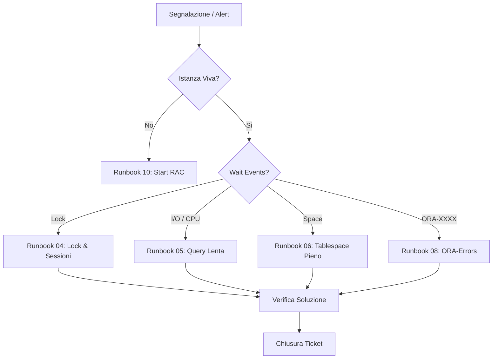

# 📋 Runbook Operativi DBA Oracle 19c

> Procedure standardizzate **"Checklist-First"** per garantire la continuità del business e ridurre il tempo medio di riparazione (MTTR).

---

## 🏗️ Triage Operativo: Come muoversi
Ogni volta che ricevi un alert o un ticket, segui questo flusso logico di diagnosi.

---

## 📁 Indice dei Runbook

### 🟢 Manutenzione Proattiva (Morning Check)
| ID | Procedura | Focus |
|---|---|---|
| **01** | [Morning Health Check](./01_MORNING_HEALTH_CHECK.md) | Stato globale Cluster, Listener, Istanze. |
| **02** | [Verifica Backup RMAN](./02_VERIFICA_BACKUP.md) | Integrità dei backup e retention policy. |
| **03** | [Check Data Guard](./03_CHECK_DATAGUARD.md) | Lag di trasporto e applicazione (Sito DR). |

### 🔴 Gestione Incidenti (Break-Fix)
| ID | Scenario | Errore Tipico |
|---|---|---|
| **04** | [Lock e Sessioni](./04_LOCK_SESSIONI_BLOCCATE.md) | Enq: TX - row lock contention |
| **05** | [Performance & Query](./05_QUERY_LENTA.md) | DB Time elevato, Piano di esecuzione errato |
| **06** | [Spazio & Tablespace](./06_TABLESPACE_PIENO.md) | ORA-01653, ORA-01654 |
| **07** | [CPU & Risorse](./07_CPU_ALTA.md) | Eccesso di Parsing, Full Table Scans |

### 🟡 Amministrazione & Change
- [09: Gestione Utenti](./09_GESTIONE_UTENTI.md) — Grant, Roles, Profile Security.
- [10: Start/Stop RAC](./10_START_STOP_RAC.md) — Orchesrazione `srvctl`.
- [13: Data Refresh](./13_REFRESH_SCHEMA_TEST.md) — Clonazione dati Prod → Test via Data Pump.

---

## ⚖️ Regole d'Oro del DBA Senior
1. **Verifica sempre i prerequisiti** prima di lanciare un comando `ALTER`.
2. **Documenta l'esito** di ogni passo (successo/errore).
3. **Pensa al Rollback**: "Cosa faccio se questo comando fallisce?".
4. **Verifica Finale**: Non chiudere un ticket finché non hai visto l'utente connettersi con successo.
