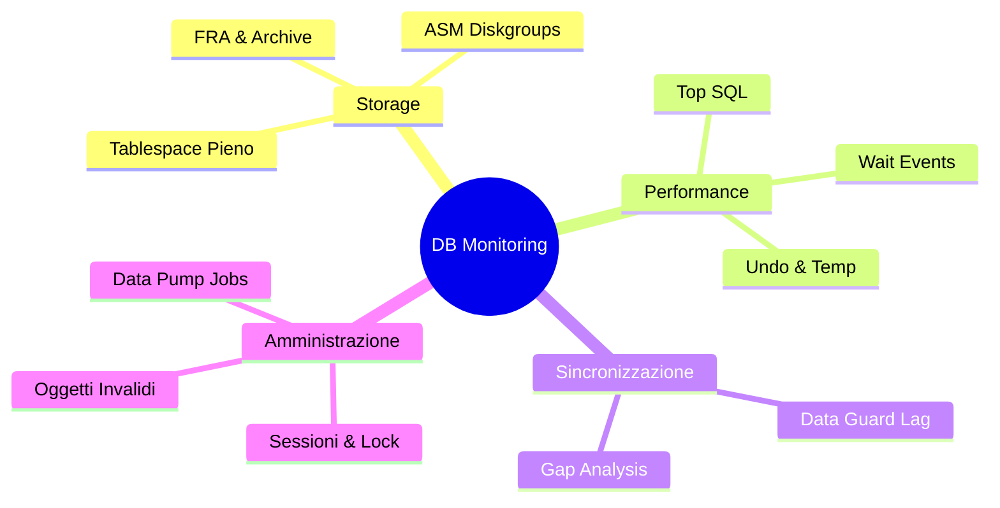

# 🛠️ Script SQL Operativi (Triage Rapido)

> Raccolta di script SQL **Architect-Ready** organizzati per dominio operativo, ottimizzati per la velocità di esecuzione in emergenza.

---

## 🏗️ Mappa dei Domini Operativi
Gli script sono mappati sulle aree critiche del database per identificare immediatamente il collo di bottiglia.

---

## 📂 Indice degli Script

| Area | Script | Scenario d'Uso |
|---|---|---|
| 📦 **Storage** | [01: Tablespace](./01_tablespace_datafile.sql) | Risoluzione ORA-01653/4 e resize datafile. |
| 🔄 **Infrastruttura** | [03: FRA & Archive](./03_fra_archivelog.sql) | Sblocco database "Hanged" per area backup piena. |
| 🏎️ **Performance** | [07: Performance Quick](./07_performance_quick.sql) | Identificazione immediata dei Top 5 Wait Events. |
| 🔐 **Concurrency** | [06: Sessioni & Lock](./06_sessioni_lock.sql) | Trovare la "Final Blocking Session" e risolvere blocchi applicativi. |
| 🛡️ **Assicurazione** | [09: Data Guard](./09_dataguard_status.sql) | Verifica salute Sito DR e secondi di ritardo (Lag). |

---

## 🚀 Come Usarli (Best Practices)

1. **Usa SQL*Plus**: Gli script sono formattati per la riga di comando.
2. **Pagine di Output**: La maggior parte degli script ha un `set linesize 200` per evitare wrap fastidiosi.
3. **Copia & Incolla**: Puoi copiare singole sezioni invece di lanciare l'intero file per una diagnosi più mirata.

> [!TIP]
> **Livello Senior?** Se hai bisogno di un'analisi profonda (es. ASH dump o profili SQL), consulta la **[Libreria Enterprise (1000+ Script)](../13_libreria_completa_script/README.md)**.
