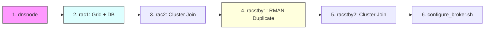

# 🎡 Lab One-Click: RAC + Standby + Data Guard
> Automazione completa basata su **Vagrant & VirtualBox** per il provisioning istantaneo di un'architettura MAA Gold.

---

## 🏗️ Sequenza di Avvio
L'ambiente viene costruito seguendo le dipendenze gerarchiche standard (DNS -> Primary -> Standby).



---

## 📥 IMPORTANTE: Posizionamento Software (Step 0)
**Il provisioning fallirà** se i binari Oracle non sono presenti nella cartella corretta. Oracle non permette il download automatico senza autenticazione.

> [!IMPORTANT]
> **Cartella di destinazione:** `vagrant_rac_dataguard/software/`
> Se la cartella non esiste, creala: `mkdir software`

Copia i seguenti file esatti dentro `software/`:
1.  `LINUX.X64_193000_grid_home.zip` (Grid Infrastructure 19.3)
2.  `LINUX.X64_193000_db_home.zip` (Database RDBMS 19.3)

---

## ⚠️ Requisiti di Sistema

| Risorsa | Minimo | Consigliato |
| :--- | :--- | :--- |
| **RAM Fisica** | 32 GB | 64 GB |
| **CPU (Cores)** | 4 Cores | 8+ Cores |
| **Spazio Disco** | 100 GB | 150 GB (SSD/NVMe) |
| **Virtualizzazione** | VT-x / AMD-V abilitato nel BIOS |

---

## 🚀 Istruzioni Operative

### 1. Avvio del Laboratorio
Esegui i comandi in terminali separati seguendo l'ordine numerico:
```bash
# Terminale 1
cd dns && vagrant up
# Terminale 2 (Dopo fine DNS)
cd rac1 && vagrant up
# Terminale 3 (Dopo fine RAC1)
cd rac2 && vagrant up
# ... e così via per racstby1 e racstby2
```

### 2. Configurazione Broker
Una volta che tutte le 5 macchine sono `running`, attiva il Data Guard Broker da `rac1`:
```bash
vagrant ssh rac1
sh /vagrant_scripts/configure_broker.sh
```

---

## 🧹 Pulizia (Shutdown)
Per distruggere l'ambiente e recuperare spazio disco:
```bash
# In ordine inverso
cd racstby2 && vagrant destroy -f
cd racstby1 && vagrant destroy -f
cd rac2 && vagrant destroy -f
cd rac1 && vagrant destroy -f
cd dns && vagrant destroy -f

# Rimuovi i dischi condivisi ASM
rm -rf ../shared_disks/*
```
